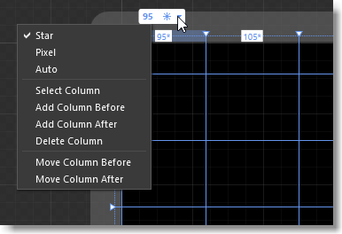
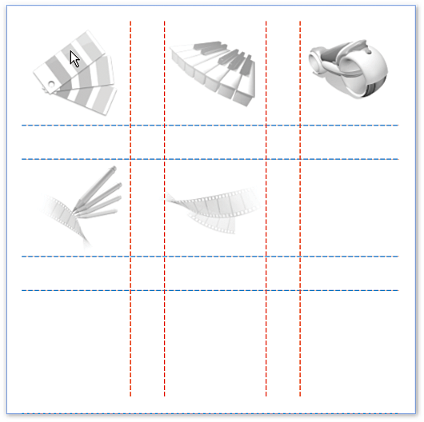
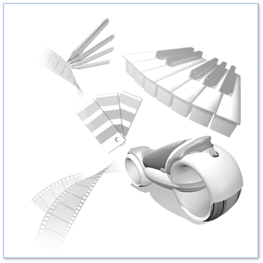
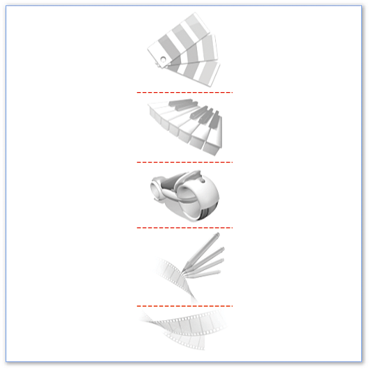
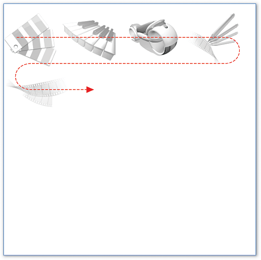
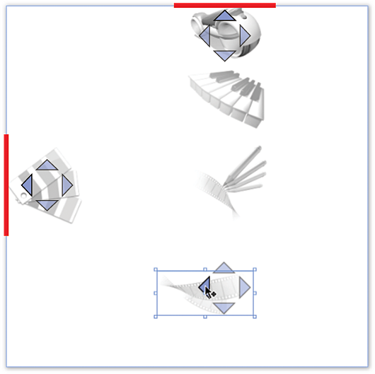
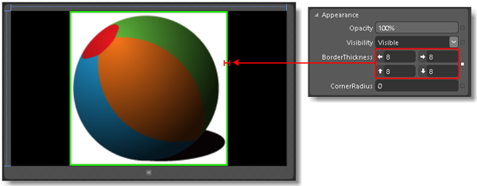
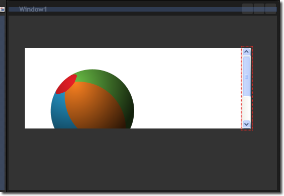
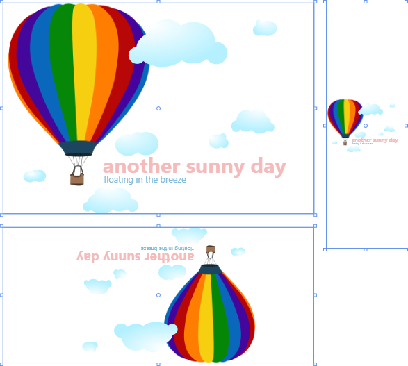

# Organize objects into layout containers in XAML Designer
Imagine where you’d like objects to appear on a page; objects such as images, buttons, and videos. Maybe you want them to appear in rows and columns, in a single line vertically or horizontally, or in fixed positions.  
  
 After you’ve had a chance to think about how the page might appear, choose a layout panel. All pages start with one because you need something to add your objects to. By default, it’s a **Grid** but you can change that.  
  
 Layout panels help you arrange objects on a page, but they do more than that. They help you design for different screen sizes and resolutions. When users run your app, everything in a layout panel resizes to match the screen real estate of their device. Of course, if you don’t want your layout to do that, you can override that behavior for a part of the layout, or the entire layout. You can use height and width properties to control that.  
  
 This page describes layout panels and controls, and then directs you to short videos that help you get started with them.  
  
> [!NOTE]
>  Some of the videos may refer to Blend or Expression Blend, which use the same XAML designer as Visual Studio and Blend for Visual Studio.  
  
## Layout panels  
 Start your page by choosing one of these layout panels. Your page can have more than one. For example, you might start with a **Grid** layout panel, and then add a **StackPanel** to an area in the **Grid** so that you can arrange controls vertically in that element.  
  
 The following layout panels are the most popularly used, but there are others. You can find them all in the **Assets** panel.  
  
-   [Grid](#Grid)  
  
-   [UniformGrid](#Uniform)  
  
-   [Canvas](#Canvas)  
  
-   [StackPanel](#Stack)  
  
-   [WrapPanel](#Wrap)  
  
-   [DockPanel](#Dock)  
  
###   Grid  
 Arrange objects into rows and columns.  
  
   
  
 **Watch a short video:**  [Using Grids](http://www.popscreen.com/v/6A4hj/Microsoft-Expression-Blend-Using-Grids)  
  
###   UniformGrid  
 Arrange objects into equal, or uniform, grid regions. This panel is great for arranging a list of images.  
  
   
  
 (Available only for WPF projects)  
  
 **Watch a short video:**  [Working with a UniformGrid](http://www.popscreen.com/v/6A4iq/Microsoft-Expression-Blend-Working-with-a-UniformGrid)  
  
###   Canvas  
 Arrange objects any way you want. When users run your app, these elements will have fixed positions on the screen.  
  
   
  
 **Watch a short video:**  [Working with the canvas](http://www.popscreen.com/v/6A4hT/Microsoft-Expression-Blend-Working-with-the-Canvas)  
  
###   StackPanel  
 Arrange objects in a single line horizontally or vertically.  
  
   
  
 **Watch a short video:**  [Working with StackPanel and WrapPanel](http://www.popscreen.com/v/6A4i5/Microsoft-Expression-Blend-Using-the-StackPanel-and-WrapPanel)  
  
###   WrapPanel  
 Arrange objects sequentially from left to right. When the panel runs out of room at the far-right edge, it *wraps* the content to the next line, and so on from left-to-right, top-to-bottom. You can also make the orientation of a wrap panel vertical so that objects flow from top-to-bottom, left-to-right.  
  
 (Available only for WPF projects)  
  
   
  
 **Watch a short video:**  [Working with StackPanel and WrapPanel](http://www.popscreen.com/v/6A4i5/Microsoft-Expression-Blend-Using-the-StackPanel-and-WrapPanel)  
  
###   DockPanel  
 Arrange objects so that they stay, or *dock*, to one edge of the panel.  
  
 (Available only for WPF projects)  
  
   
  
 **Watch a short video:**  [WPF - DockPanel](https://www.youtube.com/watch?v=EBH_OIM-zPo)  
  
## Layout controls  
 You can add your objects to layout controls as well. They aren’t as feature-rich as a layout panel, but you might find them helpful for certain scenarios.  
  
 The following layout controls are the most popularly used but there are others. You can find them all in the **Assets** panel.  
  
-   [Border](#Border)  
  
-   [Popup](#Popup)  
  
-   [ScrollViewer](#Scroll)  
  
-   [UniformGrid](#Uniform)  
  
-   [ViewBox](#View)  
  
###   Border  
 Create a border, background, or both around an object. You can add only one object to a **Border**. If you want to apply a border or background for more than one object, add layout panel to the **Border**. Then, add objects to that panel or control.  
  
   
  
 **Watch a short video:**  [Working with Borders](http://www.popscreen.com/v/6A4hB/Microsoft-Expression-Blend-Working-with-Borders)  
  
###   Popup  
 Show information or options to users in a window. You can add only one object to a **Popup**. By default, a **Popup** contains a **Grid** but you can change that.  
  
###   ScrollViewer  
 Enable uses to scroll down a page or area of a page. You can add only one object to a **ScrollViewer** so it makes a lot of sense to add a layout panel such as a **Grid** or **StackPanel**.  
  
   
  
###   Viewbox  
 Scale objects much like you would with a zoom control. You can add only one object to a **Viewbox**. If you want to apply that effect to more than one object, add a layout panel to the **ViewBox**, and then add your controls to that layout panel.  
  
 (Available only for WPF projects)  
  
   
  
## See Also  
 [Working with elements in XAML Designer](../vs140/working-with-elements-in-xaml-designer.md)   
 [Creating a UI by using XAML Designer](../vs140/creating-a-ui-by-using-xaml-designer-in-visual-studio.md)