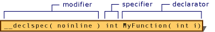

# Overview of Declarators
Declarators are the components of a declaration that specify names of objects or functions. Declarators also specify whether or not the named object is an object, pointer, reference or array.  While declarators do not specify the base type, they do modify the type information in the basic type to specify derived types such as pointers, references, and arrays.  Applied to functions, the declarator works with the type specifier to fully specify the return type of a function to be an object, pointer, or reference. (Specifiers, discussed in [Declarations](../vs140/declarations.md), convey properties such as type and storage class. Modifiers, discussed in this section and in [Microsoft-Specific Modifiers](../vs140/microsoft-specific-modifiers.md), modify declarators.) The following figure shows a complete declaration of <CodeContentPlaceHolder>15\</CodeContentPlaceHolder>, and calls out the components of the declaration.  
  
   
Specifiers, Modifiers, and Declarators  
  
 **Microsoft Specific**  
  
 Most Microsoft extended keywords can be used as modifiers to form derived types; they are not specifiers or declarators. (See [Microsoft-Specific Modifiers](../vs140/microsoft-specific-modifiers.md).)  
  
 **END Microsoft Specific**  
  
 Declarators appear in the declaration syntax after an optional list of specifiers. These specifiers are discussed in [Declarations.](../vs140/declarations.md) A declaration can contain more than one declarator, but each declarator declares only one name.  
  
 The following sample declaration shows how specifiers and declarators are combined to form a complete declaration:  
  
<CodeContentPlaceHolder>0\</CodeContentPlaceHolder>  
 In the preceding declaration, the keywords **const** and <CodeContentPlaceHolder>16\</CodeContentPlaceHolder> make up the list of specifiers. Two declarators are listed: <CodeContentPlaceHolder>17\</CodeContentPlaceHolder> and <CodeContentPlaceHolder>18\</CodeContentPlaceHolder>.  A declaration that declares multiple entities consists of a type specifier followed by a comma-separated list of declarators, terminated with a semicolon.  
  
 **Declarators for Simple Objects**  
  
 The declarator of a simple object such as an int or double is simply its name, with optional parentheses.  
  
 <CodeContentPlaceHolder>19\</CodeContentPlaceHolder>  
  
 <CodeContentPlaceHolder>20\</CodeContentPlaceHolder>  
  
 **Declarators for Pointers, References and Arrays**  
  
 Pointer operators inserted in front of the name cause the object to be a pointer or reference.  The **\*** operator declares the name as a pointer; the **&** operator declares it as a reference.  
  
<CodeContentPlaceHolder>1\</CodeContentPlaceHolder>  
 Appending <CodeContentPlaceHolder>21\</CodeContentPlaceHolder> or <CodeContentPlaceHolder>22\</CodeContentPlaceHolder> give the pointer these special properties.  The use of these specifiers in a declarator (as opposed to in the type specifier) modifies the properties of the pointer, not the object pointed to:  
  
<CodeContentPlaceHolder>2\</CodeContentPlaceHolder>  
 Further information may be found in [const and volatile Pointers](../vs140/const-and-volatile-pointers.md).  
  
 A pointer to a member of a class or struct is declared with the appropriate nested name specifier:  
  
<CodeContentPlaceHolder>3\</CodeContentPlaceHolder>  
 Brackets enclosing an optional constant expression after the name cause the object to be an array.  Successive brackets declare additional dimensions to the array.  
  
<CodeContentPlaceHolder>4\</CodeContentPlaceHolder>  
 **Declarators for Functions**  
  
 Parentheses containing the argument list are used after the name to declare a function.  The following declares a function of return type <CodeContentPlaceHolder>23\</CodeContentPlaceHolder> and three arguments of type <CodeContentPlaceHolder>24\</CodeContentPlaceHolder>.  
  
<CodeContentPlaceHolder>5\</CodeContentPlaceHolder>  
 For information on argument lists, see [Function Declarations](assetId:///3f9b4e14-60d2-47c1-acd8-4fa8fc988be7).  
  
 Pointers and references to functions are declared by prepending the pointer or reference operator to the function name as shown below.  Parentheses, normally optional, are required to distinguish a pointer to a function from a function that returns a pointer:  
  
<CodeContentPlaceHolder>6\</CodeContentPlaceHolder>  
 Pointers to member functions are distinguished by nested name specifiers:  
  
<CodeContentPlaceHolder>7\</CodeContentPlaceHolder>  
 See also [Pointers to Members](../vs140/pointers-to-members.md).  
  
 **Functions and objects in the same declaration**  
  
 Functions and objects may be declared in the same declaration as follows:  
  
<CodeContentPlaceHolder>8\</CodeContentPlaceHolder>  
 The syntax may be misleading in some circumstances.  The following declaration  
  
<CodeContentPlaceHolder>9\</CodeContentPlaceHolder>  
 may look like the declaration of an <CodeContentPlaceHolder>25\</CodeContentPlaceHolder> pointer and a function returning <CodeContentPlaceHolder>26\</CodeContentPlaceHolder>, but it is not.  That's because the * is part of the declarator for <CodeContentPlaceHolder>27\</CodeContentPlaceHolder>, not part of the declarator for <CodeContentPlaceHolder>28\</CodeContentPlaceHolder>.  
  
 **Simplifying declarator syntax with typedef**  
  
 A better technique, however, is to use a <CodeContentPlaceHolder>29\</CodeContentPlaceHolder> or a combination of parentheses and the <CodeContentPlaceHolder>30\</CodeContentPlaceHolder> keyword. Consider declaring an array of pointers to functions:  
  
<CodeContentPlaceHolder>10\</CodeContentPlaceHolder>  
 The equivalent declaration can be written without the <CodeContentPlaceHolder>31\</CodeContentPlaceHolder> declaration, but it is so complicated that the potential for error exceeds any benefits:  
  
<CodeContentPlaceHolder>11\</CodeContentPlaceHolder>  
 For more information on typedef, see [typedef Specifier](assetId:///cc96cf26-ba93-4179-951e-695d1f5fdcf1).  
  
 Pointers, references, arrays of a single base type can be combined in a single declaration (separated by commas) as  
  
<CodeContentPlaceHolder>12\</CodeContentPlaceHolder>  
 **More complex declarator syntax**  
  
-   Pointer, reference, array, and function declarators may be combined to specify such objects as arrays of pointers to functions, pointers to arrays, etc.  
  
-   The following recursive grammar describes pointer declarator syntax fully.  
  
-   A <CodeContentPlaceHolder>32\</CodeContentPlaceHolder> is defined as one of:  
  
<CodeContentPlaceHolder>13\</CodeContentPlaceHolder>  
-   and *pointer-operator* is one of:  
  
<CodeContentPlaceHolder>14\</CodeContentPlaceHolder>  
 Because a declarator may contain declarators, it is possible to construct the more complex derived types such as arrays of pointers, functions returning arrays of function pointers, by using the above rules.  To form each step of the construction, start with the identifier representing the base data type and apply the syntax rule above with the previous expression as the <CodeContentPlaceHolder>33\</CodeContentPlaceHolder>.  The order that you apply the syntax rules should be the reverse of the way the expression is stated in English.  If applying the *pointer-operator* syntax rule to an array or function expression, use parentheses if you want a pointer to the array or function, as in the last row in the table below.  
  
 The following example shows the construction of "pointer to array of 10 pointers to int".  
  
|Verbal expression|Declarator|Syntax Rule Applied|  
|-----------------------|----------------|-------------------------|  
||<CodeContentPlaceHolder>34\</CodeContentPlaceHolder>|1|  
|pointer(s) to|<CodeContentPlaceHolder>35\</CodeContentPlaceHolder>|5|  
|array of 10|<CodeContentPlaceHolder>36\</CodeContentPlaceHolder>|4|  
|pointer to|<CodeContentPlaceHolder>37\</CodeContentPlaceHolder>|6 and then 5|  
  
 When multiple pointer, reference, array or function modifiers are used, declarators may become quite complicated.  The topic [Interpreting More Complex Declarators](../vs140/interpreting-more-complex-declarators.md) describes how to read more complex declarator syntax.  The topic is applicable to both C and C++, although in C++, anywhere the * is used to indicate a pointer, a qualified name such as MyClass::\* may be used to specify a pointer to a member of a class.