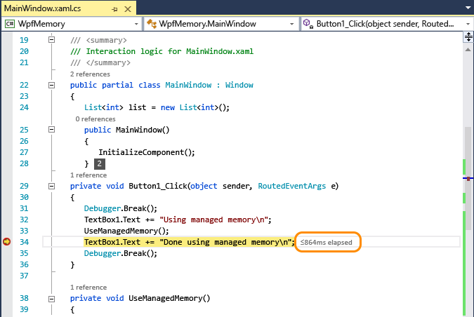
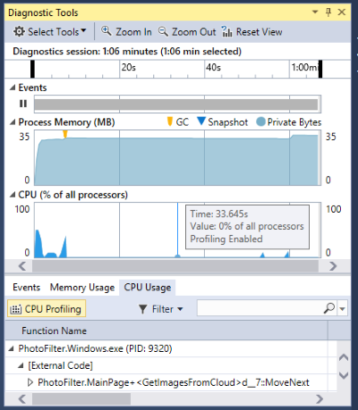

# PerfTips
Visual Studio debugger *PerfTips* and the debugger-integrated **Diagnostic Tools** help you to monitor and analyze the performance of your app while you are debugging.  
  
 Although the debugger-integrated diagnostic tools are a great way of becoming aware of performance issues while you are developing, the debugger can have a significant impact on the performance of your app. To collect more accurate performance data, consider using the Visual Studio diagnostics tools that run outside the debugger too as an additional part of your performance investigations. See [Run Visual Studio diagnostic tools without debugging](../vs140/run-profiling-tools-without-debugging.md).  
  
## PerfTips  
 When the debugger stops execution at a breakpoint or stepping operation, the elapsed time between the break and the previous breakpoint appears as a tip in the editor window. For more information, see [PerfTips: Performance Information at-a-glance while Debugging with Visual Studio](http://blogs.msdn.com/b/visualstudioalm/archive/2014/08/18/perftips-performance-information-at-a-glance-while-debugging-with-visual-studio.aspx).  
  
   
  
## Diagnostics Tools window  
 Breakpoints and associated timing data timing data are recorded in the Diagnostic Tools window  
  
 The following graphic shows the Diagnostic Tools window in Visual Studio 2015 Update 1:  
  
   
  
-   The **Break Events** timeline mark the breakpoints that were hit in the debugging session. Click on an event to select it the **Debugger** details list.  
  
-   The **CPU Utilization** graph shows the change in CPU use across all processor cores in the debugging session.  
  
-   The **Events** list of the **Debugger** details pane include items for each break event.  
  
-   The **Duration** column of a break event displays the elapsed time between the event and the previous breakpoint.  
  
## Turn PerfTips on or off  
 To enable or disable PerfTips:  
  
1.  On the **Debug** menu, choose **Options**.  
  
2.  Check or clear **Show elapsed PerfTip while debugging**.  
  
## Turn the Diagnostic Tools window on or off  
 To enable or disable the Diagnostic Tools window:  
  
1.  On the **Debug** menu, choose **Options**.  
  
2.  Check or clear **Enable Diagnostics Tools while debugging**.