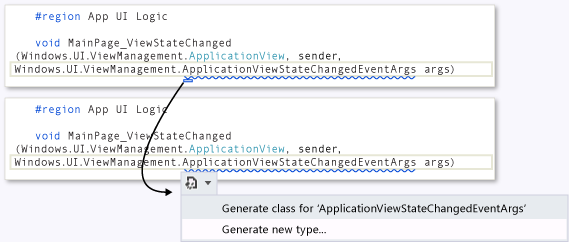
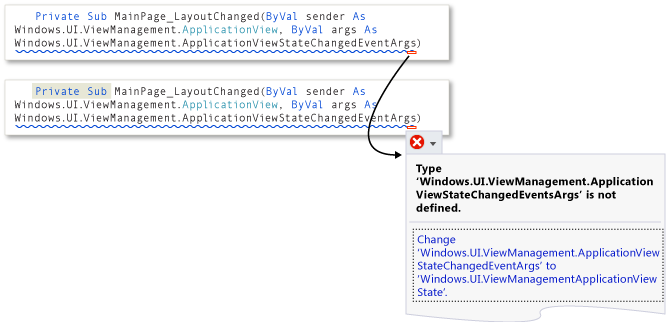

# Productivity Tips for Visual Studio
By following these tips, you can more quickly and efficiently write, navigate, and debug your code in Visual Studio. For more information about common keyboard shortcuts, see [Tips and Tricks for Visual Studio](../vs140/tips-and-tricks-for-visual-studio.md). For a more complete list, see [Identifying and Customizing Keyboard Shortcuts in Visual Studio](../vs140/identifying-and-customizing-keyboard-shortcuts-in-visual-studio.md) and [Pre-defined Keyboard Shortcuts](../vs140/default-keyboard-shortcuts-in-visual-studio.md).  
  
 This topic includes the following sections:  
  
 [Accessing Visual Studio Tools](../vs140/productivity-tips-for-visual-studio.md#BKMK_Access)  
  
 [Writing Code](../vs140/productivity-tips-for-visual-studio.md#BKMK_Writing)  
  
 [Navigating Within Your Code](../vs140/productivity-tips-for-visual-studio.md#BKMK_Navigating)  
  
 [Finding Items Faster](../vs140/productivity-tips-for-visual-studio.md#BKMK_Finding)  
  
 [Debugging Code](../vs140/productivity-tips-for-visual-studio.md#BKMK_Debugging)  
  
 [Managing Files, Toolbars, and Windows](../vs140/productivity-tips-for-visual-studio.md#BKMK_Managing)  
  
##  \ Accessing Visual Studio Tools  
 You can more easily access the Developer Command Prompt or another tool if you pin it to the Start screen or the taskbar.  
  
1.  From the Start screen, enter `Visual Studio Tools`, and then choose the Enter key.  
  
2.  In **File Explorer**, open the shortcut menu for the item that you want:  
  
    -   Build Notifications  
  
    -   Debuggable Package Manager  
  
    -   Developer Command Prompt for VS2013  
  
    -   Microsoft Feedback Client 2013  
  
    -   VS2013 ARM Cross Tools Command Prompt  
  
    -   VS2013 x64 Cross Tools Command Prompt  
  
    -   VS2013 x64 Native Tools Command Prompt  
  
    -   VS2013 x86 Native Tools Command Prompt  
  
3.  Choose **Pin to Start** or **Pin to Taskbar**.  
  
##  \ Writing Code  
 Write code more quickly by using the following features.  
  
-   **Use sample applications**. You can speed up application development by downloading and installing sample applications from the MSDN Code Gallery. You can also learn a particular technology or programming concept by downloading and exploring a Sample Pack for that area.  
  
-   **Use IntelliSense**. As you enter code in the editor, IntelliSense information, such as List Members, Parameter Info, Quick Info, Signature Help, and Complete Word, appears. These features support fuzzy matching of text; for example, the results lists for List Members includes not only entries that start with the characters that you have entered but also entries that contain the character combination anywhere in their names. For more information, see [Using IntelliSense](../vs140/using-intellisense.md).  
  
-   **Change auto-insertion of IntelliSense options as you enter code**. By switching IntelliSense to suggestion mode, you can specify that IntelliSense options are inserted only if you explicitly choose them.  
  
     To enable suggestion mode, choose the Ctrl + Alt + Spacebar keys, or, on the menu bar, choose **Edit**, **IntelliSense**, **Toggle Completion Mode**.  
  
-   **Use code snippets**. You can use built-in snippets or create your own snippets.  
  
     To insert a snippet, on the menu bar, choose **Edit**, **IntelliSense**, **Insert Snippet** or open the shortcut menu in a file and choose **Insert Snippet**. For more information, see [Code Snippets](../vs140/code-snippets.md).  
  
-   **Fix code errors inline**. Smart Tags appear as blue or red boxes under a line of code. You can display Smart Tag options by pointing to one of the boxes or by placing the cursor in the line of code and choosing the Ctrl + . (period) keys.  
  
     Blue boxes suggest ways to fix errors in your code.  
  
     Figure 1: Error Smart Tags  
  
       
  
     Red boxes suggest ways to refactor your code.  
  
     Figure 2: Refactoring Smart Tags  
  
       
  
-   **Show and edit the definition of a code element**. You can quickly show and edit the module in which a code element, such as a member, a variable, or a local, is defined.  
  
     To open a definition in a pop-up window, highlight the element and then choose the Alt+F12 keys, or open the shortcut menu for the element and then choose **Peek Definition**. To open a definition in a separate code window, open the shortcut menu for the element, and then choose **Go to Definition**.  
  
##  \ Navigating Within Your Code  
 You can use various techniques to find and move to specific locations in your code more quickly.  
  
-   **Bookmark lines of code**. You can use bookmarks to navigate quickly to specific lines of code in a file.  
  
     To set a bookmark, on the menu bar, choose **Edit**, **Bookmarks**, **Toggle Bookmark**. You can view all of the bookmarks for a solution in the **Bookmarks** window. For more information, see [Setting Bookmarks in Code](../vs140/setting-bookmarks-in-code.md).  
  
-   **Search for symbol definitions in a file**. You can search within a solution to locate symbol definitions and file names, but search results don’t include namespaces or local variables.  
  
     To access this feature, on the menu bar, choose **Edit**, **Navigate To**.  
  
-   **Browse the overall structure of your code**. In **Solution Explorer**, you can search and browse classes and their types and members in your projects. You can also search for symbols, view a method’s Call Hierarchy, find symbol references, and perform other tasks. If you choose a code element in **Solution Explorer**, the associated file opens in a **Preview** tab, and the cursor moves to the element in the file. For more information, see [Viewing the Structure of Code](../vs140/viewing-the-structure-of-code.md).  
  
##  \ Finding Items Faster  
 You can search across the IDE for commands, files, and options, in addition to filtering the contents of tool windows to show only relevant information for your current task.  
  
-   **Filter the contents of tool windows**. You can search within the contents of many tool windows, such as the **Toolbox**, the **Properties** window, and **Solution Explorer**, but display only items whose names contain the characters that you specify.  
  
-   **Display only the errors you want to address**. If you choose the **Filter** button on the **Error List** toolbar, you can reduce the number of errors that appear in the **Error List** window. You can display only the errors in the files that are open in the editor, only the errors in the current file, or only the errors in the current project. You can also search within the Error List window to find specific errors.  
  
-   **Find dialog boxes, menu commands, and options**. In the [Quick Launch](../vs140/quick-launch--environment--options-dialog-box.md) box, enter keywords or phrases for the items that you’re trying to find. For example, the following options appear if you enter `new project`:  
  
     Figure 3: Quick Launch results list for `new project`  
  
       
  
     **Quick Launch** displays links to the **New Project** dialog box, the **Add New Item** dialog box, and the Projects and Solutions page in the **Options** dialog box, among others. Quick Launch results can also include project files and tool windows.  
  
##  \ Debugging Code  
 Debugging can consume a lot of time, but the following tips can help you speed up the process.  
  
-   **Test the same page, application, or site in different browsers**. As you debug your code, you can easily switch among the installed web browsers, including [Page Inspector (Visual Studio)](assetId:///65880969-1ad2-47be-85b9-bb12c81bf209), without having to open the **Browse With** dialog box. You can use the **Debug Target** list, which is on the **Standard** toolbar next to the **Start Debugging** button, to quickly verify which browser you’re using as you debug or view pages.  
  
       
  
-   **Set temporary breakpoints**. You can create a temporary breakpoint in the current line of code and start the debugger simultaneously. When you hit that line of code, the debugger enters break mode. For more information, see [Start, Break, Step, Run through Code, and Stop Debugging in Visual Studio](../vs140/navigating-through-code-with-the-debugger.md).  
  
     To use this feature, choose the Ctrl + F10 keys, or open the shortcut menu for the line of code on which you want to break, and then choose **Run To Cursor**.  
  
-   **Move the execution point during debugging**. You can move the current execution point to a different section of code and then restart debugging from that point. This technique is useful if you want to debug a section of code without having to recreate all of the steps that are required to reach that section. For more information, see [Start, Break, Step, Run through Code, and Stop Debugging in Visual Studio](../vs140/navigating-through-code-with-the-debugger.md).  
  
     To move the execution point, drag the yellow arrowhead  to a location where you want to set the next statement in the same source file, and then choose the F5 key to continue debugging.  
  
-   **Capture value information for variables**. You can add a DataTip to a variable in your code and pin it so that you can access the last known value for the variable after debugging has finished. For more information, see [How to: Use DataTips](../vs140/view-data-values-in-data-tips--in-the-code-editor.md).  
  
     To add a DataTip, the debugger must be in break mode. Place the cursor on the variable, and then choose the pin button on the DataTip that appears. When debugging is stopped, a blue pin icon appears in the source file next to the line of code that contains the variable. If you point to the blue pin, the value of the variable from the most recent debugging session appears.  
  
-   **Clear the Immediate window**. You can erase the contents of the [Immediate Window](../vs140/immediate-window.md) at design time by entering `>cls` or `>Edit.ClearAll`  
  
     For more information about additional commands, see [Predefined Visual Studio Command Aliases](../vs140/visual-studio-command-aliases.md).  
  
##  \ Managing Files, Toolbars, and Windows  
 At any one time, you may be working in multiple code files and moving among several tool windows as you develop an application. You can keep organized by using the following tips.  
  
-   **Keep files that you frequently use visible in the editor**. You can pin files to the left side of the tab well so that they remain visible regardless of how many files are open in the editor.  
  
     To pin a file, choose the file’s tab, and then choose the **Toggle Pin Status** button.  
  
-   **Move documents and windows to other monitors**. If you use more than one monitor when you develop applications, you can work on portions of your application more easily by moving files that are open in the editor to another monitor. You can also move tool windows, such as debugger windows, to another monitor and tab dock document and tool windows together to create “rafts.” For more information, see [How to: Arrange and Dock Windows](../vs140/how-to--arrange-and-dock-windows.md).  
  
     You can also manage files more easily by creating another instance of **Solution Explorer** and moving it to another monitor. To create another instance of **Solution Explorer**, open a shortcut menu in **Solution Explorer**, and then choose **New Solution Explorer View**.  
  
-   **Customize the fonts that appear in Visual Studio**. You can change the font face, size, and color that’s used for text in the IDE. For example, you can customize the color of specific code elements in the editor and the font face in tool windows or throughout the IDE. For more information, see [How to: Change the Fonts and Colors Used in the IDE](../vs140/how-to--change-fonts-and-colors-in-visual-studio.md) and [How to: Change the Font Face, Size, and Colors Used in the Editor](../vs140/how-to--change-fonts-and-colors-in-the-editor.md).  
  
## See Also  
 [Default Keyboard Shortcuts for Frequently Used Commands in Visual Studio](../vs140/default-keyboard-shortcuts-for-frequently-used-commands-in-visual-studio.md)   
 [How to: Customize Menus and Toolbars (Visual Studio)](../vs140/how-to--customize-menus-and-toolbars-in-visual-studio.md)   
 [Walkthrough: Explore the Visual Studio IDE](../vs140/walkthrough--create-a-simple-application-with-visual-csharp-or-visual-basic.md)   
 [Accessibility Tips and Tricks](../vs140/accessibility-tips-and-tricks.md)