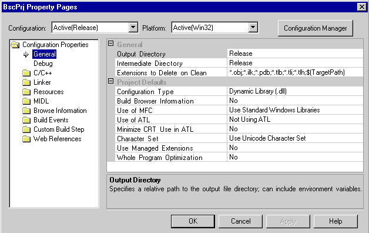

# Project Configuration Object
The project configuration object manages the display of configuration information to the UI.  
  
   
Project configuration property pages  
  
 The Project Configuration Provider manages the project configurations. The environment and other packages, to gain access to and retrieve information about a project's configurations, call the interfaces attached to Project Configuration Provider object.  
  
> [!NOTE]
>  You can’t create or edit solution configuration files programmatically. You must use <CodeContentPlaceHolder>0\</CodeContentPlaceHolder>. See [Solution Configuration](../vs140/solution-configuration.md) for more information.  
  
 To publish a display name to be used in the configuration UI, your project should implement \<xref:Microsoft.VisualStudio.Shell.Interop.IVsCfg.get_DisplayName*>. The environment calls \<xref:Microsoft.VisualStudio.Shell.Interop.IVsCfgProvider2.GetCfgs*>, which returns a list of <CodeContentPlaceHolder>1\</CodeContentPlaceHolder> pointers that you can use to get the display names for the Configuration and Platform information to be listed in the environment's UI. The active configuration and platform are determined by the project's configuration stored in the active solution configuration. The \<xref:Microsoft.VisualStudio.Shell.Interop.IVsSolutionBuildManager.FindActiveProjectCfg*> method can be used to retrieve the active project configuration.  
  
 The \<xref:Microsoft.VisualStudio.Shell.Interop.IVsProjectCfgProvider*> object can optionally be implemented on the \<xref:Microsoft.VisualStudio.Shell.Interop.IVsCfgProvider2*> object with the \<xref:Microsoft.VisualStudio.Shell.Interop.IVsCfgProviderEventsHelper*> object to allow you to retrieve an <CodeContentPlaceHolder>2\</CodeContentPlaceHolder> object based on the canonical project configuration name.  
  
 Another way to provide the environment and other projects with access to project configurations is for projects to provide an implementation of the <CodeContentPlaceHolder>3\</CodeContentPlaceHolder> method to return one or more configuration objects. The projects may also implement \<xref:Microsoft.VisualStudio.Shell.Interop.IVsProjectCfg2*>, which inherits from <CodeContentPlaceHolder>4\</CodeContentPlaceHolder> and thereby from <CodeContentPlaceHolder>5\</CodeContentPlaceHolder>, to provide configuration-specific information. \<xref:Microsoft.VisualStudio.Shell.Interop.IVsCfgProvider2*> supports platforms, and functionality for adding, deleting, and renaming project configurations.  
  
> [!NOTE]
>  Since Visual Studio is no longer limited to two configuration types, code that processes configurations should not be written with assumptions about the number of configurations, nor should it be written with the assumption that a project that has only one configuration is necessarily either Debug or Retail. This makes the use of \<xref:Microsoft.VisualStudio.Shell.Interop.IVsCfg.get_IsReleaseOnly*> and \<xref:Microsoft.VisualStudio.Shell.Interop.IVsCfg.get_IsDebugOnly*> obsolete.  
  
 Calling <CodeContentPlaceHolder>6\</CodeContentPlaceHolder> on the object returned from<CodeContentPlaceHolder>7\</CodeContentPlaceHolder> retrieves <CodeContentPlaceHolder>8\</CodeContentPlaceHolder>. If <CodeContentPlaceHolder>9\</CodeContentPlaceHolder> is not found by calling <CodeContentPlaceHolder>10\</CodeContentPlaceHolder> on the <CodeContentPlaceHolder>11\</CodeContentPlaceHolder> project object, you can access the configuration provider object by calling <CodeContentPlaceHolder>12\</CodeContentPlaceHolder> on the hierarchy root browser object for the object returned for <CodeContentPlaceHolder>13\</CodeContentPlaceHolder>, or through a pointer to the configuration provider returned for <CodeContentPlaceHolder>14\</CodeContentPlaceHolder>.  
  
 <CodeContentPlaceHolder>15\</CodeContentPlaceHolder> primarily provides access to build, debug and deployment management objects and allows projects the freedom to group outputs. The methods of <CodeContentPlaceHolder>16\</CodeContentPlaceHolder> and <CodeContentPlaceHolder>17\</CodeContentPlaceHolder> can be used to implement \<xref:Microsoft.VisualStudio.Shell.Interop.IVsBuildableProjectCfg*> to manage the build process, and \<xref:Microsoft.VisualStudio.Shell.Interop.IVsOutputGroup*> pointers for the output groups of a configuration.  
  
 The project must return the same number of groups for each configuration that it supports even though the number of outputs contained within a group may vary from configuration to configuration. The groups must also have the same identifier information (canonical name, display name, and group information) from configuration to configuration within a project. For more information, see [Project Configuration for Output](../vs140/project-configuration-for-output.md).  
  
 To enable debugging, your configurations should implement \<xref:Microsoft.VisualStudio.Shell.Interop.IVsDebuggableProjectCfg*>. <CodeContentPlaceHolder>18\</CodeContentPlaceHolder> is an optional interface implemented by projects to allow the debugger to launch a configuration and is implemented on the configuration object with <CodeContentPlaceHolder>19\</CodeContentPlaceHolder> and <CodeContentPlaceHolder>20\</CodeContentPlaceHolder>. The environment calls it when the user elects to start the debugger by pressing F5.  
  
 <CodeContentPlaceHolder>21\</CodeContentPlaceHolder> and <CodeContentPlaceHolder>22\</CodeContentPlaceHolder> are used in conjunction with property pages to retrieve and display configuration-dependent information to the user. For more information, see [Property Pages](../vs140/property-pages.md).  
  
## See Also  
 [Managing Configuration Options](../vs140/managing-configuration-options.md)   
 [Project Configuration for Building](../vs140/project-configuration-for-building.md)   
 [Project Configuration for Output](../vs140/project-configuration-for-output.md)   
 [Property Pages](../vs140/property-pages.md)   
 [Solution Configuration](../vs140/solution-configuration.md)