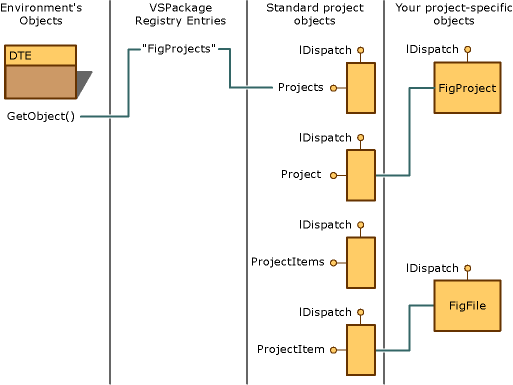

# Project Modeling
The next step in providing automation for your project is to implement the standard project objects: the \<xref:EnvDTE.Projects*> and <CodeContentPlaceHolder>1\</CodeContentPlaceHolder> collections; the <CodeContentPlaceHolder>2\</CodeContentPlaceHolder> and \<xref:EnvDTE.ProjectItem*> objects; and the remaining objects unique to your implementation. These standard objects are defined in Dteinternal.h file. An implementation of the standard objects is provided in the BscPrj sample. You can use these classes as models to create your own standard project objects that stand side-by-side with project objects from other project types.  
  
 An automation consumer presumes to be able to call \<xref:EnvDTE.Solution*>("<CodeContentPlaceHolder>3\</CodeContentPlaceHolder> and \<xref:EnvDTE.ProjectItems*> (<CodeContentPlaceHolder>4\</CodeContentPlaceHolder>) where n is an index number for obtaining a specific project in the solution. Making this automation call causes the environment to call \<xref:Microsoft.VisualStudio.Shell.Interop.IVsUIHierarchy.GetProperty*> on the appropriate project hierarchy, passing VSITEMID_ROOT as the ItemID parameter and VSHPROPID_ExtObject as VSHPROPID parameter. <CodeContentPlaceHolder>5\</CodeContentPlaceHolder> returns an <CodeContentPlaceHolder>6\</CodeContentPlaceHolder> pointer to the automation object providing the core <CodeContentPlaceHolder>7\</CodeContentPlaceHolder> interface, which you have implemented.  
  
 The following is the syntax of <CodeContentPlaceHolder>8\</CodeContentPlaceHolder>.  
  
 <CodeContentPlaceHolder>9\</CodeContentPlaceHolder>  
  
 <CodeContentPlaceHolder>10\</CodeContentPlaceHolder> <CodeContentPlaceHolder>11\</CodeContentPlaceHolder>,  
  
 <CodeContentPlaceHolder>12\</CodeContentPlaceHolder> <CodeContentPlaceHolder>13\</CodeContentPlaceHolder>,  
  
 <CodeContentPlaceHolder>14\</CodeContentPlaceHolder> <CodeContentPlaceHolder>15\</CodeContentPlaceHolder>  
  
 <CodeContentPlaceHolder>16\</CodeContentPlaceHolder>  
  
 Projects accommodate nesting and use collections to create groups of project items. The hierarchy looks like this.  
  
<CodeContentPlaceHolder>0\</CodeContentPlaceHolder>  
 Nesting means that a \<xref:EnvDTE.ProjectItem*> object can be \<xref:EnvDTE.ProjectItems*> collection at the same time because a <CodeContentPlaceHolder>17\</CodeContentPlaceHolder> collection can contain the nested objects. The Basic Project sample does not demonstrate this nesting. By implementing the <CodeContentPlaceHolder>18\</CodeContentPlaceHolder> object, you participate in the tree-like structure that characterizes the design of the overall automation model.  
  
 The project automation follows the path in the following diagram.  
  
   
Project automation  
  
 If you do not implement a <CodeContentPlaceHolder>19\</CodeContentPlaceHolder> object, the environment will still return a generic <CodeContentPlaceHolder>20\</CodeContentPlaceHolder> object that contains only the name of the project.  
  
## See Also  
 \<xref:EnvDTE.Projects*>   
 \<xref:EnvDTE.ProjectItem*>   
 \<xref:EnvDTE.ProjectItems*>