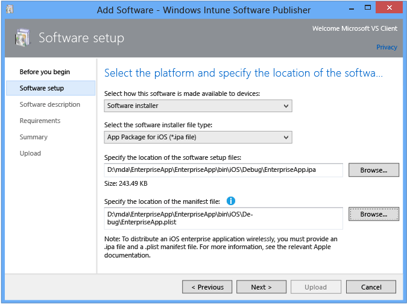

# Publish Your App Built with Visual Studio Tools for Apache Cordova
[!INCLUDE[cordova_header](../vs140/includes/cordova_header_md.md)]  
  
 To publish your app built using Visual Studio Tools for Apache Cordova, you can access the packages you build in the bin folder in the Visual Studio project directory. For more information about building packages, see [Package your app](../vs140/package-your-app-built-with-visual-studio-tools-for-apache-cordova.md).  
  
> [!TIP]
>  For information on how to create packaging assets for Windows, iOS, and Android, see this [github documentation](https://github.com/Microsoft/cordova-docs/tree/master/tutorial-package-publish).  
  
 Instructions for uploading your app to the public app store vary by platform:  
  
-   For Google Play, see the [instructions](https://support.google.com/googleplay/android-developer/answer/113469?hl=en) on the Android Developer website.  
  
-   For iOS, use the Application Loader to submit your app to the App Store. To do this, follow the instructions in the [Using Application Loader](https://itunesconnect.apple.com/docs/UsingApplicationLoader.pdf) PDF file.  
  
-   For Windows, see [Using the Windows Store Dashboard](http://msdn.microsoft.com/library/windows/apps/hh967767.aspx) in the Windows Dev Center.  
  
-   For Windows Phone, see [Submit your app](http://msdn.microsoft.com/library/windowsphone/help/jj206724.aspx) in the Windows Dev Center.  
  
 Although the process of uploading your app to a public store varies by store type and platform, [Windows Intune](http://www.microsoft.com/server-cloud/products/windows-intune/default.aspx#fbid=Zjhx4IFbY3b) provides an excellent cross-platform internal app store for Android, iOS, Windows, and Windows Phone. You can upload your app to Windows Intune by using [Microsoft System Center](http://www.microsoft.com/server-cloud/products/system-center-2012-r2/default.aspx#fbid=Zjhx4IFbY3b) and the Windows Intune management console, shown here.  
  
   
  
 Follow the steps described in [Deploy software to mobile devices in Windows Intune](http://technet.microsoft.com/library/dn646972.aspx) to publish a software installer for each device type (Android, iOS, Windows Phone, and Windows).  
  
 For your convenience, the `vs-mda-remote` agent also creates a Wireless Manifest plist file. You can use this file to upload your iOS app to Windows Intune. The plist file can be found in the bin folder with your IPA (.ipa) file after you build your app in Visual Studio. You can also modify this file manually.  
  
  [Get the Visual Studio Tools for Apache Cordova](http://aka.ms/mchm38) or [learn more](https://www.visualstudio.com/cordova-vs.aspx)  
  
## See Also  
 [Package your app](../vs140/package-your-app-built-with-visual-studio-tools-for-apache-cordova.md)   
 [Getting started with Visual Studio Tools for Apache Cordova](../vs140/get-started-with-visual-studio-tools-for-apache-cordova1.md)   
 [FAQ](http://go.microsoft.com/fwlink/?linkid=398476)