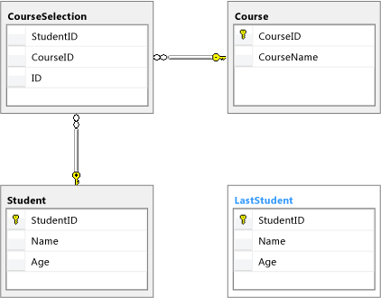

# Query Expressions (F#)
Query expressions enable you to query a data source and put the data in a desired form. Query expressions provide support for LINQ in F\#.  
  
## Syntax  
  
<CodeContentPlaceHolder>0\</CodeContentPlaceHolder>  
## Remarks  
 Query expressions are a type of computation expression similar to sequence expressions. Just as you specify a sequence by providing code in a sequence expression, you specify a set of data by providing code in a query expression. In a sequence expression, the <CodeContentPlaceHolder>5\</CodeContentPlaceHolder> keyword identifies data to be returned as part of the resulting sequence. In query expressions, the <CodeContentPlaceHolder>6\</CodeContentPlaceHolder> keyword performs the same function. In addition to the <CodeContentPlaceHolder>7\</CodeContentPlaceHolder> keyword, F\# also supports a number of query operators that are much like the parts of a SQL SELECT statement. Here is an example of a simple query expression, along with code that connects to the Northwind OData source.  
  
<CodeContentPlaceHolder>1\</CodeContentPlaceHolder>  
 In the previous code example, the query expression is in curly braces. The meaning of the code in the expression is, return every customer in the Customers table in the database in the query results. Query expressions return a type that implements <xref:System.Linq.IQueryable<CodeContentPlaceHolder>8\</CodeContentPlaceHolder>1*>, and so they can be iterated using the [Seq module](../vs140/collections.seq-module--fsharp-.md) as the example shows.  
  
 Every computation expression type is built from a builder class. The builder class for the query computation expression is <CodeContentPlaceHolder>9\</CodeContentPlaceHolder>. For more information, see [Computation Expressions \(F\#\)](../vs140/computation-expressions--fsharp-.md) and [Linq.QueryBuilder Class \(F\#\)](../vs140/linq.querybuilder-class--fsharp-.md).  
  
## Query Operators  
 Query operators enable you to specify the details of the query, such as to put criteria on records to be returned, or specify the sorting order of results. The query source must support the query operator. If you attempt to use an unsupported query operator, \<xref:System.NotSupportedException*> will be thrown.  
  
 Only expressions that can be translated to SQL are allowed in query expressions. For example, no function calls are allowed in the expressions when you use the <CodeContentPlaceHolder>10\</CodeContentPlaceHolder> query operator.  
  
 Table 1 shows available query operators. In addition, see Table2, which compares SQL queries and the equivalent F\# query expressions later in this topic. Some query operators aren't supported by some type providers. In particular, the OData type provider is limited in the query operators that it supports due to limitations in OData. For more information, see [ODataService Type Provider \(F\#\)](../vs140/odataservice-type-provider--fsharp-.md).  
  
 This table assumes a database in the following form:  
  
   
Sample Database Diagram  
  
 The code in the tables that follow also assumes the following database connection code. Projects should add references to System.Data,  System.Data.Linq, and FSharp.Data.TypeProviders assemblies. The code that creates this database is included at the end of this topic.  
  
<CodeContentPlaceHolder>2\</CodeContentPlaceHolder>  
### Table 1. Query Operators  
  
|||  
|-|-|  
|**Operator**|**Description**|  
|<CodeContentPlaceHolder>11\</CodeContentPlaceHolder>|Determines whether the selected elements include a specified element.\ \  <CodeContentPlaceHolder>12\</CodeContentPlaceHolder>|  
|<CodeContentPlaceHolder>13\</CodeContentPlaceHolder>|Returns the number of selected elements.\ \  <CodeContentPlaceHolder>14\</CodeContentPlaceHolder>|  
|<CodeContentPlaceHolder>15\</CodeContentPlaceHolder>|Selects the last element of those selected so far.\ \  <CodeContentPlaceHolder>16\</CodeContentPlaceHolder>|  
|<CodeContentPlaceHolder>17\</CodeContentPlaceHolder>|Selects the last element of those selected so far, or a default value if no element is found.\ \  <CodeContentPlaceHolder>18\</CodeContentPlaceHolder>|  
|<CodeContentPlaceHolder>19\</CodeContentPlaceHolder>|Selects the single, specific element selected so far. If multiple elements are present, an exception is thrown.\ \  <CodeContentPlaceHolder>20\</CodeContentPlaceHolder>|  
|<CodeContentPlaceHolder>21\</CodeContentPlaceHolder>|Selects the single, specific element of those selected so far, or a default value if that element is not found.\ \  <CodeContentPlaceHolder>22\</CodeContentPlaceHolder>|  
|<CodeContentPlaceHolder>23\</CodeContentPlaceHolder>|Selects the first element of those selected so far, or a default value if the sequence contains no elements.\ \  <CodeContentPlaceHolder>24\</CodeContentPlaceHolder>|  
|<CodeContentPlaceHolder>25\</CodeContentPlaceHolder>|Projects each of the elements selected so far.\ \  <CodeContentPlaceHolder>26\</CodeContentPlaceHolder>|  
|<CodeContentPlaceHolder>27\</CodeContentPlaceHolder>|Selects elements based on a specified predicate.\ \  <CodeContentPlaceHolder>28\</CodeContentPlaceHolder>|  
|<CodeContentPlaceHolder>29\</CodeContentPlaceHolder>|Selects a value for each element selected so far and returns the minimum resulting value.\ \  <CodeContentPlaceHolder>30\</CodeContentPlaceHolder>|  
|<CodeContentPlaceHolder>31\</CodeContentPlaceHolder>|Selects a value for each element selected so far and returns the maximum resulting value.\ \  <CodeContentPlaceHolder>32\</CodeContentPlaceHolder>|  
|<CodeContentPlaceHolder>33\</CodeContentPlaceHolder>|Groups the elements selected so far according to a specified key selector.\ \  <CodeContentPlaceHolder>34\</CodeContentPlaceHolder>|  
|<CodeContentPlaceHolder>35\</CodeContentPlaceHolder>|Sorts the elements selected so far in ascending order by the given sorting key.\ \  <CodeContentPlaceHolder>36\</CodeContentPlaceHolder>|  
|<CodeContentPlaceHolder>37\</CodeContentPlaceHolder>|Sorts the elements selected so far in descending order by the given sorting key.\ \  <CodeContentPlaceHolder>38\</CodeContentPlaceHolder>|  
|<CodeContentPlaceHolder>39\</CodeContentPlaceHolder>|Performs a subsequent ordering of the elements selected so far in ascending order by the given sorting key. This operator may only be used after a <CodeContentPlaceHolder>40\</CodeContentPlaceHolder>, <CodeContentPlaceHolder>41\</CodeContentPlaceHolder>, <CodeContentPlaceHolder>42\</CodeContentPlaceHolder>, or <CodeContentPlaceHolder>43\</CodeContentPlaceHolder>.\ \  <CodeContentPlaceHolder>44\</CodeContentPlaceHolder>|  
|<CodeContentPlaceHolder>45\</CodeContentPlaceHolder>|Performs a subsequent ordering of the elements selected so far in descending order by the given sorting key. This operator may only be used after a <CodeContentPlaceHolder>46\</CodeContentPlaceHolder>, <CodeContentPlaceHolder>47\</CodeContentPlaceHolder>, <CodeContentPlaceHolder>48\</CodeContentPlaceHolder>, or <CodeContentPlaceHolder>49\</CodeContentPlaceHolder>.\ \  <CodeContentPlaceHolder>50\</CodeContentPlaceHolder>|  
|<CodeContentPlaceHolder>51\</CodeContentPlaceHolder>|Selects a value for each element selected so far and groups the elements by the given key.\ \  <CodeContentPlaceHolder>52\</CodeContentPlaceHolder>|  
|<CodeContentPlaceHolder>53\</CodeContentPlaceHolder>|Correlates two sets of selected values based on matching keys. Note that the order of the keys around the \= sign in a join expression is significant. In all joins, if the line is split after the <CodeContentPlaceHolder>54\</CodeContentPlaceHolder> symbol, the indentation must be indented at least as far as the keyword <CodeContentPlaceHolder>55\</CodeContentPlaceHolder>.\ \  <CodeContentPlaceHolder>56\</CodeContentPlaceHolder>|  
|<CodeContentPlaceHolder>57\</CodeContentPlaceHolder>|Correlates two sets of selected values based on matching keys and groups the results. Note that the order of the keys around the \= sign in a join expression is significant.\ \  <CodeContentPlaceHolder>58\</CodeContentPlaceHolder>|  
|<CodeContentPlaceHolder>59\</CodeContentPlaceHolder>|Correlates two sets of selected values based on matching keys and groups the results. If any group is empty, a group with a single default value is used instead. Note that the order of the keys around the \= sign in a join expression is significant.\ \  <CodeContentPlaceHolder>60\</CodeContentPlaceHolder>|  
|<CodeContentPlaceHolder>61\</CodeContentPlaceHolder>|Selects a nullable value for each element selected so far and returns the sum of these values. If any nullable does not have a value, it is ignored.\ \  <CodeContentPlaceHolder>62\</CodeContentPlaceHolder>|  
|<CodeContentPlaceHolder>63\</CodeContentPlaceHolder>|Selects a nullable value for each element selected so far and returns the minimum of these values. If any nullable does not have a value, it is ignored.\ \  <CodeContentPlaceHolder>64\</CodeContentPlaceHolder>|  
|<CodeContentPlaceHolder>65\</CodeContentPlaceHolder>|Selects a nullable value for each element selected so far and returns the maximum of these values. If any nullable does not have a value, it is ignored.\ \  <CodeContentPlaceHolder>66\</CodeContentPlaceHolder>|  
|<CodeContentPlaceHolder>67\</CodeContentPlaceHolder>|Selects a nullable value for each element selected so far and returns the average of these values. If any nullable does not have a value, it is ignored.\ \  <CodeContentPlaceHolder>68\</CodeContentPlaceHolder>|  
|<CodeContentPlaceHolder>69\</CodeContentPlaceHolder>|Selects a value for each element selected so far and returns the average of these values.\ \  <CodeContentPlaceHolder>70\</CodeContentPlaceHolder>|  
|<CodeContentPlaceHolder>71\</CodeContentPlaceHolder>|Selects distinct elements from the elements selected so far.\ \  <CodeContentPlaceHolder>72\</CodeContentPlaceHolder>|  
|<CodeContentPlaceHolder>73\</CodeContentPlaceHolder>|Determines whether any element selected so far satisfies a condition.\ \  <CodeContentPlaceHolder>74\</CodeContentPlaceHolder>|  
|<CodeContentPlaceHolder>75\</CodeContentPlaceHolder>|Selects the first element selected so far that satisfies a specified condition.\ \  <CodeContentPlaceHolder>76\</CodeContentPlaceHolder>|  
|<CodeContentPlaceHolder>77\</CodeContentPlaceHolder>|Determines whether all elements selected so far satisfy a condition.\ \  <CodeContentPlaceHolder>78\</CodeContentPlaceHolder>|  
|<CodeContentPlaceHolder>79\</CodeContentPlaceHolder>|Selects the first element from those selected so far.\ \  <CodeContentPlaceHolder>80\</CodeContentPlaceHolder>|  
|<CodeContentPlaceHolder>81\</CodeContentPlaceHolder>|Selects the element at a specified index amongst those selected so far.\ \  <CodeContentPlaceHolder>82\</CodeContentPlaceHolder>|  
|<CodeContentPlaceHolder>83\</CodeContentPlaceHolder>|Bypasses a specified number of the elements selected so far and then selects the remaining elements.\ \  <CodeContentPlaceHolder>84\</CodeContentPlaceHolder>|  
|<CodeContentPlaceHolder>85\</CodeContentPlaceHolder>|Bypasses elements in a sequence as long as a specified condition is true and then selects the remaining elements.\ \  <CodeContentPlaceHolder>86\</CodeContentPlaceHolder>|  
|<CodeContentPlaceHolder>87\</CodeContentPlaceHolder>|Selects a value for each element selected so far and returns the sum of these values.\ \  <CodeContentPlaceHolder>88\</CodeContentPlaceHolder>|  
|<CodeContentPlaceHolder>89\</CodeContentPlaceHolder>|Selects a specified number of contiguous elements from those selected so far.\ \  <CodeContentPlaceHolder>90\</CodeContentPlaceHolder>|  
|<CodeContentPlaceHolder>91\</CodeContentPlaceHolder>|Selects elements from a sequence as long as a specified condition is true, and then skips the remaining elements.\ \  <CodeContentPlaceHolder>92\</CodeContentPlaceHolder>|  
|<CodeContentPlaceHolder>93\</CodeContentPlaceHolder>|Sorts the elements selected so far in ascending order by the given nullable sorting key.\ \  <CodeContentPlaceHolder>94\</CodeContentPlaceHolder>|  
|<CodeContentPlaceHolder>95\</CodeContentPlaceHolder>|Sorts the elements selected so far in descending order by the given nullable sorting key.\ \  <CodeContentPlaceHolder>96\</CodeContentPlaceHolder>|  
|<CodeContentPlaceHolder>97\</CodeContentPlaceHolder>|Performs a subsequent ordering of the elements selected so far in ascending order by the given nullable sorting key. This operator may only be used immediately after a <CodeContentPlaceHolder>98\</CodeContentPlaceHolder>, <CodeContentPlaceHolder>99\</CodeContentPlaceHolder>, <CodeContentPlaceHolder>100\</CodeContentPlaceHolder>, or <CodeContentPlaceHolder>101\</CodeContentPlaceHolder>, or their nullable variants.\ \  <CodeContentPlaceHolder>102\</CodeContentPlaceHolder>|  
|<CodeContentPlaceHolder>103\</CodeContentPlaceHolder>|Performs a subsequent ordering of the elements selected so far in descending order by the given nullable sorting key. This operator may only be used immediately after a <CodeContentPlaceHolder>104\</CodeContentPlaceHolder>, <CodeContentPlaceHolder>105\</CodeContentPlaceHolder>, <CodeContentPlaceHolder>106\</CodeContentPlaceHolder>, or <CodeContentPlaceHolder>107\</CodeContentPlaceHolder>, or their nullable variants.\ \  <CodeContentPlaceHolder>108\</CodeContentPlaceHolder>|  
  
## Comparison of Transact\-SQL and F\# Query Expressions  
 The following table shows some common Transact\-SQL queries and their equivalents in F\#. The code in this table also assumes the same database as the previous table and the same initial code to set up the type provider.  
  
### Table 2. Transact\-SQL and F\# Query Expressions  
  
|Transact\-SQL \(not case sensitive\)|F\# Query Expression \(case sensitive\)|  
|------------------------------------------|---------------------------------------------|  
|Select all fields from table.\ \  <CodeContentPlaceHolder>109\</CodeContentPlaceHolder>|<CodeContentPlaceHolder>110\</CodeContentPlaceHolder>|  
|Count records in a table.\ \  <CodeContentPlaceHolder>111\</CodeContentPlaceHolder>|<CodeContentPlaceHolder>112\</CodeContentPlaceHolder>|  
|<CodeContentPlaceHolder>113\</CodeContentPlaceHolder>\ \  <CodeContentPlaceHolder>114\</CodeContentPlaceHolder>|<CodeContentPlaceHolder>115\</CodeContentPlaceHolder>|  
|Grouping\ \  <CodeContentPlaceHolder>116\</CodeContentPlaceHolder>|<CodeContentPlaceHolder>117\</CodeContentPlaceHolder>|  
|Grouping with condition.\ \  <CodeContentPlaceHolder>118\</CodeContentPlaceHolder>|<CodeContentPlaceHolder>119\</CodeContentPlaceHolder>|  
|Grouping with count condition.\ \  <CodeContentPlaceHolder>120\</CodeContentPlaceHolder>|<CodeContentPlaceHolder>121\</CodeContentPlaceHolder>|  
|Grouping, counting, and summing.\ \  <CodeContentPlaceHolder>122\</CodeContentPlaceHolder>|<CodeContentPlaceHolder>123\</CodeContentPlaceHolder>|  
|Grouping, counting, and ordering by count.\ \  <CodeContentPlaceHolder>124\</CodeContentPlaceHolder>|<CodeContentPlaceHolder>125\</CodeContentPlaceHolder>|  
|<CodeContentPlaceHolder>126\</CodeContentPlaceHolder> a set of specified values\ \  <CodeContentPlaceHolder>127\</CodeContentPlaceHolder>|<CodeContentPlaceHolder>128\</CodeContentPlaceHolder>|  
|<CodeContentPlaceHolder>129\</CodeContentPlaceHolder> and <CodeContentPlaceHolder>130\</CodeContentPlaceHolder>.\ \  <CodeContentPlaceHolder>131\</CodeContentPlaceHolder>|<CodeContentPlaceHolder>132\</CodeContentPlaceHolder>|  
|<CodeContentPlaceHolder>133\</CodeContentPlaceHolder> with pattern match set.\ \  <CodeContentPlaceHolder>134\</CodeContentPlaceHolder>|<CodeContentPlaceHolder>135\</CodeContentPlaceHolder>|  
|<CodeContentPlaceHolder>136\</CodeContentPlaceHolder> with set exclusion pattern.\ \  <CodeContentPlaceHolder>137\</CodeContentPlaceHolder>|<CodeContentPlaceHolder>138\</CodeContentPlaceHolder>|  
|<CodeContentPlaceHolder>139\</CodeContentPlaceHolder> on one field, but select a different field.\ \  <CodeContentPlaceHolder>140\</CodeContentPlaceHolder>|<CodeContentPlaceHolder>141\</CodeContentPlaceHolder>|  
|<CodeContentPlaceHolder>142\</CodeContentPlaceHolder>, with substring search.\ \  <CodeContentPlaceHolder>143\</CodeContentPlaceHolder>|<CodeContentPlaceHolder>144\</CodeContentPlaceHolder>|  
|Simple <CodeContentPlaceHolder>145\</CodeContentPlaceHolder> with two tables.\ \  <CodeContentPlaceHolder>146\</CodeContentPlaceHolder>|<CodeContentPlaceHolder>147\</CodeContentPlaceHolder>|  
|<CodeContentPlaceHolder>148\</CodeContentPlaceHolder> with two tables.\ \  <CodeContentPlaceHolder>149\</CodeContentPlaceHolder>|<CodeContentPlaceHolder>150\</CodeContentPlaceHolder>|  
|<CodeContentPlaceHolder>151\</CodeContentPlaceHolder> with <CodeContentPlaceHolder>152\</CodeContentPlaceHolder>\ \  <CodeContentPlaceHolder>153\</CodeContentPlaceHolder>|<CodeContentPlaceHolder>154\</CodeContentPlaceHolder>|  
|<CodeContentPlaceHolder>155\</CodeContentPlaceHolder>\ \  <CodeContentPlaceHolder>156\</CodeContentPlaceHolder>|<CodeContentPlaceHolder>157\</CodeContentPlaceHolder>|  
|Distinct count.\ \  <CodeContentPlaceHolder>158\</CodeContentPlaceHolder>|<CodeContentPlaceHolder>159\</CodeContentPlaceHolder>|  
|<CodeContentPlaceHolder>160\</CodeContentPlaceHolder>\ \  <CodeContentPlaceHolder>161\</CodeContentPlaceHolder>|<CodeContentPlaceHolder>162\</CodeContentPlaceHolder>|  
|<CodeContentPlaceHolder>163\</CodeContentPlaceHolder>\ \  <CodeContentPlaceHolder>164\</CodeContentPlaceHolder>|<CodeContentPlaceHolder>165\</CodeContentPlaceHolder>|  
|<CodeContentPlaceHolder>166\</CodeContentPlaceHolder> with ordering\ \  <CodeContentPlaceHolder>167\</CodeContentPlaceHolder>|<CodeContentPlaceHolder>168\</CodeContentPlaceHolder>|  
|<CodeContentPlaceHolder>169\</CodeContentPlaceHolder>, <CodeContentPlaceHolder>170\</CodeContentPlaceHolder>, and ordering.\ \  <CodeContentPlaceHolder>171\</CodeContentPlaceHolder>|<CodeContentPlaceHolder>172\</CodeContentPlaceHolder>|  
|<CodeContentPlaceHolder>173\</CodeContentPlaceHolder> of two queries.\ \  <CodeContentPlaceHolder>174\</CodeContentPlaceHolder>|<CodeContentPlaceHolder>175\</CodeContentPlaceHolder>|  
|Intersection of two queries.\ \  <CodeContentPlaceHolder>176\</CodeContentPlaceHolder>|<CodeContentPlaceHolder>177\</CodeContentPlaceHolder>|  
|<CodeContentPlaceHolder>178\</CodeContentPlaceHolder> condition.\ \  <CodeContentPlaceHolder>179\</CodeContentPlaceHolder>|<CodeContentPlaceHolder>180\</CodeContentPlaceHolder>|  
|Multiple cases.\ \  <CodeContentPlaceHolder>181\</CodeContentPlaceHolder>|<CodeContentPlaceHolder>182\</CodeContentPlaceHolder>|  
|Multiple tables.\ \  <CodeContentPlaceHolder>183\</CodeContentPlaceHolder>|<CodeContentPlaceHolder>184\</CodeContentPlaceHolder>|  
|Multiple joins.\ \  <CodeContentPlaceHolder>185\</CodeContentPlaceHolder>|<CodeContentPlaceHolder>186\</CodeContentPlaceHolder>|  
|Multiple left outer joins.\ \  <CodeContentPlaceHolder>187\</CodeContentPlaceHolder>|<CodeContentPlaceHolder>188\</CodeContentPlaceHolder>|  
  
 The following code can be used to create the sample database for these examples.  
  
<CodeContentPlaceHolder>3\</CodeContentPlaceHolder>  
 The following code contains  the sample code that appears in this topic.  
  
<CodeContentPlaceHolder>4\</CodeContentPlaceHolder>  
 And here is the full output when this code is run in F\# Interactive.  
  
 **\-\-\> Referenced 'C:\\Program Files \(x86\)\\Reference Assemblies\\Microsoft\\FSharp\\3.0\\Runtime\\v4.0\\Type Providers\\FSharp.Data.TypeProviders.dll'\-\-\> Referenced 'C:\\Windows\\Microsoft.NET\\Framework\\v4.0.30319\\System.Data.dll'\-\-\> Referenced 'C:\\Windows\\Microsoft.NET\\Framework\\v4.0.30319\\System.Data.Linq.dll'contains query operatorBinding session to 'C:\\Users\\ghogen\\AppData\\Local\\Temp\\tmp5E3C.dll'...Binding session to 'C:\\Users\\ghogen\\AppData\\Local\\Temp\\tmp611A.dll'...Is at least one student age 11? truecount query operatorNumber of students: 8last query operator.Last number: 21lastOrDefault query operator.lastOrDefault: 21exactlyOne query operator.Student with StudentID \= 1 is Abercrombie, KimexactlyOneOrDefault query operator.Student with StudentID \= 1 is Abercrombie, KimheadOrDefault query operator.head student is Abercrombie, Kimselect query operator.StudentID, Name: 1 Abercrombie, KimStudentID, Name: 2 Abolrous, HazenStudentID, Name: 3 Hance, JimStudentID, Name: 4 Adams, TerryStudentID, Name: 5 Hansen, ClausStudentID, Name: 6 Penor, LoriStudentID, Name: 7 Perham, TomStudentID, Name: 8 Peng, Yun\-Fengwhere query operator.StudentID, Name: 5 Hansen, ClausStudentID, Name: 6 Penor, LoriStudentID, Name: 7 Perham, TomStudentID, Name: 8 Peng, Yun\-FengminBy query operator.maxBy query operator.groupBy query operator.Age: NULL Count at that age: 1Age: 10 Count at that age: 1Age: 11 Count at that age: 1Age: 12 Count at that age: 3Age: 13 Count at that age: 1Age: 14 Count at that age: 1sortBy query operator.StudentID, Name: 1 Abercrombie, KimStudentID, Name: 2 Abolrous, HazenStudentID, Name: 4 Adams, TerryStudentID, Name: 3 Hance, JimStudentID, Name: 5 Hansen, ClausStudentID, Name: 8 Peng, Yun\-FengStudentID, Name: 6 Penor, LoriStudentID, Name: 7 Perham, TomsortByDescending query operator.StudentID, Name: 7 Perham, TomStudentID, Name: 6 Penor, LoriStudentID, Name: 8 Peng, Yun\-FengStudentID, Name: 5 Hansen, ClausStudentID, Name: 3 Hance, JimStudentID, Name: 4 Adams, TerryStudentID, Name: 2 Abolrous, HazenStudentID, Name: 1 Abercrombie, KimthenBy query operator.StudentID, Name: 10 Abercrombie, KimStudentID, Name: 11 Hansen, ClausStudentID, Name: 12 Adams, TerryStudentID, Name: 12 Hance, JimStudentID, Name: 12 Perham, TomStudentID, Name: 13 Penor, LoriStudentID, Name: 14 Abolrous, HazenthenByDescending query operator.StudentID, Name: 10 Abercrombie, KimStudentID, Name: 11 Hansen, ClausStudentID, Name: 12 Perham, TomStudentID, Name: 12 Hance, JimStudentID, Name: 12 Adams, TerryStudentID, Name: 13 Penor, LoriStudentID, Name: 14 Abolrous, HazengroupValBy query operator.Age: NULL Count at that age: 1Name: Peng, Yun\-FengAge: 10 Count at that age: 1Name: Abercrombie, KimAge: 11 Count at that age: 1Name: Hansen, ClausAge: 12 Count at that age: 3Name: Hance, JimName: Adams, TerryName: Perham, TomAge: 13 Count at that age: 1Name: Penor, LoriAge: 14 Count at that age: 1Name: Abolrous, HazensumByNullable query operatorSum of ages: 84minByNullableMinimum age: 10maxByNullableMaximum age: 14averageByAverage student ID: 4.500000averageByNullableAverage age: 12find query operatorFound a match with StudentID \= 1all query operatorDo all students have a comma in the name? truehead query operatorFound the head student with StudentID \= 1nth query operatorThird number is 11skip query operatorStudentID \= 2StudentID \= 3StudentID \= 4StudentID \= 5StudentID \= 6StudentID \= 7StudentID \= 8skipWhile query operatorNumber \= 5Number \= 7Number \= 11Number \= 18Number \= 21sumBy query operatorSum of student IDs: 36take query operatorStudentID \= 1StudentID \= 2takeWhile query operatorNumber \= 1Number \= 5Number \= 7sortByNullable query operatorStudentID, Name, Age: 8 Peng, Yun\-Feng NULLStudentID, Name, Age: 1 Abercrombie, Kim 10StudentID, Name, Age: 5 Hansen, Claus 11StudentID, Name, Age: 7 Perham, Tom 12StudentID, Name, Age: 3 Hance, Jim 12StudentID, Name, Age: 4 Adams, Terry 12StudentID, Name, Age: 6 Penor, Lori 13StudentID, Name, Age: 2 Abolrous, Hazen 14sortByNullableDescending query operatorStudentID, Name, Age: 2 Abolrous, Hazen 14StudentID, Name, Age: 6 Penor, Lori 13StudentID, Name, Age: 7 Perham, Tom 12StudentID, Name, Age: 3 Hance, Jim 12StudentID, Name, Age: 4 Adams, Terry 12StudentID, Name, Age: 5 Hansen, Claus 11StudentID, Name, Age: 1 Abercrombie, Kim 10StudentID, Name, Age: 8 Peng, Yun\-Feng NULLthenByNullable query operatorStudentID, Name, Age: 1 Abercrombie, Kim 10StudentID, Name, Age: 2 Abolrous, Hazen 14StudentID, Name, Age: 4 Adams, Terry 12StudentID, Name, Age: 3 Hance, Jim 12StudentID, Name, Age: 5 Hansen, Claus 11StudentID, Name, Age: 8 Peng, Yun\-Feng NULLStudentID, Name, Age: 6 Penor, Lori 13StudentID, Name, Age: 7 Perham, Tom 12thenByNullableDescending query operatorStudentID, Name, Age: 1 Abercrombie, Kim 10StudentID, Name, Age: 2 Abolrous, Hazen 14StudentID, Name, Age: 4 Adams, Terry 12StudentID, Name, Age: 3 Hance, Jim 12StudentID, Name, Age: 5 Hansen, Claus 11StudentID, Name, Age: 8 Peng, Yun\-Feng NULLStudentID, Name, Age: 6 Penor, Lori 13StudentID, Name, Age: 7 Perham, Tom 12All students: Abercrombie, Kim 1 10Abolrous, Hazen 2 14Hance, Jim 3 12Adams, Terry 4 12Hansen, Claus 5 11Penor, Lori 6 13Perham, Tom 7 12Peng, Yun\-Feng 8 NULLCount of students: Student count: 8Exists."Abercrombie, Kim""Abolrous, Hazen""Hance, Jim""Adams, Terry""Hansen, Claus""Perham, Tom"Group by age and countNULL 110 111 112 313 114 1Group value by age.NULL 110 111 112 313 114 1Group students by age where age \> 10.Age: 11Hansen, ClausAge: 12Hance, JimAdams, TerryPerham, TomAge: 13Penor, LoriAge: 14Abolrous, HazenGroup students by age and print counts of number of students at each age with more than 1 student.Age: 12 Count: 3Group students by age and sum ages.Age: 0Count: 1Total years: Age: 10Count: 1Total years: 10Age: 11Count: 1Total years: 11Age: 12Count: 3Total years: 36Age: 13Count: 1Total years: 13Age: 14Count: 1Total years: 14Group students by age and count number of students at each age, and display all with count \> 1 in descending order of count.Age: 12Count: 3Select students from a set of IDsName: Abercrombie, KimName: Abolrous, HazenName: Hansen, ClausLook for students with Name match \_e% pattern and take first two.Penor, LoriPerham, TomLook for students with Name matching \[abc\]% pattern.Abercrombie, KimAbolrous, HazenAdams, TerryLook for students with name matching \[^abc\]% pattern.Hance, JimHansen, ClausPenor, LoriPerham, TomPeng, Yun\-FengLook for students with name matching \[^abc\]% pattern and select ID.35678Using Contains as a query filter.Abercrombie, KimAbolrous, HazenHance, JimAdams, TerryHansen, ClausPerham, TomSearching for names from a list.Join Student and CourseSelection tables.2 Abolrous, Hazen 23 Hance, Jim 35 Hansen, Claus 52 Abolrous, Hazen 25 Hansen, Claus 56 Penor, Lori 63 Hance, Jim 32 Abolrous, Hazen 21 Abercrombie, Kim 12 Abolrous, Hazen 25 Hansen, Claus 52 Abolrous, Hazen 23 Hance, Jim 32 Abolrous, Hazen 23 Hance, Jim 3Left Join Student and CourseSelection tables.1 Abercrombie, Kim 10 9 3 12 Abolrous, Hazen 14 1 1 22 Abolrous, Hazen 14 4 2 22 Abolrous, Hazen 14 8 3 22 Abolrous, Hazen 14 10 4 22 Abolrous, Hazen 14 12 4 22 Abolrous, Hazen 14 14 5 23 Hance, Jim 12 2 1 33 Hance, Jim 12 7 2 33 Hance, Jim 12 13 5 33 Hance, Jim 12 15 7 34 Adams, Terry 12 NULL NULL NULL5 Hansen, Claus 11 3 1 55 Hansen, Claus 11 5 2 55 Hansen, Claus 11 11 4 56 Penor, Lori 13 6 2 67 Perham, Tom 12 NULL NULL NULL8 Peng, Yun\-Feng 0 NULL NULL NULLJoin with count15Join with distinct.Abercrombie, Kim 2Abercrombie, Kim 3Abercrombie, Kim 5Abolrous, Hazen 2Abolrous, Hazen 5Abolrous, Hazen 6Abolrous, Hazen 3Hance, Jim 2Hance, Jim 1Adams, Terry 2Adams, Terry 5Adams, Terry 2Hansen, Claus 3Hansen, Claus 2Perham, Tom 3Join with distinct and count.15Selecting students with age between 10 and 15.Abercrombie, KimAbolrous, HazenHance, JimAdams, TerryHansen, ClausPenor, LoriPerham, TomSelecting students with age either 11 or 12.Hance, JimAdams, TerryHansen, ClausPerham, TomSelecting students in a certain age range and sorting.Penor, Lori 13Perham, Tom 12Hance, Jim 12Adams, Terry 12Selecting students with certain ages, taking account of possibility of nulls.Hance, JimAdams, TerryUnion of two queries.Abercrombie, Kim 10Abolrous, Hazen 14Hance, Jim 12Adams, Terry 12Hansen, Claus 11Penor, Lori 13Perham, Tom 12Peng, Yun\-Feng NULLIntersect of two queries.Using if statement to alter results for special value.1 10 102 14 143 12 124 12 125 11 116 13 137 12 128 NULL NULLUsing if statement to alter results special values.1 10 102 14 143 12 124 12 125 11 116 13 137 12 128 NULL NULLMultiple table select.StudentID Name Age CourseID CourseName1 Abercrombie, Kim 10 1 Algebra I2 Abolrous, Hazen 14 1 Algebra I3 Hance, Jim 12 1 Algebra I4 Adams, Terry 12 1 Algebra I5 Hansen, Claus 11 1 Algebra I6 Penor, Lori 13 1 Algebra I7 Perham, Tom 12 1 Algebra I8 Peng, Yun\-Feng NULL 1 Algebra I1 Abercrombie, Kim 10 2 Trigonometry2 Abolrous, Hazen 14 2 Trigonometry3 Hance, Jim 12 2 Trigonometry4 Adams, Terry 12 2 Trigonometry5 Hansen, Claus 11 2 Trigonometry6 Penor, Lori 13 2 Trigonometry7 Perham, Tom 12 2 Trigonometry8 Peng, Yun\-Feng NULL 2 Trigonometry1 Abercrombie, Kim 10 3 Algebra II2 Abolrous, Hazen 14 3 Algebra II3 Hance, Jim 12 3 Algebra II4 Adams, Terry 12 3 Algebra II5 Hansen, Claus 11 3 Algebra II6 Penor, Lori 13 3 Algebra II7 Perham, Tom 12 3 Algebra II8 Peng, Yun\-Feng NULL 3 Algebra II1 Abercrombie, Kim 10 4 History2 Abolrous, Hazen 14 4 History3 Hance, Jim 12 4 History4 Adams, Terry 12 4 History5 Hansen, Claus 11 4 History6 Penor, Lori 13 4 History7 Perham, Tom 12 4 History8 Peng, Yun\-Feng NULL 4 History1 Abercrombie, Kim 10 5 English2 Abolrous, Hazen 14 5 English3 Hance, Jim 12 5 English4 Adams, Terry 12 5 English5 Hansen, Claus 11 5 English6 Penor, Lori 13 5 English7 Perham, Tom 12 5 English8 Peng, Yun\-Feng NULL 5 English1 Abercrombie, Kim 10 6 French2 Abolrous, Hazen 14 6 French3 Hance, Jim 12 6 French4 Adams, Terry 12 6 French5 Hansen, Claus 11 6 French6 Penor, Lori 13 6 French7 Perham, Tom 12 6 French8 Peng, Yun\-Feng NULL 6 French1 Abercrombie, Kim 10 7 Chinese2 Abolrous, Hazen 14 7 Chinese3 Hance, Jim 12 7 Chinese4 Adams, Terry 12 7 Chinese5 Hansen, Claus 11 7 Chinese6 Penor, Lori 13 7 Chinese7 Perham, Tom 12 7 Chinese8 Peng, Yun\-Feng NULL 7 ChineseMultiple JoinsAbercrombie, Kim TrigonometryAbercrombie, Kim Algebra IIAbercrombie, Kim EnglishAbolrous, Hazen TrigonometryAbolrous, Hazen EnglishAbolrous, Hazen FrenchAbolrous, Hazen Algebra IIHance, Jim TrigonometryHance, Jim Algebra IAdams, Terry TrigonometryAdams, Terry EnglishAdams, Terry TrigonometryHansen, Claus Algebra IIHansen, Claus TrigonometryPerham, Tom Algebra IIMultiple Left Outer JoinsAbercrombie, Kim TrigonometryAbercrombie, Kim Algebra IIAbercrombie, Kim EnglishAbolrous, Hazen TrigonometryAbolrous, Hazen EnglishAbolrous, Hazen FrenchAbolrous, Hazen Algebra IIHance, Jim TrigonometryHance, Jim Algebra IAdams, Terry TrigonometryAdams, Terry EnglishAdams, Terry TrigonometryHansen, Claus Algebra IIHansen, Claus TrigonometryPenor, Lori Perham, Tom Algebra IIPeng, Yun\-Feng type schemaval db : schema.ServiceTypes.SimpleDataContextTypes.MyDatabase1val student : System.Data.Linq.Table\<schema.ServiceTypes.Student\>val data : int list \= \[1; 5; 7; 11; 18; 21\]type Nullable\<'T                when 'T : \(new : unit \-\>  'T\) and 'T : struct and                     'T :\> System.ValueType\> with  member Print : unit \-\> stringval num : int \= 21val student2 : schema.ServiceTypes.Studentval student3 : schema.ServiceTypes.Studentval student4 : schema.ServiceTypes.Studentval student5 : int \= 1val student6 : int \= 8val idList : int list \= \[1; 2; 5; 10\]val idQuery : seq\<int\>val names : string \[\] \= \[&#124;"a"; "b"; "c"&#124;\]module Queries \= begin  val query1 : System.Linq.IQueryable\<string \* System.Nullable\<int\>\>  val query2 : System.Linq.IQueryable\<string \* System.Nullable\<int\>\>endmodule Queries2 \= begin  val query1 : System.Linq.IQueryable\<string \* System.Nullable\<int\>\>  val query2 : System.Linq.IQueryable\<string \* System.Nullable\<int\>\>end**   
## See Also  
 [F\# Language Reference](../vs140/fsharp-language-reference.md)   
 [Linq.QueryBuilder Class \(F\#\)](../vs140/linq.querybuilder-class--fsharp-.md)   
 [Computation Expressions \(F\#\)](../vs140/computation-expressions--fsharp-.md)