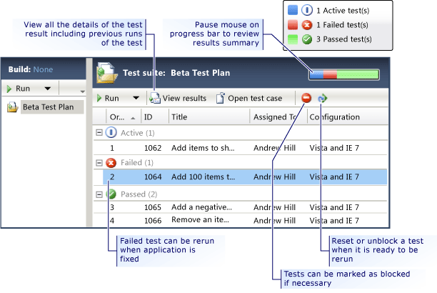
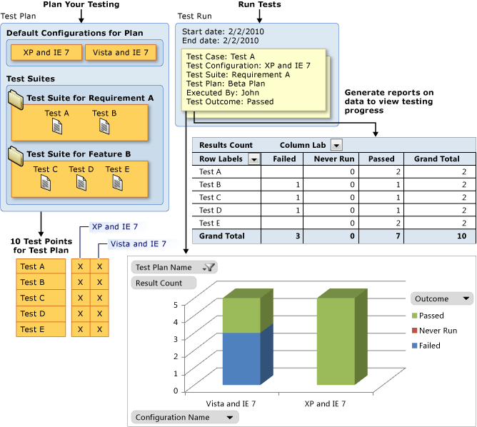

# Reporting on testing progress for test plans
You can track your progress for your test suites immediately after you run your tests from [!INCLUDE[TCMext](../vs140/includes/tcmext_md.md)]. You can view your progress in the **Run Tests** activity for each test suite individually. You can view the tests that have passed and failed. You can mark tests as blocked or reset tests to active when you are ready to run them again, as shown in the following illustration.  
  
   
  
 **Requirements**  
  
-   Visual Studio Enterprise, [!INCLUDE[vstsTestEssLong](../vs140/includes/vststestesslong_md.md)]  
  
> [!NOTE]
>  You can also view this progress for each test suite from the **Contents** activity when you plan your testing.  
  
 If you want to view the results for all the suites in the test plan rolled up for your overall status, you can see this in the **Properties** view of your test plan in **Test Plan Status**.  
  
 You can also track the progress of your testing efforts by creating your own reports or by using predefined test reports. The predefined reports are available only when your team uses [!INCLUDE[TCMext](../vs140/includes/tcmext_md.md)] to create test plans and run tests. The data for the reports is automatically collected as you run tests and save test results.  
  
 The predefined reports are created in Excel and a subset of them is also created in Report Designer. If you create your own tests, you can use either Excel or Report Designer.  
  
> [!NOTE]
>  When you use these predefined reports or create your own reports, there is a time delay between the time that you save the test results and the time that the data is available in the warehouse database or the analysis services database in [!INCLUDE[esprtfs](../vs140/includes/esprtfs_md.md)].  
  
 You can access test reports in one of three different ways, depending on your preference:  
  
 **Test Dashboard** If your team uses a project portal, you can view the predefined reports on the Test Dashboard. You can access the project portal from the **Track** view in [!INCLUDE[TCMext](../vs140/includes/tcmext_md.md)]. For more information about the Test Dashboard, see [Test Dashboard (Agile)](assetId:///701fd381-fff0-4508-9316-852a45b6afb4).  
  
 **Team Explorer** You can access Report Designer reports from the Reports folder for your team project, and you can access Excel reports from the Documents folder.  
  
 **The web portal** If you have access to the web portal, just as with [!INCLUDE[esprtfc](../vs140/includes/esprtfc_md.md)], you can access Report Designer reports from the Reports folder for your team project, and you can access Excel reports from the Documents folder.  
  
 The following illustration shows how test points are created in your test plan based on your test cases and test configurations for each test suite. A *test point* is a pairing of a test case with a test configuration. When you run a set of test points, a test run is created that has a test result for each test point. These test runs are stored in [!INCLUDE[esprtfs](../vs140/includes/esprtfs_md.md)]. You can then use predefined reports to show your progress based on these test points, or you can create custom reports.  
  
   
  
## Tasks  
 Use the following topics to help you track your software quality:  
  
|Tasks|Associated Topics|  
|-----------|-----------------------|  
|**Tracking how many test cases are ready to run:** You can view the progress on how many test cases are ready to run and how many have to be finished for a given timeframe.|-   [Test Case Readiness Report](assetId:///c4e804d5-1549-41c0-a365-28fdec77bffe) (Report Designer) -   [Test Case Readiness Excel Report](assetId:///faaad500-45da-45c7-8ab2-59d1c6f30c2a)|  
|**Tracking your test plan progress:** You can use the Test Plan Progress report to determine, for a given time frame, how many test cases were never run, blocked, failed, or passed.|-   [Test Plan Progress Report](assetId:///97d112d1-2d31-4890-b518-124fbeebea30) (Report Designer) -   [Test Plan Progress Excel Report](assetId:///5fa325e8-ca16-47f5-a8af-bdfdcbcfc243)|  
|**Tracking progress on testing user stories:** The **User Story Test Status** report shows how many tests have never run, are blocked, failed, or passed for each user story.|-   [User Story Test Status Excel Report](assetId:///bb10f6a4-25f0-4fcf-b0f2-789264d3ef27)|  
|**Tracking regression:** The **Failure Analysis** report shows the number of distinct configurations for each Test Case that previously passed and are now failing, for the past four weeks.|-   [Failure Analysis Excel Report](assetId:///22f98044-e3bb-4e63-80a1-99a95775baa5)|  
|**Tracking how all runs for all plans are doing:** You can use the Test Activity report to see how many test runs for all test cases never ran, were blocked, failed, and passed.|-   [Test Activity Excel Report](assetId:///cb950153-2f44-4b0b-afeb-cfb697281930)|  
|**Create custom test reports:** You can create your own custom reports in either Excel or Report Designer, whichever you are most familiar with.|-   [Creating and Customizing Reports for Team System](assetId:///1f28ba6c-c5e5-46d3-9209-ede24ae78e48) -   [Generating Reports Using the OLAP Data Cube](assetId:///9ab451df-ce11-4fc9-9aac-bedd154ba0d4) -   [Create a Report Server Project for Team System](assetId:///5fc5d272-2569-4dd8-b493-704f03f2aca1) -   [Create a report in Microsoft Excel for Visual Studio ALM &#91;redirected&#93;](assetId:///ae021d09-18d9-4fb0-bc06-fd6667a0b122) -   [Test Result Tables](assetId:///0fa44e3e-3033-49e7-a796-eb4fbd12d984)|  
  
## External resources  
  
### Guidance  
 [Testing for Continuous Delivery with Visual Studio 2012 – Chapter 4: Manual System Tests](http://go.microsoft.com/fwlink/?LinkID=255195)  
  
## See Also  
 [Create, Customize, and Manage Reports for Visual Studio ALM](assetId:///1f28ba6c-c5e5-46d3-9209-ede24ae78e48)   
 [Tracking Software Quality](../vs140/tracking-software-quality.md)   
 [Reviewing Test Results in Microsoft Test Manager](assetId:///9fb3e429-78df-4fe2-89ed-0ad1db0738f4)