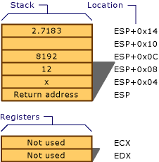
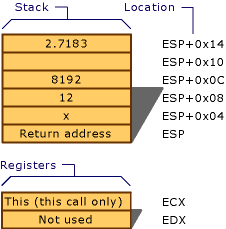
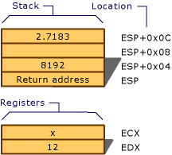

# Results of Calling Example
## Microsoft Specific  
  
## __cdecl  
 The C decorated function name is "_MyFunc."  
  
   
The __cdecl calling convention  
  
## __stdcall and thiscall  
 The C decorated name (`__stdcall`) is "_MyFunc@20." The C++ decorated name is proprietary.  
  
   
The __stdcall and thiscall calling conventions  
  
## __fastcall  
 The C decorated name (`__fastcall`) is "@MyFunc@20." The C++ decorated name is proprietary.  
  
   
The __fastcall calling convention  
  
### END Microsoft Specific  
  
## See Also  
 [Calling Example: Function Prototype and Call](../vs140/calling-example--function-prototype-and-call.md)