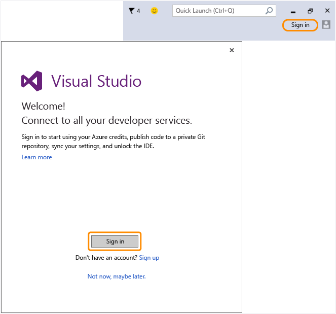

# Return to Visual Studio to sign in to the IDE  with your new Microsoft account!
You have successfully created a Microsoft Account. Return to Visual Studio and sign in from the Welcome wizard during first launch, or from the upper right corner of the IDE any time.  
  
 Sign in to the IDE to start using your Azure credits, publish code to a private Git repository, sync your settings, and unlock the IDE. [Learn more](../vs140/signing-in-to-visual-studio.md) about all the developer services available.  
  
 