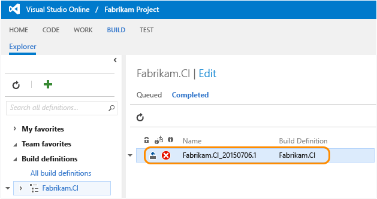
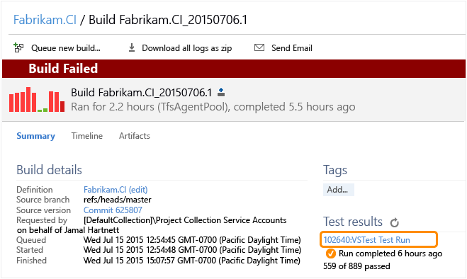
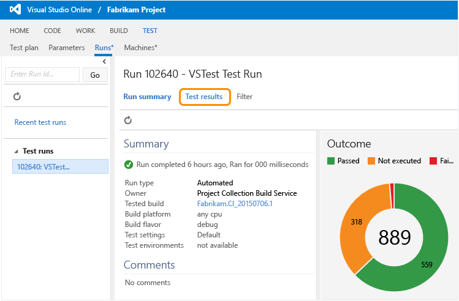
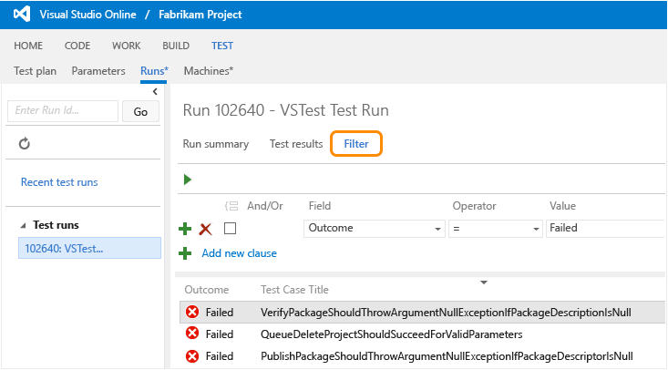
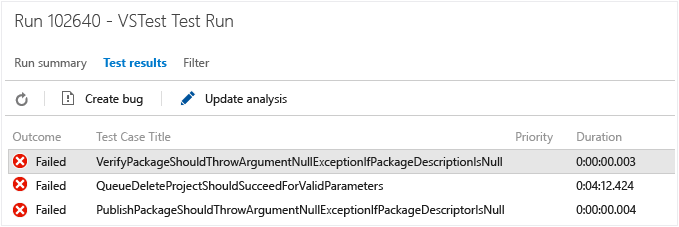
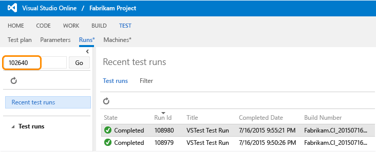

# Review continuous test results after a build
After your build finishes running automated tests using Visual Studio Online or Team Foundation Server, review your test results to start analyzing any problems that you found.  
  
1.  In Visual Studio Online or Team Foundation Server, go to your team project.  
  
2.  Find your build to open the build summary:  
  
       
  
     Then open your test run summary:  
  
       
  
3.  View your test results.  
  
       
  
     Find specific results that you want to focus on:  
  
       
  
4.  Select a result to analyze it further. You can create a bug or update the result with your findings.  
  
       
  
## Q & A  
  
### Q: Are there other ways to find a test run?  
 **A:** Yes, you can find your test run here:  
  
   
  
## See Also  
 [Test continuously with your builds](../vs140/run-tests-with-your-builds.md)   
 [Run automated tests with your builds](../vs140/set-up-continuous-testing-for-builds.md)