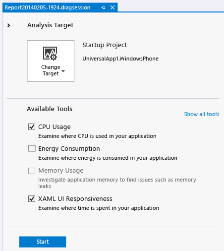
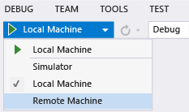
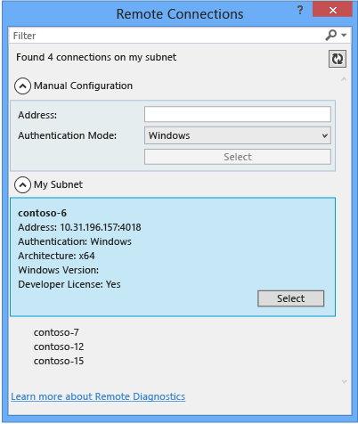
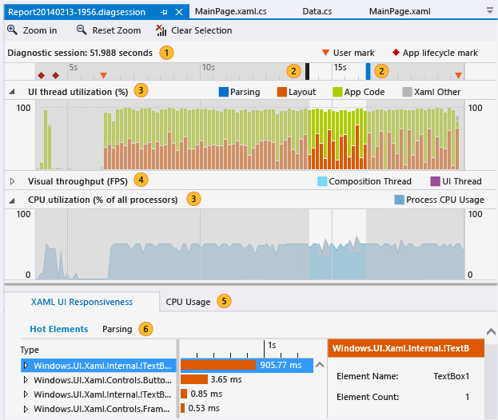

# Run analysis tools from the Performance and Diagnostic page
  
  
 You can analyze the performance, memory use, and energy consumption of Windows Store and Windows Phone apps by using the Visual Studio profilers and diagnostic tools. The Performance and Diagnostic hub makes it easy to select and run these tools, combine multiple tools in a single diagnostic run, and manage the reports they produce. You can run the tools on most deployment targets. For Windows Phone apps, use a phone or an emulator. For Windows Store apps, use the Visual Studio computer, the simulator, or a remote PC. After you have collected the data, the diagnostic report displays timeline graphs and detail views of the data. Performance and Diagnostic report filters and settings help you to focus on the critical parts of the data.  
  
 **Tools in the Performance and Diagnostic hub**  
  
 The Performance and Diagnostic hub shows you the tools that you can use on particular types of apps (XAML and C#/VB/C++ or HTML and JavaScript) and the tools that you can use in a single diagnostic run.  
  
|||  
|-|-|  
|[CPU Usage (All)](../vs140/analyze-cpu-usage-in-a-windows-universal-app.md)|[Energy Consumption (All)](../vs140/analyze-energy-use-in-store-apps.md)|  
|[Memory Usage (C#/VB/C++)](../vs140/memory-usage-without-debugging2.md)|[JavaScript Memory Usage](../vs140/javascript-memory.md)|  
|[XAML UI Responsiveness](../vs140/analyze-ui-responsiveness-in-store-apps--xaml-.md)|[HTML UI Responsiveness](../vs140/html-ui-responsiveness.md)|  
||[JavaScript Function Timing](../vs140/analyze-javascript-function-timing-data.md)|  
  
## In this article  
  
-   [Quick start: Collect diagnostic data](#BKMK_Quick_start__Collect_diagnostic_data)  
  
-   [Collect diagnostic data](#BKMK_Collect_diagnostic_data)  
  
     [Add user marks to identify locations in your diagnostic data](#BKMK_Add_user_marks_to_identify_locations_in_your_diagnostic_data)  **&#124;**  [Set the startup project](#BKMK_Set_the_startup_project)  **&#124;**  [Set the analysis target](#BKMK_Set_the_analysis_target)  **&#124;**  [Choose the tools to run in the diagnostic session](#BKMK_Choose_the_tools_to_run_in_the_diagnostic_session)  **&#124;**  [Start and stop the diagnostic session](#BKMK_Start_and_stop_the_diagnostic_session)  
  
-   [Open a diagnostic session file](#BKMK_Open_a_diagnostic_session_file)  
  
-   [The Performance and Diagnostic data page](#BKMK_The_Performance_and_Diagnostic_data_page)  
  
-   [Troubleshooting](#BKMK_Troubleshooting)  
  
##   Quick start: Collect diagnostic data  
  
> [!NOTE]
>  You must have administrator privileges to run the performance and diagnostic tools. You can run Visual Studio as an administrator, or you can choose to run the tools as an administrator when you start the diagnostic session.  
  
1.  Open the project in Visual Studio.  
  
2.  Set the deployment location.  
  
    |||  
    |-|-|  
    ||Windows Phone apps can be deployed to a phone or one of the Visual Studio emulators.|  
    ||Windows Store apps can be deployed to the Visual Studio computer, the Visual Studio simulator, or on a network-connected PC or tablet.   **Note:** Running a diagnostic session on a remote PC or tablet requires that the Visual Studio Remote Tools be installed and running on the remote target. See [Debug and test Windows Store apps on a remote machine from Visual Studio](../vs140/run-windows-store-apps-on-a-remote-machine.md).|  
  
     From the debug location list on the debugger toolbar, select the deployment location for your app. Here's the list for phone apps:  
  
       
  
3.  Open a Performance and Diagnostic session. On the **Debug** menu, choose **Start Diagnostic Tools Without Debugging** (Shortcut key: Alt + F2).  
  
4.  In the Performance and Diagnostic hub, choose one or more tools to run in the session. Only the tools that are applicable to the project type, operating system, and programming language are displayed. When you choose a diagnostic tool, the selections for tools that cannot be run in the same diagnostic session are disabled. Here's how your choices might look for a JavaScript app:  
  
       
  
5.  To start the diagnosis session, choose **Start**.  
  
6.  Run the scenarios that you want to collect data for.  
  
     While you are running the session, some tools display graphs of real-time data on the Performance and Diagnosis page.  
  
       
  
7.  To end the diagnostic session, choose **Stop collection**.  
  
##   Collect diagnostic data  
 [Add user marks to identify locations in your diagnostic data](#BKMK_Add_user_marks_to_identify_locations_in_your_diagnostic_data)  **&#124;**  [Set the startup project](#BKMK_Set_the_startup_project)  **&#124;**  [Set the analysis target](#BKMK_Set_the_analysis_target)  **&#124;**  [Choose the tools to run in the diagnostic session](#BKMK_Choose_the_tools_to_run_in_the_diagnostic_session)  **&#124;**  [Start and stop the diagnostic session](#BKMK_Start_and_stop_the_diagnostic_session)  
  
###   Set the startup project  
 If your solution contains multiple app projects, make sure the one that you want to analyze is set as the startup project. In Solution Explorer, select the project and choose **Set as Startup Project** from the context menu.  
  
   
  
###   Set the deployment location  
 You can run diagnostic sessions for phone apps on a Windows phone that is directly connected to the Visual Studio computer or in a Visual Studio phone emulator. You can run Windows Store apps on the Visual Studio computer, in the Visual Studio device simulator, or on a remote device that is connected to Visual Studio over a network or that is connected directly to the Visual Studio computer with an Ethernet to USB cable. You can set the deployment target on the Debug page of the project properties, or you can choose the target from the debug location list on the Visual Studio toolbar. Here's the deployment list for Windows Store apps:  
  
   
  
 The choice that you make on the debug location toolbar is saved to the project properties.  
  
|||  
|-|-|  
||-   Running a diagnostic session on a remote Windows Store device requires that the Visual Studio Remote Tools be installed and running on the remote target. See [Debug and test Windows Store apps on a remote machine from Visual Studio](../vs140/run-windows-store-apps-on-a-remote-machine.md). -   If you have not specified a remote device when you choose the Remote Machine on the debug location list, specify the device in the Remote Connections dialog box that appears.       -   After the remote device target has been specified, you must use the **Debug** page of the project properties to change to a new device. -   If you are using a USB to Ethernet cable to connect a remote device with the Visual Studio computer, specify the I.P. address of the remote device in the Remote Connections dialog box.|  
  
###   Set the analysis target  
 Besides starting your app from the Visual Studio project, you can also run diagnostic sessions on alternative targets. For example, you might want to diagnose performance issues on a version of your app that was installed from the Windows App Store.  
  
   
  
|||  
|-|-|  
||You can start Windows Store apps that are already installed on a device, or you can attach the diagnostic tools to a Windows Store app that is already running. When you choose Running App or Installed App, you select the app from a list that discovers the apps on the specified deployment target.   |  
||When you choose Internet Explorer, you specify the url and you can change the phone deployment target.   |  
  
###   Choose the tools to run in the diagnostic session  
 On the Performance and Diagnosis hub, choose one or more tools to run in the diagnostic session. Only the tools that are applicable to the project type and programming are displayed. When you choose a diagnostic tool, the selections for tools that cannot be run in the same diagnostic session are disabled. Here's how your choices might look for a JavaScript app:  
  
###   Start and stop the diagnostic session  
 To start the diagnosis session, choose Start.  
  
 To end the diagnostic session and begin the data analysis, choose **Stop collection** at the bottom of the page.  
  
##   Open a diagnostic session file  
 When you stop collecting data in a diagnostic session, the data is immediately analyzed and then displayed in the Performance and Diagnostic report.  
  
 You can also open saved .diagnosis session files from the recently opened list on the Performance and Diagnostic hub.  
  
   
  
 Choose the show or hide button at the top of the Performance and Diagnostic hub to expand or collapse the recently used file list.  
  
##   The Performance and Diagnostic report  
   
  
|||  
|-|-|  
||The timeline shows the length of the profiling session, app lifecycle activation events, and user marks.|  
||You can restrict the report to a part of the timeline by dragging the blue bars to select a region of the timeline.|  
||A tool displays one or more master graphs. If your diagnostic session is created with multiple tools, all of the master graphs are displayed.|  
||You can collapse and expand the individual graphs.|  
||When your data includes information from multiple tools, the details for the tool is collected under tabs.|  
||A tool can have one or more detail views. The view is filtered by the selected region of the timeline.|  
  
##   Troubleshooting  
  
###   Diagnostic events dropped. Some information in the report may be missing or inaccurate  
 The data collector in performance and diagnostic tools can be memory and CPU intensive. When the data collector is unable to log all of the diagnostic events it displays the message in an information bar at the top of the Performance and diagnostic page. Some report data might be missing or invalid.  
  
 To resolve this issue, try these steps to free up resources on the machine and then rerun the diagnostic session:  
  
1.  Close other apps that are not part of the diagnostic session.  
  
2.  Simplify your scenario so that you are collecting less data.  
  
3.  Use fewer diagnostic tools in a single session.  
  
## See Also  
 [Performance (Windows Store apps)](http://msdn.microsoft.com/library/windows/apps/hh750312.aspx)   
 [Windows SDK LoggingSession Sample](http://code.msdn.microsoft.com/windowsapps/LoggingSession-Sample-ccd52336)