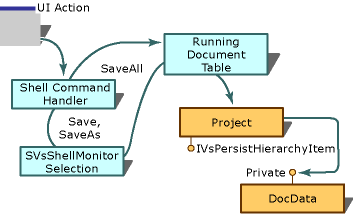

# Saving a Custom Document
The environment handles the **Save**, **Save As**, and **Save All** commands. When a user clicks **Save**, **Save As**, **or Save All** on the **File** menu or closes the solution, resulting in a Save All, the following process occurs.  
  
   
Save, Save As, and Save All command handling for a custom editor  
  
 This process is detailed in the following steps:  
  
1.  For the **Save** and **Save As** commands, the environment uses the <xref:Microsoft.VisualStudio.Shell.Interop.SVsShellMonitorSelection*> service to determine the active document window and thus what items should be saved. Once the active document window is known, the environment finds the hierarchy pointer and item identifier (itemID) for the document in the running document table. For more information, see [Running Document Table](../vs140/running-document-table.md).  
  
     For the Save All command, the environment uses the information in the running document table to compile the list of all items to save.  
  
2.  When the solution receives an [QueryStatus](assetId:///M:Microsoft.VisualStudio.OLE.Interop.IOleCommandTarget.QueryStatus(System.Guid@,System.UInt32,Microsoft.VisualStudio.OLE.Interop.OLECMD[],System.IntPtr)?qualifyHint=False&autoUpgrade=True) call, it iterates through the set of selected items (that is, the multiple selections exposed by the <xref:Microsoft.VisualStudio.Shell.Interop.SVsShellMonitorSelection*> service).  
  
3.  On each item in the selection, the solution uses the hierarchy pointer to call the [IsItemDirty](assetId:///M:Microsoft.VisualStudio.Shell.Interop.IVsPersistHierarchyItem2.IsItemDirty(System.UInt32,System.IntPtr,System.Int32@)?qualifyHint=False&autoUpgrade=True) method to determine whether the Save menu command should be enabled. If one or more items are dirty, then the Save command is enabled. If the hierarchy uses a standard editor, then the hierarchy delegates querying for dirty status to the editor by calling the [IsDocDataDirty](assetId:///M:Microsoft.VisualStudio.Shell.Interop.IVsPersistDocData2.IsDocDataDirty(System.Int32@)?qualifyHint=False&autoUpgrade=True) method.  
  
4.  On each selected item that is dirty, the solution uses the hierarchy pointer to call the [SaveItem](assetId:///M:Microsoft.VisualStudio.Shell.Interop.IVsPersistHierarchyItem2.SaveItem(Microsoft.VisualStudio.Shell.Interop.VSSAVEFLAGS,System.String,System.UInt32,System.IntPtr,System.Int32@)?qualifyHint=False&autoUpgrade=True) method on the appropriate hierarchies.  
  
     In the case of a custom editor, the communication between the document data object and the project is private. Thus, any special persistence concerns are handled between these two objects.  
  
    > [!NOTE]
    >  If you implement your own persistence, be sure to call the [QuerySaveFiles](assetId:///M:Microsoft.VisualStudio.Shell.Interop.IVsQueryEditQuerySave2.QuerySaveFiles(System.UInt32,System.Int32,System.String[],System.UInt32[],Microsoft.VisualStudio.Shell.Interop.VSQEQS_FILE_ATTRIBUTE_DATA[],System.UInt32@)?qualifyHint=False&autoUpgrade=True) method to save time. This method checks to make sure that it is safe to save the file (for example, the file is not read-only).  
  
## See Also  
 <xref:Microsoft.VisualStudio.OLE.Interop.IOleCommandTarget*>   
 [Opening and Saving Project Items](../vs140/opening-and-saving-project-items.md)