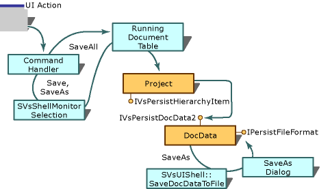

# Saving a Standard Document
The environment handles the Save, Save As, and Save All commands. When a user selects **Save**, **Save As**, or **Save All** from the **File** menu or closes the solution, resulting in a **Save All**, the following process occurs.  
  
   
Save, Save As, and Save All command handling for a standard editor  
  
 This process is detailed in the following steps:  
  
1.  When the **Save** and **Save As** commands are selected, the environment uses the <xref:Microsoft.VisualStudio.Shell.Interop.SVsShellMonitorSelection?qualifyHint=False> service to determine the active document window and thus what items should be saved. Once the active document window is known, the environment finds the hierarchy pointer and item identifier (itemID) for the document in the running document table. For more information, see [Running Document Table](../vs140/running-document-table.md).  
  
     When the **Save All** command is selected, the environment uses the information in the running document table to compile the list of all items to save.  
  
2.  When the solution receives an <xref:Microsoft.VisualStudio.OLE.Interop.IOleCommandTarget.QueryStatus?qualifyHint=False> call, it iterates through the set of selected items (that is, the multiple selections exposed by the <xref:Microsoft.VisualStudio.Shell.Interop.SVsShellMonitorSelection?qualifyHint=False> service).  
  
3.  On each item in the selection, the solution uses the hierarchy pointer to call the <xref:Microsoft.VisualStudio.Shell.Interop.IVsPersistHierarchyItem2.IsItemDirty?qualifyHint=False> method to determine whether the **Save** menu command should be enabled. If one or more items are dirty, then the **Save** command is enabled. If the hierarchy uses a standard editor, then the hierarchy delegates querying for dirty status to the editor by calling the <xref:Microsoft.VisualStudio.Shell.Interop.IVsPersistDocData2.IsDocDataDirty?qualifyHint=False> method.  
  
4.  On each selected item that is dirty, the solution uses the hierarchy pointer to call the <xref:Microsoft.VisualStudio.Shell.Interop.IVsPersistHierarchyItem2.SaveItem?qualifyHint=False> method on the appropriate hierarchies.  
  
     It is common for the hierarchy to use a standard editor to edit the document. In this case, the document data object for that editor should support the <xref:Microsoft.VisualStudio.Shell.Interop.IVsPersistDocData2?qualifyHint=False> interface. Upon receiving the <xref:Microsoft.VisualStudio.Shell.Interop.IVsPersistHierarchyItem2.SaveItem?qualifyHint=False> method call, the project should inform the editor that the document is being saved by calling the <xref:Microsoft.VisualStudio.Shell.Interop.IVsPersistDocData2.SaveDocData?qualifyHint=False> method on the document data object. The editor can allow the environment to handle the **Save As** dialog box, by calling `Query Service` for the <xref:Microsoft.VisualStudio.Shell.Interop.SVsUIShell?qualifyHint=False> interface. This returns a pointer to the <xref:Microsoft.VisualStudio.Shell.Interop.IVsUIShell?qualifyHint=False> interface. The editor must then call the <xref:Microsoft.VisualStudio.Shell.Interop.IVsUIShell.SaveDocDataToFile?qualifyHint=False> method, passing a pointer to the editor's <xref:Microsoft.VisualStudio.Shell.Interop.IPersistFileFormat?qualifyHint=False> implementation by means of the `pPersistFile` parameter. The environment then performs the Save operation and provides the **Save As** dialog box for the editor. The environment then calls back to the editor with <xref:Microsoft.VisualStudio.Shell.Interop.IPersistFileFormat?qualifyHint=False>.  
  
5.  If the user is attempting to save an untitled document (that is, a previously unsaved document), then a Save As command is actually performed.  
  
6.  For the Save As command, the environment displays the Save As dialog box, prompting the user for a file name.  
  
     If the name of the file has changed, then the hierarchy is responsible for updating the document frame's cached information by calling <xref:Microsoft.VisualStudio.Shell.Interop.IVsWindowFrame.SetProperty?qualifyHint=False>(VSFPROPID_MkDocument).  
  
 If the **Save As** command moves the location of the document, and the hierarchy is sensitive to the document location, then the hierarchy is responsible for handing off the ownership of the open document window to another hierarchy. For example, this occurs if the project tracks whether the file is an internal or external file (Miscellaneous File) in relation to the project. Use the following procedure to change ownership of a file to the Miscellaneous Files project.  
  
## Changing File Ownership  
  
#### To change file ownership to the Miscellaneous Files project  
  
1.  Query Service for the <xref:Microsoft.VisualStudio.Shell.Interop.SVsExternalFilesManager?qualifyHint=False> interface.  
  
     A pointer to <xref:Microsoft.VisualStudio.Shell.Interop.IVsExternalFilesManager2?qualifyHint=False> is returned.  
  
2.  Call the <xref:Microsoft.VisualStudio.Shell.Interop.IVsExternalFilesManager2.TransferDocument?qualifyHint=False> (`pszMkDocumentNew`, `punkWindowFrame`) method to transfer the document to the new hierarchy. The hierarchy performing the Save As command calls this method.  
  
## See Also  
 <xref:Microsoft.VisualStudio.OLE.Interop.IOleCommandTarget?qualifyHint=False>   
 [Opening and Saving Project Items](../vs140/opening-and-saving-project-items.md)