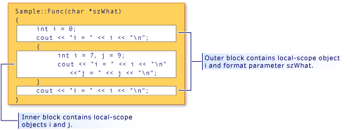

# Scope (Visual C++)
C++ names can be used only in certain regions of a program. This area is called the "scope" of the name. Scope determines the "lifetime" of a name that does not denote an object of static extent. Scope also determines the visibility of a name, when class constructors and destructors are called, and when variables local to the scope are initialized. (For more information, see [Constructors](../vs140/constructors--c---.md) and [Destructors](../vs140/destructors--c---.md).) There are five kinds of scope:  
  
-   **Local scope** A name declared within a block is accessible only within that block and blocks enclosed by it, and only after the point of declaration. The names of formal arguments to a function in the scope of the outermost block of the function have local scope, as if they had been declared inside the block enclosing the function body. Consider the following code fragment:  
  
<CodeContentPlaceHolder>0\</CodeContentPlaceHolder>  
     Because the declaration of <CodeContentPlaceHolder>7\</CodeContentPlaceHolder> is in a block enclosed by curly braces, <CodeContentPlaceHolder>8\</CodeContentPlaceHolder> has local scope and is never accessible because no code accesses it before the closing curly brace.  
  
-   **Function scope** Labels are the only names that have function scope. They can be used anywhere within a function, but are not accessible outside that function. Formal arguments (arguments specified in function definitions) to functions are considered to be in the scope of the outermost block of the function body.  
  
-   **File scope** Any name declared outside all blocks or classes has file scope. It is accessible anywhere in the translation unit after its declaration. Names with file scope that do not declare static objects are often called global names.  
  
     In C++, file scope is also known as namespace scope.  
  
-   **Class scope** Names of class members have class scope. Class member functions can be accessed only by using the member-selection operators (**.** or **–>**) or pointer-to-member operators (**.\*** or **–>\***) on an object or pointer to an object of that class; nonstatic class member data is considered local to the object of that class. Consider the following class declaration:  
  
<CodeContentPlaceHolder>1\</CodeContentPlaceHolder>  
     The class members <CodeContentPlaceHolder>9\</CodeContentPlaceHolder> and <CodeContentPlaceHolder>10\</CodeContentPlaceHolder> are considered to be in the scope of class <CodeContentPlaceHolder>11\</CodeContentPlaceHolder>.  
  
-   **Prototype scope** Names declared in a function prototype are visible only until the end of the prototype. The following prototype declares three names (<CodeContentPlaceHolder>12\</CodeContentPlaceHolder>, <CodeContentPlaceHolder>13\</CodeContentPlaceHolder>, and <CodeContentPlaceHolder>14\</CodeContentPlaceHolder>); these names go out of scope at the end of the prototype:  
  
<CodeContentPlaceHolder>2\</CodeContentPlaceHolder>  
## Hiding Names  
 You can hide a name by declaring it in an enclosed block. In the following figure, <CodeContentPlaceHolder>15\</CodeContentPlaceHolder> is redeclared within the inner block, thereby hiding the variable associated with <CodeContentPlaceHolder>16\</CodeContentPlaceHolder> in the outer block scope.  
  
   
Block Scope and Name Hiding  
  
 The output from the program shown in the figure is:  
  
<CodeContentPlaceHolder>3\</CodeContentPlaceHolder>  
> [!NOTE]
>  The argument <CodeContentPlaceHolder>17\</CodeContentPlaceHolder> is considered to be in the scope of the function. Therefore, it is treated as if it had been declared in the outermost block of the function.  
  
## Hiding class names  
 You can hide class names by declaring a function, object or variable, or enumerator in the same scope. However, the class name can still be accessed when prefixed by the keyword **class**.  
  
<CodeContentPlaceHolder>4\</CodeContentPlaceHolder>  
> [!NOTE]
>  Any place the class name (<CodeContentPlaceHolder>18\</CodeContentPlaceHolder>) is called for, the keyword class must be used to differentiate it from the file-scoped variable Account. This rule does not apply when the class name occurs on the left side of the scope-resolution operator (::). Names on the left side of the scope-resolution operator are always considered class names.  
  
 The following example demonstrates how to declare a pointer to an object of type <CodeContentPlaceHolder>19\</CodeContentPlaceHolder> using the **class** keyword:  
  
<CodeContentPlaceHolder>5\</CodeContentPlaceHolder>  
 The <CodeContentPlaceHolder>20\</CodeContentPlaceHolder> in the initializer (in parentheses) in the preceding statement has file scope; it is of type **double**.  
  
> [!NOTE]
>  The reuse of identifier names as shown in this example is considered poor programming style.  
  
 For more information about pointers, see [Derived Types](assetId:///aa14183c-02fe-4d81-95fe-beddb0c01c7c). For information about declaration and initialization of class objects, see [Classes, Structures, and Unions](../vs140/classes-and-structs--c---.md). For information about using the **new** and **delete** free-store operators, see [Special Member Functions](../vs140/special-member-functions--c---.md).  
  
## Hiding names with file scope  
 You can hide names with file scope by explicitly declaring the same name in block scope. However, file-scope names can be accessed using the scope-resolution operator (<CodeContentPlaceHolder>21\</CodeContentPlaceHolder>).  
  
<CodeContentPlaceHolder>6\</CodeContentPlaceHolder>  
 **Block-scoped i has the value: 5**  
**File-scoped i has the value: 7**   
## See Also  
 [Basic Concepts](../vs140/basic-concepts---c---.md)