# Shared Colors for Visual Studio
When you are designing UI that uses common Visual Studio shell elements, or you would like your interface element to be consistent with similar features, use existing token names in package definition files to choose and assign colors. This ensures that your UI stays consistent with the overall Visual Studio environment and that it updates automatically when themes are added or updated.  
  
 This article describes common UI elements and the token names that they use, which you can reference when building similar UI. For specific information about how to access these color tokens, see [The VSColor Service](../vs140/colors-and-styling-for-visual-studio.md#BKMK_TheVSColorService).  
  
 Make sure to use token names correctly:  
  
-   **Use token names based on function, not on the color itself.** The common shared colors are associated with specific interface elements and are only intended to be used for the same or similar features. For example, don't reuse the color of a pressed combo box for a spinning progress animation just because you like the color. The functions of the combo box and the animation are different, and if the color associated with the combo box changes, it may no longer be an appropriate color for your animation element. Consistent use of color helps orient your users and prevent confusion.  
  
-   **Use background and text colors in the correct combination.** Background colors that are intended to be used with text will have an associated text color. Don't use text colors other than what is specified for that background. If there is not an associated text color, don't use that background color for any surface on which you expect to display text. Other combinations of text and background colors may result in an unreadable interface.  
  
-   **Use control colors that are appropriate for their location.** In certain states, some Visual Studio controls do not have separate border and background colors. Instead, they pick up those colors from the surfaces behind them. Make sure that you always use the token names that are appropriate for the location where you are placing the control.  
  
> [!IMPORTANT]
>  Do not use tokens found in the categories "Start Page" or "Cider."  
  
## Command structures  
  
###  \<a name="BKMK_CommandMenus">\</a> Menus  
 Menus can occur at several places within Visual Studio: the main menu bar, embedded in document or tool windows, or on right-click in various locations throughout the IDE. Implementations of menus associated with other UI elements are discussed in the section for the respective element. You should always use the standard menu implementation provided by the Visual Studio environment. However, in some rare instances you might not have access to the standard Visual Studio menus. In these situations, use the following token names to ensure that your UI is consistent with other menus in Visual Studio.  
  
   
  
 Use …  
 -   whenever you need to create a custom menu.  
  
-   when you have a new UI component that you want to match the Visual Studio menus.  
  
 Do not use …  
 the background color alone. Always use the background/foreground combination as specified.  
  
#### Menu title  
 Menu titles consist of a background, a border, and the title text, as well as an optional glyph, usually when the menu is found in a command bar.  
  
 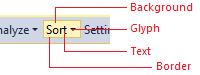  
  
 Use…  
 whenever you are creating a custom menu title.  
  
 Do not use…  
 -   for anything that you don't want to always match the menu title.  
  
-   in any background/foreground combination other than specified.  
  
 **Default**  
  
 Component  
  
 Element  
  
 Token name: Category.color  
  
   
  
 **Menu title**  
  
 Background  
  
 None  
  
 Foreground (Text)  
  
 <CodeContentPlaceHolder>0\</CodeContentPlaceHolder>  
  
 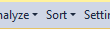  
  
 **Menu title with glyph**  
  
 Foreground (Glyph)  
  
 <CodeContentPlaceHolder>1\</CodeContentPlaceHolder>  
  
 Border  
  
 None  
  
 **Hover**  
  
 Component  
  
 Element  
  
 Token name: Category.color  
  
   
  
 **Menu title**  
  
 Background  
  
 <CodeContentPlaceHolder>2\</CodeContentPlaceHolder>  
  
 While not used in modern themed UI, there are gradient stops and values for this background.  
  
 Foreground (Text)  
  
 <CodeContentPlaceHolder>3\</CodeContentPlaceHolder>  
  
   
  
 **Menu title with glyph**  
  
 Foreground (Glyph)  
  
 <CodeContentPlaceHolder>4\</CodeContentPlaceHolder>  
  
 Border  
  
 <CodeContentPlaceHolder>5\</CodeContentPlaceHolder>  
  
 **Pressed**  
  
 Component  
  
 Element  
  
 Token name: Category.color  
  
   
  
 **Menu title**  
  
 Background  
  
 <CodeContentPlaceHolder>6\</CodeContentPlaceHolder>  
  
 While not used in modern themed UI, there are gradient stops and values for this background.  
  
 Foreground (Text)  
  
 <CodeContentPlaceHolder>7\</CodeContentPlaceHolder>  
  
   
  
 **Menu title with glyph**  
  
 Foreground (Glyph)  
  
 <CodeContentPlaceHolder>8\</CodeContentPlaceHolder>  
  
 Border  
  
 <CodeContentPlaceHolder>9\</CodeContentPlaceHolder>  
  
 Only left, top, and right sides.  
  
 **Disabled**  
  
 Component  
  
 Element  
  
 Token name: Category.color  
  
 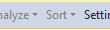  
  
 **Menu title with glyph**  
  
 Background  
  
 None  
  
 Foreground (Text)  
  
 <CodeContentPlaceHolder>10\</CodeContentPlaceHolder>  
  
 Foreground (Glyph)  
  
 <CodeContentPlaceHolder>11\</CodeContentPlaceHolder>  
  
 Border  
  
 None  
  
#### Menu  
 An individual menu item consists of the menu text and an optional icon, check box, or submenu glyph. Its background and text color change on hover. This color token is a background/foreground pair.  
  
   
  
 Use…  
 for any drop-down list that is launched from a menu bar or command bar.  
  
 Do not use…  
 -   for any drop-down list that occurs in another context.  
  
-   in any background/foreground combination other than specified.  
  
 **Default**  
  
 Component  
  
 Element  
  
 Token name: Category.color  
  
   
  
 **Menu**  
  
 Background  
  
 <CodeContentPlaceHolder>12\</CodeContentPlaceHolder>  
  
 While not used in modern themed UI, there are gradient stops and values for this background.  
  
 Foreground (Text)  
  
 <CodeContentPlaceHolder>13\</CodeContentPlaceHolder>  
  
 Foreground (Submenu glyph)  
  
 <CodeContentPlaceHolder>14\</CodeContentPlaceHolder>  
  
 Border  
  
 <CodeContentPlaceHolder>15\</CodeContentPlaceHolder>  
  
 Icon channel background  
  
 <CodeContentPlaceHolder>16\</CodeContentPlaceHolder>  
  
 Separator  
  
 <CodeContentPlaceHolder>17\</CodeContentPlaceHolder>  
  
 Shadow  
  
 <CodeContentPlaceHolder>18\</CodeContentPlaceHolder>  
  
 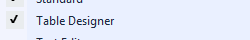  
  
 **Checked**  
  
 Check mark  
  
 <CodeContentPlaceHolder>19\</CodeContentPlaceHolder>  
  
 Check mark background  
  
 <CodeContentPlaceHolder>20\</CodeContentPlaceHolder>  
  
   
  
 **Selected**  
  
 Icon background  
  
 <CodeContentPlaceHolder>21\</CodeContentPlaceHolder>  
  
 Icon border  
  
 <CodeContentPlaceHolder>22\</CodeContentPlaceHolder>  
  
 **Hover**  
  
 Component  
  
 Element  
  
 Token name: Category.color  
  
   
  
 **Menu item**  
  
 Background  
  
 <CodeContentPlaceHolder>23\</CodeContentPlaceHolder>  
  
 Foreground (Text)  
  
 <CodeContentPlaceHolder>24\</CodeContentPlaceHolder>  
  
 Foreground (Submenu glyph)  
  
 <CodeContentPlaceHolder>25\</CodeContentPlaceHolder>  
  
 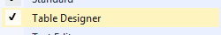  
  
 **Checked**  
  
 Check mark  
  
 <CodeContentPlaceHolder>26\</CodeContentPlaceHolder>  
  
 Check mark background  
  
 <CodeContentPlaceHolder>27\</CodeContentPlaceHolder>  
  
 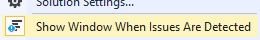  
  
 **Selected**  
  
 Icon background  
  
 <CodeContentPlaceHolder>28\</CodeContentPlaceHolder>  
  
 Icon border  
  
 <CodeContentPlaceHolder>29\</CodeContentPlaceHolder>  
  
 **Disabled**  
  
 Component  
  
 Element  
  
 Token name: Category.color  
  
 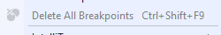  
  
 Menu item  
  
 Foreground (Text)  
  
 <CodeContentPlaceHolder>30\</CodeContentPlaceHolder>  
  
 Foreground (Submenu glyph)  
  
 <CodeContentPlaceHolder>31\</CodeContentPlaceHolder>  
  
 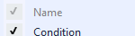  
  
 Checked  
  
 Check mark  
  
 <CodeContentPlaceHolder>32\</CodeContentPlaceHolder>  
  
 Check mark background  
  
 <CodeContentPlaceHolder>33\</CodeContentPlaceHolder>  
  
### Command bar  
 The command bar can appear in multiple places within the Visual Studio IDE, most notably the command shelf and embedded in tool or document windows.  
  
 In general, always use the standard command bar implementation provided by the Visual Studio environment. Using the standard mechanism ensures that all visual details will appear correctly and that interactive elements, will behave consistently with other Visual Studio command bar controls. However, if it is necessary for you to build your own command bar, make sure you style it correctly using the following token names.  
  
   
  
   
  
 Use…  
 in places where you need an embedded command bar but are unable to use the standard Visual Studio command bar implementation.  
  
 Do not use…  
 -   for UI elements that are not similar to a command bar.  
  
-   for command bar components other than the ones for which token names are specified.  
  
#### Command bar group  
 A command bar group consists of a related set of command bar controls and might contain any number of buttons, split buttons, drop-down menus, combo boxes, or menus. Colors for those controls are regulated by separate token names and are discussed individually elsewhere in this guide. A separator line is used to divide a command bar group into related subgroups.  
  
 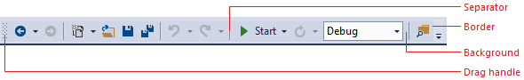  
  
 Use…  
 in places where you need an embedded command bar but are unable to use the standard Visual Studio command bar implementation.  
  
 Do not use…  
 -   for UI elements that are not similar to a command bar.  
  
-   for command bar components other than the ones for which token names are specified.  
  
 **Default** (no other states)  
  
 Element  
  
 Token name: Category.color  
  
 Background  
  
 <CodeContentPlaceHolder>34\</CodeContentPlaceHolder>  
  
 While not used in modern themed UI, there are gradient stops and values for this background.  
  
 Border  
  
 <CodeContentPlaceHolder>35\</CodeContentPlaceHolder>  
  
 Drag handle  
  
 <CodeContentPlaceHolder>36\</CodeContentPlaceHolder>  
  
 Separator  
  
 <CodeContentPlaceHolder>37\</CodeContentPlaceHolder>  
  
 <CodeContentPlaceHolder>38\</CodeContentPlaceHolder>  
  
#### Command icons  
   
  
 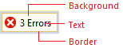  
  
 Use…  
 for any buttons that will be placed on a command bar.  
  
 Do not use…  
 -   for controls that have their own token names.  
  
-   in any background/foreground combination other than specified.  
  
 **Default**  
  
 Component  
  
 Element  
  
 Token name: Category.color  
  
   
  
 **Default**  
  
 Background  
  
 N/A (inherits from command bar background)  
  
 Foreground (Text)  
  
 <CodeContentPlaceHolder>39\</CodeContentPlaceHolder>  
  
 Border  
  
 N/A  
  
   
  
 **Selected**  
  
 Background  
  
 <CodeContentPlaceHolder>40\</CodeContentPlaceHolder>  
  
 Foreground (Text)  
  
 <CodeContentPlaceHolder>41\</CodeContentPlaceHolder>  
  
 Border  
  
 <CodeContentPlaceHolder>42\</CodeContentPlaceHolder>  
  
 **Hover and keyboard focused**  
  
 Component  
  
 Element  
  
 Token name: Category.color  
  
   
  
 **Standard on hover**  
  
 Background  
  
 <CodeContentPlaceHolder>43\</CodeContentPlaceHolder>  
  
 While not used in modern themed UI, there are gradient stops and values for this background.  
  
 Foreground (Text)  
  
 <CodeContentPlaceHolder>44\</CodeContentPlaceHolder>  
  
 Border  
  
 <CodeContentPlaceHolder>45\</CodeContentPlaceHolder>  
  
 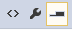  
  
 **Selected on hover**  
  
 Background  
  
 <CodeContentPlaceHolder>46\</CodeContentPlaceHolder>  
  
 Foreground (Text)  
  
 <CodeContentPlaceHolder>47\</CodeContentPlaceHolder>  
  
 Border  
  
 <CodeContentPlaceHolder>48\</CodeContentPlaceHolder>  
  
 **Pressed**  
  
 Component  
  
 Element  
  
 Token name: Category.color  
  
 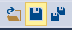  
  
 **Pressed command icon**  
  
 Background  
  
 <CodeContentPlaceHolder>49\</CodeContentPlaceHolder>  
  
 While not used in modern themed UI, there are gradient stops and values for this background.  
  
 Foreground (Text)  
  
 <CodeContentPlaceHolder>50\</CodeContentPlaceHolder>  
  
 Border  
  
 <CodeContentPlaceHolder>51\</CodeContentPlaceHolder>  
  
 **Disabled**  
  
 Component  
  
 Element  
  
 Token name: Category.color  
  
 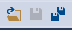  
  
 **Disabled command icon**  
  
 Background  
  
 N/A (inherits from command bar background)  
  
 Foreground (Text)  
  
 <CodeContentPlaceHolder>52\</CodeContentPlaceHolder>  
  
 Border  
  
 N/A  
  
####  \<a name="BKMK_CommandComboBox">\</a> Combo box  
  
> [!IMPORTANT]
>  Combo boxes are similar to drop-downs, but include an editable text region. If your drop-down does not include an editable text region, use the color tokens found under [Drop-down](../vs140/shared-colors-for-visual-studio.md#BKMK_CommandDropDown).  
  
   
  
 Use …  
 -   when building custom combo boxes.  
  
-   when creating a command bar control that is similar to a combo box.  
  
 Do not use …  
 -   for anything you don’t want always to match the command bar UI.  
  
-   when you have access to a styled combo box.  
  
 **Default**  
  
 Component  
  
 Element  
  
 Token name: Category.color  
  
   
  
 **Input field**  
  
 Background  
  
 <CodeContentPlaceHolder>53\</CodeContentPlaceHolder>  
  
 Foreground (Text)  
  
 <CodeContentPlaceHolder>54\</CodeContentPlaceHolder>  
  
 Border  
  
 <CodeContentPlaceHolder>55\</CodeContentPlaceHolder>  
  
 Separator  
  
 No separator  
  
   
  
 **Drop-down button**  
  
 Background  
  
 N/A (inherits)  
  
 Foreground (Glyph)  
  
 <CodeContentPlaceHolder>56\</CodeContentPlaceHolder>  
  
   
  
 **Drop-down list**  
  
 Background  
  
 <CodeContentPlaceHolder>57\</CodeContentPlaceHolder>  
  
 While not used in modern themed UI, there are gradient stops and values for this background.  
  
 Foreground (Text)  
  
 <CodeContentPlaceHolder>58\</CodeContentPlaceHolder>  
  
 Border  
  
 <CodeContentPlaceHolder>59\</CodeContentPlaceHolder>  
  
 **Hover**  
  
 Component  
  
 Element  
  
 Token name: Category.color  
  
   
  
 **Input field**  
  
 Background  
  
 <CodeContentPlaceHolder>60\</CodeContentPlaceHolder>  
  
 While not used in modern themed UI, there are gradient stops and values for this background.  
  
 Foreground (Text)  
  
 <CodeContentPlaceHolder>61\</CodeContentPlaceHolder>  
  
 Border  
  
 <CodeContentPlaceHolder>62\</CodeContentPlaceHolder>  
  
 Separator  
  
 <CodeContentPlaceHolder>63\</CodeContentPlaceHolder>  
  
   
  
 **Drop-down button**  
  
 Background  
  
 <CodeContentPlaceHolder>64\</CodeContentPlaceHolder>  
  
 Foreground (Glyph)  
  
 <CodeContentPlaceHolder>65\</CodeContentPlaceHolder>  
  
   
  
 **Drop-down list**  
  
 Background (Menu item)  
  
 <CodeContentPlaceHolder>66\</CodeContentPlaceHolder>  
  
 Foreground (Text)  
  
 <CodeContentPlaceHolder>67\</CodeContentPlaceHolder>  
  
 Border (Menu item)  
  
 <CodeContentPlaceHolder>68\</CodeContentPlaceHolder>  
  
 **Focused**  
  
 Component  
  
 Element  
  
 Token name: Color.category  
  
 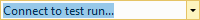  
  
 **Input field**  
  
 Background  
  
 <CodeContentPlaceHolder>69\</CodeContentPlaceHolder>  
  
 Foreground (Text)  
  
 <CodeContentPlaceHolder>70\</CodeContentPlaceHolder>  
  
 Border  
  
 <CodeContentPlaceHolder>71\</CodeContentPlaceHolder>  
  
 Separator  
  
 <CodeContentPlaceHolder>72\</CodeContentPlaceHolder>  
  
 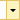  
  
 **Drop-down button**  
  
 Background  
  
 <CodeContentPlaceHolder>73\</CodeContentPlaceHolder>  
  
 Foreground (Glyph)  
  
 <CodeContentPlaceHolder>74\</CodeContentPlaceHolder>  
  
 **Pressed**  
  
 Component  
  
 Element  
  
 Token name: Color.category  
  
 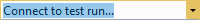  
  
 **Input field**  
  
 Background  
  
 <CodeContentPlaceHolder>75\</CodeContentPlaceHolder>  
  
 Foreground (Text)  
  
 <CodeContentPlaceHolder>76\</CodeContentPlaceHolder>  
  
 Border  
  
 <CodeContentPlaceHolder>77\</CodeContentPlaceHolder>  
  
 Separator  
  
 <CodeContentPlaceHolder>78\</CodeContentPlaceHolder>  
  
 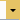  
  
 **Drop-down button**  
  
 Background  
  
 <CodeContentPlaceHolder>79\</CodeContentPlaceHolder>  
  
 Foreground (Glyph)  
  
 <CodeContentPlaceHolder>80\</CodeContentPlaceHolder>  
  
 **Disabled**  
  
 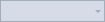  
  
 **Input field**  
  
 Background  
  
 <CodeContentPlaceHolder>81\</CodeContentPlaceHolder>  
  
 Foreground (Text)  
  
 <CodeContentPlaceHolder>82\</CodeContentPlaceHolder>  
  
 Border  
  
 <CodeContentPlaceHolder>83\</CodeContentPlaceHolder>  
  
 Separator  
  
 No separator  
  
   
  
 **Drop-down button**  
  
 Background  
  
 None  
  
 Foreground (Glyph)  
  
 <CodeContentPlaceHolder>84\</CodeContentPlaceHolder>  
  
####  \<a name="BKMK_CommandDropDown">\</a> Drop-down  
  
> [!IMPORTANT]
>  Drop-downs are similar to combo boxes, but lack editable text regions. If your drop-down includes an editable text region, use the color tokens found under [Combo box](../vs140/shared-colors-for-visual-studio.md#BKMK_CommandComboBox).  
  
   
  
 Use …  
 when you are creating custom drop-down list controls.  
  
 Do not use …  
 -   for anything that is not similar to a drop-down list.  
  
-   for combo boxes or split buttons.  
  
 **Default**  
  
 Component  
  
 Element  
  
 Token name: Category.color  
  
 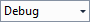  
  
 **Selection field**  
  
 Background  
  
 <CodeContentPlaceHolder>85\</CodeContentPlaceHolder>  
  
 Foreground (Text)  
  
 <CodeContentPlaceHolder>86\</CodeContentPlaceHolder>  
  
 Border  
  
 <CodeContentPlaceHolder>87\</CodeContentPlaceHolder>  
  
 Separator  
  
 No separator  
  
   
  
 **Drop-down button**  
  
 Background  
  
 None  
  
 Foreground (Glyph)  
  
 <CodeContentPlaceHolder>88\</CodeContentPlaceHolder>  
  
   
  
 **Drop-down list**  
  
 Background  
  
 <CodeContentPlaceHolder>89\</CodeContentPlaceHolder>  
  
 While not used in modern themed UI, there are gradient stops and values for this background.  
  
 Foreground (Text)  
  
 <CodeContentPlaceHolder>90\</CodeContentPlaceHolder>  
  
 Border  
  
 <CodeContentPlaceHolder>91\</CodeContentPlaceHolder>  
  
 Shadow  
  
 <CodeContentPlaceHolder>92\</CodeContentPlaceHolder>  
  
 **Hover**  
  
 Component  
  
 Element  
  
 Token name: Category.color  
  
 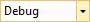  
  
 **Selection field**  
  
 Background  
  
 <CodeContentPlaceHolder>93\</CodeContentPlaceHolder>  
  
 While not used in modern themed UI, there are gradient stops and values for this background.  
  
 Foreground (Text)  
  
 <CodeContentPlaceHolder>94\</CodeContentPlaceHolder>  
  
 Border  
  
 <CodeContentPlaceHolder>95\</CodeContentPlaceHolder>  
  
 Separator  
  
 <CodeContentPlaceHolder>96\</CodeContentPlaceHolder>  
  
   
  
 **Drop-down button**  
  
 Background  
  
 <CodeContentPlaceHolder>97\</CodeContentPlaceHolder>  
  
 Foreground (Glyph)  
  
 <CodeContentPlaceHolder>98\</CodeContentPlaceHolder>  
  
   
  
 **Drop-down list**  
  
 Background (Menu item)  
  
 <CodeContentPlaceHolder>99\</CodeContentPlaceHolder>  
  
 Foreground (Text)  
  
 <CodeContentPlaceHolder>100\</CodeContentPlaceHolder>  
  
 Border (Menu item)  
  
 <CodeContentPlaceHolder>101\</CodeContentPlaceHolder>  
  
 **Pressed**  
  
 Component  
  
 Element  
  
 Token name: Category.color  
  
   
  
 **Selection field**  
  
 Background  
  
 <CodeContentPlaceHolder>102\</CodeContentPlaceHolder>  
  
 Foreground (Text)  
  
 <CodeContentPlaceHolder>103\</CodeContentPlaceHolder>  
  
 Border  
  
 <CodeContentPlaceHolder>104\</CodeContentPlaceHolder>  
  
 Separator  
  
 <CodeContentPlaceHolder>105\</CodeContentPlaceHolder>  
  
 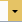  
  
 **Drop-down button**  
  
 Background  
  
 <CodeContentPlaceHolder>106\</CodeContentPlaceHolder>  
  
 Foreground (Glyph)  
  
 <CodeContentPlaceHolder>107\</CodeContentPlaceHolder>  
  
 **Disabled**  
  
 Component  
  
 Element  
  
 Token name: Category.color  
  
   
  
 Background  
  
 <CodeContentPlaceHolder>108\</CodeContentPlaceHolder>  
  
 Foreground (Text)  
  
 <CodeContentPlaceHolder>109\</CodeContentPlaceHolder>  
  
 Border  
  
 <CodeContentPlaceHolder>110\</CodeContentPlaceHolder>  
  
 Separator  
  
 No separator  
  
   
  
 Background  
  
 N/A  
  
 Foreground (Glyph)  
  
 <CodeContentPlaceHolder>111\</CodeContentPlaceHolder>  
  
#### Split button  
 Split buttons share many token names with other command bar controls, such as buttons, menus, and command bar text. All necessary action and drop-down button token names are repeated here for convenience. Split button drop-down lists are implementations of command bar [Menus](../vs140/shared-colors-for-visual-studio.md#BKMK_CommandMenus).  
  
   
  
 Use …  
 when you are building a custom split button.  
  
 Do not use …  
 -   for other kinds of buttons.  
  
-   in any background/foreground combination other than specified.  
  
 **Default**  
  
 Component  
  
 Element  
  
 Token name: Category.color  
  
 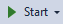  
  
 **Split button (default)**  
  
 Background  
  
 None  
  
 Foreground (Text)  
  
 <CodeContentPlaceHolder>112\</CodeContentPlaceHolder>  
  
 Foreground (Glyph)  
  
 <CodeContentPlaceHolder>113\</CodeContentPlaceHolder>  
  
 Border  
  
 N/A  
  
 Separator  
  
 N/A  
  
 **Hover**  
  
 Component  
  
 Element  
  
 Token name: Category.color  
  
 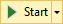  
  
 **Split button (on hover)**  
  
 Background  
  
 <CodeContentPlaceHolder>114\</CodeContentPlaceHolder>  
  
 While not used in modern themed UI, there are gradient stops and values for this background.  
  
 Foreground (Text)  
  
 <CodeContentPlaceHolder>115\</CodeContentPlaceHolder>  
  
 Foreground (Glyph)  
  
 <CodeContentPlaceHolder>116\</CodeContentPlaceHolder>  
  
 Border  
  
 <CodeContentPlaceHolder>117\</CodeContentPlaceHolder>  
  
 Separator  
  
 <CodeContentPlaceHolder>118\</CodeContentPlaceHolder>  
  
 **Pressed**  
  
 Component  
  
 Element  
  
 Token name: Category.color  
  
 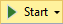  
  
 **Split button (pressed)**  
  
 Background  
  
 <CodeContentPlaceHolder>119\</CodeContentPlaceHolder>  
  
 While not used in modern themed UI, there are gradient stops and values for this background.  
  
 Foreground (Text)  
  
 <CodeContentPlaceHolder>120\</CodeContentPlaceHolder>  
  
 Foreground (Glyph)  
  
 <CodeContentPlaceHolder>121\</CodeContentPlaceHolder>  
  
 Border  
  
 <CodeContentPlaceHolder>122\</CodeContentPlaceHolder>  
  
 Separator  
  
 N/A  
  
 **Disabled**  
  
 Component  
  
 Element  
  
 Token name: Category.color  
  
 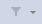  
  
 **Split button (disabled)**  
  
 Background  
  
 N/A  
  
 Foreground (Text)  
  
 <CodeContentPlaceHolder>123\</CodeContentPlaceHolder>  
  
 Foreground (Glyph)  
  
 <CodeContentPlaceHolder>124\</CodeContentPlaceHolder>  
  
 Border  
  
 N/A  
  
 Separator  
  
 N/A  
  
#### ‘More options’ and ‘Overflow’ buttons  
 The "More options" button is used when a command bar group is customizable by either adding or removing related command bar buttons. The "Overflow" button appears when a command bar is truncated due to lack of horizontal space, and on click shows a menu containing the command bar buttons that cannot be displayed. Colors for these two buttons are controlled by the same set of token names.  
  
   
  
 Use …  
 for custom 'More options' or 'Overflow' buttons.  
  
 Do not use …  
 for buttons that don't have similar functionality to a 'More options' or 'Overflow' button.  
  
 **Default**  
  
 Component  
  
 Element  
  
 Token name: Category.color  
  
   
  
 **More options**  
  
 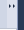  
  
 **Overflow**  
  
 Background  
  
 <CodeContentPlaceHolder>125\</CodeContentPlaceHolder>  
  
 Foreground (Glyph)  
  
 <CodeContentPlaceHolder>126\</CodeContentPlaceHolder>  
  
 **Hover**  
  
 Component  
  
 Element  
  
 Token name: Category.color  
  
   
  
 **More options**  
  
 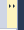  
  
 **Overflow**  
  
 Background  
  
 <CodeContentPlaceHolder>127\</CodeContentPlaceHolder>  
  
 While not used in modern themed UI, there are gradient stops and values for this background.  
  
 Foreground (Glyph)  
  
 <CodeContentPlaceHolder>128\</CodeContentPlaceHolder>  
  
 **Pressed**  
  
 Component  
  
 Element  
  
 Token name: Category.color  
  
   
  
 **More options**  
  
   
  
 **Overflow**  
  
 Background  
  
 <CodeContentPlaceHolder>129\</CodeContentPlaceHolder>  
  
 While not used in modern themed UI, there are gradient stops and values for this background.  
  
 Foreground (Glyph)  
  
 <CodeContentPlaceHolder>130\</CodeContentPlaceHolder>  
  
## Document windows  
 There is no need to replicate document windows, because they are provided by the Visual Studio environment. However, you might decide that you want to leverage the colors used in document windows so that your UI always appears consistent with this part of the Visual Studio environment.  
  
 When using document window color tokens, you must be careful to use them only for similar elements, and always in pairs. If you do not do so, you will have unexpected results in your UI.  
  
### Document window frame  
 Document windows can be either docked in the IDE or floating as a separate window. When a document window is floating outside the IDE, it still sits in a document well, and has background, border, text, and tab colors that are the same as when it is part of the IDE. However, the document sits inside a frame that has its own background, border, and text colors. When tool windows are docked in the document well, they inherit the behavior and color for their tabs from document window token names.  
  
 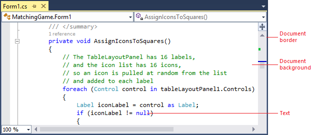  
  
 **Docked document window**  
  
   
  
 **Floating document window**  
  
 Use …  
 anywhere you are creating UI that you want to match the document window.  
  
 Do not use …  
 for any UI that you don't want automatically to change if the shell has a theme update.  
  
 **Default**  
  
 Component  
  
 Element  
  
 Token name: Category.color  
  
 Document: docked or floating  
  
 Background  
  
 Depends on document type  
  
 Foreground (Text)  
  
 Depends on document type  
  
 Border  
  
 <CodeContentPlaceHolder>131\</CodeContentPlaceHolder>  
  
   
  
 **Frame: floating, focused**  
  
 Background  
  
 <CodeContentPlaceHolder>132\</CodeContentPlaceHolder>  
  
 Foreground (Text)  
  
 <CodeContentPlaceHolder>133\</CodeContentPlaceHolder>  
  
 Foreground (Glyph)  
  
 <CodeContentPlaceHolder>134\</CodeContentPlaceHolder>  
  
 Border  
  
 <CodeContentPlaceHolder>135\</CodeContentPlaceHolder>  
  
 Border (Glyph)  
  
 <CodeContentPlaceHolder>136\</CodeContentPlaceHolder>  
  
 Set to transparent  
  
   
  
 **Frame: floating, unfocused**  
  
 Background  
  
 <CodeContentPlaceHolder>137\</CodeContentPlaceHolder>  
  
 Foreground (Text)  
  
 <CodeContentPlaceHolder>138\</CodeContentPlaceHolder>  
  
 Foreground (Glyph)  
  
 <CodeContentPlaceHolder>139\</CodeContentPlaceHolder>  
  
 Border  
  
 <CodeContentPlaceHolder>140\</CodeContentPlaceHolder>  
  
 Border (Glyph)  
  
 <CodeContentPlaceHolder>141\</CodeContentPlaceHolder>  
  
 Set to transparent  
  
 **Hover**  
  
 Component  
  
 Element  
  
 Token name: Category.color  
  
   
  
 **Frame: floating, focused**  
  
 Background (Glyph)  
  
 <CodeContentPlaceHolder>142\</CodeContentPlaceHolder>  
  
 Foreground (Glyph)  
  
 <CodeContentPlaceHolder>143\</CodeContentPlaceHolder>  
  
 Border (Glyph)  
  
 <CodeContentPlaceHolder>144\</CodeContentPlaceHolder>  
  
 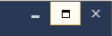  
  
 **Frame: floating, unfocused**  
  
 Background (Glyph)  
  
 <CodeContentPlaceHolder>145\</CodeContentPlaceHolder>  
  
 Foreground (Glyph)  
  
 <CodeContentPlaceHolder>146\</CodeContentPlaceHolder>  
  
 Border (Glyph)  
  
 <CodeContentPlaceHolder>147\</CodeContentPlaceHolder>  
  
 **Pressed**  
  
 Component  
  
 Element  
  
 Token name: Category.color  
  
   
  
 **Frame: floating, focused**  
  
 Background (Glyph)  
  
 <CodeContentPlaceHolder>148\</CodeContentPlaceHolder>  
  
 Foreground (Glyph)  
  
 <CodeContentPlaceHolder>149\</CodeContentPlaceHolder>  
  
 Border (Glyph)  
  
 <CodeContentPlaceHolder>150\</CodeContentPlaceHolder>  
  
### Document tabs  
 Document tabs sit in the tab channel to indicate which documents are currently open, along with which one is the current selected or active document. Tool windows can also be docked in the document tab channel if the user places them there. In this situation, they use the same tab colors as document windows. If you are creating UI that you want to always match the document window colors (including theme updates or if new themes are installed), then reference these color tokens.  
  
   
  
 Use …  
 anywhere you are creating UI that you want to match document tabs and automatically pick up theme updates or new theme colors.  
  
 Do not use …  
 for any UI that you don’t want to change automatically when the shell has a theme update.  
  
#### Open document tabs  
 Each open document has a tab in the document tab channel that displays its name. Documents can be either selected or open in the background, and their tabs reflect these states:  
  
-   The selected tab represents the document that is currently displayed in the document well. A selected tab has a document border that extends across the top edge of the document well.  
  
-   Background tabs are any document tabs that are not the currently selected tab. Once clicked, they become the selected tab and acquire all background, border, and text colors from those token names.  
  
   
  
 Use …  
 when you are creating custom document tabs.  
  
 Do not use …  
 -   for provisional (preview) tabs.  
  
-   for any UI that you don't want to change automatically if the shell has a theme update.  
  
#### Selected tab  
 **Focused**  
  
 Component  
  
 Element  
  
 Token name: Category.color  
  
   
  
 **Selected document tab, focused**  
  
 Background  
  
 <CodeContentPlaceHolder>151\</CodeContentPlaceHolder>  
  
 While not used in modern themed UI, there are gradient stops and values for this background.  
  
 Foreground (Text)  
  
 <CodeContentPlaceHolder>152\</CodeContentPlaceHolder>  
  
 Border  
  
 <CodeContentPlaceHolder>153\</CodeContentPlaceHolder>  
  
 Set to same color as background.  
  
 Document border  
  
 <CodeContentPlaceHolder>154\</CodeContentPlaceHolder>  
  
 **Unfocused**  
  
 Component  
  
 Element  
  
 Token name: Category.color  
  
   
  
 **Selected document tab, unfocused**  
  
 Background  
  
 <CodeContentPlaceHolder>155\</CodeContentPlaceHolder>  
  
 While not used in modern themed UI, there are gradient stops and values for this background.  
  
 Foreground (Text)  
  
 <CodeContentPlaceHolder>156\</CodeContentPlaceHolder>  
  
 Border  
  
 <CodeContentPlaceHolder>157\</CodeContentPlaceHolder>  
  
 Set to same color as background.  
  
 Document border  
  
 <CodeContentPlaceHolder>158\</CodeContentPlaceHolder>  
  
#### Background tab  
 **Default**  
  
 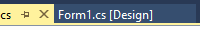  
  
 **Background tab default**  
  
 Background  
  
 <CodeContentPlaceHolder>159\</CodeContentPlaceHolder>  
  
 Foreground (Text)  
  
 <CodeContentPlaceHolder>160\</CodeContentPlaceHolder>  
  
 Border  
  
 <CodeContentPlaceHolder>161\</CodeContentPlaceHolder>  
  
 Set to same color as background.  
  
 **Hover**  
  
 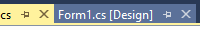  
  
 **Background tab on hover**  
  
 Background  
  
 <CodeContentPlaceHolder>162\</CodeContentPlaceHolder>  
  
 While not used in modern themed UI, there are gradient stops and values for this background.  
  
 Foreground (Text)  
  
 <CodeContentPlaceHolder>163\</CodeContentPlaceHolder>  
  
 Border  
  
 <CodeContentPlaceHolder>164\</CodeContentPlaceHolder>  
  
 Set to same color as background.  
  
#### Preview tab  
 The preview tab appears on the right side of the document tab channel when the user clicks an item in the Solution Explorer tool window. It acts as a preview of the document and also gives the user the option to keep the document open on the left side of the document tab channel. Only one preview tab open can be open at a time. Preview tabs have both background and selected states, like open tabs, and can be focused or unfocused in their active state.  
  
   
  
 Use …  
 anywhere you are creating provisional preview and want some element to match the current preview tab color.  
  
 Do not use …  
 -   for any kind of document or tab that is not provisional (preview).  
  
-   for any UI that you don't want to change automatically if the shell has a theme update.  
  
 **Selected preview tab: Focused**  
  
 Component  
  
 Element  
  
 Token name: Category.color  
  
   
  
 **Focused preview tab**  
  
 Background  
  
 <CodeContentPlaceHolder>165\</CodeContentPlaceHolder>  
  
 Foreground (Text)  
  
 <CodeContentPlaceHolder>166\</CodeContentPlaceHolder>  
  
 Border  
  
 <CodeContentPlaceHolder>167\</CodeContentPlaceHolder>  
  
 Set to same color as background.  
  
 Document border  
  
 <CodeContentPlaceHolder>168\</CodeContentPlaceHolder>  
  
 **Selected preview tab: Unfocused**  
  
 Component  
  
 Element  
  
 Token name: Category.color  
  
   
  
 **Unfocused preview tab**  
  
 Background  
  
 <CodeContentPlaceHolder>169\</CodeContentPlaceHolder>  
  
 Foreground (Text)  
  
 <CodeContentPlaceHolder>170\</CodeContentPlaceHolder>  
  
 Border  
  
 <CodeContentPlaceHolder>171\</CodeContentPlaceHolder>  
  
 Document border  
  
 <CodeContentPlaceHolder>172\</CodeContentPlaceHolder>  
  
 **Background preview tab: Default**  
  
 Component  
  
 Element  
  
 Token name: Category.color  
  
   
  
 **Preview tab background tab**  
  
 Background  
  
 <CodeContentPlaceHolder>173\</CodeContentPlaceHolder>  
  
 Foreground (Text)  
  
 <CodeContentPlaceHolder>174\</CodeContentPlaceHolder>  
  
 Border  
  
 <CodeContentPlaceHolder>175\</CodeContentPlaceHolder>  
  
 Set to same color as background.  
  
 **Background preview tab: Hover**  
  
 Component  
  
 Element  
  
 Token name: Category.color  
  
   
  
 **Preview tab background tab on hover**  
  
 Background  
  
 <CodeContentPlaceHolder>176\</CodeContentPlaceHolder>  
  
 Foreground (Text)  
  
 <CodeContentPlaceHolder>177\</CodeContentPlaceHolder>  
  
 Border  
  
 <CodeContentPlaceHolder>178\</CodeContentPlaceHolder>  
  
 Set to same color as background.  
  
#### Document overflow button  
 The document overflow button is present if there are one or more documents open, regardless of whether there is vertical space in the current configuration to fit all document tabs. The document overflow drop-down menu, which is controlled by the **CommandBarMenu** colors (see [Menus](../Topic/Shared%20colors.md#BKMK_CommandMenus)), displays a list of all open documents, both visible and hidden, and the overflow glyph changes depending on whether all the open documents are displayed in the tab channel.  
  
 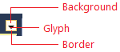  
  
 Use …  
 when you are creating a custom document overflow button.  
  
 Do not use …  
 -   for UI that is not similar to an overflow button.  
  
-   for command bar overflow buttons.  
  
 **Default**  
  
 Component  
  
 Element  
  
 Token name: Category.color  
  
   
  
 **Document overflow button**  
  
 Background  
  
 <CodeContentPlaceHolder>179\</CodeContentPlaceHolder>  
  
 Foreground (Glyph)  
  
 <CodeContentPlaceHolder>180\</CodeContentPlaceHolder>  
  
 Border  
  
 N/A  
  
 **Hover**  
  
 Component  
  
 Element  
  
 Token name: Category.color  
  
   
  
 **Document overflow button on hover**  
  
 Background  
  
 <CodeContentPlaceHolder>181\</CodeContentPlaceHolder>  
  
 Foreground (Glyph)  
  
 <CodeContentPlaceHolder>182\</CodeContentPlaceHolder>  
  
 Border  
  
 <CodeContentPlaceHolder>183\</CodeContentPlaceHolder>  
  
 **Pressed**  
  
 Component  
  
 Element  
  
 Token name: Category.color  
  
 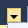  
  
 **Pressed document overflow button**  
  
 Background  
  
 <CodeContentPlaceHolder>184\</CodeContentPlaceHolder>  
  
 Foreground (Glyph)  
  
 <CodeContentPlaceHolder>185\</CodeContentPlaceHolder>  
  
 Border  
  
 <CodeContentPlaceHolder>186\</CodeContentPlaceHolder>  
  
## Tool windows  
 There is no need to replicate tool windows, because they are provided by the Visual Studio environment. However, you might decide that you want to leverage the colors used in tool windows so that your UI always appears consistent with this part of the Visual Studio environment.  
  
   
  
 Use …  
 anywhere you are creating UI that you want to match tool windows.  
  
 Do not use …  
 for any UI that you don't want to change automatically if the shell has a theme update.  
  
### Tool window frame  
 Tool windows in Visual Studio are used for many different tasks, and can exist in one of several different states. If a tool window is open, it can be assigned to any of the four sides of the document area. Tool windows can also float outside of the IDE, which allows them to be repositioned anywhere within the user's screen. Floating windows always sit on top of the IDE. Finally, tool windows can be docked as document windows and appear as a tab in the document well. Tool windows that have been docked as document windows are colored in part using document window token names.  
  
   
  
 Use …  
 anywhere you are creating UI that you want to match tool windows.  
  
 Do not use …  
 for any UI that you don't want to change automatically if the shell has a theme update.  
  
 **Docked**  
  
 Component  
  
 Element  
  
 Token name: Category.color  
  
   
  
 Background  
  
 <CodeContentPlaceHolder>187\</CodeContentPlaceHolder>  
  
 Border  
  
 <CodeContentPlaceHolder>188\</CodeContentPlaceHolder>  
  
 **Floating: focused**  
  
 Component  
  
 Element  
  
 Token name: Category.color  
  
   
  
 Background  
  
 <CodeContentPlaceHolder>189\</CodeContentPlaceHolder>  
  
 Border  
  
 <CodeContentPlaceHolder>190\</CodeContentPlaceHolder>  
  
 **Floating: unfocused**  
  
 Component  
  
 Element  
  
 Token name: Category.color  
  
   
  
 Background  
  
 <CodeContentPlaceHolder>191\</CodeContentPlaceHolder>  
  
 Border  
  
 <CodeContentPlaceHolder>192\</CodeContentPlaceHolder>  
  
### Tool window title bar  
 The title bar border is not a true border, but a thick line across the top of the title bar. It does not have a token name for its unfocused state.  
  
   
  
 Use …  
 anywhere you are creating UI that you want to match tool windows.  
  
 Do not use …  
 for any UI that you don't want to change automatically if the shell has a theme update.  
  
 **Focused**  
  
 Component  
  
 Element  
  
 Token name: Category.color  
  
 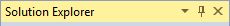  
  
 **Focused title bar**  
  
 Background  
  
 <CodeContentPlaceHolder>193\</CodeContentPlaceHolder>  
  
 While not used in modern themed UI, there are gradient stops and values for this background.  
  
 Foreground (Text)  
  
 <CodeContentPlaceHolder>194\</CodeContentPlaceHolder>  
  
 Border  
  
 <CodeContentPlaceHolder>195\</CodeContentPlaceHolder>  
  
 Set to same color as background.  
  
 Drag handle  
  
 <CodeContentPlaceHolder>196\</CodeContentPlaceHolder>  
  
 **Unfocused**  
  
 Component  
  
 Element  
  
 Token name: Category.color  
  
   
  
 **Unfocused title bar**  
  
 Background  
  
 <CodeContentPlaceHolder>197\</CodeContentPlaceHolder>  
  
 While not used in modern themed UI, there are gradient stops and values for this background.  
  
 Foreground (Text)  
  
 <CodeContentPlaceHolder>198\</CodeContentPlaceHolder>  
  
 Border  
  
 N/A  
  
 Drag handle  
  
 <CodeContentPlaceHolder>199\</CodeContentPlaceHolder>  
  
#### Title bar buttons  
   
  
 Use …  
 for buttons that appear in UI that uses color tokens from the tool window title bars.  
  
 Do not use …  
 -   for buttons that appear in other locations.  
  
-   in any background/foreground combination other than specified.  
  
 **Default**  
  
 Component  
  
 Element  
  
 Token name: Category.color  
  
 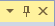  
  
 **Focused**  
  
 Background  
  
 N/A  
  
 Foreground (Glyph)  
  
 <CodeContentPlaceHolder>200\</CodeContentPlaceHolder>  
  
 Border  
  
 N/A  
  
   
  
 **Unfocused**  
  
 Background  
  
 N/A  
  
 Foreground (Glyph)  
  
 <CodeContentPlaceHolder>201\</CodeContentPlaceHolder>  
  
 Border  
  
 N/A  
  
 **Hover**  
  
 Component  
  
 Element  
  
 Token name: Category.color  
  
 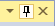  
  
 **Focused**  
  
 Background  
  
 <CodeContentPlaceHolder>202\</CodeContentPlaceHolder>  
  
 Foreground (Glyph)  
  
 <CodeContentPlaceHolder>203\</CodeContentPlaceHolder>  
  
 Border  
  
 <CodeContentPlaceHolder>204\</CodeContentPlaceHolder>  
  
   
  
 **Unfocused**  
  
 Background  
  
 <CodeContentPlaceHolder>205\</CodeContentPlaceHolder>  
  
 Foreground (Glyph)  
  
 <CodeContentPlaceHolder>206\</CodeContentPlaceHolder>  
  
 Border  
  
 <CodeContentPlaceHolder>207\</CodeContentPlaceHolder>  
  
 **Pressed**  
  
 Component  
  
 Element  
  
 Token name: Category.color  
  
 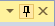  
  
 **Focused**  
  
 Background  
  
 <CodeContentPlaceHolder>208\</CodeContentPlaceHolder>  
  
 Foreground (Glyph)  
  
 <CodeContentPlaceHolder>209\</CodeContentPlaceHolder>  
  
 Border  
  
 <CodeContentPlaceHolder>210\</CodeContentPlaceHolder>  
  
 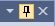  
  
 **Unfocused**  
  
 Background  
  
 <CodeContentPlaceHolder>211\</CodeContentPlaceHolder>  
  
 Foreground (Glyph)  
  
 <CodeContentPlaceHolder>212\</CodeContentPlaceHolder>  
  
 Border  
  
 <CodeContentPlaceHolder>213\</CodeContentPlaceHolder>  
  
### Tool window tabs  
   
  
 Use …  
 anywhere you are creating UI that you want to match tool windows.  
  
 Do not use …  
 for any UI that you don't want to change automatically if the shell has a theme update.  
  
 **Selected tab**  
  
 Component  
  
 Element  
  
 Token name: Category.color  
  
   
  
 **Selected, focused tool window tab**  
  
 Background  
  
 <CodeContentPlaceHolder>214\</CodeContentPlaceHolder>  
  
 Foreground (Text)  
  
 <CodeContentPlaceHolder>215\</CodeContentPlaceHolder>  
  
 Border  
  
 <CodeContentPlaceHolder>216\</CodeContentPlaceHolder>  
  
 Set to same color as background.  
  
 Component  
  
 Element  
  
 Token name: Category.color  
  
   
  
 **Selected, unfocused tool window tab**  
  
 Background  
  
 <CodeContentPlaceHolder>217\</CodeContentPlaceHolder>  
  
 Foreground (Text)  
  
 <CodeContentPlaceHolder>218\</CodeContentPlaceHolder>  
  
 Border  
  
 <CodeContentPlaceHolder>219\</CodeContentPlaceHolder>  
  
 Set to same color as background.  
  
 **Background tab**  
  
 Component  
  
 Element  
  
 Token name: Category.color  
  
   
  
 **Background tool window tab**  
  
 Background  
  
 <CodeContentPlaceHolder>220\</CodeContentPlaceHolder>  
  
 Gradient stops set to the same color value in Visual Studio 2013.  
  
 <CodeContentPlaceHolder>221\</CodeContentPlaceHolder>  
  
 Gradient stops set to the same color value in Visual Studio 2013.  
  
 Foreground (Text)  
  
 <CodeContentPlaceHolder>222\</CodeContentPlaceHolder>  
  
 Border  
  
 <CodeContentPlaceHolder>223\</CodeContentPlaceHolder>  
  
 Component  
  
 Element  
  
 Token name: Category.color  
  
   
  
 **Background tool window tab on hover**  
  
 Background  
  
 <CodeContentPlaceHolder>224\</CodeContentPlaceHolder>  
  
 Gradient stops set to the same color value in Visual Studio 2013.  
  
 <CodeContentPlaceHolder>225\</CodeContentPlaceHolder>  
  
 Gradient stops set to the same color value in Visual Studio 2013.  
  
 Foreground (Text)  
  
 <CodeContentPlaceHolder>226\</CodeContentPlaceHolder>  
  
 Border  
  
 <CodeContentPlaceHolder>227\</CodeContentPlaceHolder>  
  
 Set to same color as background.  
  
### Auto-hide tabs  
   
  
 Use …  
 anywhere you are creating UI that you want to match auto-hidden tool window tabs.  
  
 Do not use …  
 for any UI that you don’t want to change automatically if the shell has a theme update.  
  
 **Default**  
  
 Component  
  
 Element  
  
 Token name: Category.color  
  
   
  
 **Default auto-hide tab**  
  
 Background  
  
 <CodeContentPlaceHolder>228\</CodeContentPlaceHolder>  
  
 While not used in modern themed UI, there are gradient stops and values for this background.  
  
 Foreground (Text)  
  
 <CodeContentPlaceHolder>229\</CodeContentPlaceHolder>  
  
 Border  
  
 <CodeContentPlaceHolder>230\</CodeContentPlaceHolder>  
  
 **Hover**  
  
 Component  
  
 Element  
  
 Token name: Category.color  
  
   
  
 **Auto-hide tab on hover**  
  
 Background  
  
 <CodeContentPlaceHolder>231\</CodeContentPlaceHolder>  
  
 While not used in modern themed UI, there are gradient stops and values for this background.  
  
 Foreground (Text)  
  
 <CodeContentPlaceHolder>232\</CodeContentPlaceHolder>  
  
 Border  
  
 <CodeContentPlaceHolder>233\</CodeContentPlaceHolder>  
  
## Common shared controls  
 When you use a standard Visual Studio command bar in your feature, you will have access to styled shell controls, and you should not re-template these common controls. However, if you need to build a custom command bar, you might need to build custom controls as well. In that case, make sure to use the correct token names for each of the following controls so that your UI is consistent with the rest of Visual Studio.  
  
### Search box  
 Whenever possible, use the common search control provided by the Visual Studio environment. Search box colors are found in the "SearchControl" category in the **ShellColors.pkgdef** file, which contains token names for the input field, action button, drop-down button, and drop-down menu.  
  
 A search box can be one of several states, some of which are mutually exclusive:  
  
-   "Focused" or "unfocused" refers to whether or not the cursor is in the text box.  
  
-   "Active" or "inactive" refers to whether the user has input a search query in the text box.  
  
-   "Hover" means that the user has moused over the search box with the mouse (this state overrides all other states).  
  
-   "Disabled" means that search functionality is turned off for the current context.  
  
   
  
 Use …  
 when you are designing a custom search box.  
  
 Do not use …  
 -   for anything that is not a search box.  
  
-   for anything that you do not want always to match the search box UI.  
  
 **Focused**  
  
 Component  
  
 Element  
  
 Token name: Category.color  
  
   
  
 **Input field**  
  
 Background  
  
 <CodeContentPlaceHolder>234\</CodeContentPlaceHolder>  
  
 Foreground (Text)  
  
 <CodeContentPlaceHolder>235\</CodeContentPlaceHolder>  
  
 Border  
  
 <CodeContentPlaceHolder>236\</CodeContentPlaceHolder>  
  
 Separator  
  
 <CodeContentPlaceHolder>237\</CodeContentPlaceHolder>  
  
   
  
 **Action button**  
  
 Background  
  
 None  
  
 Foreground (Search glyph)  
  
 <CodeContentPlaceHolder>238\</CodeContentPlaceHolder>  
  
 Foreground (Stop glyph)  
  
 <CodeContentPlaceHolder>239\</CodeContentPlaceHolder>  
  
 Foreground (Clear glyph)  
  
 <CodeContentPlaceHolder>240\</CodeContentPlaceHolder>  
  
 Border  
  
 N/A  
  
   
  
 **Drop-down button**  
  
 Background  
  
 <CodeContentPlaceHolder>241\</CodeContentPlaceHolder>  
  
 Foreground (Glyph)  
  
 <CodeContentPlaceHolder>242\</CodeContentPlaceHolder>  
  
 Border  
  
 <CodeContentPlaceHolder>243\</CodeContentPlaceHolder>  
  
 **Unfocused**  
  
 Component  
  
 Element  
  
 Token name: Category.color  
  
   
  
 **Active input field**  
  
 Background  
  
 <CodeContentPlaceHolder>244\</CodeContentPlaceHolder>  
  
 Foreground (Text)  
  
 <CodeContentPlaceHolder>245\</CodeContentPlaceHolder>  
  
 Border  
  
 <CodeContentPlaceHolder>246\</CodeContentPlaceHolder>  
  
 Separator  
  
 <CodeContentPlaceHolder>247\</CodeContentPlaceHolder>  
  
   
  
 **Inactive input field**  
  
 Background  
  
 <CodeContentPlaceHolder>248\</CodeContentPlaceHolder>  
  
 Foreground (Text)  
  
 <CodeContentPlaceHolder>249\</CodeContentPlaceHolder>  
  
 Border  
  
 <CodeContentPlaceHolder>250\</CodeContentPlaceHolder>  
  
 Separator  
  
 <CodeContentPlaceHolder>251\</CodeContentPlaceHolder>  
  
   
  
 **Action button**  
  
 Background  
  
 N/A  
  
 Foreground (Search glyph)  
  
 <CodeContentPlaceHolder>252\</CodeContentPlaceHolder>  
  
 Foreground (Stop glyph)  
  
 <CodeContentPlaceHolder>253\</CodeContentPlaceHolder>  
  
 Foreground (Clear glyph)  
  
 <CodeContentPlaceHolder>254\</CodeContentPlaceHolder>  
  
 Border  
  
 N/A  
  
   
  
 **Drop-down button**  
  
 Background  
  
 <CodeContentPlaceHolder>255\</CodeContentPlaceHolder>  
  
 Foreground (Glyph)  
  
 <CodeContentPlaceHolder>256\</CodeContentPlaceHolder>  
  
 Border  
  
 <CodeContentPlaceHolder>257\</CodeContentPlaceHolder>  
  
 **Pressed**  
  
 Component  
  
 Element  
  
 Token name: Category.color  
  
   
  
 **Action button**  
  
 Background  
  
 <CodeContentPlaceHolder>258\</CodeContentPlaceHolder>  
  
 Foreground (Glyph)  
  
 <CodeContentPlaceHolder>259\</CodeContentPlaceHolder>  
  
 Border  
  
 <CodeContentPlaceHolder>260\</CodeContentPlaceHolder>  
  
   
  
 **Drop-down button**  
  
 Background  
  
 <CodeContentPlaceHolder>261\</CodeContentPlaceHolder>  
  
 Foreground (Glyph)  
  
 <CodeContentPlaceHolder>262\</CodeContentPlaceHolder>  
  
 Border  
  
 <CodeContentPlaceHolder>263\</CodeContentPlaceHolder>  
  
 **Highlighted (Text only)**  
  
 Component  
  
 Element  
  
 Token name: Category.color  
  
   
  
 **Input field with text highlighted**  
  
 Background  
  
 <CodeContentPlaceHolder>264\</CodeContentPlaceHolder>  
  
 Foreground (Text)  
  
 <CodeContentPlaceHolder>265\</CodeContentPlaceHolder>  
  
 Border  
  
 None  
  
 Separator  
  
 <CodeContentPlaceHolder>266\</CodeContentPlaceHolder>  
  
 **Disabled**  
  
 Component  
  
 Element  
  
 Token name: Category.color  
  
 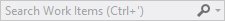  
  
 **Input field**  
  
 Background  
  
 <CodeContentPlaceHolder>267\</CodeContentPlaceHolder>  
  
 Foreground (Text)  
  
 <CodeContentPlaceHolder>268\</CodeContentPlaceHolder>  
  
 Border  
  
 <CodeContentPlaceHolder>269\</CodeContentPlaceHolder>  
  
 Separator  
  
 <CodeContentPlaceHolder>270\</CodeContentPlaceHolder>  
  
   
  
 **Action button**  
  
 Background  
  
 None  
  
 Foreground (Glyph)  
  
 <CodeContentPlaceHolder>271\</CodeContentPlaceHolder>  
  
 Border  
  
 None  
  
   
  
 **Drop-down button**  
  
 Background  
  
 None  
  
 Foreground (Glyph)  
  
 <CodeContentPlaceHolder>272\</CodeContentPlaceHolder>  
  
 Border  
  
 None  
  
#### Search drop-down lists  
 The search box dropdown menu has the potential to be slightly more complex than other dropdown menus in Visual Studio. The "suggested searches" and "search options" sections can appear alone or together in the menu and each one is colored separately. A line also separates these two sections when they appear together and a border surrounds the entire dropdown menu.  
  
   
  
 Use …  
 -   when you are creating a custom search dropdown list.  
  
-   the correct token names for the correct list components.  
  
 Do not use …  
 -   for dropdown lists that appear in other contexts.  
  
-   in any background/foreground combination other than specified.  
  
 **Default (no other states)**  
  
 Element  
  
 Token name: Category.color  
  
 Border  
  
 <CodeContentPlaceHolder>273\</CodeContentPlaceHolder>  
  
 Separator  
  
 <CodeContentPlaceHolder>274\</CodeContentPlaceHolder>  
  
 Shadow  
  
 <CodeContentPlaceHolder>275\</CodeContentPlaceHolder>  
  
 **Default**  
  
 Component  
  
 Element  
  
 Token name: Category.color  
  
   
  
 **Suggested searches**  
  
 Background  
  
 <CodeContentPlaceHolder>276\</CodeContentPlaceHolder>  
  
 While not used in modern themed UI, there are gradient stops and values for this background.  
  
 Foreground (Text)  
  
 <CodeContentPlaceHolder>277\</CodeContentPlaceHolder>  
  
   
  
 **Search options (check box)**  
  
   
  
 **Search options (link)**  
  
 Background  
  
 <CodeContentPlaceHolder>278\</CodeContentPlaceHolder>  
  
 While not used in modern themed UI, there are gradient stops and values for this background.  
  
 Foreground (Check box text)  
  
 <CodeContentPlaceHolder>279\</CodeContentPlaceHolder>  
  
 Foreground (Link text)  
  
 <CodeContentPlaceHolder>280\</CodeContentPlaceHolder>  
  
 Header background  
  
 <CodeContentPlaceHolder>281\</CodeContentPlaceHolder>  
  
 While not used in modern themed UI, there are gradient stops and values for this background.  
  
 Foreground (Header text)  
  
 <CodeContentPlaceHolder>282\</CodeContentPlaceHolder>  
  
 **Hover**  
  
 Component  
  
 Element  
  
 Token name: Category.color  
  
   
  
 **Suggested searches**  
  
 Background  
  
 <CodeContentPlaceHolder>283\</CodeContentPlaceHolder>  
  
 While not used in modern themed UI, there are gradient stops and values for this background.  
  
 Foreground (Text)  
  
 <CodeContentPlaceHolder>284\</CodeContentPlaceHolder>  
  
 Border  
  
 <CodeContentPlaceHolder>285\</CodeContentPlaceHolder>  
  
   
  
 **Suggested searches (check box)**  
  
   
  
 **Search options**  
  
 Background  
  
 <CodeContentPlaceHolder>286\</CodeContentPlaceHolder>  
  
 While not used in modern themed UI, there are gradient stops and values for this background.  
  
 Foreground (Check box text)  
  
 <CodeContentPlaceHolder>287\</CodeContentPlaceHolder>  
  
 Foreground (Link text)  
  
 <CodeContentPlaceHolder>288\</CodeContentPlaceHolder>  
  
 Border  
  
 <CodeContentPlaceHolder>289\</CodeContentPlaceHolder>  
  
 **Pressed**  
  
 Component  
  
 Element  
  
 Token name: Category.color  
  
   
  
 **Suggested searches (check box)**  
  
 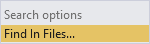  
  
 **Search options**  
  
 Check box background  
  
 <CodeContentPlaceHolder>290\</CodeContentPlaceHolder>  
  
 While not used in modern themed UI, there are gradient stops and values for this background.  
  
 <CodeContentPlaceHolder>291\</CodeContentPlaceHolder>  
  
 While not used in modern themed UI, there are gradient stops and values for this background.  
  
 Foreground (Check box text)  
  
 <CodeContentPlaceHolder>292\</CodeContentPlaceHolder>  
  
 Link background  
  
 <CodeContentPlaceHolder>293\</CodeContentPlaceHolder>  
  
 While not used in modern themed UI, there are gradient stops and values for this background.  
  
 Foreground (Link text)  
  
 <CodeContentPlaceHolder>294\</CodeContentPlaceHolder>  
  
### Hyperlink  
 The hyperlink is one control that does not have a foreground/background pair. In all cases, use the foreground hyperlink color, which will appear correctly on dark, gray and white backgrounds. If you do not use the color token for the hyperlink control, you will see the default system color for "pressed,"" which will flash red. That is the signal that the control is not using the correct environment color token.  
  
   
  
 Use …  
 when you need to create a custom hyperlink.  
  
 Do not use …  
 for anything that is not a hyperlink.  
  
 **Default**  
  
 Component  
  
 Element  
  
 Token name: Category.color  
  
   
  
 Foreground (Text)  
  
 <CodeContentPlaceHolder>295\</CodeContentPlaceHolder>  
  
 **Hover**  
  
 Component  
  
 Element  
  
 Token name: Category.color  
  
   
  
 Foreground (Text)  
  
 <CodeContentPlaceHolder>296\</CodeContentPlaceHolder>  
  
 **Pressed**  
  
 Component  
  
 Element  
  
 Token name: Category.color  
  
 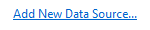  
  
 Foreground (Text)  
  
 <CodeContentPlaceHolder>297\</CodeContentPlaceHolder>  
  
 **Disabled**  
  
 Component  
  
 Element  
  
 Token name: Category.color  
  
   
  
 Foreground (Text)  
  
 <CodeContentPlaceHolder>298\</CodeContentPlaceHolder>  
  
### Infobar  
 Infobars are used to provide more information about a given context and always appear at the top of a document window or tool window.  
  
   
  
 Use …  
 when creating custom infobars.  
  
 Do not use …  
 for UI elements that are not similar to an infobar.  
  
 Component  
  
 Element  
  
 Token name: Category.color  
  
   
  
 **Infobar**  
  
 Background  
  
 <CodeContentPlaceHolder>299\</CodeContentPlaceHolder>  
  
 Foreground (Text)  
  
 <CodeContentPlaceHolder>300\</CodeContentPlaceHolder>  
  
 Border  
  
 <CodeContentPlaceHolder>301\</CodeContentPlaceHolder>  
  
### Scroll bar  
 Scroll bars are styled by the Visual Studio environment, and will not need to be themed. However, you might decide that you want to leverage the colors used in scroll bars so that your UI always appears consistent with this this part of the Visual Studio environment.  
  
   
  
 Use …  
 when you are creating UI that you want to match Visual Studio scrollbars.  
  
 Do not use ...  
 for anything you don't want to always match scrollbar UI.  
  
 **Default**  
  
 Component  
  
 Element  
  
 Token name: Category.color  
  
 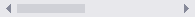  
  
 **Scrollbar**  
  
 Scrollbar  
  
 <CodeContentPlaceHolder>302\</CodeContentPlaceHolder>  
  
 Foreground (Thumb)  
  
 <CodeContentPlaceHolder>303\</CodeContentPlaceHolder>  
  
   
  
 **Scroll arrow**  
  
 Background  
  
 <CodeContentPlaceHolder>304\</CodeContentPlaceHolder>  
  
 Set to same color as scroll bar.  
  
 Foreground (Glyph)  
  
 <CodeContentPlaceHolder>305\</CodeContentPlaceHolder>  
  
 **Hover**  
  
 Component  
  
 Element  
  
 Token name: Category.color  
  
   
  
 **Scrollbar**  
  
 Scrollbar  
  
 <CodeContentPlaceHolder>306\</CodeContentPlaceHolder>  
  
 Foreground (Thumb)  
  
 <CodeContentPlaceHolder>307\</CodeContentPlaceHolder>  
  
   
  
 **Scroll arrow**  
  
 Background  
  
 <CodeContentPlaceHolder>308\</CodeContentPlaceHolder>  
  
 Set to same color as scroll bar.  
  
 Foreground (Glyph)  
  
 <CodeContentPlaceHolder>309\</CodeContentPlaceHolder>  
  
 **Pressed**  
  
 Component  
  
 Element  
  
 Token name: Category.color  
  
   
  
 **Scrollbar**  
  
 Scrollbar  
  
 <CodeContentPlaceHolder>310\</CodeContentPlaceHolder>  
  
 Foreground (Thumb)  
  
 <CodeContentPlaceHolder>311\</CodeContentPlaceHolder>  
  
   
  
 **Scroll arrow**  
  
 Background  
  
 <CodeContentPlaceHolder>312\</CodeContentPlaceHolder>  
  
 Set to same color as scrollbar.  
  
 Foreground (Glyph)  
  
 <CodeContentPlaceHolder>313\</CodeContentPlaceHolder>  
  
###  \<a name="BKMK_TreeView">\</a> Tree view  
 Several tool windows, including the Solution Explorer, Server Explorer, and Class View, implement a hierarchical organizational scheme whose colors are controlled by color names in the TreeView category. All items in a tree view have background and text colors. Items that have nested child elements also have glyphs that indicate whether the item is expanded or collapsed.  
  
   
  
 Use …  
 anywhere you need to implement a hierarchical organizational view.  
  
 Do not use …  
 -   for anything that is not similar to a tree view.  
  
-   in any background/foreground combination other than specified.  
  
 **Default**  
  
 Component  
  
 Element  
  
 Token name: Category.color  
  
   
  
 Background  
  
 <CodeContentPlaceHolder>314\</CodeContentPlaceHolder>  
  
 Foreground (Text)  
  
 <CodeContentPlaceHolder>315\</CodeContentPlaceHolder>  
  
 Foreground (Glyph)  
  
 <CodeContentPlaceHolder>316\</CodeContentPlaceHolder>  
  
 Border  
  
 None  
  
 **Hover**  
  
 Component  
  
 Element  
  
 Token name: Category.color  
  
   
  
 Background  
  
 <CodeContentPlaceHolder>317\</CodeContentPlaceHolder>  
  
 Foreground (Text)  
  
 <CodeContentPlaceHolder>318\</CodeContentPlaceHolder>  
  
 Foreground (Glyph)  
  
 <CodeContentPlaceHolder>319\</CodeContentPlaceHolder>  
  
 Border  
  
 None  
  
 **Drag over**  
  
 Component  
  
 Element  
  
 Token name: Category.color  
  
   
  
 Background  
  
 <CodeContentPlaceHolder>320\</CodeContentPlaceHolder>  
  
 Foreground (Text)  
  
 <CodeContentPlaceHolder>321\</CodeContentPlaceHolder>  
  
 Foreground (Glyph)  
  
 <CodeContentPlaceHolder>322\</CodeContentPlaceHolder>  
  
 Border  
  
 None  
  
 **Selected**  
  
 Component  
  
 Element  
  
 Token name: Category.color  
  
 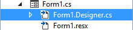  
  
 **Focused**  
  
 Background  
  
 <CodeContentPlaceHolder>323\</CodeContentPlaceHolder>  
  
 Foreground (Text)  
  
 <CodeContentPlaceHolder>324\</CodeContentPlaceHolder>  
  
 Foreground (Glyph)  
  
 <CodeContentPlaceHolder>325\</CodeContentPlaceHolder>  
  
 Border  
  
 <CodeContentPlaceHolder>326\</CodeContentPlaceHolder>  
  
 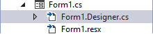  
  
 **Unfocused**  
  
 Background  
  
 <CodeContentPlaceHolder>327\</CodeContentPlaceHolder>  
  
 Foreground (Text)  
  
 <CodeContentPlaceHolder>328\</CodeContentPlaceHolder>  
  
 Foreground (Glyph)  
  
 <CodeContentPlaceHolder>329\</CodeContentPlaceHolder>  
  
 Border  
  
 None  
  
 **Hover over selected**  
  
 Component  
  
 Element  
  
 Token name: Category.color  
  
   
  
 **Focused**  
  
 Background  
  
 <CodeContentPlaceHolder>330\</CodeContentPlaceHolder>  
  
 Foreground (Text)  
  
 <CodeContentPlaceHolder>331\</CodeContentPlaceHolder>  
  
 Foreground (Glyph)  
  
 <CodeContentPlaceHolder>332\</CodeContentPlaceHolder>  
  
 Border  
  
 None<CodeContentPlaceHolder>333\</CodeContentPlaceHolder>  
  
   
  
 **Unfocused**  
  
 Background  
  
 <CodeContentPlaceHolder>334\</CodeContentPlaceHolder>  
  
 Foreground (Text)  
  
 <CodeContentPlaceHolder>335\</CodeContentPlaceHolder>  
  
 Foreground (Glyph)  
  
 <CodeContentPlaceHolder>336\</CodeContentPlaceHolder>  
  
 Border  
  
 None  
  
### Button controls  
   
  
 Use …  
 for buttons in the document well that you want to integrate with Visual Studio themes (Light, Dark, Blue, or a system High Contrast theme).  
  
 Do not use …  
 for buttons that will display against a custom background that is not part of a Visual Studio theme.  
  
 **Default**  
  
 Component  
  
 Element  
  
 Token name: Category.color  
  
   
  
 Button  
  
 <CodeContentPlaceHolder>337\</CodeContentPlaceHolder>  
  
 Button border  
  
 <CodeContentPlaceHolder>338\</CodeContentPlaceHolder>  
  
 **Disabled**  
  
 Component  
  
 Element  
  
 Token name: Category.color  
  
   
  
 Button  
  
 <CodeContentPlaceHolder>339\</CodeContentPlaceHolder>  
  
 Button border  
  
 <CodeContentPlaceHolder>340\</CodeContentPlaceHolder>  
  
 **Hover**  
  
 Component  
  
 Element  
  
 Token name: Category.color  
  
   
  
 Button  
  
 <CodeContentPlaceHolder>341\</CodeContentPlaceHolder>  
  
 Button border  
  
 <CodeContentPlaceHolder>342\</CodeContentPlaceHolder>  
  
 **Pressed**  
  
 Component  
  
 Element  
  
 Token name: Category.color  
  
 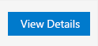  
  
 Button  
  
 <CodeContentPlaceHolder>343\</CodeContentPlaceHolder>  
  
 Button border  
  
 <CodeContentPlaceHolder>344\</CodeContentPlaceHolder>  
  
 **Focused**  
  
 Component  
  
 Element  
  
 Token name: Category.color  
  
   
  
 Button  
  
 <CodeContentPlaceHolder>345\</CodeContentPlaceHolder>  
  
 Button border  
  
 <CodeContentPlaceHolder>346\</CodeContentPlaceHolder>  
  
### Check box controls  
   
  
 Use …  
 for check box controls contained within the document well.  
  
 Do not use …  
 for any UI that is not a check box control.  
  
 **Default**  
  
 Component  
  
 Element  
  
 Token name: Category.color  
  
 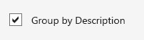  
  
 Background  
  
 <CodeContentPlaceHolder>347\</CodeContentPlaceHolder>  
  
 Border  
  
 <CodeContentPlaceHolder>348\</CodeContentPlaceHolder>  
  
 Text  
  
 <CodeContentPlaceHolder>349\</CodeContentPlaceHolder>  
  
 Glyph  
  
 <CodeContentPlaceHolder>350\</CodeContentPlaceHolder>  
  
 **Disabled**  
  
 Component  
  
 Element  
  
 Token name: Category.color  
  
   
  
 Background  
  
 <CodeContentPlaceHolder>351\</CodeContentPlaceHolder>  
  
 Border  
  
 <CodeContentPlaceHolder>352\</CodeContentPlaceHolder>  
  
 Text  
  
 <CodeContentPlaceHolder>353\</CodeContentPlaceHolder>  
  
 Glyph  
  
 <CodeContentPlaceHolder>354\</CodeContentPlaceHolder>  
  
 **Hover**  
  
 Component  
  
 Element  
  
 Token name: Category.color  
  
   
  
 Background  
  
 <CodeContentPlaceHolder>355\</CodeContentPlaceHolder>  
  
 Border  
  
 <CodeContentPlaceHolder>356\</CodeContentPlaceHolder>  
  
 Text  
  
 <CodeContentPlaceHolder>357\</CodeContentPlaceHolder>  
  
 Glyph  
  
 <CodeContentPlaceHolder>358\</CodeContentPlaceHolder>  
  
 **Pressed**  
  
 Component  
  
 Element  
  
 Token name: Category.color  
  
   
  
 Background  
  
 <CodeContentPlaceHolder>359\</CodeContentPlaceHolder>  
  
 Border  
  
 <CodeContentPlaceHolder>360\</CodeContentPlaceHolder>  
  
 Text  
  
 <CodeContentPlaceHolder>361\</CodeContentPlaceHolder>  
  
 Glyph  
  
 <CodeContentPlaceHolder>362\</CodeContentPlaceHolder>  
  
 **Focused**  
  
 Component  
  
 Element  
  
 Token name: Category.color  
  
   
  
 Background  
  
 <CodeContentPlaceHolder>363\</CodeContentPlaceHolder>  
  
 Border  
  
 <CodeContentPlaceHolder>364\</CodeContentPlaceHolder>  
  
 Text  
  
 <CodeContentPlaceHolder>365\</CodeContentPlaceHolder>  
  
 Glyph  
  
 <CodeContentPlaceHolder>366\</CodeContentPlaceHolder>  
  
### Drop box/combo box controls  
   
  
 Use …  
 for drop-downs and combo boxes that are part of the document well.  
  
 Do not use …  
 -   for any UI that is not a drop-down or combo box.  
  
-   for a [Drop-down](../Topic/Shared%20colors.md#BKMK_CommandDropDown) or [Combo box](../Topic/Shared%20colors.md#BKMK_CommandComboBox) in the command bar.  
  
 **Default**  
  
 Component  
  
 Element  
  
 Token name: Category.color  
  
   
  
 Background  
  
 <CodeContentPlaceHolder>367\</CodeContentPlaceHolder>  
  
 Border  
  
 <CodeContentPlaceHolder>368\</CodeContentPlaceHolder>  
  
 Text  
  
 <CodeContentPlaceHolder>369\</CodeContentPlaceHolder>  
  
 Separator  
  
 <CodeContentPlaceHolder>370\</CodeContentPlaceHolder>  
  
 Glyph  
  
 <CodeContentPlaceHolder>371\</CodeContentPlaceHolder>  
  
 Glyph background  
  
 <CodeContentPlaceHolder>372\</CodeContentPlaceHolder>  
  
 **Disabled**  
  
 Component  
  
 Element  
  
 Token name: Category.color  
  
   
  
 Background  
  
 <CodeContentPlaceHolder>373\</CodeContentPlaceHolder>  
  
 Border  
  
 <CodeContentPlaceHolder>374\</CodeContentPlaceHolder>  
  
 Text  
  
 <CodeContentPlaceHolder>375\</CodeContentPlaceHolder>  
  
 Separator  
  
 <CodeContentPlaceHolder>376\</CodeContentPlaceHolder>  
  
 Glyph  
  
 <CodeContentPlaceHolder>377\</CodeContentPlaceHolder>  
  
 Glyph background  
  
 <CodeContentPlaceHolder>378\</CodeContentPlaceHolder>  
  
 **Hover**  
  
 Component  
  
 Element  
  
 Token name: Category.color  
  
   
  
 Background  
  
 <CodeContentPlaceHolder>379\</CodeContentPlaceHolder>  
  
 Border  
  
 <CodeContentPlaceHolder>380\</CodeContentPlaceHolder>  
  
 Text  
  
 <CodeContentPlaceHolder>381\</CodeContentPlaceHolder>  
  
 Separator  
  
 <CodeContentPlaceHolder>382\</CodeContentPlaceHolder>  
  
 Glyph  
  
 <CodeContentPlaceHolder>383\</CodeContentPlaceHolder>  
  
 Glyph background  
  
 <CodeContentPlaceHolder>384\</CodeContentPlaceHolder>  
  
 **Pressed**  
  
 Component  
  
 Element  
  
 Token name: Category.color  
  
 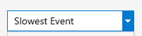  
  
 Background  
  
 <CodeContentPlaceHolder>385\</CodeContentPlaceHolder>  
  
 Border  
  
 <CodeContentPlaceHolder>386\</CodeContentPlaceHolder>  
  
 Text  
  
 <CodeContentPlaceHolder>387\</CodeContentPlaceHolder>  
  
 Separator  
  
 <CodeContentPlaceHolder>388\</CodeContentPlaceHolder>  
  
 Glyph  
  
 <CodeContentPlaceHolder>389\</CodeContentPlaceHolder>  
  
 Glyph background  
  
 <CodeContentPlaceHolder>390\</CodeContentPlaceHolder>  
  
 **Focused**  
  
 Component  
  
 Element  
  
 Token name: Category.color  
  
 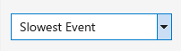  
  
 Background  
  
 <CodeContentPlaceHolder>391\</CodeContentPlaceHolder>  
  
 Border  
  
 <CodeContentPlaceHolder>392\</CodeContentPlaceHolder>  
  
 Text  
  
 <CodeContentPlaceHolder>393\</CodeContentPlaceHolder>  
  
 Separator  
  
 <CodeContentPlaceHolder>394\</CodeContentPlaceHolder>  
  
 Glyph  
  
 <CodeContentPlaceHolder>395\</CodeContentPlaceHolder>  
  
 Glyph background  
  
 <CodeContentPlaceHolder>396\</CodeContentPlaceHolder>  
  
 **Text input selection**  
  
 Component  
  
 Element  
  
 Token name: Category.color  
  
   
  
 Highlight  
  
 <CodeContentPlaceHolder>397\</CodeContentPlaceHolder>  
  
 **Pressed – List item view**  
  
   
  
 Background  
  
 <CodeContentPlaceHolder>398\</CodeContentPlaceHolder>  
  
 <CodeContentPlaceHolder>399\</CodeContentPlaceHolder>  
  
 <CodeContentPlaceHolder>400\</CodeContentPlaceHolder>  
  
 <CodeContentPlaceHolder>401\</CodeContentPlaceHolder>  
  
 Border  
  
 <CodeContentPlaceHolder>402\</CodeContentPlaceHolder>  
  
 <CodeContentPlaceHolder>403\</CodeContentPlaceHolder>  
  
 <CodeContentPlaceHolder>404\</CodeContentPlaceHolder>  
  
 <CodeContentPlaceHolder>405\</CodeContentPlaceHolder>  
  
 Item text  
  
 <CodeContentPlaceHolder>406\</CodeContentPlaceHolder>  
  
 <CodeContentPlaceHolder>407\</CodeContentPlaceHolder>  
  
 <CodeContentPlaceHolder>408\</CodeContentPlaceHolder>  
  
 <CodeContentPlaceHolder>409\</CodeContentPlaceHolder>  
  
 Background shadow  
  
 <CodeContentPlaceHolder>410\</CodeContentPlaceHolder>  
  
### Tabular data (grid) controls  
 Tabular data controls, also known as grid controls, are common controls for Visual Studio that can be used to present large amounts of data in multiple columns. Standard tabular data controls can be found in multiple places within Visual Studio: the Error List tool window, IntelliTrace reports, and memory heap view, among others. Always use the standard tabular data controls provided. In some rare instances, you might not have access to the standard tabular data controls. In these situations, use the following token names to ensure that your UI is consistent with other tabular data controls in Visual Studio.  
  
   
  
 Use …  
 for tabular or grid controls.  
  
 Do not use …  
 for any UI that is not a tabular or grid control.  
  
#### Column headers  
 Column headers consist of a background, a border, the title text, and an optional glyph usually used when a grid is sorted by that column.  
  
 State  
  
 Element  
  
 Token name: Category.color  
  
 Default  
  
 Background  
  
 <CodeContentPlaceHolder>411\</CodeContentPlaceHolder>  
  
 Foreground (Text)  
  
 <CodeContentPlaceHolder>412\</CodeContentPlaceHolder>  
  
 Foreground (Glyph)  
  
 <CodeContentPlaceHolder>413\</CodeContentPlaceHolder>  
  
 Border  
  
 <CodeContentPlaceHolder>414\</CodeContentPlaceHolder>  
  
 Hover  
  
 Background  
  
 <CodeContentPlaceHolder>415\</CodeContentPlaceHolder>  
  
 Foreground (Text)  
  
 <CodeContentPlaceHolder>416\</CodeContentPlaceHolder>  
  
 Foreground (Glyph)  
  
 <CodeContentPlaceHolder>417\</CodeContentPlaceHolder>  
  
 Border  
  
 <CodeContentPlaceHolder>418\</CodeContentPlaceHolder>  
  
 Pressed  
  
 Background  
  
 <CodeContentPlaceHolder>419\</CodeContentPlaceHolder>  
  
 Foreground (Text)  
  
 <CodeContentPlaceHolder>420\</CodeContentPlaceHolder>  
  
 Foreground (Glyph)  
  
 <CodeContentPlaceHolder>421\</CodeContentPlaceHolder>  
  
 Border  
  
 <CodeContentPlaceHolder>422\</CodeContentPlaceHolder>  
  
#### List view items  
 List view items consist of a background and the content. The content can be text, an icon, or both.  
  
 State  
  
 Element  
  
 Token name: Category.color  
  
 Default  
  
 Background  
  
 Transparent  
  
 Foreground (Text)  
  
 <CodeContentPlaceHolder>423\</CodeContentPlaceHolder>  
  
 Border  
  
 None  
  
 Selected (active)  
  
 Background  
  
 <CodeContentPlaceHolder>424\</CodeContentPlaceHolder>  
  
 Foreground (Text)  
  
 <CodeContentPlaceHolder>425\</CodeContentPlaceHolder>  
  
 Border  
  
 None  
  
 Selected (inactive)  
  
 Background  
  
 <CodeContentPlaceHolder>426\</CodeContentPlaceHolder>  
  
 Foreground (Text)  
  
 <CodeContentPlaceHolder>427\</CodeContentPlaceHolder>  
  
 Border  
  
 None  
  
## Manifest Designer  
 The Manifest Designer was designed as a way to make it easier to edit the manifest file in Windows 8 and Windows Phone 8 projects. While there is no shared framework available for consumption, it might be appropriate for you to match the design layout and colors of the orientation/navigation tabs and overall structure. For more information about layout details, see [Layout for Visual Studio](../vs140/layout-for-visual-studio.md).  
  
 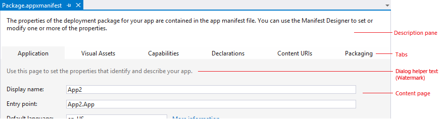  
  
 Use …  
 -   for designers that are similar to the Manifest Designer.  
  
-   in place of using common tab controls at the top of an editor within the document well.  
  
 Do not use …  
 -   if you have more than six tabs.  
  
-   for any UI that is not structured like the Manifest Designer.  
  
 State  
  
 Component  
  
 Element  
  
 Token name: Category.color  
  
 Default (selected)  
  
 Tab  
  
 Background  
  
 <CodeContentPlaceHolder>428\</CodeContentPlaceHolder>  
  
 Border  
  
 None  
  
 Description pane  
  
 Background  
  
 <CodeContentPlaceHolder>429\</CodeContentPlaceHolder>  
  
 Content page  
  
 Background  
  
 <CodeContentPlaceHolder>430\</CodeContentPlaceHolder>  
  
 Dialog helper text  
  
 <CodeContentPlaceHolder>431\</CodeContentPlaceHolder>  
  
 This token name does not match its function.  
  
 Non-selected  
  
 Tab  
  
 Background  
  
 <CodeContentPlaceHolder>432\</CodeContentPlaceHolder>  
  
 Hover  
  
 Tab  
  
 Background  
  
 <CodeContentPlaceHolder>433\</CodeContentPlaceHolder>  
  
## Tagging  
 Visual Studio supports tagging, which allows a user to declare searchable keywords for tracking purposes. For example, project managers and developers can use Team Foundation Server (TFS) to tag work items. The tables below give color names for both the tag itself and the "close icon" glyph that appears in hover and selected states.  
  
   
  
 Use …  
 for UI that supports tagging.  
  
 Do not use …  
 for any other type of UI.  
  
### Tag  
 Component  
  
 Element  
  
 Token name: Category.color  
  
   
  
 **Default**  
  
 Background  
  
 <CodeContentPlaceHolder>434\</CodeContentPlaceHolder>  
  
 Foreground (Text)  
  
 <CodeContentPlaceHolder>435\</CodeContentPlaceHolder>  
  
 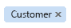  
  
 **Hover**  
  
 Background  
  
 <CodeContentPlaceHolder>436\</CodeContentPlaceHolder>  
  
 Foreground (Text)  
  
 <CodeContentPlaceHolder>437\</CodeContentPlaceHolder>  
  
   
  
 **Pressed**  
  
 Background  
  
 <CodeContentPlaceHolder>438\</CodeContentPlaceHolder>  
  
 Foreground (Text)  
  
 <CodeContentPlaceHolder>439\</CodeContentPlaceHolder>  
  
   
  
 **Selected**  
  
 Background  
  
 <CodeContentPlaceHolder>440\</CodeContentPlaceHolder>  
  
 Foreground (Text)  
  
 <CodeContentPlaceHolder>441\</CodeContentPlaceHolder>  
  
### Glyph (close icon)  
 **Default**  
  
 Component  
  
 Element  
  
 Token name: Category.color  
  
   
  
 **Default (tag default)**  
  
 Background  
  
 N/A  
  
 Foreground (Glyph)  
  
 <CodeContentPlaceHolder>442\</CodeContentPlaceHolder>  
  
 **Hover**  
  
 Component  
  
 Element  
  
 Token name: Category.color  
  
   
  
 **Hover (tag default)**  
  
 Background  
  
 <CodeContentPlaceHolder>443\</CodeContentPlaceHolder>  
  
 Foreground (Glyph)  
  
 <CodeContentPlaceHolder>444\</CodeContentPlaceHolder>  
  
 Border  
  
 <CodeContentPlaceHolder>445\</CodeContentPlaceHolder>  
  
 **Pressed**  
  
 Component  
  
 Element  
  
 Token name: Category.color  
  
   
  
 **Pressed (tag default)**  
  
 Background  
  
 <CodeContentPlaceHolder>446\</CodeContentPlaceHolder>  
  
 Foreground (Glyph)  
  
 <CodeContentPlaceHolder>447\</CodeContentPlaceHolder>  
  
 Border  
  
 <CodeContentPlaceHolder>448\</CodeContentPlaceHolder>  
  
 **Tag selected/glyph default**  
  
 Component  
  
 Element  
  
 Token name: Category.color  
  
   
  
 **Default (tag selected)**  
  
 Background  
  
 N/A  
  
 Foreground (Glyph)  
  
 <CodeContentPlaceHolder>449\</CodeContentPlaceHolder>  
  
 **Tag selected/glyph hover**  
  
 Component  
  
 Element  
  
 Token name: Category.color  
  
   
  
 **Hover (tag selected)**  
  
 Background  
  
 <CodeContentPlaceHolder>450\</CodeContentPlaceHolder>  
  
 Foreground (Glyph)  
  
 <CodeContentPlaceHolder>451\</CodeContentPlaceHolder>  
  
 Border  
  
 <CodeContentPlaceHolder>452\</CodeContentPlaceHolder>  
  
 **Tag selected/glyph pressed**  
  
 Component  
  
 Element  
  
 Token name: Category.color  
  
   
  
 **Pressed (tag selected)**  
  
 Background  
  
 <CodeContentPlaceHolder>453\</CodeContentPlaceHolder>  
  
 Foreground(Glyph)  
  
 <CodeContentPlaceHolder>454\</CodeContentPlaceHolder>  
  
 Border  
  
 <CodeContentPlaceHolder>455\</CodeContentPlaceHolder>  
  
## Shell  
  
### Background  
 The environment background consists of two layers. The bottom layer is a solid color that covers the entire IDE. The top layer fits under the command shelf and between the tool window auto-hide channels on the left and right edges of the IDE. As of Visual Studio 2013, the top and bottom background layers are set to the same color in the Light and Dark themes.  
  
   
  
 Use …  
 for places that you want to match the background of the Visual Studio environment.  
  
 Do not use …  
 -   as a fill for places that are not background surfaces.  
  
-   as a background on which you wish to place foreground elements.  
  
 Component  
  
 Element  
  
 Token name: Category.color  
  
 Bottom layer  
  
 Background  
  
 <CodeContentPlaceHolder>456\</CodeContentPlaceHolder>  
  
 Component  
  
 Element  
  
 Token name: Category.color  
  
 Top layer  
  
 Background  
  
 *Gradient stops set to the same color value in Visual Studio 2013 Light and Dark themes.*  
  
 <CodeContentPlaceHolder>457\</CodeContentPlaceHolder>  
  
 <CodeContentPlaceHolder>458\</CodeContentPlaceHolder>  
  
 <CodeContentPlaceHolder>459\</CodeContentPlaceHolder>  
  
 <CodeContentPlaceHolder>460\</CodeContentPlaceHolder>  
  
### Command shelf  
 Two sets of token names are used for the command shelf backgrounds: one set for where the menu bar sits and one for where the command bars sit. An individual command bar group has its own background color values, which are discussed in more detail in the "command bar" section. Menu bar and command bar text is discussed in the menu and command bar sections, respectively.  
  
   
  
 Use …  
 -   for areas where you place menus or toolbars.  
  
-   with the correct background/?foreground token name combination.  
  
 Do not use …  
 for areas that are not similar to a command shelf.  
  
 Component  
  
 Element  
  
 Token name: Category.color  
  
 Menu bar  
  
 Background  
  
 *Gradient stops set to the same color value in Visual Studio 2013 Light and Dark themes.*  
  
 <CodeContentPlaceHolder>461\</CodeContentPlaceHolder>  
  
 <CodeContentPlaceHolder>462\</CodeContentPlaceHolder>  
  
 <CodeContentPlaceHolder>463\</CodeContentPlaceHolder>  
  
 Command bar  
  
 Background  
  
 *Gradient stops set to the same color value in Visual Studio 2013 Light and Dark themes.*  
  
 <CodeContentPlaceHolder>464\</CodeContentPlaceHolder>  
  
 <CodeContentPlaceHolder>465\</CodeContentPlaceHolder>  
  
 <CodeContentPlaceHolder>466\</CodeContentPlaceHolder>  
  
## Toolbox  
 The toolbox is one of the common tool windows that is most frequently used in Visual Studio. It is essentially a tree control with a special theme and styling applied.  
  
   
  
 Use …  
 when you are designing a tool window that you want to always be consistent with the shell toolbox.  
  
 Do not use …  
 for anything that is not similar to the toolbox UI, or if you are unsure whether your UI will have problems if the shell toolbox colors change.  
  
 **Default**  
  
 Component  
  
 Element  
  
 Token name: Category.color  
  
   
  
 **Parent node**  
  
   
  
 **Child node**  
  
 Background  
  
 <CodeContentPlaceHolder>467\</CodeContentPlaceHolder>  
  
 Headings  
  
 <CodeContentPlaceHolder>468\</CodeContentPlaceHolder>  
  
 Individual items, or entire window if no available controls  
  
 Border  
  
 None  
  
 Foreground (Glyph)  
  
 <CodeContentPlaceHolder>469\</CodeContentPlaceHolder>  
  
 Foreground (Text)  
  
 <CodeContentPlaceHolder>470\</CodeContentPlaceHolder>  
  
 **Hover**  
  
 Component  
  
 Element  
  
 Token name: Category.color  
  
   
  
 **Toolbox hover on child node**  
  
 Background  
  
 <CodeContentPlaceHolder>471\</CodeContentPlaceHolder>  
  
 Individual items only  
  
 Border  
  
 None  
  
 Foreground (Text)  
  
 <CodeContentPlaceHolder>472\</CodeContentPlaceHolder>  
  
 Individual items only  
  
 **Selected**  
  
 Component  
  
 Element  
  
 Token name: Category.color  
  
   
  
 **Focused parent node**  
  
   
  
 **Focused child node**  
  
 Background  
  
 <CodeContentPlaceHolder>473\</CodeContentPlaceHolder>  
  
 From [Tree view](../vs140/shared-colors-for-visual-studio.md#BKMK_TreeView) category  
  
 Border  
  
 <CodeContentPlaceHolder>474\</CodeContentPlaceHolder>  
  
 From [Tree view](../vs140/shared-colors-for-visual-studio.md#BKMK_TreeView) category  
  
 Foreground (Glyph)  
  
 <CodeContentPlaceHolder>475\</CodeContentPlaceHolder>  
  
 From [Tree view](../vs140/shared-colors-for-visual-studio.md#BKMK_TreeView) category  
  
 Foreground (Text)  
  
 <CodeContentPlaceHolder>476\</CodeContentPlaceHolder>  
  
 From [Tree view](../vs140/shared-colors-for-visual-studio.md#BKMK_TreeView) category  
  
   
  
 **Unfocused parent node**  
  
   
  
 **Unfocused child node**  
  
 Background  
  
 <CodeContentPlaceHolder>477\</CodeContentPlaceHolder>  
  
 From [Tree view](../vs140/shared-colors-for-visual-studio.md#BKMK_TreeView) category  
  
 Border  
  
 None  
  
 Foreground (Glyph)  
  
 <CodeContentPlaceHolder>478\</CodeContentPlaceHolder>  
  
 From [Tree view](../vs140/shared-colors-for-visual-studio.md#BKMK_TreeView) category  
  
 Foreground (Text)  
  
 <CodeContentPlaceHolder>479\</CodeContentPlaceHolder>  
  
 From [Tree view](../vs140/shared-colors-for-visual-studio.md#BKMK_TreeView) category