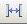
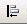
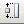
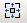

# Showing or Hiding the Dialog Editor Toolbar
When you open the Dialog editor, the Dialog Editor toolbar automatically appears at the top of your solution.  
  
### Dialog Editor Toolbar  
  
|Icon|Meaning|Icon|Meaning|  
|----------|-------------|----------|-------------|  
||Test Dialog||Across|  
||Align Lefts||Down|  
||Align Rights||Make Same Width|  
||Align Tops||Make Same Height|  
||Align Bottoms||Make Same Size|  
||Vertical||Toggle Grid|  
||Horizontal||Toggle Guides|  
  
 The Dialog Editor toolbar contains buttons for arranging the layout of controls on the dialog box, for example size and alignment. Dialog Editor toolbar buttons correspond to commands on the Format menu. For details, see [Accelerator Keys for the Dialog Editor](../vs140/accelerator-keys-for-the-dialog-editor.md).  
  
 When you are in the Dialog editor, you can toggle the display of the Dialog Editor toolbar by selecting it from the list of available toolbars and windows.  
  
### To show or hide the dialog editor toolbar  
  
1.  On the **View** menu click **Toolbars** then choose **Dialog Editor** from the submenu.  
  
    > [!NOTE]
    >  The Dialog Editor toolbar is displayed by default when you open a dialog box resource in the Dialog editor; however, if you explicitly close the toolbar, you will need to invoke it the next time you open a dialog box resource.  
  
 For information on adding resources to managed projects, please see [Resources in Applications](assetId:///8ad495d4-2941-40cf-bf64-e82e85825890) in the *.NET Framework Developer's Guide.* For information on manually adding resource files to managed projects, accessing resources, displaying static resources, and assigning resources strings to properties, see [Walkthrough: Localizing Windows Forms](assetId:///9a96220d-a19b-4de0-9f48-01e5d82679e5) and [Walkthrough: Using Resources for Localization with ASP.NET](assetId:///bb4e5b44-e2b0-48ab-bbe9-609fb33900b6).  
  
 Requirements  
  
 Win32  
  
## See Also  
 [Arrangement of Controls on Dialog Boxes](../vs140/arrangement-of-controls-on-dialog-boxes.md)   
 [How to: Create a Resource](../vs140/how-to--create-a-resource.md)   
 [Resource Files](../vs140/resource-files--visual-studio-.md)   
 [Dialog Editor](../vs140/dialog-editor.md)