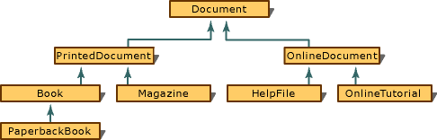

# Single Inheritance
In "single inheritance," a common form of inheritance, classes have only one base class. Consider the relationship illustrated in the following figure.  
  
   
Simple Single-Inheritance Graph  
  
 Note the progression from general to specific in the figure. Another common attribute found in the design of most class hierarchies is that the derived class has a "kind of" relationship with the base class. In the figure, a <CodeContentPlaceHolder>5\</CodeContentPlaceHolder> is a kind of a <CodeContentPlaceHolder>6\</CodeContentPlaceHolder>, and a <CodeContentPlaceHolder>7\</CodeContentPlaceHolder> is a kind of a <CodeContentPlaceHolder>8\</CodeContentPlaceHolder>.  
  
 One other item of note in the figure: <CodeContentPlaceHolder>9\</CodeContentPlaceHolder> is both a derived class (from <CodeContentPlaceHolder>10\</CodeContentPlaceHolder>) and a base class (<CodeContentPlaceHolder>11\</CodeContentPlaceHolder> is derived from <CodeContentPlaceHolder>12\</CodeContentPlaceHolder>). A skeletal declaration of such a class hierarchy is shown in the following example:  
  
<CodeContentPlaceHolder>0\</CodeContentPlaceHolder>  
 <CodeContentPlaceHolder>13\</CodeContentPlaceHolder> is considered a "direct base" class to <CodeContentPlaceHolder>14\</CodeContentPlaceHolder>; it is an "indirect base" class to <CodeContentPlaceHolder>15\</CodeContentPlaceHolder>. The difference is that a direct base class appears in the base list of a class declaration and an indirect base does not.  
  
 The base class from which each class is derived is declared before the declaration of the derived class. It is not sufficient to provide a forward-referencing declaration for a base class; it must be a complete declaration.  
  
 In the preceding example, the access specifier **public** is used. The meaning of public, protected, and private inheritance is described in [Member-Access Control.](../vs140/member-access-control--c---.md)  
  
 A class can serve as the base class for many specific classes, as illustrated in the following figure.  
  
   
Sample of Directed Acyclic Graph  
  
 In the diagram shown above, called a "directed acyclic graph" (or "DAG"), some of the classes are base classes for more than one derived class. However, the reverse is not true: there is only one direct base class for any given derived class. The graph in the figure depicts a "single inheritance" structure.  
  
> [!NOTE]
>  Directed acyclic graphs are not unique to single inheritance. They are also used to depict multiple-inheritance graphs. This topic is covered in [Multiple Inheritance](assetId:///3b74185e-2beb-4e29-8684-441e51d2a2ca).  
  
 In inheritance, the derived class contains the members of the base class plus any new members you add. As a result, a derived class can refer to members of the base class (unless those members are redefined in the derived class). The scope-resolution operator (<CodeContentPlaceHolder>16\</CodeContentPlaceHolder>) can be used to refer to members of direct or indirect base classes when those members have been redefined in the derived class. Consider this example:  
  
<CodeContentPlaceHolder>1\</CodeContentPlaceHolder>  
 Note that the constructor for <CodeContentPlaceHolder>17\</CodeContentPlaceHolder>, (<CodeContentPlaceHolder>18\</CodeContentPlaceHolder>), has access to the data member, <CodeContentPlaceHolder>19\</CodeContentPlaceHolder>. In a program, an object of type <CodeContentPlaceHolder>20\</CodeContentPlaceHolder> can be created and used as follows:  
  
<CodeContentPlaceHolder>2\</CodeContentPlaceHolder>  
 As the preceding example demonstrates, class-member and inherited data and functions are used identically. If the implementation for class <CodeContentPlaceHolder>21\</CodeContentPlaceHolder> calls for a reimplementation of the <CodeContentPlaceHolder>22\</CodeContentPlaceHolder> function, the function that belongs to the <CodeContentPlaceHolder>23\</CodeContentPlaceHolder> class can be called only by using the scope-resolution (<CodeContentPlaceHolder>24\</CodeContentPlaceHolder>) operator:  
  
<CodeContentPlaceHolder>3\</CodeContentPlaceHolder>  
 Pointers and references to derived classes can be implicitly converted to pointers and references to their base classes if there is an accessible, unambiguous base class. The following code demonstrates this concept using pointers (the same principle applies to references):  
  
<CodeContentPlaceHolder>4\</CodeContentPlaceHolder>  
 In the preceding example, different types are created. However, because these types are all derived from the <CodeContentPlaceHolder>25\</CodeContentPlaceHolder> class, there is an implicit conversion to <CodeContentPlaceHolder>26\</CodeContentPlaceHolder>. As a result, <CodeContentPlaceHolder>27\</CodeContentPlaceHolder> is a "heterogeneous list" (a list in which not all objects are of the same type) containing different kinds of objects.  
  
 Because the <CodeContentPlaceHolder>28\</CodeContentPlaceHolder> class has a <CodeContentPlaceHolder>29\</CodeContentPlaceHolder> function, it can print the name of each book in the library, although it may omit some of the information specific to the type of document (page count for <CodeContentPlaceHolder>30\</CodeContentPlaceHolder>, number of bytes for <CodeContentPlaceHolder>31\</CodeContentPlaceHolder>, and so on).  
  
> [!NOTE]
>  Forcing the base class to implement a function such as <CodeContentPlaceHolder>32\</CodeContentPlaceHolder> is often not the best design. [Virtual Functions](../vs140/virtual-functions.md) offers other design alternatives.  
  
## See Also  
 [Overview of Derived Classes](../vs140/overview-of-derived-classes.md)   
 [(NOTINBUILD) Multiple Inheritance](assetId:///3b74185e-2beb-4e29-8684-441e51d2a2ca)