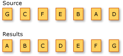

# Sorting Data (C#)
A sorting operation orders the elements of a sequence based on one or more attributes. The first sort criterion performs a primary sort on the elements. By specifying a second sort criterion, you can sort the elements within each primary sort group.  
  
 The following illustration shows the results of an alphabetical sort operation on a sequence of characters.  
  
   
  
 The standard query operator methods that sort data are listed in the following section.  
  
## Methods  
  
|Method Name|Description|C# Query Expression Syntax|More Information|  
|-----------------|-----------------|---------------------------------|----------------------|  
|OrderBy|Sorts values in ascending order.|<CodeContentPlaceHolder>4\</CodeContentPlaceHolder>|\<xref:System.Linq.Enumerable.OrderBy*?displayProperty=fullName>\ \  \<xref:System.Linq.Queryable.OrderBy*?displayProperty=fullName>|  
|OrderByDescending|Sorts values in descending order.|<CodeContentPlaceHolder>5\</CodeContentPlaceHolder>|\<xref:System.Linq.Enumerable.OrderByDescending*?displayProperty=fullName>\ \  \<xref:System.Linq.Queryable.OrderByDescending*?displayProperty=fullName>|  
|ThenBy|Performs a secondary sort in ascending order.|<CodeContentPlaceHolder>6\</CodeContentPlaceHolder>|\<xref:System.Linq.Enumerable.ThenBy*?displayProperty=fullName>\ \  \<xref:System.Linq.Queryable.ThenBy*?displayProperty=fullName>|  
|ThenByDescending|Performs a secondary sort in descending order.|<CodeContentPlaceHolder>7\</CodeContentPlaceHolder>|\<xref:System.Linq.Enumerable.ThenByDescending*?displayProperty=fullName>\ \  \<xref:System.Linq.Queryable.ThenByDescending*?displayProperty=fullName>|  
|Reverse|Reverses the order of the elements in a collection.|Not applicable.|\<xref:System.Linq.Enumerable.Reverse*?displayProperty=fullName>\ \  \<xref:System.Linq.Queryable.Reverse*?displayProperty=fullName>|  
  
## Query Expression Syntax Examples  
  
### Primary Sort Examples  
  
#### Primary Ascending Sort  
 The following example demonstrates how to use the <CodeContentPlaceHolder>8\</CodeContentPlaceHolder> clause in a LINQ query to sort the strings in an array by string length, in ascending order.  
  
<CodeContentPlaceHolder>0\</CodeContentPlaceHolder>  
#### Primary Descending Sort  
 The next example demonstrates how to use the <CodeContentPlaceHolder>9\</CodeContentPlaceHolder> clause in a LINQ query to sort the strings by their first letter, in descending order.  
  
<CodeContentPlaceHolder>1\</CodeContentPlaceHolder>  
### Secondary Sort Examples  
  
#### Secondary Ascending Sort  
 The following example demonstrates how to use the <CodeContentPlaceHolder>10\</CodeContentPlaceHolder> clause in a LINQ query to perform a primary and secondary sort of the strings in an array. The strings are sorted primarily by length and secondarily by the first letter of the string, both in ascending order.  
  
<CodeContentPlaceHolder>2\</CodeContentPlaceHolder>  
#### Secondary Descending Sort  
 The next example demonstrates how to use the <CodeContentPlaceHolder>11\</CodeContentPlaceHolder> clause in a LINQ query to perform a primary sort, in ascending order, and a secondary sort, in descending order. The strings are sorted primarily by length and secondarily by the first letter of the string.  
  
<CodeContentPlaceHolder>3\</CodeContentPlaceHolder>  
## See Also  
 \<xref:System.Linq*>   
 [Standard Query Operators Overview (C#)](../vs140/standard-query-operators-overview--csharp-.md)   
 [orderby clause (C# Reference)](../vs140/orderby-clause--csharp-reference-.md)   
 [How to: Order the Results of a Join Clause (C# Programming Guide)](../vs140/how-to--order-the-results-of-a-join-clause--csharp-programming-guide-.md)   
 [How to: Sort or Filter Text Data by Any Word or Field (LINQ) (C#)](../vs140/how-to--sort-or-filter-text-data-by-any-word-or-field--linq---csharp-.md)