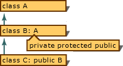

# Standard Conversions
The C++ language defines conversions between its fundamental types. It also defines conversions for pointer, reference, and pointer-to-member derived types. These conversions are called "standard conversions." (For more information about types, standard types, and derived types, see [Types](assetId:///6882ee83-ea32-4373-8d57-c3efbbc15af0).)  
  
 This section discusses the following standard conversions:  
  
-   Integral promotions  
  
-   Integral conversions  
  
-   Floating conversions  
  
-   Floating and integral conversions  
  
-   Arithmetic conversions  
  
-   Pointer conversions  
  
-   Reference conversions  
  
-   Pointer-to-member conversions  
  
    > [!NOTE]
    >  User-defined types can specify their own conversions. Conversion of user-defined types is covered in [Constructors](../vs140/constructors--c---.md) and [Conversions](../vs140/user-defined-type-conversions--c---.md).  
  
 The following code causes conversions (in this example, integral promotions):  
  
<CodeContentPlaceHolder>0\</CodeContentPlaceHolder>  
 The result of a conversion is an l-value only if it produces a reference type. For example, a user-defined conversion declared as <CodeContentPlaceHolder>8\</CodeContentPlaceHolder> returns a reference and is an l-value. However, a conversion declared as <CodeContentPlaceHolder>9\</CodeContentPlaceHolder>returns an object and is not an l-value.  
  
## Integral promotions  
 Objects of an integral type can be converted to another wider integral type (that is, a type that can represent a larger set of values). This widening type of conversion is called "integral promotion." With integral promotion, you can use the following in an expression wherever another integral type can be used:  
  
-   Objects, literals, and constants of type <CodeContentPlaceHolder>10\</CodeContentPlaceHolder> and <CodeContentPlaceHolder>11\</CodeContentPlaceHolder>  
  
-   Enumeration types  
  
-   <CodeContentPlaceHolder>12\</CodeContentPlaceHolder> bit fields  
  
-   Enumerators  
  
 C++ promotions are "value-preserving." That is, the value after the promotion is guaranteed to be the same as the value before the promotion. In value-preserving promotions, objects of shorter integral types (such as bit fields or objects of type <CodeContentPlaceHolder>13\</CodeContentPlaceHolder>) are promoted to type <CodeContentPlaceHolder>14\</CodeContentPlaceHolder> if <CodeContentPlaceHolder>15\</CodeContentPlaceHolder> can represent the full range of the original type. If <CodeContentPlaceHolder>16\</CodeContentPlaceHolder> cannot represent the full range of values, then the object is promoted to type <CodeContentPlaceHolder>17\</CodeContentPlaceHolder>. Although this strategy is the same as that used by ANSI C, value-preserving conversions do not preserve the "signedness" of the object.  
  
 Value-preserving promotions and promotions that preserve signedness normally produce the same results. However, they can produce different results if the promoted object is one of the following:  
  
-   An operand of **/**, <CodeContentPlaceHolder>18\</CodeContentPlaceHolder>, <CodeContentPlaceHolder>19\</CodeContentPlaceHolder>, <CodeContentPlaceHolder>20\</CodeContentPlaceHolder>, **<**, **\<=**, **>**, or **>=**  
  
     These operators rely on sign for determining the result. Therefore, value-preserving and sign-preserving promotions produce different results when applied to these operands.  
  
-   The left operand of **>>** or **>>=**  
  
     These operators treat signed and unsigned quantities differently when performing a shift operation. For signed quantities, shifting a quantity right causes the sign bit to be propagated into the vacated bit positions. For unsigned quantities, the vacated bit positions are zero-filled.  
  
-   An argument to an overloaded function or operand of an overloaded operator that depends on the signedness of the type of that operand for argument matching. (See [Overloaded Operators](../vs140/operator-overloading.md) for more about defining overloaded operators.)  
  
## Integral conversions  
 Integral conversions are performed between integral types. The integral types are <CodeContentPlaceHolder>21\</CodeContentPlaceHolder>, <CodeContentPlaceHolder>22\</CodeContentPlaceHolder>, and **long** (and the **short**, **signed**, and <CodeContentPlaceHolder>23\</CodeContentPlaceHolder> versions of these types).  
  
 **Signed to unsigned**  
  
 Objects of signed integral types can be converted to corresponding unsigned types. When these conversions occur, the actual bit pattern does not change; however, the interpretation of the data changes. Consider this code:  
  
<CodeContentPlaceHolder>1\</CodeContentPlaceHolder>  
 In the preceding example, a <CodeContentPlaceHolder>24\</CodeContentPlaceHolder>, <CodeContentPlaceHolder>25\</CodeContentPlaceHolder>, is defined and initialized to a negative number. The expression <CodeContentPlaceHolder>26\</CodeContentPlaceHolder> causes <CodeContentPlaceHolder>27\</CodeContentPlaceHolder> to be converted to an **unsigned short** prior to the assignment to <CodeContentPlaceHolder>28\</CodeContentPlaceHolder>.  
  
 **Unsigned to signed**  
  
 Objects of unsigned integral types can be converted to corresponding signed types. However, such a conversion can cause misinterpretation of data if the value of the unsigned object is outside the range representable by the signed type, as demonstrated in the following example:  
  
<CodeContentPlaceHolder>2\</CodeContentPlaceHolder>  
 In the preceding example, <CodeContentPlaceHolder>29\</CodeContentPlaceHolder> is an <CodeContentPlaceHolder>30\</CodeContentPlaceHolder> **short** integral object that must be converted to a signed quantity to evaluate the expression <CodeContentPlaceHolder>31\</CodeContentPlaceHolder>. Because its value cannot be properly represented in a <CodeContentPlaceHolder>32\</CodeContentPlaceHolder>, the data is misinterpreted as shown.  
  
## Floating point conversions  
 An object of a floating type can be safely converted to a more precise floating type — that is, the conversion causes no loss of significance. For example, conversions from **float** to **double** or from **double** to <CodeContentPlaceHolder>33\</CodeContentPlaceHolder> are safe, and the value is unchanged.  
  
 An object of a floating type can also be converted to a less precise type, if it is in a range representable by that type. (See [Floating Limits](../vs140/floating-limits.md) for the ranges of floating types.) If the original value cannot be represented precisely, it can be converted to either the next higher or the next lower representable value. If no such value exists, the result is undefined. Consider the following example:  
  
<CodeContentPlaceHolder>3\</CodeContentPlaceHolder>  
 The maximum value representable by type **float** is 3.402823466E38 — a much smaller number than 1E300. Therefore, the number is converted to infinity, and the result is 1.#INF.  
  
## Conversions between integral and floating point types  
 Certain expressions can cause objects of floating type to be converted to integral types, or vice versa. When an object of integral type is converted to a floating type and the original value cannot be represented exactly, the result is either the next higher or the next lower representable value.  
  
 When an object of floating type is converted to an integral type, the fractional part is truncated. No rounding takes place in the conversion process. Truncation means that a number like 1.3 is converted to 1, and –1.3 is converted to –1.  
  
## Arithmetic conversions  
 Many binary operators (discussed in [Expressions with Binary Operators](../vs140/expressions-with-binary-operators.md)) cause conversions of operands and yield results the same way. The way these operators cause conversions is called "usual arithmetic conversions." Arithmetic conversions of operands of different native types are performed as shown in the following table. Typedef types behave according to their underlying native types.  
  
### Conditions for Type Conversion  
  
|Conditions Met|Conversion|  
|--------------------|----------------|  
|Either operand is of type **long double**.|Other operand is converted to type **long double**.|  
|Preceding condition not met and either operand is of type **double**.|Other operand is converted to type **double**.|  
|Preceding conditions not met and either operand is of type **float**.|Other operand is converted to type **float**.|  
|Preceding conditions not met (none of the operands are of floating types).|Integral promotions are performed on the operands as follows:\ \  -   If either operand is of type <CodeContentPlaceHolder>34\</CodeContentPlaceHolder> **long**, the other operand is converted to type <CodeContentPlaceHolder>35\</CodeContentPlaceHolder>.\ -   If preceding condition not met, and if either operand is of type **long** and the other of type <CodeContentPlaceHolder>36\</CodeContentPlaceHolder> <CodeContentPlaceHolder>37\</CodeContentPlaceHolder>, both operands are converted to type <CodeContentPlaceHolder>38\</CodeContentPlaceHolder>.\ -   If the preceding two conditions are not met, and if either operand is of type **long**, the other operand is converted to type **long**.\ -   If the preceding three conditions are not met, and if either operand is of type <CodeContentPlaceHolder>39\</CodeContentPlaceHolder>, the other operand is converted to type <CodeContentPlaceHolder>40\</CodeContentPlaceHolder>.\ -   If none of the preceding conditions are met, both operands are converted to type <CodeContentPlaceHolder>41\</CodeContentPlaceHolder>.|  
  
 The following code illustrates the conversion rules described in the table:  
  
<CodeContentPlaceHolder>4\</CodeContentPlaceHolder>  
 The first statement in the preceding example shows multiplication of two integral types, <CodeContentPlaceHolder>42\</CodeContentPlaceHolder> and <CodeContentPlaceHolder>43\</CodeContentPlaceHolder>. The condition met is that neither operand is of floating type and one operand is of type <CodeContentPlaceHolder>44\</CodeContentPlaceHolder>. Therefore, the other operand, <CodeContentPlaceHolder>45\</CodeContentPlaceHolder>, is converted to type <CodeContentPlaceHolder>46\</CodeContentPlaceHolder>. The result is assigned to <CodeContentPlaceHolder>47\</CodeContentPlaceHolder>. The condition met is that one operand is of type **double**; therefore, the <CodeContentPlaceHolder>48\</CodeContentPlaceHolder> result of the multiplication is converted to type **double**.  
  
 The second statement in the preceding example shows addition of a **float** and an integral type, <CodeContentPlaceHolder>49\</CodeContentPlaceHolder> and <CodeContentPlaceHolder>50\</CodeContentPlaceHolder>. The <CodeContentPlaceHolder>51\</CodeContentPlaceHolder> variable is converted to type **float** (third condition in the table). The result of the addition is converted to type **double** (second condition in the table) and assigned to <CodeContentPlaceHolder>52\</CodeContentPlaceHolder>.  
  
## Pointer conversions  
 Pointers can be converted during assignment, initialization, comparison, and other expressions.  
  
### Pointer to classes  
 There are two cases in which a pointer to a class can be converted to a pointer to a base class.  
  
 The first case is when the specified base class is accessible and the conversion is unambiguous. (See [Multiple Base Classes](../vs140/multiple-base-classes.md) for more information about ambiguous base-class references.)  
  
 Whether a base class is accessible depends on the kind of inheritance used in derivation. Consider the inheritance illustrated in the following figure.  
  
   
Inheritance Graph for Illustration of Base-Class Accessibility  
  
 The following table shows the base-class accessibility for the situation illustrated in the figure.  
  
### Base-Class Accessibility  
  
|Type of Function|Derivation|Conversion from\ \  B* to A\* Legal?|  
|----------------------|----------------|-------------------------------------------|  
|External (not class-scoped) function|Private|No|  
||Protected|No|  
||Public|Yes|  
|B member function (in B scope)|Private|Yes|  
||Protected|Yes|  
||Public|Yes|  
|C member function (in C scope)|Private|No|  
||Protected|Yes|  
||Public|Yes|  
  
 The second case in which a pointer to a class can be converted to a pointer to a base class is when you use an explicit type conversion. (See [Expressions with Explicit Type Conversions](assetId:///060ad6b4-9592-4f3e-8509-a20ac84a85ae) for more information about explicit type conversions.)  
  
 The result of such a conversion is a pointer to the "subobject," the portion of the object that is completely described by the base class.  
  
 The following code defines two classes, <CodeContentPlaceHolder>53\</CodeContentPlaceHolder> and <CodeContentPlaceHolder>54\</CodeContentPlaceHolder>, where <CodeContentPlaceHolder>55\</CodeContentPlaceHolder> is derived from <CodeContentPlaceHolder>56\</CodeContentPlaceHolder>. (For more information on inheritance, see [Derived Classes](../vs140/inheritance---c---.md).) It then defines <CodeContentPlaceHolder>57\</CodeContentPlaceHolder>, an object of type <CodeContentPlaceHolder>58\</CodeContentPlaceHolder>, and two pointers (<CodeContentPlaceHolder>59\</CodeContentPlaceHolder> and <CodeContentPlaceHolder>60\</CodeContentPlaceHolder>) that point to the object.  
  
<CodeContentPlaceHolder>5\</CodeContentPlaceHolder>  
 The pointer <CodeContentPlaceHolder>61\</CodeContentPlaceHolder> is of type <CodeContentPlaceHolder>62\</CodeContentPlaceHolder>, which can be interpreted as meaning "pointer to an object of type <CodeContentPlaceHolder>63\</CodeContentPlaceHolder>." Members of <CodeContentPlaceHolder>64\</CodeContentPlaceHolder> <CodeContentPlaceHolder>65\</CodeContentPlaceHolder>such as <CodeContentPlaceHolder>66\</CodeContentPlaceHolder> and <CodeContentPlaceHolder>67\</CodeContentPlaceHolder>) are unique to type <CodeContentPlaceHolder>68\</CodeContentPlaceHolder> and are therefore inaccessible through <CodeContentPlaceHolder>69\</CodeContentPlaceHolder>. The <CodeContentPlaceHolder>70\</CodeContentPlaceHolder> pointer allows access only to those characteristics (member functions and data) of the object that are defined in class <CodeContentPlaceHolder>71\</CodeContentPlaceHolder>.  
  
### Pointer to function  
 A pointer to a function can be converted to type **void \***, if type **void \*** is large enough to hold that pointer.  
  
### Pointer to void  
 Pointers to type <CodeContentPlaceHolder>72\</CodeContentPlaceHolder> can be converted to pointers to any other type, but only with an explicit type cast (unlike in C). (See [Expressions with Explicit Type Conversions](assetId:///060ad6b4-9592-4f3e-8509-a20ac84a85ae) for more information about type casts.) A pointer to any type can be converted implicitly to a pointer to type <CodeContentPlaceHolder>73\</CodeContentPlaceHolder>.A pointer to an incomplete object of a type can be converted to a pointer to <CodeContentPlaceHolder>74\</CodeContentPlaceHolder> (implicitly) and back (explicitly). The result of such a conversion is equal to the value of the original pointer. An object is considered incomplete if it is declared, but there is insufficient information available to determine its size or base class.  
  
 A pointer to any object that is not **const** or <CodeContentPlaceHolder>75\</CodeContentPlaceHolder> can be implicitly converted to a pointer of type **void \***.  
  
### const and volatile pointers  
 C++ does not supply a standard conversion from a **const** or <CodeContentPlaceHolder>76\</CodeContentPlaceHolder> type to a type that is not **const** or <CodeContentPlaceHolder>77\</CodeContentPlaceHolder>. However, any sort of conversion can be specified using explicit type casts (including conversions that are unsafe).  
  
> [!NOTE]
>  C++ pointers to members, except pointers to static members, are different from normal pointers and do not have the same standard conversions. Pointers to static members are normal pointers and have the same conversions as normal pointers. (See [(NOTINBUILD) Directly Derived Types](assetId:///d2d611d1-dbff-4fb4-9858-e1572544f5c3) for more information.)  
  
### null pointer conversions  
 An integral constant expression that evaluates to zero, or such an expression cast to a pointer type, is converted to a pointer called the "null pointer." This pointer is guaranteed to compare unequal to a pointer to any valid object or function (except for pointers to based objects, which can have the same offset and still point to different objects).  
  
 In C++11 the [nullptr](../vs140/nullptr.md) type should be preferred to the C-style null pointer.  
  
### Pointer expression conversions  
 Any expression with an array type can be converted to a pointer of the same type. The result of the conversion is a pointer to the first array element. The following example demonstrates such a conversion:  
  
<CodeContentPlaceHolder>6\</CodeContentPlaceHolder>  
 An expression that results in a function returning a particular type is converted to a pointer to a function returning that type, except when:  
  
-   The expression is used as an operand to the address-of operator (**&**).  
  
-   The expression is used as an operand to the function-call operator.  
  
## Reference conversions  
 A reference to a class can be converted to a reference to a base class in the following cases:  
  
-   The specified base class is accessible (as defined in [Pointers to Classes](../vs140/pointers-to-classes.md)).  
  
-   The conversion is unambiguous. (See [Multiple Base Classes](../vs140/multiple-base-classes.md) for more information about ambiguous base-class references.)  
  
 The result of the conversion is a pointer to the subobject that represents the base class.  
  
## Pointer to member  
 Pointers to class members can be converted during assignment, initialization, comparison, and other expressions. This section describes the following pointer-to-member conversions:  
  
## Pointer to base class member  
 A pointer to a member of a base class can be converted to a pointer to a member of a class derived from it, when the following conditions are met:  
  
-   The inverse conversion, from pointer to derived class to base-class pointer, is accessible.  
  
-   The derived class does not inherit virtually from the base class.  
  
 When the left operand is a pointer to member, the right operand must be of pointer-to-member type or be a constant expression that evaluates to 0. This assignment is valid only in the following cases:  
  
-   The right operand is a pointer to a member of the same class as the left operand.  
  
-   The left operand is a pointer to a member of a class derived publicly and unambiguously from the class of the right operand.  
  
## Integral constant conversions  
 An integral constant expression that evaluates to zero is converted to a pointer called the "null pointer." This pointer is guaranteed to compare unequal to a pointer to any valid object or function (except for pointers to based objects, which can have the same offset and still point to different objects).  
  
 The following code illustrates the definition of a pointer to member <CodeContentPlaceHolder>78\</CodeContentPlaceHolder> in class <CodeContentPlaceHolder>79\</CodeContentPlaceHolder>. The pointer, <CodeContentPlaceHolder>80\</CodeContentPlaceHolder>, is initialized to 0, which is the null pointer.  
  
<CodeContentPlaceHolder>7\</CodeContentPlaceHolder>  
## See Also  
 [C++ Language Reference](../vs140/c---language-reference.md)