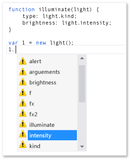

# Statement Completion for Identifiers
JavaScript doesn't allow explicit typing for variable declarations. As a result, IntelliSense can't always provide completion lists for objects. This can occur in various situations. Following are a few common ones.  
  
-   A parameter is declared, but it has not been called elsewhere in the active document, as shown in the following example.  
  
    ```javascript  
    function illuminate(light) {  
             light.  // Accurate statement completion is not available   
                     // unless illuminate is called elsewhere with a   
                     // parameter that has a value. If it is called only  
                     // in a function that is a sibling to   
                     // illuminate(light) in the call hierarchy, the   
                     // IntelliSense engine also cannot determine the   
                     // parameter type.  
         }  
  
    // Sibling function. No statement completion for light   
    // object in preceding code.  
    function lightLamp() {  
        var x = illuminate(1);  
    }  
  
    // Uncomment the next line to obtain statement completion for  
    // light object in preceding code.  
    // var x = illuminate(1);  
    ```  
  
-   An object is in a function that is called in response to an event. At design time, the IntelliSense engine cannot determine the type of the objects used in this situation.  
  
     If the IntelliSense engine can determine that the event should be called, typically through the use of `addEventListener` for the event in the active document, more accurate IntelliSense information is provided.  
  
 When IntelliSense is unable to identify an object, the IntelliSense engine populates the completion list with named entities, or identifiers, that are present in the active document. When the completion list contains these identifiers, information icons appear next to them. In addition, a tooltip for each identifier indicates that the expression is unknown. The following illustration shows statement completion options for an object of type `light` that can't be identified because the object and its properties are undefined. However, the `intensity` property is available in the identifier list because it has been used in the `illuminate` function.  
  
 **Completion options for an object that can't be identified**  
  
   
  
 You can override the completion list for an object by using XML documentation comments or JavaScript IntelliSense extensibility features. Using these features, you can provide type information and more descriptive IntelliSense information when it might not otherwise be available. For more information, see [Extending JavaScript IntelliSense](../vs140/extending-javascript-intellisense.md) and [How to: Create JavaScript XML Documentation Comments](../vs140/create-xml-documentation-comments-for-javascript-intellisense.md).  
  
## See Also  
 [JavaScript IntelliSense Overview](../vs140/javascript-intellisense.md)