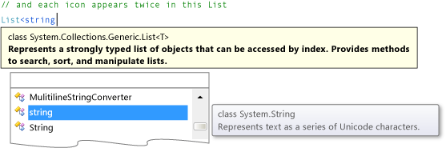

# Step 2: Add a Random Object and a List of Icons
In this step, you create a set of matching symbols for the game. Each symbol is added to two random cells in the TableLayoutPanel on the form. To do this, you use two <CodeContentPlaceHolder>0\</CodeContentPlaceHolder> statements to create two objects. The first is a <CodeContentPlaceHolder>1\</CodeContentPlaceHolder> object, like the one you used in the math quiz game. It is used in this code to randomly choose cells in the TableLayoutPanel. The second object, which may be new to you, is a <CodeContentPlaceHolder>2\</CodeContentPlaceHolder> object which is used to store the randomly-chosen symbols.  
  
### To add a Random object and a list of icons  
  
1.  In **Solution Explorer**, choose **Form1.cs** if you're using Visual C#, or **Form1.vb** if you're using Visual Basic, and then on the menu bar, choose **View**, **Code**. As an alternative, you can choose the **F7** key or double-click **Form1** in **Solution Explorer**.  
  
     This displays the code module behind Form1.  
  
2.  In the existing code, add the following code.  
  
     [!code[VbExpressTutorial4Step2_3_4#1](../vs140/codesnippet/CSharp/step-2--add-a-random-object-and-a-list-of-icons_1.cs)]
[!code[VbExpressTutorial4Step2_3_4#1](../vs140/codesnippet/VisualBasic/step-2--add-a-random-object-and-a-list-of-icons_1.vb)]  
  
     If you're using Visual C#, be sure you put the code after the opening curly brace and just after the class declaration (<CodeContentPlaceHolder>3\</CodeContentPlaceHolder>). If you're using Visual Basic, put the code right after the class declaration (<CodeContentPlaceHolder>4\</CodeContentPlaceHolder>).  
  
3.  When adding the <CodeContentPlaceHolder>5\</CodeContentPlaceHolder> object, notice the **IntelliSense** window that opens. The following is a Visual C# example, but similar text appears when you add a list in Visual Basic.  
  
       
IntelliSense window  
  
    > [!NOTE]
    >  The Intellisense window appears only when you enter code manually. If you copy and paste the code, it doesn't appear.  
  
     If you look at the code (and remarks) in small sections, it's easier to understand. Your programs can use <CodeContentPlaceHolder>6\</CodeContentPlaceHolder> objects to keep track of many different types of items. A list can hold numbers, true/false values, text, or other objects. You can even have a <CodeContentPlaceHolder>7\</CodeContentPlaceHolder> object that holds other <CodeContentPlaceHolder>8\</CodeContentPlaceHolder> objects. The items in a list are called *elements*, and each list only holds one type of element. So, a list of numbers can only hold numbers—you can't add text to that list. Similarly, you can't add numbers to a list of true/false values.  
  
     When you create a <CodeContentPlaceHolder>9\</CodeContentPlaceHolder> object using a <CodeContentPlaceHolder>10\</CodeContentPlaceHolder> statement, you need to specify the kind of data you want to store in it. That's why the tooltip at the top of the **IntelliSense** window shows the types of elements in the list. Also, that's what <CodeContentPlaceHolder>11\</CodeContentPlaceHolder> (in Visual C#) and <CodeContentPlaceHolder>12\</CodeContentPlaceHolder> (in Visual Basic) means: It's a <CodeContentPlaceHolder>13\</CodeContentPlaceHolder> object that holds elements of <CodeContentPlaceHolder>14\</CodeContentPlaceHolder> data type. A string is what your program uses to store text, which is what the tooltip to the right of the **IntelliSense** window is telling you.  
  
4.  Consider why in Visual Basic a temporary array must be created first, but in Visual C#, the list can be created with one statement. This is because the Visual C# language has *collection initializers*, which prepare the list to accept values. In Visual Basic, you can use a collection initializer. However, for compatibility with the previous version of Visual Basic, we recommend using the preceding code.  
  
     When you use a collection initializer with a <CodeContentPlaceHolder>15\</CodeContentPlaceHolder> statement, after the new <CodeContentPlaceHolder>16\</CodeContentPlaceHolder> object is created, the program fills it with the data you provided inside the curly braces. In this case, you get a list of strings named **icons**, and that list will be initialized so that it contains sixteen strings. Each of those strings is a single letter, and they all correspond to the icons that will be in the labels. So, the game will have a pair of exclamation points, a pair of uppercase N letters, a pair of commas, and so on. (When these characters are set to the Webdings font, they will appear as symbols, such as a bus, a bike, a spider, and so forth.) Your <CodeContentPlaceHolder>17\</CodeContentPlaceHolder> object will have sixteen strings in all, one for each cell in the TableLayoutPanel panel.  
  
    > [!NOTE]
    >  In Visual Basic, you get the same result, but first the strings are put into a temporary array, which is then converted into a <CodeContentPlaceHolder>18\</CodeContentPlaceHolder> object. An array is similar to a list, except, for example, arrays are created with a fixed size. Lists can shrink and grow as needed, which is important in this program.  
  
### To continue or review  
  
-   To go to the next tutorial step, see [Step 3: Assign a Random Icon to Each Label](../vs140/step-3--assign-a-random-icon-to-each-label.md).  
  
-   To return to the previous tutorial step, see [Step 1: Create a Project and Add a Table to Your Form](../vs140/step-1--create-a-project-and-add-a-table-to-your-form.md).