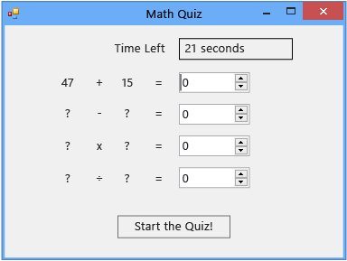

# Step 3: Add a Countdown Timer
In the third part of this tutorial, you'll add a countdown timer to track the number of seconds that remain for the quiz taker to finish.  
  
> [!NOTE]
>  This topic is part of a tutorial series about basic coding concepts. For an overview of the tutorial, see [Tutorial 2: Create a Timed Math Quiz](../vs140/tutorial-2--create-a-timed-math-quiz.md).  
  
### To add a countdown timer  
  
1.  Add an integer variable that's named **timeLeft**, just like you did in the previous procedure. Your code should look like the following.  
  
     [!code[VbExpressTutorial3Step3#5](../vs140/codesnippet/VisualBasic/step-3--add-a-countdown-timer_1.vb)]
[!code[VbExpressTutorial3Step3#5](../vs140/codesnippet/CSharp/step-3--add-a-countdown-timer_1.cs)]  
  
     Now you need a method that actually counts the seconds, such as a timer, which raises an event after the amount of time that you specify.  
  
2.  In the design window, move a `Timer` control from the **Components** category of the Toolbox to your form.  
  
     The control appears in the gray area at the bottom of the design window.  
  
3.  On the form, choose the **timer1** icon that you just added, and set its **Interval** property to **1000**.  
  
     Because the interval value is milliseconds, a value of 1000 causes the Tick event to fire every second.  
  
4.  On the form, double-click the Timer control, or choose it and then choose the Enter key.  
  
     The code editor appears and displays the method for the Tick event handler that you just added.  
  
5.  Add the following statements to the new event handler method.  
  
     [!code[VbExpressTutorial3Step3#6](../vs140/codesnippet/VisualBasic/step-3--add-a-countdown-timer_2.vb)]
[!code[VbExpressTutorial3Step3#6](../vs140/codesnippet/CSharp/step-3--add-a-countdown-timer_2.cs)]  
  
     Based on what you added, the timer checks each second whether time has run out by determining whether the **timeLeft** integer variable is greater than 0. If it is, time still remains. The timer first subtracts 1 from timeLeft and then updates the **Text** property of the `timeLabel` control to show the quiz taker how many seconds remain.  
  
     If no time remains, the timer stops and changes the text of the `timeLabel` control so that it shows **Time's up!** A message box announces that the quiz is over, and the answer is revealed—in this case, by adding addend1 and addend2. The **Enabled** property of the `startButton` control is set to `true` so that the quiz taker can start another quiz.  
  
     You just added an `if else` statement, which is how you tell programs to make decisions. An `if else` statement looks like the following.  
  
    > [!NOTE]
    >  The following example is for illustration only–don't add it to your project.  
  
    ```vb  
    If (something that your program will check) Then  
        ' One or more statements that will run  
        ' if what the program checked is true.   
    Else  
        ' One or more statements that will run  
        ' if what the program checked is false.  
    End If  
    ```  
  
    ```c#  
    if (something that your program will check)  
    {  
        // One or more statements that will run  
        // if what the program checked is true.   
    }  
    else  
    {  
        // One or more statements that will run  
        // if what the program checked is false.  
    }  
    ```  
  
     Look closely at the statement that you added in the `else` block to show the answer to the addition problem.  
  
     [!code[VbExpressTutorial3Step3#24](../vs140/codesnippet/VisualBasic/step-3--add-a-countdown-timer_3.vb)]
[!code[VbExpressTutorial3Step3#24](../vs140/codesnippet/CSharp/step-3--add-a-countdown-timer_3.cs)]  
  
     The statement `addend1 + addend2` adds the values in the two variables together. The first part (`sum.Value`) uses the **Value** property of the sum `NumericUpDown` control to display the correct answer. You use the same property later to check the answers for the quiz.  
  
     Quiz takers can enter numbers more easily by using a `NumericUpDown` control, which is why you use one for the answers to the math problems. All of the potential answers are whole numbers from 0 through 100. By leaving the default values of the **Minimum**, **Maximum**, and **DecimalPlaces** properties, you ensure that quiz takers can't enter decimals, negative numbers, or numbers that are too high. (If you wanted to allow quiz takers to enter 3.141 but not 3.1415, you could set the **DecimalPlaces** property to 3.)  
  
6.  Add three lines to the end of the `StartTheQuiz()` method, so the code looks like the following.  
  
     [!code[VbExpressTutorial3Step3#7](../vs140/codesnippet/VisualBasic/step-3--add-a-countdown-timer_4.vb)]
[!code[VbExpressTutorial3Step3#7](../vs140/codesnippet/CSharp/step-3--add-a-countdown-timer_4.cs)]  
  
     Now, when your quiz starts, the **timeLeft** variable is set to 30 and the **Text** property of the `timeLabel` control is set to 30 seconds. Then the `Start()` method of the `Timer` control starts the countdown. (The quiz doesn't check the answer yet—that comes next.)  
  
7.  Save your program, run it, and then choose the **Start** button on the form.  
  
     The timer starts to count down. When time runs out, the quiz ends, and the answer appears. The following illustration shows the quiz in progress.  
  
       
Math quiz in progress  
  
### To continue or review  
  
-   To go to the next tutorial step, see [Step 4: Add the CheckTheAnswer() Method](../vs140/step-4--add-the-checktheanswer---method.md).  
  
-   To return to the previous tutorial step, see [Step 2: Create a Random Addition Problem](../vs140/step-2--create-a-random-addition-problem.md).