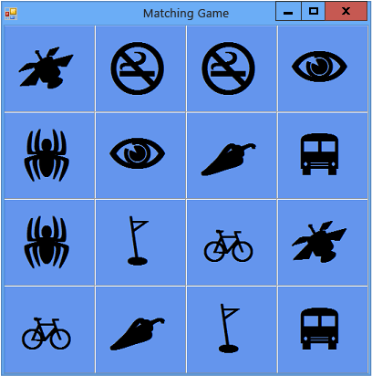

# Step 3: Assign a Random Icon to Each Label
If the icons show up in the same cells every game, it's not very challenging. To avoid this, assign the icons randomly to the label controls on your form by using an <CodeContentPlaceHolder>1\</CodeContentPlaceHolder> method.  
  
### To assign a random icon to each label  
  
1.  Before adding the following code, consider how the method works. There's a new keyword: <CodeContentPlaceHolder>2\</CodeContentPlaceHolder> in Visual C# and <CodeContentPlaceHolder>3\</CodeContentPlaceHolder> in Visual Basic. (One of the lines is commented out on purpose, which is explained at the end of this procedure.)  
  
     [!code[VbExpressTutorial4Step2_3_4#2](../vs140/codesnippet/CSharp/step-3--assign-a-random-icon-to-each-label_1.cs)]
[!code[VbExpressTutorial4Step2_3_4#2](../vs140/codesnippet/VisualBasic/step-3--assign-a-random-icon-to-each-label_1.vb)]  
  
2.  Add the <CodeContentPlaceHolder>4\</CodeContentPlaceHolder> method as shown in the previous step. You can put it just below the code you added in [Step 2: Add a Random Object and a List of Icons](../vs140/step-2--add-a-random-object-and-a-list-of-icons.md).  
  
     As mentioned earlier, there's something new in your <CodeContentPlaceHolder>5\</CodeContentPlaceHolder> method: a <CodeContentPlaceHolder>6\</CodeContentPlaceHolder> loop in Visual C# and <CodeContentPlaceHolder>7\</CodeContentPlaceHolder> in Visual Basic. You can use a <CodeContentPlaceHolder>8\</CodeContentPlaceHolder> loop any time you want to do the same action multiple times. In this case, you want to execute the same statements for every label on your TableLayoutPanel, as explained by the following code. The first line creates a variable named <CodeContentPlaceHolder>9\</CodeContentPlaceHolder> that stores each control one at a time while that control has the statements in the loop executed on it.  
  
     [!code[VbExpressTutorial4Step2_3_4#14](../vs140/codesnippet/CSharp/step-3--assign-a-random-icon-to-each-label_2.cs)]
[!code[VbExpressTutorial4Step2_3_4#14](../vs140/codesnippet/VisualBasic/step-3--assign-a-random-icon-to-each-label_2.vb)]  
  
    > [!NOTE]
    >  The names "iconLabel" and "control" are used because they are descriptive. You can replace these names with any names, and the code will work exactly the same as long as you change the name in each statement inside the loop.  
  
     The <CodeContentPlaceHolder>10\</CodeContentPlaceHolder> method iterates through each label control in the TableLayoutPanel and executes the same statements for each of them. Those statements pull a random icon from the list that you added in [Step 2: Add a Random Object and a List of Icons](../vs140/step-2--add-a-random-object-and-a-list-of-icons.md). (That's why you included two of each icon in the list, so there would be a pair of icons assigned to random label controls.)  
  
     Look more closely at the code that runs inside the <CodeContentPlaceHolder>11\</CodeContentPlaceHolder> or <CodeContentPlaceHolder>12\</CodeContentPlaceHolder> loop. This code is reproduced here.  
  
     [!code[VbExpressTutorial4Step2_3_4#16](../vs140/codesnippet/CSharp/step-3--assign-a-random-icon-to-each-label_3.cs)]
[!code[VbExpressTutorial4Step2_3_4#16](../vs140/codesnippet/VisualBasic/step-3--assign-a-random-icon-to-each-label_3.vb)]  
  
     The first line converts the <CodeContentPlaceHolder>13\</CodeContentPlaceHolder> variable to a label named <CodeContentPlaceHolder>14\</CodeContentPlaceHolder>. The line after that is an <CodeContentPlaceHolder>15\</CodeContentPlaceHolder> statement that checks to make sure the conversion worked. If the conversion does work, the statements in the <CodeContentPlaceHolder>16\</CodeContentPlaceHolder> statement run. (As you may recall from the previous tutorials, the <CodeContentPlaceHolder>17\</CodeContentPlaceHolder> statement is used to evaluate whatever condition you specify.) The first line in the <CodeContentPlaceHolder>18\</CodeContentPlaceHolder> statement creates a variable named <CodeContentPlaceHolder>19\</CodeContentPlaceHolder> that contains a random number that corresponds to one of the items in the icons list. To do this, it uses the <CodeContentPlaceHolder>20\</CodeContentPlaceHolder> method of the <CodeContentPlaceHolder>21\</CodeContentPlaceHolder> object that you created earlier. The <CodeContentPlaceHolder>22\</CodeContentPlaceHolder> method returns the random number. This line also uses the <CodeContentPlaceHolder>23\</CodeContentPlaceHolder> property of the <CodeContentPlaceHolder>24\</CodeContentPlaceHolder> list to determine the range from which to choose the random number. The next line assigns one of the icon list items to the <CodeContentPlaceHolder>25\</CodeContentPlaceHolder> property of the label. The commented-out line is explained later in this topic. Finally, the last line in the <CodeContentPlaceHolder>26\</CodeContentPlaceHolder> statement removes from the list the icon that has been added to the form.  
  
     Remember, if you're not sure about what some part of the code does, you can position the mouse pointer over a code element and review the resulting tooltip. You can also step through each line of code while the program is running by using the Visual Studio debugger. See [How Do I: Step with The Debugger in Visual Studio?](http://msdn.microsoft.com/vstudio/ee672313.aspx) or [Start, Break, Step, Run through Code, and Stop Debugging in Visual Studio](../vs140/navigating-through-code-with-the-debugger.md) for more information.  
  
3.  To fill up the game board with icons, you need to call the <CodeContentPlaceHolder>27\</CodeContentPlaceHolder> method as soon as the program starts. If you're using Visual C#, add a statement just below the call to the <CodeContentPlaceHolder>28\</CodeContentPlaceHolder> method in the <CodeContentPlaceHolder>29\</CodeContentPlaceHolder>*constructor*, so your form calls your new method to set itself up before it's shown. Constructors are called when you create a new object, such as a class or struct. See [Constructors (C# Programming Guide)](http://msdn.microsoft.com/library/ace5hbzh.aspx) or [Using Constructors and Destructors](http://msdn.microsoft.com/library/2z08e49e%28v=vs.90%29.aspx) in Visual Basic for more information.  
  
     [!code[VbExpressTutorial4Step2_3_4#13](../vs140/codesnippet/CSharp/step-3--assign-a-random-icon-to-each-label_4.cs)]  
  
     For Visual Basic, add the <CodeContentPlaceHolder>30\</CodeContentPlaceHolder> method call to the <CodeContentPlaceHolder>31\</CodeContentPlaceHolder> method so that the code looks like the following.  
  
<CodeContentPlaceHolder>0\</CodeContentPlaceHolder>  
4.  Save your program and run it. It should show a form with random icons assigned to each label.  
  
5.  Close your program, and then run it again. Notice that different icons are assigned to each label, as shown in the following picture.  
  
       
Matching game with random icons  
  
     The icons are visible now because you haven't hidden them. To hide them from the player, you can set each label's <CodeContentPlaceHolder>32\</CodeContentPlaceHolder> property to the same color as its <CodeContentPlaceHolder>33\</CodeContentPlaceHolder> property.  
  
    > [!TIP]
    >  Another way to hide controls like labels is to set their **Visible** property to <CodeContentPlaceHolder>34\</CodeContentPlaceHolder>.  
  
6.  To hide the icons, stop the program and remove the comment marks for the commented line of code inside the <CodeContentPlaceHolder>35\</CodeContentPlaceHolder> loop.  
  
     [!code[VbExpressTutorial4Step2_3_4#15](../vs140/codesnippet/CSharp/step-3--assign-a-random-icon-to-each-label_5.cs)]
[!code[VbExpressTutorial4Step2_3_4#15](../vs140/codesnippet/VisualBasic/step-3--assign-a-random-icon-to-each-label_5.vb)]  
  
7.  On the menu bar, choose the **Save All** button to save your program, and then run it. The icons seem to have disappeared—only a blue background appears. However, the icons are randomly assigned and are still there. Because the icons are the same color as the background, it hides them from the player. After all, it wouldn't be a very challenging game if the player could see all of the icons right away!  
  
### To continue or review  
  
-   To go to the next tutorial step, see [Step 4: Add a Click Event Handler to Each Label](../vs140/step-4--add-a-click-event-handler-to-each-label.md).  
  
-   To return to the previous tutorial step, see [Step 2: Add a Random Object and a List of Icons](../vs140/step-2--add-a-random-object-and-a-list-of-icons.md).