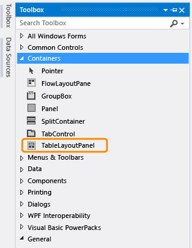
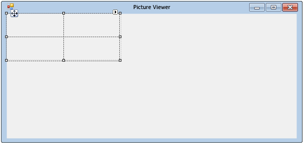
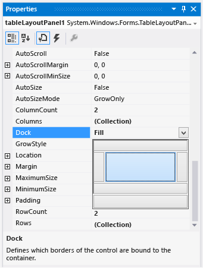
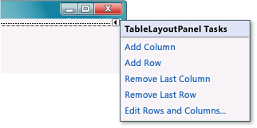
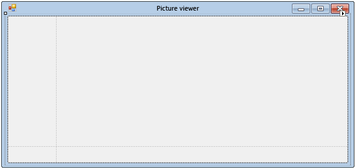

# Step 4: Lay Out Your Form with a TableLayoutPanel Control
In this step, you add a `TableLayoutPanel` control to your form. The TableLayoutPanel helps properly align controls in the form that you will add later.  
  
 For a video version of this topic, see [Tutorial 1: Create a Picture Viewer in Visual Basic - Video 2](http://go.microsoft.com/fwlink/?LinkId=205211) or [Tutorial 1: Create a Picture Viewer in C# - Video 2](http://go.microsoft.com/fwlink/?LinkId=205200). These videos use an earlier version of Visual Studio, so there are slight differences in some menu commands and other user interface elements. However, the concepts and procedures work similarly in the current version of Visual Studio.  
  
### To lay out your form with a TableLayoutPanel control  
  
1.  On the left side of the Visual Studio IDE, locate the **Toolbox** tab. Choose the **Toolbox** tab, and the Toolbox appears. (Or, on the menu bar, choose **View**, **Toolbox**.)  
  
2.  Choose the small triangle symbol next to the **Containers** group to open it, as shown in the following picture.  
  
       
Containers group  
  
3.  You can add controls like buttons, check boxes, and labels to your form. Double-click the `TableLayoutPanel` control in the Toolbox. (Or, you can drag the control from the toolbox onto the form.) When you do this, the IDE adds a `TableLayoutPanel` control to your form, as shown in the following picture.  
  
       
TableLayoutPanel control  
  
    > [!NOTE]
    >  After you add your TableLayoutPanel, if a window appears inside your form with the title **TableLayoutPanel Tasks**, choose anywhere inside the form to close it. You will learn more about this window later in the tutorial.  
  
     Notice how the Toolbox expands to cover your form when you choose its tab, and closes after you choose anywhere outside of it. That's the IDE auto-hide feature. You can turn it on or off for any of the windows by choosing the pushpin icon in the upper-right corner of the window to toggle auto-hide and lock it in place. The pushpin icon appears as follows.  
  
       
Pushpin icon  
  
4.  Be sure **TableLayoutPanel** is selected by choosing it. You can verify what control is selected by looking at the drop-down list at the top of the **Properties** window, as shown in the following picture.  
  
       
Properties window showing TableLayoutPanel control  
  
5.  Choose the **Alphabetical** button on the toolbar in the **Properties** window. This causes the list of properties in the **Properties** window to display in alphabetical order, which will make it easier to locate properties in this tutorial.  
  
6.  The control selector is a drop-down list at the top of the **Properties** window. In this example, it shows that a control called `tableLayoutPanel1` is selected. You can select controls either by choosing an area in Windows Forms Designer or by choosing from the control selector. Now that `TableLayoutPanel` is selected, find the **Dock** property and choose **Dock**, which should be set to **None**. Notice that a drop-down arrow appears next to the value. Choose the arrow, and then select the **Fill** button (the large button in the middle), as shown in the following picture.  
  
       
Properties window with Fill selected  
  
     *Docking* in Visual Studio refers to when a window is attached to another window or area in the IDE. For example, the Properties window can be undocked – that is, unattached and free-floating within Visual Studio – or it can be docked against **Solution Explorer**.  
  
7.  After you set the TableLayoutPanel **Dock** property to **Fill**, the panel fills the entire form. If you resize the form again, the TableLayoutPanel stays docked, and resizes itself to fit.  
  
    > [!NOTE]
    >  A TableLayoutPanel works like a table in Microsoft Office Word: It has rows and columns, and an individual cell can span multiple rows and columns. Each cell can hold one control (like a button, a check box, or a label). Your TableLayoutPanel will have a `PictureBox` control spanning its entire top row, a `CheckBox` control in its lower-left cell, and four `Button` controls in its lower-right cell.  
  
8.  Currently, the TableLayoutPanel has two equal-size rows and two equal-size columns. You need to resize them so the top row and right column are both much bigger. In Windows Forms Designer, select the TableLayoutPanel. In the upper-right corner, there is a small black triangle button, which appears as follows.  
  
       
Triangle button  
  
     This button indicates that the control has tasks that help you set its properties automatically.  
  
9. Choose the triangle to display the control's task list, as shown in the following picture.  
  
       
TableLayoutPanel tasks  
  
10. Choose the **Edit Rows and Columns** task to display the **Column and Row Styles** window. Choose **Column1**, and set its size to 15 percent by being sure the **Percent** button is selected and entering `15` in the **Percent** box. (That's a `NumericUpDown` control, which you will use in a later tutorial.) Choose **Column2** and set it to 85 percent. Don't choose the **OK** button yet, because the window will close. (But if you do, you can reopen it using the task list.)  
  
       
TableLayoutPanel column and row styles  
  
11. From the **Show** drop-down list at the top of the window, choose **Rows**. Set **Row1** to 90 percent and **Row2** to 10 percent.  
  
12. Choose the **OK** button. Your TableLayoutPanel should now have a large top row, a small bottom row, a small left column, and a large right column. You can resize the rows and columns in the TableLayoutPanel by choosing tableLayoutPanel1 in the form and then dragging its row and column borders.  
  
       
Form1 with resized TableLayoutPanel  
  
### To continue or review  
  
-   To go to the next tutorial step, see [Step 5: Add Controls to Your Form](../vs140/step-5--add-controls-to-your-form.md).  
  
-   To return to the previous tutorial step, see [Step 3: Set Up Your Form Properties](../vs140/step-3--set-your-form-properties.md).