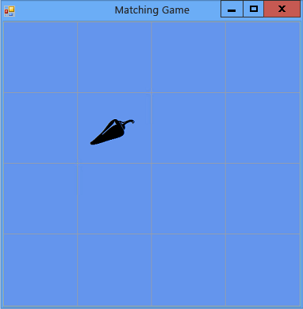

# Step 5: Add Label References
The program needs to track which label controls the player chooses. Right now, the program shows all labels chosen by the player. But we're going to change that. After the first label is chosen, the program should show the label's icon. After the second label is chosen, the program should display both icons for a brief time, and then hide both icons again. Your program will now keep track of which label control is chosen first and which is chosen second by using *reference variables*.  
  
### To add label references  
  
1.  Add label references to your form by using the following code.  
  
     [!code[VbExpressTutorial4Step5#5](../vs140/codesnippet/VisualBasic/step-5--add-label-references_1.vb)]
[!code[VbExpressTutorial4Step5#5](../vs140/codesnippet/CSharp/step-5--add-label-references_1.cs)]  
  
     These reference variables look similar to the statements you used earlier to add objects (like <CodeContentPlaceHolder>0\</CodeContentPlaceHolder> objects, <CodeContentPlaceHolder>1\</CodeContentPlaceHolder> objects, and <CodeContentPlaceHolder>2\</CodeContentPlaceHolder> objects) to your form. However, these statements don't cause two extra label controls to appear on the form because there's no <CodeContentPlaceHolder>3\</CodeContentPlaceHolder> keyword used in either of the two statements. Without the <CodeContentPlaceHolder>4\</CodeContentPlaceHolder> keyword, no object is created. That's why <CodeContentPlaceHolder>5\</CodeContentPlaceHolder> and <CodeContentPlaceHolder>6\</CodeContentPlaceHolder> are called reference variables: They just keep track (or, refer to) <CodeContentPlaceHolder>7\</CodeContentPlaceHolder> objects.  
  
     When a variable isn't keeping track of an object, it's set to a special reserved value: <CodeContentPlaceHolder>8\</CodeContentPlaceHolder> in Visual C# and <CodeContentPlaceHolder>9\</CodeContentPlaceHolder> in Visual Basic. So, when the program starts, both <CodeContentPlaceHolder>10\</CodeContentPlaceHolder> and <CodeContentPlaceHolder>11\</CodeContentPlaceHolder> are set to <CodeContentPlaceHolder>12\</CodeContentPlaceHolder> or <CodeContentPlaceHolder>13\</CodeContentPlaceHolder>, which means that the variables aren't keeping track of anything.  
  
2.  Modify your Click event handler to use the new <CodeContentPlaceHolder>14\</CodeContentPlaceHolder> reference variable. Remove the last statement in the <CodeContentPlaceHolder>15\</CodeContentPlaceHolder> event handler method (<CodeContentPlaceHolder>16\</CodeContentPlaceHolder>) and replace it with the <CodeContentPlaceHolder>17\</CodeContentPlaceHolder> statement that follows. (Be sure you include the comment, and the whole <CodeContentPlaceHolder>18\</CodeContentPlaceHolder> statement.)  
  
     [!code[VbExpressTutorial4Step5#6](../vs140/codesnippet/VisualBasic/step-5--add-label-references_2.vb)]
[!code[VbExpressTutorial4Step5#6](../vs140/codesnippet/CSharp/step-5--add-label-references_2.cs)]  
  
3.  Save and run your program. Choose one of the label controls, and its icon appears.  
  
4.  Choose the next label control, and notice that nothing happens. The program is already keeping track of the first label that the player chose, so <CodeContentPlaceHolder>19\</CodeContentPlaceHolder> isn't equal to <CodeContentPlaceHolder>20\</CodeContentPlaceHolder> in Visual C# or <CodeContentPlaceHolder>21\</CodeContentPlaceHolder> in Visual Basic. When your <CodeContentPlaceHolder>22\</CodeContentPlaceHolder> statement checks <CodeContentPlaceHolder>23\</CodeContentPlaceHolder> to determine if it's equal to <CodeContentPlaceHolder>24\</CodeContentPlaceHolder> or <CodeContentPlaceHolder>25\</CodeContentPlaceHolder>, it finds that it isn't, and it doesn't execute the statements in the <CodeContentPlaceHolder>26\</CodeContentPlaceHolder> statement. So, only the first icon that's chosen turns black, and the other icons are invisible, as shown in the following picture.  
  
       
Matching game showing one icon  
  
     You'll fix this situation in the next step of the tutorial by adding a **Timer** control.  
  
### To continue or review  
  
-   To go to the next tutorial step, see [Step 6: Add a Timer](../vs140/step-6--add-a-timer.md).  
  
-   To return to the previous tutorial step, see [Step 4: Add a Click Event Handler to Each Label](../vs140/step-4--add-a-click-event-handler-to-each-label.md).