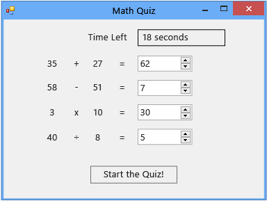

# Step 7: Add Multiplication and Division Problems
In the seventh part of this tutorial, you'll add multiplication and division problems, but first think about how to make that change. Consider the initial step, which involves storing values.  
  
### To add multiplication and division problems  
  
1.  Add four more integer variables to the form.  
  
     [!code[VbExpressTutorial3Step7#15](../vs140/codesnippet/VisualBasic/step-7--add-multiplication-and-division-problems_1.vb)]
[!code[VbExpressTutorial3Step7#15](../vs140/codesnippet/CSharp/step-7--add-multiplication-and-division-problems_1.cs)]  
  
2.  As you did before, modify the `StartTheQuiz()` method to fill in random numbers for the multiplication and division problems.  
  
     [!code[VbExpressTutorial3Step7#16](../vs140/codesnippet/VisualBasic/step-7--add-multiplication-and-division-problems_2.vb)]
[!code[VbExpressTutorial3Step7#16](../vs140/codesnippet/CSharp/step-7--add-multiplication-and-division-problems_2.cs)]  
  
3.  Modify the `CheckTheAnswer()` method so that it also checks the multiplication and division problems.  
  
     [!code[VbExpressTutorial3Step7#17](../vs140/codesnippet/VisualBasic/step-7--add-multiplication-and-division-problems_3.vb)]
[!code[VbExpressTutorial3Step7#17](../vs140/codesnippet/CSharp/step-7--add-multiplication-and-division-problems_3.cs)]  
  
     You can't easily enter the multiplication sign (×) and the division sign (÷) using the keyboard, so Visual C# and Visual Basic accept an asterisk (*) for multiplication and a slash mark (/) for division.  
  
4.  Change the last part of the timer's Tick event handler so that it fills in the correct answer when time runs out.  
  
     [!code[VbExpressTutorial3Step7#23](../vs140/codesnippet/VisualBasic/step-7--add-multiplication-and-division-problems_4.vb)]
[!code[VbExpressTutorial3Step7#23](../vs140/codesnippet/CSharp/step-7--add-multiplication-and-division-problems_4.cs)]  
  
5.  Save and run your program.  
  
     Quiz takers must answer four problems to complete the quiz, as the following illustration shows.  
  
       
Math quiz with four problems  
  
### To continue or review  
  
-   To go to the next tutorial step, see [Step 8: Customize the Quiz](../vs140/step-8--customize-the-quiz.md).  
  
-   To return to the previous tutorial step, see [Step 6: Add a Subtraction Problem](../vs140/step-6--add-a-subtraction-problem.md).