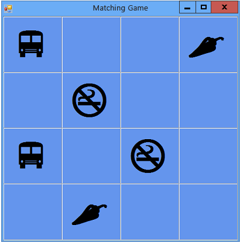

# Step 7: Keep Pairs Visible
The game works well, as long as the player only chooses pairs of icons that don't match. But consider what should happen when the player chooses a matching pair. Instead of making the icons disappear by turning on the timer (using the <CodeContentPlaceHolder>4\</CodeContentPlaceHolder> method), the game should reset itself so that it's no longer keeping track of any labels using the <CodeContentPlaceHolder>5\</CodeContentPlaceHolder> and <CodeContentPlaceHolder>6\</CodeContentPlaceHolder> reference variables, without resetting the colors for the two labels that were chosen.  
  
### To keep pairs visible  
  
1.  Add the following <CodeContentPlaceHolder>7\</CodeContentPlaceHolder> statement to the <CodeContentPlaceHolder>8\</CodeContentPlaceHolder> event handler method, near the end of the code just above the statement where you start the timer. Take a close look at the code while adding it to the program. Consider how the code works.  
  
     [!code[VbExpressTutorial4Step7#9](../vs140/codesnippet/CSharp/step-7--keep-pairs-visible_1.cs)]
[!code[VbExpressTutorial4Step7#9](../vs140/codesnippet/VisualBasic/step-7--keep-pairs-visible_1.vb)]  
  
     The first line of the <CodeContentPlaceHolder>9\</CodeContentPlaceHolder> statement you just added checks whether the icon in the first label that the player chooses is the same as the icon in the second label. If the icons are identical, the program executes the three statements between the curly braces in C# or the three statements within the <CodeContentPlaceHolder>10\</CodeContentPlaceHolder> statement in Visual Basic. The first two statements reset the <CodeContentPlaceHolder>11\</CodeContentPlaceHolder> and <CodeContentPlaceHolder>12\</CodeContentPlaceHolder> reference variables so that they no longer keep track of any of the labels. (You may recognize those two statements from the timer's Tick event handler.) The third statement is a <CodeContentPlaceHolder>13\</CodeContentPlaceHolder> statement, which tells the program to skip the rest of the statements in the method without executing them.  
  
     If programming in Visual C#, you may have noticed that some of the code uses a single equal sign (<CodeContentPlaceHolder>14\</CodeContentPlaceHolder>), while other statements use two equal signs (<CodeContentPlaceHolder>15\</CodeContentPlaceHolder>). Consider why <CodeContentPlaceHolder>16\</CodeContentPlaceHolder> is used in some places but <CodeContentPlaceHolder>17\</CodeContentPlaceHolder> is used in other places.  
  
     This is a good example that shows the difference. Take a careful look at the code between the parentheses in the <CodeContentPlaceHolder>18\</CodeContentPlaceHolder> statement.  
  
<CodeContentPlaceHolder>0\</CodeContentPlaceHolder>  
<CodeContentPlaceHolder>1\</CodeContentPlaceHolder>  
     Then look closely at the first statement in the block of code after the <CodeContentPlaceHolder>19\</CodeContentPlaceHolder> statement.  
  
<CodeContentPlaceHolder>2\</CodeContentPlaceHolder>  
<CodeContentPlaceHolder>3\</CodeContentPlaceHolder>  
     The first of those two statements checks whether two icons are the same. Because two values are being compared, the Visual C# program uses the <CodeContentPlaceHolder>20\</CodeContentPlaceHolder> equality operator. The second statement actually changes the value (called *assignment*), setting the <CodeContentPlaceHolder>21\</CodeContentPlaceHolder> reference variable equal to <CodeContentPlaceHolder>22\</CodeContentPlaceHolder> to reset it. That's why it uses the <CodeContentPlaceHolder>23\</CodeContentPlaceHolder> assignment operator instead. Visual C# uses <CodeContentPlaceHolder>24\</CodeContentPlaceHolder> to set values, and <CodeContentPlaceHolder>25\</CodeContentPlaceHolder> to compare them. Visual Basic uses <CodeContentPlaceHolder>26\</CodeContentPlaceHolder> for both variable assignment and comparison.  
  
2.  Save and run the program, and then start choosing icons on the form. If you choose a pair that doesn't match, the timer's Tick event triggers, and both icons disappear. If you choose a matching pair, the new <CodeContentPlaceHolder>27\</CodeContentPlaceHolder> statement executes, and the return statement causes the method to skip the code that starts the timer, so the icons stay visible, as shown in the following picture.  
  
       
Matching game with visible icon pairs  
  
### To continue or review  
  
-   To go to the next tutorial step, see [Step 8: Add a Method to Verify Whether the Player Won](../vs140/step-8--add-a-method-to-verify-whether-the-player-won.md).  
  
-   To return to the previous tutorial step, see [Step 6: Add a Timer](../vs140/step-6--add-a-timer.md).