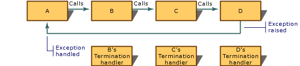

# try-finally Statement
**Microsoft Specific**  
  
 The following syntax describes the <CodeContentPlaceHolder>1\</CodeContentPlaceHolder> statement:  
  
<CodeContentPlaceHolder>0\</CodeContentPlaceHolder>  
## Grammar  
 *try-finally-statement*:  
 <CodeContentPlaceHolder>2\</CodeContentPlaceHolder> *compound-statement*  
  
 <CodeContentPlaceHolder>3\</CodeContentPlaceHolder> *compound-statement*  
  
 The <CodeContentPlaceHolder>4\</CodeContentPlaceHolder> statement is a Microsoft extension to the C and C++ languages that enables target applications to guarantee execution of cleanup code when execution of a block of code is interrupted. Cleanup consists of such tasks as deallocating memory, closing files, and releasing file handles. The <CodeContentPlaceHolder>5\</CodeContentPlaceHolder> statement is especially useful for routines that have several places where a check is made for an error that could cause premature return from the routine.  
  
 For related information and a code sample, see [try-except Statement](../vs140/try-except-statement.md). For more information on structured exception handling in general, see [Structured Exception Handling](../vs140/structured-exception-handling--c-c---.md). For more information on handling exceptions in managed applications, see [Exception Handling under /clr](../vs140/exception-handling---c---component-extensions-.md).  
  
> [!NOTE]
>  Structured exception handling works with Win32 for both C and C++ source files. However, it is not specifically designed for C++. You can ensure that your code is more portable by using C++ exception handling. Also, C++ exception handling is more flexible, in that it can handle exceptions of any type. For C++ programs, it is recommended that you use the C++ exception-handling mechanism ([try, catch, and throw](../vs140/try--throw--and-catch-statements--c---.md) statements).  
  
 The compound statement after the <CodeContentPlaceHolder>6\</CodeContentPlaceHolder> clause is the guarded section. The compound statement after the <CodeContentPlaceHolder>7\</CodeContentPlaceHolder> clause is the termination handler. The handler specifies a set of actions that execute when the guarded section is exited, regardless of whether the guarded section is exited by an exception (abnormal termination), or by standard fall through (normal termination).  
  
 Control reaches a <CodeContentPlaceHolder>8\</CodeContentPlaceHolder> statement by simple sequential execution (fall through). When control enters the <CodeContentPlaceHolder>9\</CodeContentPlaceHolder>, its associated handler becomes active. If the flow of control reaches the end of the try block, execution proceeds as follows:  
  
1.  The termination handler is invoked.  
  
2.  When the termination handler completes, execution continues after the <CodeContentPlaceHolder>10\</CodeContentPlaceHolder> statement. Regardless of how the guarded section ends (for example, via a <CodeContentPlaceHolder>11\</CodeContentPlaceHolder> out of the guarded body or a <CodeContentPlaceHolder>12\</CodeContentPlaceHolder> statement), the termination handler is executed <CodeContentPlaceHolder>13\</CodeContentPlaceHolder> the flow of control moves out of the guarded section.  
  
     A **__finally** statement does not block searching for an appropriate exception handler.  
  
 If an exception occurs in the <CodeContentPlaceHolder>14\</CodeContentPlaceHolder> block, the operating system must find a handler for the exception or the program will fail. If a handler is found, any and all <CodeContentPlaceHolder>15\</CodeContentPlaceHolder> blocks are executed and execution resumes in the handler.  
  
 For example, suppose a series of function calls links function A to function D, as shown in the following figure. Each function has one termination handler. If an exception is raised in function D and handled in A, the termination handlers are called in this order as the system unwinds the stack: D, C, B.  
  
   
Order of Termination-Handler Execution  
  
> [!NOTE]
>  The behavior of try-finally is different from some other languages that support the use of **finally**, such as C#.  A single <CodeContentPlaceHolder>16\</CodeContentPlaceHolder> may have either, but not both, of <CodeContentPlaceHolder>17\</CodeContentPlaceHolder> and <CodeContentPlaceHolder>18\</CodeContentPlaceHolder>.  If both are to be used together, an outer try-except statement must enclose the inner try-finally statement.  The rules specifying when each block executes are also different.  
  
## The __leave Keyword  
 The <CodeContentPlaceHolder>19\</CodeContentPlaceHolder> keyword is valid only within the guarded section of a <CodeContentPlaceHolder>20\</CodeContentPlaceHolder> statement, and its effect is to jump to the end of the guarded section. Execution continues at the first statement in the termination handler.  
  
 A <CodeContentPlaceHolder>21\</CodeContentPlaceHolder> statement can also jump out of the guarded section, but it degrades performance because it invokes stack unwinding. The <CodeContentPlaceHolder>22\</CodeContentPlaceHolder> statement is more efficient because it does not cause stack unwinding.  
  
## Abnormal Termination  
 Exiting a <CodeContentPlaceHolder>23\</CodeContentPlaceHolder> statement using the [longjmp](../vs140/longjmp.md) run-time function is considered abnormal termination. It is illegal to jump into a <CodeContentPlaceHolder>24\</CodeContentPlaceHolder> statement, but legal to jump out of one. All <CodeContentPlaceHolder>25\</CodeContentPlaceHolder> statements that are active between the point of departure (normal termination of the <CodeContentPlaceHolder>26\</CodeContentPlaceHolder> block) and the destination (the <CodeContentPlaceHolder>27\</CodeContentPlaceHolder> block that handles the exception) must be run. This is called a local unwind.  
  
 If a **try** block is prematurely terminated for any reason, including a jump out of the block, the system executes the associated **finally** block as a part of the process of unwinding the stack. In such cases, the [AbnormalTermination](http://msdn.microsoft.com/library/windows/desktop/ms679265) function returns TRUE if called from within the **finally** block; otherwise, it returns FALSE.  
  
 The termination handler is not called if a process is killed in the middle of executing a <CodeContentPlaceHolder>28\</CodeContentPlaceHolder> statement.  
  
 **END Microsoft Specific**  
  
## See Also  
 [Writing a Termination Handler](../vs140/writing-a-termination-handler.md)   
 [Structured Exception Handling (C/C++)](../vs140/structured-exception-handling--c-c---.md)   
 [Keywords](../vs140/keywords--c---.md)   
 [Termination-Handler Syntax](http://msdn.microsoft.com/library/windows/desktop/ms681393)