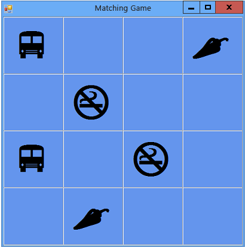

# Tutorial 3: Create a Matching Game
In this tutorial, you build a matching game, where the player must match pairs of hidden icons. You learn how to:  
  
-   Store objects, such as icons, in a <CodeContentPlaceHolder>0\</CodeContentPlaceHolder> object.  
  
-   Use a <CodeContentPlaceHolder>1\</CodeContentPlaceHolder> loop in Visual C# or a <CodeContentPlaceHolder>2\</CodeContentPlaceHolder> loop in Visual Basic to iterate through items in a list.  
  
-   Keep track of a form's state by using reference variables.  
  
-   Build an event handler to respond to events that you can use with multiple objects.  
  
-   Make a timer that counts down and then fires an event exactly once after being started.  
  
 When you finish this tutorial, your program will look like the following picture.  
  
   
Game that you create in this tutorial  
  
 To download a completed version of the sample, see [Complete Matching Game tutorial sample](http://code.msdn.microsoft.com/Complete-Matching-Game-4cffddba).  
  
> [!NOTE]
>  In this tutorial, both Visual C# and Visual Basic are covered, so focus on information specific to the programming language that you're using.  
  
 If you get stuck or have programming questions, try posting your question on one of the MSDN forums. See [Visual Basic Forum](http://social.msdn.microsoft.com/Forums/home?forum=vbgeneral) and [Visual C# Forum](http://social.msdn.microsoft.com/Forums/home?forum=csharpgeneral). Also, there are great, free video learning resources available to you. To learn more about programming in Visual Basic, see [Visual Basic Fundamentals: Development for Absolute Beginners](http://channel9.msdn.com/Series/Visual-Basic-Development-for-Absolute-Beginners). To learn more about programming in Visual C#, see [C# Fundamentals: Development for Absolute Beginners](http://channel9.msdn.com/Series/C-Sharp-Fundamentals-Development-for-Absolute-Beginners).  
  
## Related Topics  
  
|Title|Description|  
|-----------|-----------------|  
|[Step 1: Create a Project and Add a Table to Your Form](../vs140/step-1--create-a-project-and-add-a-table-to-your-form.md)|Begin by creating the project and adding a <CodeContentPlaceHolder>3\</CodeContentPlaceHolder> control to keep the controls aligned properly.|  
|[Step 2: Add a Random Object and a List of Icons](../vs140/step-2--add-a-random-object-and-a-list-of-icons.md)|Add a <CodeContentPlaceHolder>4\</CodeContentPlaceHolder> object and a <CodeContentPlaceHolder>5\</CodeContentPlaceHolder> object, to create a list of icons.|  
|[Step 3: Assign a Random Icon to Each Label](../vs140/step-3--assign-a-random-icon-to-each-label.md)|Assign the icons randomly to the <CodeContentPlaceHolder>6\</CodeContentPlaceHolder> controls, so that each game is different.|  
|[Step 4: Add a Click Event Handler to Each Label](../vs140/step-4--add-a-click-event-handler-to-each-label.md)|Add a Click event handler that changes the color of the label that is clicked.|  
|[Step 5: Add Label References](../vs140/step-5--add-label-references.md)|Add reference variables to keep track of which labels are clicked.|  
|[Step 6: Add a Timer](../vs140/step-6--add-a-timer.md)|Add a timer to the form to keep track of the time that has passed in the game.|  
|[Step 7: Keep Pairs Visible](../vs140/step-7--keep-pairs-visible.md)|Keep pairs of icons visible, if a matching pair is selected.|  
|[Step 8: Add a Method to Verify Whether the Player Won](../vs140/step-8--add-a-method-to-verify-whether-the-player-won.md)|Add a <CodeContentPlaceHolder>7\</CodeContentPlaceHolder> method to verify whether the player won.|  
|[Step 9: Try Other Features](../vs140/step-9--try-other-features.md)|Try other features, such as changing icons and colors, adding a grid, and adding sounds. Try making the board bigger and adjusting the timer.|