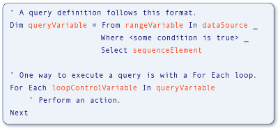

# Type Relationships in Query Operations (Visual Basic)
Variables used in [!INCLUDE[vbteclinqext](../vs140/includes/vbteclinqext_md.md)] query operations are strongly typed and must be compatible with each other. Strong typing is used in the data source, in the query itself, and in the query execution. The following illustration identifies terms used to describe a [!INCLUDE[vbteclinq](../vs140/includes/vbteclinq_md.md)] query. For more information about the parts of a query, see [Basic Query Operations (Visual Basic)](../vs140/basic-query-operations--visual-basic-.md).  
  
   
Parts of a LINQ query  
  
 The type of the range variable in the query must be compatible with the type of the elements in the data source. The type of the query variable must be compatible with the sequence element defined in the <CodeContentPlaceHolder>3\</CodeContentPlaceHolder> clause. Finally, the type of the sequence elements also must be compatible with the type of the loop control variable that is used in the <CodeContentPlaceHolder>4\</CodeContentPlaceHolder> statement that executes the query. This strong typing facilitates identification of type errors at compile time.  
  
 [!INCLUDE[vbprvb](../vs140/includes/vbprvb_md.md)] makes strong typing convenient by implementing local type inference, also known as *implicit typing*. That feature is used in the previous example, and you will see it used throughout the [!INCLUDE[vbteclinq](../vs140/includes/vbteclinq_md.md)] samples and documentation. In Visual Basic, local type inference is accomplished simply by using a <CodeContentPlaceHolder>5\</CodeContentPlaceHolder> statement without an <CodeContentPlaceHolder>6\</CodeContentPlaceHolder> clause. In the following example, <CodeContentPlaceHolder>7\</CodeContentPlaceHolder> is strongly typed as a string.  
  
 [!code[VbLINQTypeRels#1](../vs140/codesnippet/VisualBasic/type-relationships-in-query-operations--visual-basic-_1.vb)]  
  
> [!NOTE]
>  Local type inference works only when <CodeContentPlaceHolder>8\</CodeContentPlaceHolder> is set to <CodeContentPlaceHolder>9\</CodeContentPlaceHolder>. For more information, see [Option Infer Statement](../vs140/option-infer-statement.md).  
  
 However, even if you use local type inference in a query, the same type relationships are present among the variables in the data source, the query variable, and the query execution loop. It is useful to have a basic understanding of these type relationships when you are writing [!INCLUDE[vbteclinq](../vs140/includes/vbteclinq_md.md)] queries, or working with the samples and code examples in the documentation.  
  
 You may need to specify an explicit type for a range variable that does not match the type returned from the data source. You can specify the type of the range variable by using an <CodeContentPlaceHolder>10\</CodeContentPlaceHolder> clause. However, this results in an error if the conversion is a [narrowing conversion](../vs140/widening-and-narrowing-conversions--visual-basic-.md) and <CodeContentPlaceHolder>11\</CodeContentPlaceHolder> is set to <CodeContentPlaceHolder>12\</CodeContentPlaceHolder>. Therefore, we recommend that you perform the conversion on the values retrieved from the data source. You can convert the values from the data source to the explicit range variable type by using the \<xref:System.Linq.Enumerable.Cast*> method. You can also cast the values selected in the <CodeContentPlaceHolder>13\</CodeContentPlaceHolder> clause to an explicit type that is different from the type of the range variable. These points are illustrated in the following code.  
  
 [!code[VbLINQTypeRels#4](../vs140/codesnippet/VisualBasic/type-relationships-in-query-operations--visual-basic-_2.vb)]  
  
## Queries That Return Entire Elements of the Source Data  
 The following example shows a [!INCLUDE[vbteclinq](../vs140/includes/vbteclinq_md.md)] query operation that returns a sequence of elements selected from the source data. The source, <CodeContentPlaceHolder>14\</CodeContentPlaceHolder>, contains an array of strings, and the query output is a sequence containing strings that start with the letter M.  
  
 [!code[VbLINQTypeRels#2](../vs140/codesnippet/VisualBasic/type-relationships-in-query-operations--visual-basic-_3.vb)]  
  
 This is equivalent to the following code, but is much shorter and easier to write. Reliance on local type inference in queries is the preferred style in Visual Basic.  
  
 [!code[VbLINQTypeRels#3](../vs140/codesnippet/VisualBasic/type-relationships-in-query-operations--visual-basic-_4.vb)]  
  
 The following relationships exist in both of the previous code examples, whether the types are determined implicitly or explicitly.  
  
1.  The type of the elements in the data source, <CodeContentPlaceHolder>15\</CodeContentPlaceHolder>, is the type of the range variable, <CodeContentPlaceHolder>16\</CodeContentPlaceHolder>, in the query.  
  
2.  The type of the object that is selected, <CodeContentPlaceHolder>17\</CodeContentPlaceHolder>, determines the type of the query variable, <CodeContentPlaceHolder>18\</CodeContentPlaceHolder>. Here <CodeContentPlaceHolder>19\</CodeContentPlaceHolder> is a string, so the query variable is IEnumerable(Of String) in Visual Basic.  
  
3.  The query defined in <CodeContentPlaceHolder>20\</CodeContentPlaceHolder> is executed in the <CodeContentPlaceHolder>21\</CodeContentPlaceHolder> loop. The loop iterates over the result of executing the query. Because <CodeContentPlaceHolder>22\</CodeContentPlaceHolder>, when it is executed, will return a sequence of strings, the loop iteration variable, <CodeContentPlaceHolder>23\</CodeContentPlaceHolder>, also is a string.  
  
## Queries That Return One Field from Selected Elements  
 The following example shows a [!INCLUDE[vbtecdlinq](../vs140/includes/vbtecdlinq_md.md)] query operation that returns a sequence containing only one part of each element selected from the data source. The query takes a collection of <CodeContentPlaceHolder>24\</CodeContentPlaceHolder> objects as its data source and projects only the <CodeContentPlaceHolder>25\</CodeContentPlaceHolder> property in the result. Because the customer name is a string, the query produces a sequence of strings as output.  
  
<CodeContentPlaceHolder>0\</CodeContentPlaceHolder>  
 The relationships between variables are like those in the simpler example.  
  
1.  The type of the elements in the data source, <CodeContentPlaceHolder>26\</CodeContentPlaceHolder>, is the type of the range variable, <CodeContentPlaceHolder>27\</CodeContentPlaceHolder>, in the query. In this example, that type is <CodeContentPlaceHolder>28\</CodeContentPlaceHolder>.  
  
2.  The <CodeContentPlaceHolder>29\</CodeContentPlaceHolder> statement returns the <CodeContentPlaceHolder>30\</CodeContentPlaceHolder> property of each <CodeContentPlaceHolder>31\</CodeContentPlaceHolder> object instead of the whole object. Because <CodeContentPlaceHolder>32\</CodeContentPlaceHolder> is a string, the query variable, <CodeContentPlaceHolder>33\</CodeContentPlaceHolder>, will again be IEnumerable(Of String), not of <CodeContentPlaceHolder>34\</CodeContentPlaceHolder>.  
  
3.  Because <CodeContentPlaceHolder>35\</CodeContentPlaceHolder> represents a sequence of strings, the <CodeContentPlaceHolder>36\</CodeContentPlaceHolder> loop's iteration variable, <CodeContentPlaceHolder>37\</CodeContentPlaceHolder>, must be a string.  
  
 Without local type inference, the previous example would be more cumbersome to write and to understand, as the following example shows.  
  
<CodeContentPlaceHolder>1\</CodeContentPlaceHolder>  
## Queries That Require Anonymous Types  
 The following example shows a more complex situation. In the previous example, it was inconvenient to specify types for all the variables explicitly. In this example, it is impossible. Instead of selecting entire <CodeContentPlaceHolder>38\</CodeContentPlaceHolder> elements from the data source, or a single field from each element, the <CodeContentPlaceHolder>39\</CodeContentPlaceHolder> clause in this query returns two properties of the original <CodeContentPlaceHolder>40\</CodeContentPlaceHolder> object: <CodeContentPlaceHolder>41\</CodeContentPlaceHolder> and <CodeContentPlaceHolder>42\</CodeContentPlaceHolder>. In response to the <CodeContentPlaceHolder>43\</CodeContentPlaceHolder> clause, the compiler defines an anonymous type that contains those two properties. The result of executing <CodeContentPlaceHolder>44\</CodeContentPlaceHolder> in the <CodeContentPlaceHolder>45\</CodeContentPlaceHolder> loop is a collection of instances of the new anonymous type. Because the anonymous type has no usable name, you cannot specify the type of <CodeContentPlaceHolder>46\</CodeContentPlaceHolder> or <CodeContentPlaceHolder>47\</CodeContentPlaceHolder> explicitly. That is, with an anonymous type, you have no type name to use in place of <CodeContentPlaceHolder>48\</CodeContentPlaceHolder> in <CodeContentPlaceHolder>49\</CodeContentPlaceHolder>. For more information, see [Anonymous Types](../vs140/anonymous-types--visual-basic-.md).  
  
<CodeContentPlaceHolder>2\</CodeContentPlaceHolder>  
 Although it is not possible to specify types for all the variables in the previous example, the relationships remain the same.  
  
1.  The type of the elements in the data source is again the type of the range variable in the query. In this example, <CodeContentPlaceHolder>50\</CodeContentPlaceHolder> is an instance of <CodeContentPlaceHolder>51\</CodeContentPlaceHolder>.  
  
2.  Because the <CodeContentPlaceHolder>52\</CodeContentPlaceHolder> statement produces an anonymous type, the query variable, <CodeContentPlaceHolder>53\</CodeContentPlaceHolder>, must be implicitly typed as an anonymous type. An anonymous type has no usable name, and therefore cannot be specified explicitly.  
  
3.  The type of the iteration variable in the <CodeContentPlaceHolder>54\</CodeContentPlaceHolder> loop is the anonymous type created in step 2. Because the type has no usable name, the type of the loop iteration variable must be determined implicitly.  
  
## See Also  
 [Getting Started with LINQ in Visual Basic](../vs140/getting-started-with-linq-in-visual-basic.md)   
 [Anonymous Types](../vs140/anonymous-types--visual-basic-.md)   
 [Local Type Inference](../vs140/local-type-inference--visual-basic-.md)   
 [Introduction to LINQ in Visual Basic](../vs140/introduction-to-linq-in-visual-basic.md)   
 [LINQ in Visual Basic](../vs140/linq-in-visual-basic.md)   
 [Queries](../vs140/queries--visual-basic-.md)