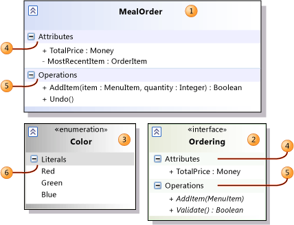
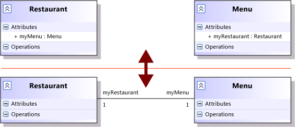
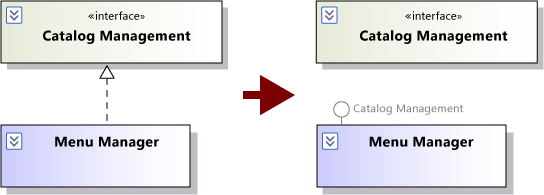
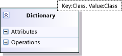

# UML Class Diagrams: Guidelines
In Visual Studio, you can use a *UML class diagram* to describe data types and their relationships separately from their implementation. The diagram is used to focus on the logical aspects of the classes, instead of their implementation.  
  
 To create a UML class diagram, on the **Architecture** menu, choose **New UML Diagram or Layer Diagram**.  
  
 To see which versions of Visual Studio support this feature, see [Version support for architecture and modeling tools](../vs140/what-s-new-for-design-in-visual-studio.md#VersionSupport).  
  
> [!NOTE]
>  This topic is about UML class diagrams. There is another kind of class diagram, which you can create and use to visualize program code. See [Designing and Viewing Classes and Types](http://go.microsoft.com/fwlink/?LinkId=142231).  
  
##  \<a name="Using"></a> Using UML Class Diagrams  
 You can use a UML class diagram for a variety of purposes:  
  
-   To provide an implementation-independent description of the types that are used in a system and passed between its components.  
  
     For example, the type Meal Order might be implemented in .NET code in the business layer, in XML at the interfaces between components, in SQL in the database, and in HTML in the user interface. Although these implementations are different in detail, the relationship between a Meal Order and other types, such as Menu and Payment, is always the same. The UML class diagram makes it possible to discuss these relationships separately from the implementations.  
  
-   To clarify the glossary of terms used for communication between the application and its users, and in descriptions of the users' needs. See [Clarifying User Requirements](../vs140/model-user-requirements.md).  
  
     For example, consider the user stories, use cases or other requirements descriptions of a restaurant application. In such a description, you would find terms like Menu, Order, Meal, Price, Payment, and so on. You could draw a UML class diagram that defines the relationships between these terms. This will reduce the risk of inconsistencies in the requirements descriptions, and in the user interface, and in the help documents.  
  
### Relationship to Other Diagrams  
 A UML class diagram is usually drawn together with other modeling diagrams to provide descriptions of the types that they use. In each case, the physical representation of the types is not implied by any of the diagrams.  
  
 Activity diagram  
  
 Type of data passing through an Object Node.  
  
 Types of input and output pins, and of activity parameter nodes.  
  
 See [UML Activity Diagrams: Guidelines](../vs140/uml-activity-diagrams--guidelines.md).  
  
 Sequence diagram  
  
 Types of parameters and return values of messages.  
  
 Types of the lifelines. The class of a lifeline should include operations for all the messages it can receive.  
  
 See [UML Sequence Diagrams: Guidelines](../vs140/uml-sequence-diagrams--guidelines.md).  
  
 Component diagram  
  
 Component interfaces, listing their operations.  
  
 See [UML Component Diagrams: Guidelines](../vs140/uml-component-diagrams--guidelines.md).  
  
 Use case diagram  
  
 Types mentioned in descriptions of the goals and steps of a use case.  
  
 See [UML Use Case Diagrams: Guidelines](../vs140/uml-use-case-diagrams--guidelines.md).  
  
##  \<a name="BasicSteps"></a> Basic Steps for Drawing Class Diagrams  
 For reference information about the elements on UML class diagrams, see [UML Class Diagrams: Overview](../vs140/uml-class-diagrams--reference.md).  
  
> [!NOTE]
>  Detailed steps for creating any of the modeling diagrams are described in [How to: Draw Modeling Diagrams](../vs140/edit-uml-models-and-diagrams.md).  
  
#### To create a UML Class diagram  
  
1.  On the **Architecture** menu, choose **New UML or Layer Diagram**.  
  
2.  Under **Templates**, choose **UML Class Diagram**.  
  
3.  Name the diagram.  
  
4.  In **Add to Modeling Project**, select an existing modeling project in your solution, or **Create a New Modeling Project**, and then choose **OK**.  
  
     A new class diagram appears with the **UMLClass Diagram** Toolbox. The Toolbox contains the required elements and relations.  
  
#### To draw a UML Class Diagram  
  
1.  To create a type, choose the **Class**, **Interface** or **Enumeration** tool on the Toolbox, and then click a blank part of the diagram. (If you can’t see the Toolbox, press CTRL+ALT+X.)  
  
2.  To add attributes or operations to the types, or literals to an enumeration, choose the **Attributes**, **Operations** or **Literals** heading in the type, and press ENTER.  
  
     You can write a signature such as `f(x:Boolean):Integer`. See [Attributes and Operations](#AttributesAndOperations).  
  
     To add several items quickly, press ENTER two times at the end of each item. You can use the arrow keys to move up and down the list.  
  
3.  To expand or collapse a type, choose the chevron icon at its upper-left. You can also expand and collapse the **Attributes** and **Operations** section of a class or interface.  
  
4.  To draw associations, inheritance, or dependency links between the types, click the appropriate tool, then the source type, and then the target type.  
  
5.  To create types in a package, create a package using the **Package** tool, and then create new types and packages within the package. You can also use the copy command to copy types, and paste them into a package.  
  
6.  Every diagram is a view on a model that is shared between other diagrams in the same project. To see a tree view of the complete model, choose **View**, **Other Windows**, **UML Model Explorer**.  
  
##  \<a name="UsingTypes"></a> Using Classes, Interfaces, and Enumerations  
 There are three standard kinds of classifier available on the toolbox. These are referred to as *types* throughout this document.  
  
   
  
-   Use **Classes** (1) to represent data or object types for most purposes.  
  
-   Use **Interfaces** (2) in a context where you have to differentiate between pure interfaces and concrete classes that have internal implementations. This difference is useful when the purpose of the diagram is to describe a software implementation. It is less useful when you are modeling passive data, or where you are defining concepts used to describe the user requirements.  
  
-   Use an **Enumeration** (3) to represent a type that has a limited number of literal values, for example `Stop` and `Go`.  
  
    -   Add the literal values to the enumeration. Give each one a separate name.  
  
    -   You can also provide a numeric value for each literal value, if you want. Open the shortcut menu for the literal in the enumeration, choose **Properties**, and then type a number in the **Value** field in the **Properties** window.  
  
 Give each type a unique name.  
  
### Getting Types from Other Diagrams  
 You can make types from another diagram appear on your UML class diagram.  
  
 UML Class Diagram  
  
 You can make a class appear on more than one UML class diagram. When you have created a class on one diagram, drag the class from **UML Model Explorer** onto the other diagram.  
  
 This is useful if you want each diagram to focus on a particular group of relationships.  
  
 For example, you could show the associations between a Meal Order and the restaurant Menu on one diagram, and the associations between Meal Order and Payment on another diagram.  
  
 Component Diagram  
  
 If you have defined interfaces on the components in a component diagram, you can drag an interface from **UML Model Explorer** onto the class diagram. In the class diagram, you can define the methods that the interface includes.  
  
 See [Component Diagram: Guidelines](../vs140/uml-component-diagrams--guidelines.md).  
  
 UML Sequence Diagram  
  
 You can create classes and interfaces from lifelines in a sequence diagram, and then drag the class from **UML Model Explorer** to a UML class diagram. Each lifeline in a sequence diagram represents an instance of an object, component, or actor.  
  
 To create a class from a lifeline, open the shortcut menu for the lifeline, and then choose **Create Class** or **Create Interface**. See [UML Sequence Diagram: Guidelines](../vs140/uml-sequence-diagrams--guidelines.md).  
  
##  \<a name="AttributesAndOperations"></a> Attributes and Operations  
 An attribute (4) is a named value that every instance of a type can have. Accessing an attribute does not change the state of the instance.  
  
 An operation (5) is a method or function that instances of the type can perform. It can return a value. If its **isQuery** property is true, it cannot change the state of the instance.  
  
 To add an attribute or operation to a type, open the shortcut menu for the type, choose **Add**, and then choose **Attribute** or **Operation**.  
  
 To see its properties, open the shortcut menu for the attribute or operation, and then choose **Properties**. The properties appear in the **Properties** window.  
  
 To see the properties of an operation's parameters, choose **[…]**in the **Parameters** property. A new properties dialog box appears.  
  
 For detailed information about all the properties that you can set, see:  
  
-   [Properties of Attributes in UML Class Diagrams](../vs140/properties-of-attributes-on-uml-class-diagrams.md)  
  
-   [Properties of Operations in UML Class Diagrams](../vs140/properties-of-operations-on-uml-class-diagrams.md)  
  
### Types of Attributes and Operations  
 Each *Type* of an attribute or operation, and each parameter type, can be one of the following:  
  
-   **(none)** - You can leave a type unspecified in the signature by omitting the preceding colon (`:`).  
  
-   One of the standard primitive types: **Boolean**, **Integer**, **String**.  
  
-   A type that is defined in your model.  
  
-   A parameterized value of a template type, written Template\<Parameter>. See [Template Types](#Templates).  
  
 You can also write the name of a type that you have not yet defined in your model. The name will be listed under **Unspecified Types** in UML Model Explorer.  
  
> [!NOTE]
>  If you subsequently define a class or interface of that name in your model, the older attributes and operations will still refer to the element in Unspecified Types. If you want to change them to refer to the new class, you must visit each attribute or operation and reset the type, selecting the new class from the drop-down menu.  
  
#### Multiple Types  
 You can set a multiplicity of any attribute, operation, or parameter type.  
  
 The allowed values are as follows:  
  
 `[1]`  
  
 One value of the given type. This is the default.  
  
 `[0..1]`  
  
 **Null** or a value of the given type.  
  
 `[*]`  
  
 A collection of any number of instances of the given type.  
  
 `[1..*]`  
  
 A collection of at least one instance of the given type.  
  
 `[n..m]`  
  
 A collection of between `n` and `m` instances of the given type.  
  
 If the multiplicity is more than 1, you can also set these properties:  
  
-   **IsOrdered** - If true, the collection has a defined order.  
  
-   **IsUnique** - If true, there are no duplicate values in the collection.  
  
### Visibility  
 *Visibility* indicates whether the attribute or operation can be accessed outside the class definition. The allowed values are as follows:  
  
 **Public**  
  
 **+**  
  
 Accessible from all other types.  
  
 **Private**  
  
 **-**  
  
 Accessible only to the internal definition of this type.  
  
 **Package**  
  
 **~**  
  
 Accessible only within the package that contains this type, and in any packages that explicitly import it. See [Defining Namespaces and Packages](#Packages).  
  
 **Protected**  
  
 **#**  
  
 Accessible only to this type and types that inherit from it. See [Inheritance](#Inheritance).  
  
### Setting the Signature of an Attribute or an Operation  
 The signature of an attribute or an operation is a collection of properties that includes its visibility, name, parameters (for operations), and type.  
  
 You can write a signature directly in the diagram. Click the attribute or operation to select it, and then click it again.  
  
 Write the signature in the form:  
  
```  
visibility attribute-name : Type  
```  
  
 \- or -  
  
```  
visibility operation-name (parameter1 : Type1, ...) : Type  
```  
  
 For example:  
  
```  
+ AddItem (item : MenuItem, quantity : Integer) : Boolean  
```  
  
 Use the short form of visibility. The default value is `+` (public).  
  
 Each type can be types that you have defined in the model, standard types such as Integer or String, or the name of a new type that you have not defined yet.  
  
> [!NOTE]
>  If you write a name without a type in a parameter list, it indicates the name of the parameter, instead of its type. In this example, MenuItem and Integer become the names of two parameters with unspecified types:  
>   
>  `AddItem(MenuItem, Integer) /* parameter names, not types! */`  
  
 To set the multiplicity of a type in a signature, write the multiplicity in square brackets following the type name, for example:  
  
```  
+ AddItems (items : MenuItem [1..*])  
+ MenuContent : MenuItem [*]  
```  
  
 If the attribute or operation is static, its name will appear underlined in the signature. If it is abstract, the name will appear in italic font.  
  
 However, you can only set the **Is Static** and **Is Abstract** properties in the **Properties** window.  
  
#### Full Signature  
 When you edit the signature of an attribute or operation, some additional properties might appear at the end of the line, and after each parameter. They appear enclosed in braces {…}. You can edit or add these properties. For example:  
  
```  
+ AddItems (items: MenuItem [1..*] {unique, ordered})  
+ GetItems (filter: String) : MenuItem [*] {ordered, query}  
```  
  
 These properties are as follows:  
  
 `unique`  
  
 **Is Unique**  
  
 There are no duplicate values in the collection. Applies to types with multiplicity greater than 1.  
  
 `ordered`  
  
 **Is Ordered**  
  
 The collection is a sequence. If false, there is no definite first item. Applies to types with multiplicity greater than 1.  
  
 `query`  
  
 **Is Query**  
  
 The operation does not change the state of its instance. Applies only to operations.  
  
 `/`  
  
 **Is Derived**  
  
 The attribute is computed from values of other attributes or associations.  
  
 "/" appears before the name of an attribute. For example:  
  
```  
/TotalPrice: Integer  
```  
  
 Usually the full signature appears on the diagram only while you are editing it. When you finish editing, the additional properties are hidden. If you want to see the full signature all the time, open the shortcut menu for the type, and then choose **Show Full Signature**.  
  
##  \<a name="Associations"></a> Drawing and Using Associations  
 Use an association to represent any kind of linkage between two elements, regardless of how the linkage is implemented in the software. For example, you could use an association to represent a pointer in C#, a relation in a database, or a cross reference from one part of an XML file to another. It can represent an association between objects in the real world, such as the earth and the sun. The association does not say how the link is represented, only that the information exists.  
  
### Properties of an Association  
 After you have created an association, set its properties. Open the shortcut menu for the association, and then choose **Properties**.  
  
 In addition to the properties of the association as a whole, each *role*, that is, each end of the association, has some properties of its own. To view them, expand the **First Role** and **Second Role** properties.  
  
 Some properties of each role are directly visible on the diagram. They are as follows:  
  
-   Role name. This appears at the appropriate end of the association on the diagram. You can set it either on the diagram or in the **Properties** window.  
  
-   **Multiplicity**, which defaults to **1**. This also appears on the diagram near the appropriate end of the association.  
  
-   **Aggregation**. This appears as a diamond shape at one end of the connector. You can use it to indicate that instances at the aggregating role own or contain instances of the other.  
  
-   **Is Navigable**. If true for only one role, an arrow appears in the navigable direction. You can use this to indicate navigability of links and database relations in the software.  
  
 For the full details of these and other properties, see [Properties of Associations in UML Class Diagrams](../vs140/properties-of-associations-on-uml-class-diagrams.md).  
  
### Navigability  
 When you draw an association, it has an arrow at one end, signifying that the association is navigable in that direction. This is useful if your class diagram represents software classes, and the associations represent pointers or references. But when you use a class diagram to represent entities and relations or business concepts, it is less relevant to represent navigability. In this case, you might prefer to draw associations without arrows. You can do so by setting the **Is Navigable** property on both ends of the association to True. To make this easier, you can download the code sample [UML Domain Modeling](http://code.msdn.microsoft.com/UML-Domain-Modeling-6df6f7f4).  
  
### Attributes and Associations  
 An association is a pictorial way of showing an attribute. For example, instead of creating a class Restaurant with an attribute of type Menu, you can draw an association from Restaurant to Menu.  
  
 Each attribute name becomes a role name. It appears at the opposite end of the association from the owning type. Look, for example, at `myMenu` in the illustration.  
  
 Generally, it is better to use attributes only for types that you would not draw on the diagram, such as primitive types.  
  
   
  
##  \<a name="Inheritance"></a> Inheritance  
 Use the **Inheritance** tool to create the following relationships:  
  
-   A *generalization* relationship between a specialized type and a general type  
  
     \- or -  
  
-   A *realization* relation between a class and an interface that it implements.  
  
 You cannot create loops in inheritance relationships.  
  
### Generalization  
 Generalization means that the specializing or derived type inherits attributes, operations, and associations of the general or base type.  
  
 The general type appears at the arrowhead end of the relationship.  
  
 The inherited operations and attributes are not typically shown in the specializing types. But you can add inherited operations to the specializing type's operations list. This is useful if you want to override some of an operation's properties in the specializing type, or if you want to indicate that the implementing code should do so.  
  
##### To override an operation's definition in a specializing type  
  
1.  Click the generalization relation.  
  
     It appears highlighted, and an Action tag appears near to it.  
  
2.  Click the Action tag, and then click **Override Operations**.  
  
     The **Override Operations** dialog box appears.  
  
3.  Select the operations that you want to appear in the specializing type, and then click **OK**.  
  
 The operations that you selected now appear in the specializing type.  
  
### Realization  
 Realization means that a class implements the attributes and operations specified by the interface. The interface is at the arrow end of the connector.  
  
 When you create a realization connector, the operations of the interface are automatically replicated in the realizing class. If you add new operations to an interface, they are replicated in its realizing classes.  
  
 After you have created a realization relationship, you can convert it to lollipop notation. Right-click the relationship and choose **Show as Lollipop**.  
  
 This lets you show the interfaces that a class implements, without cluttering the class diagrams with realization links. You can also show the interface and the classes that realize it on separate diagrams.  
  
   
  
##  \<a name="Templates"></a> Template Types  
 You can define a generic or template type that can be parameterized by other types or values.  
  
 For example, you can create a generic Dictionary parameterized by key and value types:  
  
   
  
#### To create a template type  
  
1.  Create a class or interface. This will become your template type. Name it accordingly, for example, `Dictionary`.  
  
2.  Open the shortcut menu for the new type, and then choose **Properties**.  
  
3.  In the **Properties** window, click **[…]** in the **Template Parameters** field.  
  
     The **Template Parameter Collection Editor** dialog box appears.  
  
4.  Choose **Add**.  
  
5.  Set the name property to a parameter name for your template type, for example, `Key`.  
  
6.  Set **Parameter Kind**. The default is **Class**.  
  
7.  If you want the parameter to accept only derived classes of a particular base class, set **Constrained Value** to the base class that you want.  
  
8.  Add as many parameters as you need, then choose **OK**.  
  
9. Add attributes and operations to the template type as you would do for other classes.  
  
     You can use parameters whose kind is **Class**, **Interface** or **Enumeration** in the definition of attributes and operations. For example, by using parameter classes `Key` and `Value`, you could define this operation in `Dictionary`:  
  
     `Get(k : Key) : Value`  
  
     You can use a parameter whose kind is **Integer** as a bound in a multiplicity. For example, a parameter integer max could be used to define the multiplicity of an attribute as `[0..max]`.  
  
 When you have created template types, you can use them to define template bindings:  
  
   
  
#### To use a template type  
  
1.  Create a new type, for example, `AddressTable`.  
  
2.  Open the shortcut menu for the new type, and then choose **Properties**.  
  
3.  In the **Template Binding** property, select the template type, for example `Dictionary`, from the drop-down list.  
  
4.  Expand the **Template Binding** property.  
  
     A row appears for each parameter of the template type.  
  
5.  Set each parameter to a suitable value. For example, set the `Key` parameter to a class called `Name`.  
  
##  \<a name="Packages"></a> Packages  
 You can view packages in a UML class diagram. A package is a container for other model elements. You can create any element inside a package. On the diagram, the elements inside the package will move around when you move the package.  
  
 You can use the collapse/expand control to hide or show the contents of the package.  
  
 See [Defining Namespaces with Packages](../vs140/define-packages-and-namespaces.md).  
  
##  \<a name="generating"></a> Generating Code from UML Class Diagrams  
 To start implementing the classes on a UML class diagram, you can generate C# code or customize the templates for code generation. To start generating code by using the provided C# templates:  
  
-   Open the shortcut menu for the diagram or an element, choose **Generate Code**, and then set the necessary properties.  
  
     For more information about how to set these properties and customize the provided templates, see [How to: Generate Code from UML Class Diagrams](../vs140/generate-code-from-uml-class-diagrams.md).  
  
## See Also  
 [How to Draw Modeling Diagrams](../vs140/edit-uml-models-and-diagrams.md)   
 [UML Class Diagrams: Overview](../vs140/uml-class-diagrams--reference.md)   
 [Clarifying User Requirements](../vs140/model-user-requirements.md)   
 [Component Diagrams: Overview](../vs140/uml-component-diagrams--reference.md)   
 [Sequence Diagrams: Overview](../vs140/uml-sequence-diagrams--reference.md)   
 [Use Case Diagrams: Overview](../vs140/uml-use-case-diagrams--reference.md)   
 [Activity Diagrams: Overview](../vs140/uml-component-diagrams--reference.md)