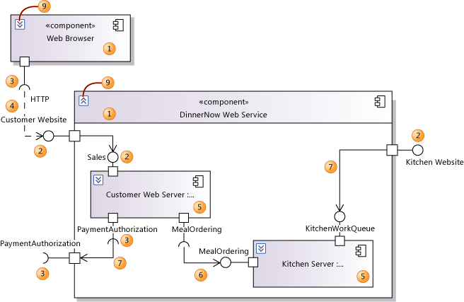

# UML Component Diagrams: Reference
In Visual Studio, a *component diagram* shows the parts of a design for a software system. A component diagram helps you visualize the high-level structure of the system and the service behavior that those pieces provide and consume through interfaces. To create a UML component diagram, on the **Architecture** menu, click **New UML or Layer Diagram**.  
  
 To see which versions of Visual Studio support this feature, see [Version support for architecture and modeling tools](../vs140/what-s-new-for-design-in-visual-studio.md#VersionSupport).  
  
 You can use a component diagram to describe a design that is implemented in any language or style. It is only necessary to identify parts of the design that interact with the other parts of the design through a restricted set of inputs and outputs. The components can be of any scale, and can be interconnected in any manner.  
  
 For more information about how to use component diagrams in the process of design, see [Modeling the Architecture of a Software System](../vs140/model-your-app-s-architecture.md).  
  
> [!NOTE]
>  This topic describes the elements that you can use in Component diagrams. For more detailed in information about how to draw Component diagrams see [Component Diagrams: Guidelines for Drawing](../vs140/uml-component-diagrams--guidelines.md). For more information about how to draw modeling diagrams in general, see [How to: Draw Modeling Diagrams](../vs140/edit-uml-models-and-diagrams.md).  
  
## Reading Component Diagrams  
 The following table describes the elements that you can use on a component diagram, together with their main properties. For a full list of the properties of the elements, see [Properties of Elements in Component Diagrams](../vs140/properties-of-elements-on-uml-component-diagrams.md).  
  
   
  
|**Shape**|**Element**|**Description and Main Properties**|  
|---------------|-----------------|-----------------------------------------|  
|1|**Component**|A reusable piece of system functionality. A component provides and consumes behavior through interfaces, and can use other components.   You can hide or show the internal parts of a component using the expand/collapse control (9).   A component is a kind of class.   -   **Is Indirectly Instantiated**. If true (default), the component exists only as a design artifact. At run time, only its parts exist.|  
|2|**Provided Interface Port**|Represents a group messages or calls that a component implements and that other components or external systems can use. A port is a property of a component that has an interface as its type.|  
|3|**Required Interface Port**|Represents a group of messages or calls that the component sends to other components or external systems. The component is designed to be coupled to components that provide at least these operations. The port has an interface as its type.|  
|4|**Dependency**|Can be used to indicate that a Required Interface on one component can be satisfied by a Provided Interface on another.   Dependencies can also be used more generally between model elements, to show that the design of one depends on the design of the other.|  
|5|**Part**|An attribute of a component, whose type is a usually another component. A part is used in the internal design of its parent component. Parts are shown graphically, nested within the parent component.   To create a Part of an existing component type, drag the component from UML Model Explorer onto the owner component.   To create a Part of a new type, click the **Component** tool and then click the owner component.   For example, a component `Car` has parts `engine:CarEngine`, `backLeft:Wheel`, `frontRight:Wheel`, and so on.   More than one part can have the same type, and different components can have parts of the same type.   -   **Type**. The type of the part, which is defined elsewhere in the model. Typically, the type is another component. -   **Multiplicity**. Defaults to 1. You can set it to **0..1** to indicate that the part can have the value **null**, **\*** to indicate that the part is a collection of instances of the given type, or to any expression that can be evaluated to a range of numbers.|  
|6|**Part Assembly**|A connection between the required interface ports of one part and the provided interface ports of another. The implementation of a part assembly can vary from one component to another. The connected parts must have the same parent component.|  
|7|**Delegation**|Links a port to an interface of one of the component's parts. Indicates that messages sent to the component are dealt with by the part, or that messages sent from the part are sent out from the parent component.|  
|(not shown)|**Generalization**|Indicates that one component inherits from another component. Parts and interfaces are inherited.|  
|9|Collapse/Expand control|Use this to hide or show a component's internal parts.|  
|(not shown)|**Comment**|For additional notes. You can link a comment to any number of elements on the diagram by using the **Connector** tool.|  
  
## See Also  
 [How to Draw Modeling Diagrams](../vs140/edit-uml-models-and-diagrams.md)   
 [Component Diagrams: Guidelines for Drawing](../vs140/uml-component-diagrams--guidelines.md)   
 [Ensuring your Application Supports User Requirements](../vs140/validate-your-system-during-development.md)   
 [Use Case Diagrams: Overview](../vs140/uml-use-case-diagrams--reference.md)   
 [UML Class Diagrams: Overview](../vs140/uml-class-diagrams--reference.md)   
 [Activity Diagrams: Overview](../vs140/uml-activity-diagrams--reference.md)   
 [Sequence Diagrams: Overview](../vs140/uml-sequence-diagrams--reference.md)