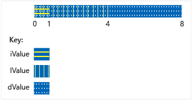

# Unions
A <CodeContentPlaceHolder>6\</CodeContentPlaceHolder> is a user-defined type in which all members share the same memory location. This means that at any given time a union can contain no more than one object from its list of members. It also means that no matter how many members a union has, it always uses only enough memory to store the largest member.  
  
 Unions can be useful for conserving memory when you have lots of objects and/or limited memory. However they require extra care to use correctly because you are responsible for ensuring that you always access the last member that was written to. If any member types have a non-trivial constructor, then you must write additional code to explicitly construct and destroy that member. Before using a union, consider whether the problem you are trying to solve could be better expressed by using a base class and derived classes.  
  
## Syntax  
  
<CodeContentPlaceHolder>0\</CodeContentPlaceHolder>  
#### Parameters  
 <CodeContentPlaceHolder>7\</CodeContentPlaceHolder>  
 The type name given to the union.  
  
 <CodeContentPlaceHolder>8\</CodeContentPlaceHolder>  
 Members that the union can contain. See Remarks.  
  
## Remarks  
  
## Declaring a Union  
 Begin the declaration of a union with the <CodeContentPlaceHolder>9\</CodeContentPlaceHolder> keyword, and enclose the member list in curly braces:  
  
<CodeContentPlaceHolder>1\</CodeContentPlaceHolder>  
## Using unions  
 In the previous example, any code that accesses the union needs to know which member is holding the data. The most common solution to this problem is to enclose the union in a struct along with an additional enum member that indicates the type of the data currently being stored in the union. This is called a *discriminated union* and the following example shows the basic pattern.  
  
<CodeContentPlaceHolder>2\</CodeContentPlaceHolder>  
 In the previous example, note that the union in the Input struct has no name. This is an anonymous union and its members can be accessed as if they were direct members of the struct. For more information about anonymous unions, see the section below.  
  
 Of course, the previous example shows a problem that could also be solved by using classes that derive from a common base class, and branching your code based on the runtime type of each object in the container. This may result in code that easier to maintain and understand, but it might also be slower than using unions. Also, with a union, you can store completely unrelated types, and dynamically change the type of the value that is stored without changing the type of the union variable itself. Thus you can create a heterogeneous array of MyUnionType whose elements store different values of different types.  
  
 Note that the <CodeContentPlaceHolder>10\</CodeContentPlaceHolder> struct in the preceding example can be easily misused. It is completely up to the user to use the discriminator correctly to access the member that holds the data. You can protect against misuse by making the union private and providing special access functions, as shown in the next example.  
  
## Unrestricted Unions (C++11)  
 In C++03 and earlier a union can contain non-static data members with class type as long as the type has no user provided constructors, destructors or assignment operators. In C++11, these restrictions are removed. If you include such a member in your union then the compiler will automatically mark any special member functions that are not user provided as deleted. If the union is an anonymous union inside a class or struct, then any special member functions of the class or struct that are not user provided are marked as deleted. The following example shows how to handle the case where one of the members of the union has a member that requires this special treatment:  
  
<CodeContentPlaceHolder>3\</CodeContentPlaceHolder>  
 Unions cannot store references. Unions don’t support inheritance, therefore a union itself cannot be used as a base class, or inherit from another class, or have virtual functions.  
  
## Initializing unions  
 You can declare and initialize a union in the same statement by assigning an expression enclosed in braces. The expression is evaluated and assigned to the first field of the union.  
  
<CodeContentPlaceHolder>4\</CodeContentPlaceHolder>  
 The <CodeContentPlaceHolder>11\</CodeContentPlaceHolder> union is arranged in memory (conceptually) as shown in the following figure.  
  
   
Storage of Data in NumericType Union  
  
## Anonymous unions  
 Anonymous unions are unions that are declared without a *class-name* or *declarator-list*.  
  
<CodeContentPlaceHolder>5\</CodeContentPlaceHolder>  
 Names declared in an anonymous union are used directly, like nonmember variables. Therefore, the names declared in an anonymous union must be unique in the surrounding scope.  
  
 In addition to the restrictions listed in [Union Member Data](../vs140/union-member-data.md), anonymous unions are subject to additional restrictions:  
  
-   They must also be declared as **static** if declared in file or namespace scope.  
  
-   They can have only public members; private and protected members in anonymous unions generate errors.  
  
-   They cannot have member functions.  
  
## See Also  
 [Classes and Structs](../vs140/classes-and-structs--c---.md)   
 [Keywords](../vs140/keywords--c---.md)   
 [Anonymous Unions](../vs140/anonymous-unions.md)   
 [class](../vs140/class--c---.md)   
 [struct](../vs140/struct--c---.md)