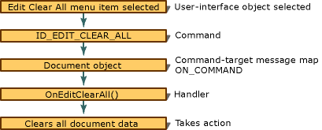
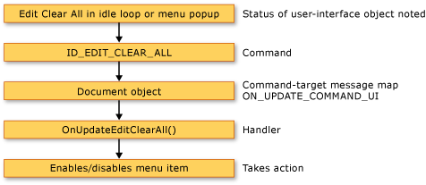

# User-Interface Objects and Command IDs
Menu items, toolbar buttons, and accelerator keys are "user-interface objects" capable of generating commands. Each such user-interface object has an ID. You associate a user-interface object with a command by assigning the same ID to the object and the command. As explained in [Messages](../vs140/messages.md), commands are implemented as special messages. The figure "Commands in the Framework" below shows how the framework manages commands. When a user-interface object generates a command, such as `ID_EDIT_CLEAR_ALL`, one of the objects in your application handles the command — in the figure below, the document object's `OnEditClearAll` function is called via the document's message map.  
  
   
Commands in the Framework  
  
 The figure "Command Updating in the Framework" below shows how MFC updates user-interface objects such as menu items and toolbar buttons. Before a menu drops down, or during the idle loop in the case of toolbar buttons, MFC routes an update command. In the figure below, the document object calls its update command handler, `OnUpdateEditClearAll`, to enable or disable the user-interface object.  
  
   
Command Updating in the Framework  
  
## See Also  
 [Messages and Commands in the Framework](../vs140/messages-and-commands-in-the-framework.md)