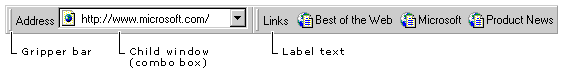

# Using CReBarCtrl
A rebar control acts as a container for child windows. These child windows, often other controls, are assigned to a rebar control band. A rebar control can contain one or more bands, with each band having any combination of a gripper bar, a bitmap, a text label, and a child window. However, bands cannot contain more than one child window.  
  
 The following illustration shows a rebar control that has two bands. One contains a gripper bar, a text label ("Address"), and a combo box child window. The other band contains a gripper bar, a text label, and a flat toolbar (implemented with a child window).  
  
   
  
## What do you want to know more about?  
  
-   [CReBar vs. CReBarCtrl](../vs140/crebar-vs.-crebarctrl.md)  
  
-   [Creating a Rebar Control](../vs140/creating-a-rebar-control.md)  
  
-   [Rebar Controls and Bands](../vs140/rebar-controls-and-bands.md)  
  
-   [Using an Image List with a Rebar Control](../vs140/using-an-image-list-with-a-rebar-control.md)  
  
-   [Using a Dialog Bar with a Rebar Control](../vs140/using-a-dialog-bar-with-a-rebar-control.md)  
  
-   [Processing Notification Messages in a Rebar Control](../vs140/processing-notification-messages-in-a-rebar-control.md)  
  
## See Also  
 [Controls (MFC)](../vs140/controls--mfc-.md)