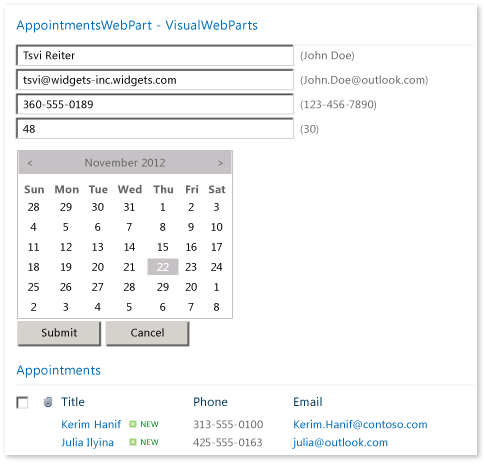
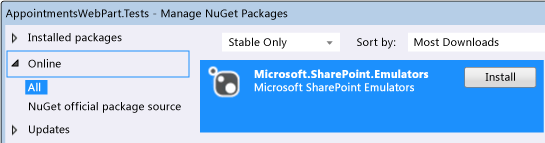
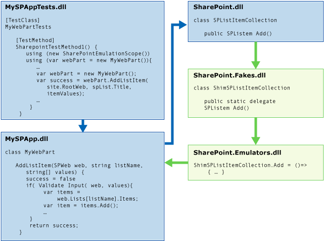
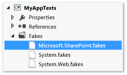
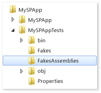

# Using emulators to isolate unit tests for Sharepoint 2010 applications
The Microsoft.SharePoint.Emulators package provides a set of libraries that help you to create isolated unit tests for Microsoft SharePoint 2010 applications. Emulators use [shims](../vs140/using-shims-to-isolate-your-application-from-other-assemblies-for-unit-testing.md) from the [Microsoft Fakes](../vs140/isolating-code-under-test-with-microsoft-fakes.md) isolation framework to create lightweight in-memory objects that mimic the most common objects and methods of the SharePoint API. When a SharePoint method is not emulated, or when you want to change the default behavior of an emulator, you can create Fakes shims to provide the results that you want.  
  
 Existing test methods and classes can be easily converted to run in the Emulator context. This capability lets you create dual-use tests. A dual-use test can toggle between integration tests against the real SharePoint API and isolated unit tests that use the emulators.  
  
##  \<a name="BKMK_In_this_topic">\</a> In this topic  
 [Requirements](#BKMK_Requirements)  
  
 [The AppointmentsWebPart example](#BKMK_The_AppointmentsWebPart_example)  
  
 [Converting an existing test](#BKMK_Converting_an_existing_test)  
  
-   [Adding the Emulators package to a test project](#BKMK_Adding_the_Emulators_package_to_a_test_project)  
  
-   [Running a test method with emulation](#BKMK__Running_a_test_method_in_the_emulation_context)  
  
 [Creating dual-use classes and methods](#BKMK_Creating_dual_use_classes_and_methods)  
  
 [Using TestInitialize and TestCleanup attributes to create a dual-use test class](#BKMK_Using_TestInitialize_and_TestCleanup_attributes_to_create_a_dual_use_test_class)  
  
 [Handling non-emulated SharePoint methods](#BKMK_Handling_non_emulated_SharePoint_methods)  
  
 [Writing emulation tests from scratch, and a summary](#BKMK_Writing_emulation_tests_from_scratch__and_a_summary)  
  
 [Example](#BKMK_Example)  
  
 [Emulated SharePoint types](#BKMK_Emulated_SharePoint_types)  
  
##  \<a name="BKMK_Requirements">\</a> Requirements  
  
-   Microsoft SharePoint 2010 (SharePoint 2010 Server or SharePoint 2010 Foundation)  
  
-   Microsoft Visual Studio Enterprise  
  
-   Microsoft SharePoint Emulators NuGet package  
  
 You should also be familiar with the [basics of unit testing in Visual Studio](../vs140/unit-test-basics.md) and some knowledge of [Microsoft Fakes](../vs140/isolating-code-under-test-with-microsoft-fakes.md).  
  
##  \<a name="BKMK_The_AppointmentsWebPart_example">\</a> The AppointmentsWebPart example  
 The AppointmentsWebPart lets you view and manage a SharePoint list of your appointments.  
  
   
  
 We'll test two methods of the web part in this example:  
  
-   The <CodeContentPlaceHolder>8\</CodeContentPlaceHolder> method validates the list item values passed to the method and creates a new entry in a list on a specified SharePoint web.  
  
-   The <CodeContentPlaceHolder>9\</CodeContentPlaceHolder> method returns the details of today's appointments.  
  
 [In this topic](#BKMK_In_this_topic)  
  
##  \<a name="BKMK_Converting_an_existing_test">\</a> Converting an existing test  
 In a typical test of a method in a SharePoint component, the test method creates a temporary site in SharePoint Foundation and adds the SharePoint components to the site that the code under test requires. The test method then creates and exercises an instance of the component. At the end of the test, the site is torn down.  
  
 The <CodeContentPlaceHolder>10\</CodeContentPlaceHolder> method of our code under test is probably one of the first methods written for the component:  
  
<CodeContentPlaceHolder>0\</CodeContentPlaceHolder>  
 The first test of the functionality in <CodeContentPlaceHolder>11\</CodeContentPlaceHolder> method might look like this:  
  
<CodeContentPlaceHolder>1\</CodeContentPlaceHolder>  
 Although this test method does verify that the <CodeContentPlaceHolder>12\</CodeContentPlaceHolder> method correctly adds a new entry to the list, it is more an integration test of the web part than a test of the specific behavior of your code. The external dependencies to SharePoint and the SharePoint API can cause the test to fail for reasons other than the user code in the <CodeContentPlaceHolder>13\</CodeContentPlaceHolder> method. The overhead in creating and destroying the SharePoint site can also make the test too slow to run as a regular part of the coding process. Performing the setup and destruction of the site for every test method only compounds the problem of creating efficient developer unit tests.  
  
 Microsoft SharePoint emulators give you a set of object and method "doubles" that mimic the behavior of the most common SharePoint APIs. The emulated methods are lightweight implementations of the SharePoint API that do not require SharePoint to run. By using Microsoft Fakes to detour calls to the SharePoint API to the method doubles of SharePoint Emulators, you isolate your tests and make sure that you are testing the code you want. When you call SharePoint methods that are not emulated, you can use Fakes directly to create the desired behavior.  
  
 [In this topic](#BKMK_In_this_topic)  
  
###  \<a name="BKMK_Adding_the_Emulators_package_to_a_test_project">\</a> Adding the Emulators package to a test project  
 To add the SharePoint emulators to a test project:  
  
1.  Select the test project in Solution Explorer.  
  
2.  Choose **Manage NuGet Packages ...** on the shortcut menu.  
  
3.  Search the **Online** category for <CodeContentPlaceHolder>14\</CodeContentPlaceHolder>, and then choose **Install**.  
  
   
  
 [In this topic](#BKMK_In_this_topic)  
  
###  \<a name="BKMK__Running_a_test_method_in_the_emulation_context">\</a> Running a test method with emulation  
 Installing the package adds references to the required libraries to your projects. To make it easy to use emulators in an existing test class, add the namespaces <CodeContentPlaceHolder>15\</CodeContentPlaceHolder> and <CodeContentPlaceHolder>16\</CodeContentPlaceHolder>.  
  
 To enable emulation in your test methods, wrap the method body in a <CodeContentPlaceHolder>17\</CodeContentPlaceHolder> statement that creates a <CodeContentPlaceHolder>18\</CodeContentPlaceHolder> object. For example:  
  
<CodeContentPlaceHolder>2\</CodeContentPlaceHolder>  
 When the test method is executed, the Emulator runtime calls Microsoft Fakes to dynamically inject code into SharePoint methods to divert the calls to these methods to delegates that are declared in Microsoft.SharePoint.Fakes.dll. Microsoft.SharePoint.Emulators.dll implements the delegates for emulated methods, closely mimicking the actual SharePoint behavior. When the test method or the component under test calls a SharePoint method, the behavior that results is that of the emulation.  
  
   
  
 [In this topic](#BKMK_In_this_topic)  
  
##  \<a name="BKMK_Creating_dual_use_classes_and_methods">\</a> Creating dual-use classes and methods  
 To create methods that can be used for both integration tests against the real SharePoint API and isolated unit tests that use emulators, use the overloaded constructor <CodeContentPlaceHolder>19\</CodeContentPlaceHolder> to wrap your test method code. The two values of the <CodeContentPlaceHolder>20\</CodeContentPlaceHolder> enum specify whether the scope uses emulators (<CodeContentPlaceHolder>21\</CodeContentPlaceHolder>) or whether the scope uses the SharePoint API (<CodeContentPlaceHolder>22\</CodeContentPlaceHolder>).  
  
 For example, here's how you can modify the previous test to be dual-use:  
  
<CodeContentPlaceHolder>3\</CodeContentPlaceHolder>  
 [In this topic](#BKMK_In_this_topic)  
  
##  \<a name="BKMK_Using_TestInitialize_and_TestCleanup_attributes_to_create_a_dual_use_test_class">\</a> Using TestInitialize and TestCleanup attributes to create a dual-use test class  
 If you run all or most of the tests in a class using <CodeContentPlaceHolder>23\</CodeContentPlaceHolder>, you can take advantage of class-level techniques to set the emulation mode.  
  
-   Test class methods that attributed with \<xref:Microsoft.VisualStudio.TestTools.UnitTesting.TestInitializeAttribute*> and \<xref:Microsoft.VisualStudio.TestTools.UnitTesting.TestCleanupAttribute*> can create and destroy the scope.  
  
-   Setting the <CodeContentPlaceHolder>24\</CodeContentPlaceHolder> at the class level can let you automate the mode change between <CodeContentPlaceHolder>25\</CodeContentPlaceHolder> and <CodeContentPlaceHolder>26\</CodeContentPlaceHolder>.  
  
 A class method that is attributed with <CodeContentPlaceHolder>27\</CodeContentPlaceHolder> is run at the start of each test method and a method that is attributed with <CodeContentPlaceHolder>28\</CodeContentPlaceHolder> runs at the end of each test method. You can declare a private field for the <CodeContentPlaceHolder>29\</CodeContentPlaceHolder> object at the class level, initialize it in the <CodeContentPlaceHolder>30\</CodeContentPlaceHolder> attributed method, and then dispose of the object in the <CodeContentPlaceHolder>31\</CodeContentPlaceHolder> attributed method.  
  
 You can use any method that you choose to automate the selection of the <CodeContentPlaceHolder>32\</CodeContentPlaceHolder>. One way is to check for the existence of a symbol by using preprocessor directives. For example, to run the test methods in a class using emulators, you can define a symbol such as <CodeContentPlaceHolder>33\</CodeContentPlaceHolder> in the test project file or on the build command line. If the symbol is defined, a class level <CodeContentPlaceHolder>34\</CodeContentPlaceHolder> constant is declared and set to <CodeContentPlaceHolder>35\</CodeContentPlaceHolder>. Otherwise, the constant is set to <CodeContentPlaceHolder>36\</CodeContentPlaceHolder>.  
  
 Here's an example of the test class that demonstrates how to use preprocessor directives and the <CodeContentPlaceHolder>37\</CodeContentPlaceHolder> and <CodeContentPlaceHolder>38\</CodeContentPlaceHolder> attributed methods to set the emulation mode.  
  
<CodeContentPlaceHolder>4\</CodeContentPlaceHolder>  
 [In this topic](#BKMK_In_this_topic)  
  
##  \<a name="BKMK_Handling_non_emulated_SharePoint_methods">\</a> Handling non-emulated SharePoint methods  
 Not all SharePoint types are emulated, and not all methods in some emulated types are emulated. If the code under test calls a SharePoint method that is not emulated, the method throws a <CodeContentPlaceHolder>39\</CodeContentPlaceHolder> exception. When an exception occurs, you add a Fakes shim for the SharePoint method.  
  
 **Setting up Sharepoint Fakes**  
  
 To explicitly call Microsoft Fakes shims:  
  
1.  If you want to shim a SharePoint class that is not emulated, edit the Microsoft.SharePoint.fakes file and add the class to the list of shimmed classes. See the [Configuring code generation of stubs and shims](http://msdn.microsoft.com/library/hh708916.aspx#bkmk_configuring_code_generation_of_stubs) section of [Code generation, compilation, and naming conventions in Microsoft Fakes](../vs140/code-generation--compilation--and-naming-conventions-in-microsoft-fakes.md).  
  
       
  
2.  Rebuild the test project at least once after you have installed the Microsoft SharePoint Emulators package and if you have edited the Microsoft.SharePoint.Fakes file. Building the project creates and populates a **FakesAssembly** folder in your on-disk project root folder.  
  
       
  
3.  Add a reference to the **Microsoft.SharePoint.14.0.0.0.Fakes.dll** assembly that is located in the **FakesAssembly** folder.  
  
4.  (Optional) Add a namespace directive for to the test class for <CodeContentPlaceHolder>40\</CodeContentPlaceHolder>, <CodeContentPlaceHolder>41\</CodeContentPlaceHolder> and any nested namespace of <CodeContentPlaceHolder>42\</CodeContentPlaceHolder>that you want to use.  
  
 **Implementing the shim delegate for a SharePoint method**  
  
 In our example project, the <CodeContentPlaceHolder>43\</CodeContentPlaceHolder> method calls the [SPList.GetItems(SPQuery)](http://msdn.microsoft.com/library/ms457534.aspx) SharePoint API method.  
  
<CodeContentPlaceHolder>5\</CodeContentPlaceHolder>  
 The <CodeContentPlaceHolder>44\</CodeContentPlaceHolder> version of the overloaded <CodeContentPlaceHolder>45\</CodeContentPlaceHolder> method is not emulated. Therefore, just wrapping an existing test for <CodeContentPlaceHolder>46\</CodeContentPlaceHolder> in <CodeContentPlaceHolder>47\</CodeContentPlaceHolder> would fail. To create a working test, you have to write an implementation of the Fakes delegate <CodeContentPlaceHolder>48\</CodeContentPlaceHolder> that returns the results that you want to test against.  
  
 Here's a modification of an existing test method, <CodeContentPlaceHolder>49\</CodeContentPlaceHolder>, that implements a Fakes delegate. The required changes are called out in comments:  
  
> [!IMPORTANT]
>  Test methods that explicitly create Fakes shims throw a <CodeContentPlaceHolder>50\</CodeContentPlaceHolder> exception when the test is run in the <CodeContentPlaceHolder>51\</CodeContentPlaceHolder> context. To avoid this issue, use a variable to set the <CodeContentPlaceHolder>52\</CodeContentPlaceHolder> value and wrap any Fakes code in an <CodeContentPlaceHolder>53\</CodeContentPlaceHolder> statement that tests the value.  
  
<CodeContentPlaceHolder>6\</CodeContentPlaceHolder>  
 In this method, we first test that emulation is enabled. If it is, we create a Fakes shim object for our <CodeContentPlaceHolder>54\</CodeContentPlaceHolder> list and then create and assign a method to its <CodeContentPlaceHolder>55\</CodeContentPlaceHolder> delegate. The delegate uses the Fakes <CodeContentPlaceHolder>56\</CodeContentPlaceHolder> method to add the correct list item to the <CodeContentPlaceHolder>57\</CodeContentPlaceHolder> that is returned to the caller.  
  
 [In this topic](#BKMK_In_this_topic)  
  
##  \<a name="BKMK_Writing_emulation_tests_from_scratch__and_a_summary">\</a> Writing emulation tests from scratch, and a summary  
 Although the techniques to create emulation and dual-use tests that are described in the previous sections assume that you are converting existing tests, you can also use the techniques to write tests from scratch. The following list summarizes these techniques:  
  
-   To use emulators in a test project, add the Microsoft.SharePoint.Emulators NuGet package to the project.  
  
-   To use emulators in a test method, create a <CodeContentPlaceHolder>58\</CodeContentPlaceHolder> object at the beginning of the method. All supported SharePoint APIs will be emulated until the scope is disposed.  
  
-   Write your test code as if you were writing it against the real SharePoint API. The emulation context automatically detours the calls to SharePoint methods to their emulators.  
  
-   Not all SharePoint objects are emulated, and not all methods of some emulated objects are emulated. A <CodeContentPlaceHolder>59\</CodeContentPlaceHolder> exception is thrown when you use a non-emulated object or method. When this occurs, explicitly create a Fakes shim delegate for the method to return the required behavior.  
  
-   To create dual-use tests, use the <CodeContentPlaceHolder>60\</CodeContentPlaceHolder> constructor to create the emulation scope object. The <CodeContentPlaceHolder>61\</CodeContentPlaceHolder> value specifies whether the SharePoint calls are emulated or executed against a real SharePoint site.  
  
-   If all or most of your test methods in a test class execute in the emulation context, you can use a class-level <CodeContentPlaceHolder>62\</CodeContentPlaceHolder> attributed method to create the <CodeContentPlaceHolder>63\</CodeContentPlaceHolder> object and a class-level field to set the emulation mode. This will help you to automate the changing of the emulation mode. Then use a <CodeContentPlaceHolder>64\</CodeContentPlaceHolder> attributed method to dispose of the scope object.  
  
 [In this topic](#BKMK_In_this_topic)  
  
##  \<a name="BKMK_Example">\</a> Example  
 Here's a final example that incorporates the SharePoint emulator techniques that are described above:  
  
<CodeContentPlaceHolder>7\</CodeContentPlaceHolder>  
##  \<a name="BKMK_Emulated_SharePoint_types">\</a> Emulated SharePoint types  
 [Microsoft.SharePoint.SPField](http://msdn.microsoft.com/library/Microsoft.SharePoint.SPField)  
  
 [Microsoft.SharePoint.SPFieldIndex](http://msdn.microsoft.com/library/Microsoft.SharePoint.SPFieldIndex)  
  
 [Microsoft.SharePoint.SPFieldIndexCollection](http://msdn.microsoft.com/library/Microsoft.SharePoint.SPFieldIndexCollection)  
  
 [Microsoft.SharePoint.SPFieldLink](http://msdn.microsoft.com/library/Microsoft.SharePoint.SPFieldLink)  
  
 [Microsoft.SharePoint.SPFieldLinkCollection](http://msdn.microsoft.com/library/Microsoft.SharePoint.SPFieldLinkCollection)  
  
 [Microsoft.SharePoint.SPFieldUrlValue](http://msdn.microsoft.com/library/Microsoft.SharePoint.SPFieldUrlValue)  
  
 [Microsoft.SharePoint.SPFile](http://msdn.microsoft.com/library/Microsoft.SharePoint.SPFile)  
  
 [Microsoft.SharePoint.SPFileCollection](http://msdn.microsoft.com/library/Microsoft.SharePoint.SPFileCollection)  
  
 [Microsoft.SharePoint.SPFolder](http://msdn.microsoft.com/library/Microsoft.SharePoint.SPFolder)  
  
 [Microsoft.SharePoint.SPFolderCollection](http://msdn.microsoft.com/library/Microsoft.SharePoint.SPFolderCollection)  
  
 [Microsoft.SharePoint.SPItem](http://msdn.microsoft.com/library/Microsoft.SharePoint.SPItem)  
  
 [Microsoft.SharePoint.SPItemEventDataCollection](http://msdn.microsoft.com/library/Microsoft.SharePoint.SPItemEventDataCollection)  
  
 [Microsoft.SharePoint.SPItemEventProperties](http://msdn.microsoft.com/library/Microsoft.SharePoint.SPItemEventProperties)  
  
 [Microsoft.SharePoint.SPList](http://msdn.microsoft.com/library/Microsoft.SharePoint.SPList)  
  
 [Microsoft.SharePoint.SPListCollection](http://msdn.microsoft.com/library/Microsoft.SharePoint.SPListCollection)  
  
 [Microsoft.SharePoint.SPListEventProperties](http://msdn.microsoft.com/library/Microsoft.SharePoint.SPListEventProperties)  
  
 [Microsoft.SharePoint.SPListItem](http://msdn.microsoft.com/library/Microsoft.SharePoint.SPListItem)  
  
 [Microsoft.SharePoint.SPListItemCollection](http://msdn.microsoft.com/library/Microsoft.SharePoint.SPListItemCollection)  
  
 [Microsoft.SharePoint.SPQuery](http://msdn.microsoft.com/library/Microsoft.SharePoint.SPQuery)  
  
 [Microsoft.SharePoint.SPRoleAssignment](http://msdn.microsoft.com/library/Microsoft.SharePoint.SPRoleAssignment)  
  
 [Microsoft.SharePoint.SPRoleAssignmentCollection](http://msdn.microsoft.com/library/Microsoft.SharePoint.SPRoleAssignmentCollection)  
  
 [Microsoft.SharePoint.SPSecurableObject](http://msdn.microsoft.com/library/Microsoft.SharePoint.SPSecurableObject)  
  
 [Microsoft.SharePoint.SPSecurity](http://msdn.microsoft.com/library/Microsoft.SharePoint.SPSecurity)  
  
 [Microsoft.SharePoint.SPSite](http://msdn.microsoft.com/library/Microsoft.SharePoint.SPSite)  
  
 [Microsoft.SharePoint.SPUser](http://msdn.microsoft.com/library/Microsoft.SharePoint.SPUser)  
  
 [Microsoft.SharePoint.SPUserCollection](http://msdn.microsoft.com/library/Microsoft.SharePoint.SPUserCollection)  
  
 [Microsoft.SharePoint.SPView](http://msdn.microsoft.com/library/Microsoft.SharePoint.SPView)  
  
 [Microsoft.SharePoint.SPViewCollection](http://msdn.microsoft.com/library/Microsoft.SharePoint.SPViewCollection)  
  
 [Microsoft.SharePoint.SPViewContext](http://msdn.microsoft.com/library/Microsoft.SharePoint.SPViewContext)  
  
 [Microsoft.SharePoint.SPWeb](http://msdn.microsoft.com/library/Microsoft.SharePoint.SPWeb)  
  
 [Microsoft.SharePoint.SPWebCollection](http://msdn.microsoft.com/library/Microsoft.SharePoint.SPWebCollection)  
  
 [In this topic](#BKMK_In_this_topic)  
  
## See Also  
 [Verifying Code by Using Unit Tests](../vs140/unit-test-your-code.md)   
 [Testing SharePoint 2010 Applications with Coded UI Tests](../vs140/testing-sharepoint-2010-applications-with-coded-ui-tests.md)   
 [Web performance and load testing SharePoint 2010 and 2013 applications](assetId:///20c2e469-0e4e-4296-a739-c0e8fff36e54)   
 [Developing SharePoint Solutions](assetId:///059bce0f-c301-4234-a0b4-9c14b7cdfa3e)