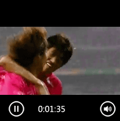

# Using HTML5 Controls in Coded UI Tests
Coded UI tests include support for some of the HTML5 controls that are included in Internet Explorer 9 and Internet Explorer 10.  
  
 **Requirements**  
  
-   Visual Studio Enterprise  
  
> [!WARNING]
>  In versions prior to Internet Explorer 10, it was possible to run coded UI tests in a higher privilege level compared to that of the Internet Explorer process. When running coded UI tests on Internet Explorer 10, both the coded UI test and the Internet Explorer process must be at the same privilege level. This is because of more secure AppContainer features in Internet Explorer 10.  
  
> [!WARNING]
>  If you create a coded UI test in Internet Explorer 10, it might not run using Internet Explorer 9 or Internet Explorer 8. This is because Internet Explorer 10 includes HTML5 controls such as Audio, Video, ProgressBar and Slider. These HTML5 controls are not recognized by Internet Explorer 9, or Internet Explorer 8. Likewise, your coded UI test using Internet Explorer 9 might include some HTML5 controls that also will not be recognized by Internet Explorer 8.  
  
## Supported HTML5 Controls  
 Coded UI tests include support for record, playback, and validation of the following HTML5 controls:  
  
-   [Audio Control](#UsingHTML5ControlsCodedUITestsAudio)  
  
-   [Video Control](#UsingHTML5ControlsCodedUITestsVideo)  
  
-   [Slider Control](#UsingHTML5ControlsCodedUITestsSlider)  
  
-   [ProgressBar](#UsingHTML5ControlsCodedUITestsProgressBar)  
  
###  \<a name="UsingHTML5ControlsCodedUITestsAudio">\</a> Audio Control  
 **Audio control:** Actions on the HTML5 Audio control are correctly recorded and played back.  
  
   
  
|Action|Recording|Generated Code|  
|------------|---------------|--------------------|  
|**Play audio**\ \  Directly from control, or from controls context menu.|Play \<name> Audio from 00:00:00|HtmlAudio.Play(TimeSpan)|  
|**Seek to a specific time in the audio**|Seek \<name> Audio to 00:01:48|HtmlAudio.Seek(TimeSpan)|  
|**Pause audio**\ \  Directly from control, or from controls context menu.|Pause \<name> Audio at 00:01:53|HtmlAudio.Pause(TimeSpan)|  
|**Mute audio**\ \  Directly from control, or from controls context menu.|Mute \<name> Audio|HtmlAudio.Mute()|  
|**Unmute audio**\ \  Directly from control, or from controls context menu.|Unmute \<name> Audio|HtmlAudio.Unmute()|  
|**Change volume of audio**|Set volume of \<name> Audio to 79%|HtmlAudio.SetVolume(float)|  
  
 The following properties are available for HtmlAudio and you can add an assertion on all of them:  
  
<CodeContentPlaceHolder>0\</CodeContentPlaceHolder>  
 **Search properties:** The search properties for <CodeContentPlaceHolder>3\</CodeContentPlaceHolder> are <CodeContentPlaceHolder>4\</CodeContentPlaceHolder>, <CodeContentPlaceHolder>5\</CodeContentPlaceHolder> and <CodeContentPlaceHolder>6\</CodeContentPlaceHolder>.  
  
 **Filter properties:** The filter properties for <CodeContentPlaceHolder>7\</CodeContentPlaceHolder> are <CodeContentPlaceHolder>8\</CodeContentPlaceHolder>, <CodeContentPlaceHolder>9\</CodeContentPlaceHolder>, <CodeContentPlaceHolder>10\</CodeContentPlaceHolder> and <CodeContentPlaceHolder>11\</CodeContentPlaceHolder>.  
  
> [!NOTE]
>  The amount of time for Seek and Pause can be significant. During playback, the coded UI test will wait until the specified time in <CodeContentPlaceHolder>12\</CodeContentPlaceHolder> before Pausing the audio. If by some special circumstance, the specified time has passed before hitting the Pause command, an exception will be thrown.  
  
###  \<a name="UsingHTML5ControlsCodedUITestsVideo">\</a> Video Control  
 **Video control:** Actions on the HTML5 Video control are correctly recorded and played back.  
  
   
  
|Action|Recording|Generated Code|  
|------------|---------------|--------------------|  
|**Play video**\ \  Directly from control, or from controls context menu.|Play \<name> Video  from 00:00:00|HtmlVideo.Play(TimeSpan)|  
|**Seek to a specific time in the video**|Seek \<name> Video to 00:01:48|HtmlVideo.Seek(TimeSpan)|  
|**Pause video**\ \  Directly from control, or from controls context menu.|Pause \<name> Video at 00:01:53|HtmlVideo.Pause(TimeSpan)|  
|**Mute video**\ \  Directly from control, or from controls context menu.|Mute \<name> Video|HtmlVideo.Mute()|  
|**Unmute video**\ \  Directly from control, or from controls context menu.|Unmute \<name> Video|HtmlVideo.Unmute()|  
|**Change volume of video**|Set volume of \<name> Video to 79%||  
  
 All the properties of HtmlAudio are available for HtmlVideo. In addition, the following three properties are also available. Assertion can be added on all of them.  
  
<CodeContentPlaceHolder>1\</CodeContentPlaceHolder>  
 **Search properties:** The search properties for <CodeContentPlaceHolder>13\</CodeContentPlaceHolder> are <CodeContentPlaceHolder>14\</CodeContentPlaceHolder>, <CodeContentPlaceHolder>15\</CodeContentPlaceHolder> and <CodeContentPlaceHolder>16\</CodeContentPlaceHolder>.  
  
 **Filter properties:** The filter properties for <CodeContentPlaceHolder>17\</CodeContentPlaceHolder> are <CodeContentPlaceHolder>18\</CodeContentPlaceHolder>, <CodeContentPlaceHolder>19\</CodeContentPlaceHolder>, <CodeContentPlaceHolder>20\</CodeContentPlaceHolder>, <CodeContentPlaceHolder>21\</CodeContentPlaceHolder> and <CodeContentPlaceHolder>22\</CodeContentPlaceHolder>.  
  
> [!NOTE]
>  If you rewind or fast forward the video using -30s or +30s labels, this will be aggregated to seek to the appropriate time.  
  
###  \<a name="UsingHTML5ControlsCodedUITestsSlider">\</a> Slider  
 **Slider control:** Actions on the HTML5 Slider control are correctly recorded and played back.  
  
   
  
|Action|Recording|Generated Code|  
|------------|---------------|--------------------|  
|**Set a position in the slider**|Set position to \<x> in \<name> slider|HtmlSlider.ValueAsNumber=\<x>|  
  
 The following properties are available for HtmlSlider and assertion can be added on all of them:  
  
<CodeContentPlaceHolder>2\</CodeContentPlaceHolder>  
###  \<a name="UsingHTML5ControlsCodedUITestsProgressbar">\</a> ProgressBar  
 **ProgreesBar control:** The ProgressBar is a non-interactable control. You can add assertions on the <CodeContentPlaceHolder>23\</CodeContentPlaceHolder> and <CodeContentPlaceHolder>24\</CodeContentPlaceHolder> properties of this control.  
  
   
  
## See Also  
 [HTML Elements](http://go.microsoft.com/fwlink/?LinkID=232441)   
 [Verifying Code by Using Coded User Interface Tests](../vs140/use-ui-automation-to-test-your-code.md)   
 [Creating Coded UI Tests](../vs140/use-ui-automation-to-test-your-code.md#VerifyingCodeUsingCUITCreate)   
 [Customizing your coded UI test](../vs140/use-ui-automation-to-test-your-code.md#VerifyingCodeCUITModify)   
 [Supported Configurations and Platforms for Coded UI Tests and Action Recordings](../vs140/supported-configurations-and-platforms-for-coded-ui-tests-and-action-recordings.md)