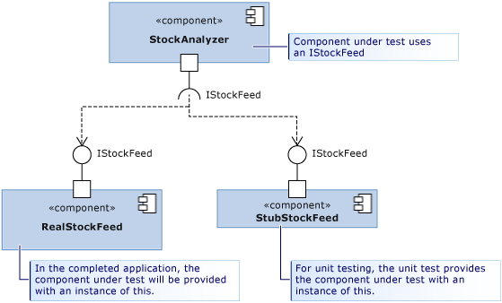

# Using stubs to isolate parts of your application from each other for unit testing
*Stub types* are one of two technologies that the Microsoft Fakes framework provides to let you easily isolate a component you are testing from other components that it calls. A stub is a small piece of code that takes the place of another component during testing. The benefit of using a stub is that it returns consistent results, making the test easier to write. And you can run tests even if the other components are not working yet.  
  
 For an overview and quick start guide to Fakes, see [Isolating Unit Test Methods with Microsoft Fakes](../vs140/isolating-code-under-test-with-microsoft-fakes.md).  
  
 To use stubs, you have to write your component so that it uses only interfaces, not classes, to refer to other parts of the application. This is a good design practice because it makes changes in one part less likely to require changes in another. For testing, it allows you to substitute a stub for a real component.  
  
 In the diagram, the component StockAnalyzer is the one we want to test. It normally uses another component, RealStockFeed. But RealStockFeed returns different results every time its methods are called, making it difficult to test StockAnalyzer.  During testing, we replace it with a different class, StubStockFeed.  
  
   
  
 Because stubs rely on your being able to structure your code in this way, you typically use stubs to isolate one part of your application from another. To isolate it from other assemblies that are not under your control, such as System.dll, you would normally use shims. See [Using shims to isolate calls to non-virtual functions in unit test methods](../vs140/using-shims-to-isolate-your-application-from-other-assemblies-for-unit-testing.md).  
  
 **Requirements**  
  
-   Visual Studio Enterprise  
  
## In this topic  
  
-   [How to use stubs](#how)  
  
    -   [Design for Dependency Injection](#Dependency)  
  
    -   [Generate Stubs](#GeneratingStubs)  
  
    -   [Write your Test with Stubs](#WriteTest)  
  
    -   [Verifying Parameter Values](#mocks)  
  
-   [Stubs for different kinds of type members](../vs140/using-stubs-to-isolate-parts-of-your-application-from-each-other-for-unit-testing.md#BKMK_Stub_basics)  
  
    -   [Methods](../vs140/using-stubs-to-isolate-parts-of-your-application-from-each-other-for-unit-testing.md#BKMK_Methods)  
  
    -   [Properties](../vs140/using-stubs-to-isolate-parts-of-your-application-from-each-other-for-unit-testing.md#BKMK_Properties)  
  
    -   [Events](../vs140/using-stubs-to-isolate-parts-of-your-application-from-each-other-for-unit-testing.md#BKMK_Events)  
  
    -   [Generic methods](../vs140/using-stubs-to-isolate-parts-of-your-application-from-each-other-for-unit-testing.md#BKMK_Generic_methods)  
  
    -   [Stubs of virtual classes](../vs140/using-stubs-to-isolate-parts-of-your-application-from-each-other-for-unit-testing.md#BKMK_Partial_stubs)  
  
-   [Debugging stubs](../vs140/using-stubs-to-isolate-parts-of-your-application-from-each-other-for-unit-testing.md#BKMK_Debugging_stubs)  
  
-   [Stub limitations](../vs140/using-stubs-to-isolate-parts-of-your-application-from-each-other-for-unit-testing.md#BKMK_Stub_limitation)  
  
-   [Changing the default behavior of stubs](../vs140/using-stubs-to-isolate-parts-of-your-application-from-each-other-for-unit-testing.md#BKMK_Changing_the_default_behavior_of_stubs)  
  
##  \<a name="How">\</a> How to use stubs  
  
###  \<a name="Dependency">\</a> Design for dependency injection  
 To use stubs, your application has to be designed so that the different components are not dependent on each other, but only dependent on interface definitions. Instead of being coupled at compile time, components are connected at run time. This pattern helps to make software that is robust and easy to update, because changes tend not to propagate across component boundaries. We recommend following it even if you don’t use stubs. If you are writing new code, it’s easy to follow the [dependency injection](http://en.wikipedia.org/wiki/Dependency_injection) pattern. If you are writing tests for existing software, you might have to refactor it. If that would be impractical, you could consider using shims instead.  
  
 Let’s start this discussion with a motivating example, the one in the diagram. The class StockAnalyzer reads share prices and generates some interesting results. It has some public methods, which we want to test. To keep things simple, let’s just look at one of those methods, a very simple one that reports the current price of a particular share. We want to write a unit test of that method. Here’s the first draft of a test:  
  
<CodeContentPlaceHolder>0\</CodeContentPlaceHolder>  
<CodeContentPlaceHolder>1\</CodeContentPlaceHolder>  
 One problem with this test is immediately obvious: share prices vary, and so the assertion will usually fail.  
  
 Another problem might be that the StockFeed component, which is used by the StockAnalyzer, is still under development. Here’s the first draft of the code of the method under test:  
  
<CodeContentPlaceHolder>2\</CodeContentPlaceHolder>  
<CodeContentPlaceHolder>3\</CodeContentPlaceHolder>  
 As it stands, this method might not compile or might throw an exception because work on the StockFeed class is not yet complete.  
  
 Interface injection addresses both of these problems.  
  
 Interface injection applies the following rule:  
  
-   The code of any component of your application should never explicitly refer to a class in another component, either in a declaration or in a <CodeContentPlaceHolder>24\</CodeContentPlaceHolder> statement. Instead, variables and parameters should be declared with interfaces. Component instances should be created only by the component’s container.  
  
     By "component" in this case we mean a class, or a group of classes that you develop and update together. Typically, a component is the code in one Visual Studio project. It’s less important to decouple classes within one component, because they are updated at the same time.  
  
     It is also not so important to decouple your components from the classes of a relatively stable platform such as System.dll. Writing interfaces for all these classes would clutter your code.  
  
 The StockAnalyzer code can therefore be improved by decoupling it from the StockFeed by using an interface like this:  
  
<CodeContentPlaceHolder>4\</CodeContentPlaceHolder>  
<CodeContentPlaceHolder>5\</CodeContentPlaceHolder>  
 In this example, StockAnalyzer is passed an implementation of an IStockFeed when it is constructed. In the completed application, the initialization code would perform the connection:  
  
<CodeContentPlaceHolder>6\</CodeContentPlaceHolder>  
 There are more flexible ways of performing this connection. For example, StockAnalyzer could accept a factory object that can instantiate different implementations of IStockFeed in different conditions.  
  
###  \<a name="GeneratingStubs">\</a> Generate stubs  
 You’ve decoupled the class you want to test from the other components that it uses. As well as making the application more robust and flexible, the decoupling allows you to connect the component under test to stub implementations of the interfaces for test purposes.  
  
 You could simply write the stubs as classes in the usual way. But Microsoft Fakes provides you with a more dynamic way to create the most appropriate stub for every test.  
  
 To use stubs, you must first generate stub types from the interface definitions.  
  
##### Adding a Fakes Assembly  
  
1.  In Solution Explorer, expand your unit test project’s **References**.  
  
    -   If you are working in Visual Basic, you must select **Show All Files** in the Solution Explorer toolbar, in order to see the References list.  
  
2.  Select the assembly that contains the interface definitions for which you want to create stubs.  
  
3.  On the shortcut menu, choose **Add Fakes Assembly**.  
  
###  \<a name="WriteTest">\</a> Write your test with stubs  
  
<CodeContentPlaceHolder>7\</CodeContentPlaceHolder>  
<CodeContentPlaceHolder>8\</CodeContentPlaceHolder>  
 The special piece of magic here is the class <CodeContentPlaceHolder>25\</CodeContentPlaceHolder>. For every public type in the referenced assembly, the Microsoft Fakes mechanism generates a stub class. The name of the stub class is the derived from the name of the interface, with "<CodeContentPlaceHolder>26\</CodeContentPlaceHolder>" as a prefix, and the parameter type names appended.  
  
 Stubs are also generated for the getters and setters of properties, for events, and for generic methods.  
  
###  \<a name="mocks">\</a> Verifying parameter values  
 You can verify that when your component makes a call to another component, it passes the correct values. You can either place an assertion in the stub, or you can store the value and verify it in the main body of the test. For example:  
  
<CodeContentPlaceHolder>9\</CodeContentPlaceHolder>  
<CodeContentPlaceHolder>10\</CodeContentPlaceHolder>  
##  \<a name="BKMK_Stub_basics">\</a> Stubs for different kinds of type members  
  
###  \<a name="BKMK_Methods">\</a> Methods  
 As described in the example, methods can be stubbed by attaching a delegate to an instance of the stub class. The name of the stub type is derived from the names of the method and parameters. For example, given the following <CodeContentPlaceHolder>27\</CodeContentPlaceHolder> interface and method <CodeContentPlaceHolder>28\</CodeContentPlaceHolder>:  
  
<CodeContentPlaceHolder>11\</CodeContentPlaceHolder>  
 We attach a stub to <CodeContentPlaceHolder>29\</CodeContentPlaceHolder> that always returns 1:  
  
<CodeContentPlaceHolder>12\</CodeContentPlaceHolder>  
 If you do not provide a stub for a function, Fakes will generate a function that returns the default value of the return type. For numbers, the default value is 0, and for class types it is <CodeContentPlaceHolder>30\</CodeContentPlaceHolder> (C#) or <CodeContentPlaceHolder>31\</CodeContentPlaceHolder> (Visual Basic).  
  
###  \<a name="BKMK_Properties">\</a> Properties  
 Property getters and setters are exposed as separate delegates and can be stubbed separately. For example, consider the <CodeContentPlaceHolder>32\</CodeContentPlaceHolder> property of <CodeContentPlaceHolder>33\</CodeContentPlaceHolder>:  
  
<CodeContentPlaceHolder>13\</CodeContentPlaceHolder>  
 We attach delegates to the getter and setter of <CodeContentPlaceHolder>34\</CodeContentPlaceHolder> to simulate an auto-property:  
  
<CodeContentPlaceHolder>14\</CodeContentPlaceHolder>  
 If you do not provide stub methods for either the setter or the getter of a property, Fakes will generate a stub that stores values, so that the stub property works like a simple variable.  
  
###  \<a name="BKMK_Events">\</a> Events  
 Events are exposed as delegate fields. As a result, any stubbed event can be raised simply by invoking the event backing field. Let’s consider the following interface to stub:  
  
<CodeContentPlaceHolder>15\</CodeContentPlaceHolder>  
 To raise the <CodeContentPlaceHolder>35\</CodeContentPlaceHolder> event, we simply invoke the backing delegate:  
  
<CodeContentPlaceHolder>16\</CodeContentPlaceHolder>  
###  \<a name="BKMK_Generic_methods">\</a> Generic methods  
 It’s possible to stub generic methods by providing a delegate for each desired instantiation of the method. For example, given the following interface containing a generic method:  
  
<CodeContentPlaceHolder>17\</CodeContentPlaceHolder>  
 you could write a test that stubs the <CodeContentPlaceHolder>36\</CodeContentPlaceHolder> instantiation:  
  
<CodeContentPlaceHolder>18\</CodeContentPlaceHolder>  
 If the code were to call <CodeContentPlaceHolder>37\</CodeContentPlaceHolder> with any other instantiation, the stub would simply call the behavior.  
  
###  \<a name="BKMK_Partial_stubs">\</a> Stubs of virtual classes  
 In the previous examples, the stubs have been generated from interfaces. You can also generate stubs from a class that has virtual or abstract members. For example:  
  
<CodeContentPlaceHolder>19\</CodeContentPlaceHolder>  
 In the stub generated from this class, you can set delegate methods for DoAbstract() and DoVirtual(), but not DoConcrete().  
  
<CodeContentPlaceHolder>20\</CodeContentPlaceHolder>  
 If you do not provide a delegate for a virtual method, Fakes can either provide the default behavior, or it can call the method in the base class. To have the base method called, set the <CodeContentPlaceHolder>38\</CodeContentPlaceHolder> property:  
  
<CodeContentPlaceHolder>21\</CodeContentPlaceHolder>  
##  \<a name="BKMK_Debugging_stubs">\</a> Debugging stubs  
 The stub types are designed to provide a smooth debugging experience. By default, the debugger is instructed to step over any generated code, so it should step directly into the custom member implementations that were attached to the stub.  
  
##  \<a name="BKMK_Stub_limitation">\</a> Stub limitations  
  
1.  Method signatures with pointers aren’t supported.  
  
2.  Sealed classes or static methods can’t be stubbed because stub types rely on virtual method dispatch. For such cases, use shim types as described in [Using shims to isolate calls to non-virtual functions in unit test methods](../vs140/using-shims-to-isolate-your-application-from-other-assemblies-for-unit-testing.md)  
  
##  \<a name="BKMK_Changing_the_default_behavior_of_stubs">\</a> Changing the default behavior of stubs  
 Each generated stub type holds an instance of the <CodeContentPlaceHolder>39\</CodeContentPlaceHolder> interface (through the <CodeContentPlaceHolder>40\</CodeContentPlaceHolder> property). The behavior is called whenever a client calls a member with no attached custom delegate. If the behavior has not been set, it will use the instance returned by the <CodeContentPlaceHolder>41\</CodeContentPlaceHolder> property. By default, this property returns a behavior that throws a <CodeContentPlaceHolder>42\</CodeContentPlaceHolder> exception.  
  
 The behavior can be changed at any time by setting the <CodeContentPlaceHolder>43\</CodeContentPlaceHolder> property on any stub instance. For example, the following snippet changes a behavior that does nothing or returns the default value of the return type: <CodeContentPlaceHolder>44\</CodeContentPlaceHolder>:  
  
<CodeContentPlaceHolder>22\</CodeContentPlaceHolder>  
 The behavior can also be changed globally for all stub objects for which the behavior has not been set by setting the <CodeContentPlaceHolder>45\</CodeContentPlaceHolder> property:  
  
<CodeContentPlaceHolder>23\</CodeContentPlaceHolder>  
## External resources  
  
### Guidance  
 [Testing for Continuous Delivery with Visual Studio 2012 – Chapter 2: Unit Testing: Testing the Inside](http://go.microsoft.com/fwlink/?LinkID=255188)  
  
## See Also  
 [Isolating Unit Test Methods with Microsoft Fakes](../vs140/isolating-code-under-test-with-microsoft-fakes.md)