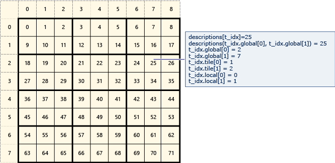

# Using Tiles
You can use tiling to maximize the acceleration of your app. Tiling divides threads into equal rectangular subsets or *tiles*. If you use an appropriate tile size and tiled algorithm, you can get even more acceleration from your C++ AMP code. The basic components of tiling are:  
  
-   <CodeContentPlaceHolder>5\</CodeContentPlaceHolder> variables. The primary benefit of tiling is the performance gain from <CodeContentPlaceHolder>6\</CodeContentPlaceHolder> access. Access to data in <CodeContentPlaceHolder>7\</CodeContentPlaceHolder> memory can be significantly faster than access to data in the global space (<CodeContentPlaceHolder>8\</CodeContentPlaceHolder> or <CodeContentPlaceHolder>9\</CodeContentPlaceHolder> objects). An instance of a <CodeContentPlaceHolder>10\</CodeContentPlaceHolder> variable is created for each tile, and all threads in the tile have access to the variable. In a typical tiled algorithm, data is copied into <CodeContentPlaceHolder>11\</CodeContentPlaceHolder> memory once from global memory and then accessed many times from the <CodeContentPlaceHolder>12\</CodeContentPlaceHolder> memory.  
  
-   [tile_barrier::wait Method](../vs140/tile_barrier--wait-method.md). A call to <CodeContentPlaceHolder>13\</CodeContentPlaceHolder> suspends execution of the current thread until all of the threads in the same tile reach the call to <CodeContentPlaceHolder>14\</CodeContentPlaceHolder>. You cannot guarantee the order that the threads will run in, only that no threads in the tile will execute past the call to <CodeContentPlaceHolder>15\</CodeContentPlaceHolder> until all of the threads have reached the call. This means that by using the <CodeContentPlaceHolder>16\</CodeContentPlaceHolder> method, you can perform tasks on a tile-by-tile basis rather than a thread-by-thread basis. A typical tiling algorithm has code to initialize the <CodeContentPlaceHolder>17\</CodeContentPlaceHolder> memory for the whole tile followed by a call to <CodeContentPlaceHolder>18\</CodeContentPlaceHolder>. Code that follows <CodeContentPlaceHolder>19\</CodeContentPlaceHolder> contains computations that require access to all the <CodeContentPlaceHolder>20\</CodeContentPlaceHolder> values.  
  
-   Local and global indexing. You have access to the index of the thread relative to the entire <CodeContentPlaceHolder>21\</CodeContentPlaceHolder> or <CodeContentPlaceHolder>22\</CodeContentPlaceHolder> object and the index relative to the tile. Using the local index can make your code easier to read and debug. Typically, you use local indexing to access <CodeContentPlaceHolder>23\</CodeContentPlaceHolder> variables, and global indexing to access <CodeContentPlaceHolder>24\</CodeContentPlaceHolder> and <CodeContentPlaceHolder>25\</CodeContentPlaceHolder> variables.  
  
-   [tiled_extent Class](../vs140/tiled_extent-class.md) and [tiled_index Class](../vs140/tiled_index-class.md). You use a <CodeContentPlaceHolder>26\</CodeContentPlaceHolder> object instead of an <CodeContentPlaceHolder>27\</CodeContentPlaceHolder> object in the <CodeContentPlaceHolder>28\</CodeContentPlaceHolder> call. You use a <CodeContentPlaceHolder>29\</CodeContentPlaceHolder> object instead of an <CodeContentPlaceHolder>30\</CodeContentPlaceHolder> object in the <CodeContentPlaceHolder>31\</CodeContentPlaceHolder> call.  
  
 To take advantage of tiling, your algorithm must partition the compute domain into tiles and then copy the tile data into <CodeContentPlaceHolder>32\</CodeContentPlaceHolder> variables for faster access.  
  
## Example of Global, Tile, and Local Indices  
 The following diagram represents an 8x9 matrix of data that is arranged in 2x3 tiles.  
  
   
  
 The following example displays the global, tile, and local indices of this tiled matrix. An <CodeContentPlaceHolder>33\</CodeContentPlaceHolder> object is created by using elements of type <CodeContentPlaceHolder>34\</CodeContentPlaceHolder>. The <CodeContentPlaceHolder>35\</CodeContentPlaceHolder> holds the global, tile, and local indices of the element in the matrix. The code in the call to <CodeContentPlaceHolder>36\</CodeContentPlaceHolder> sets the values of the global, tile, and local indices of each element. The output displays the values in the <CodeContentPlaceHolder>37\</CodeContentPlaceHolder> structures.  
  
<CodeContentPlaceHolder>0\</CodeContentPlaceHolder>  
 The main work of the example is in the definition of the <CodeContentPlaceHolder>38\</CodeContentPlaceHolder> object and the call to <CodeContentPlaceHolder>39\</CodeContentPlaceHolder>.  
  
1.  The vector of <CodeContentPlaceHolder>40\</CodeContentPlaceHolder> structures is copied into an 8x9 <CodeContentPlaceHolder>41\</CodeContentPlaceHolder> object.  
  
2.  The <CodeContentPlaceHolder>42\</CodeContentPlaceHolder> method is called with a <CodeContentPlaceHolder>43\</CodeContentPlaceHolder> object as the compute domain. The <CodeContentPlaceHolder>44\</CodeContentPlaceHolder> object is created by calling the <CodeContentPlaceHolder>45\</CodeContentPlaceHolder> method of the <CodeContentPlaceHolder>46\</CodeContentPlaceHolder> variable. The type parameters of the call to <CodeContentPlaceHolder>47\</CodeContentPlaceHolder>, <CodeContentPlaceHolder>48\</CodeContentPlaceHolder>, specify that 2x3 tiles are created. Thus, the 8x9 matrix is tiled into 12 tiles, four rows and three columns.  
  
3.  The <CodeContentPlaceHolder>49\</CodeContentPlaceHolder> method is called by using a <CodeContentPlaceHolder>50\</CodeContentPlaceHolder> object (<CodeContentPlaceHolder>51\</CodeContentPlaceHolder>) as the index. The type parameters of the index (<CodeContentPlaceHolder>52\</CodeContentPlaceHolder>) must match the type parameters of the compute domain (<CodeContentPlaceHolder>53\</CodeContentPlaceHolder>).  
  
4.  When each thread is executed, the index <CodeContentPlaceHolder>54\</CodeContentPlaceHolder> returns information about which tile the thread is in (<CodeContentPlaceHolder>55\</CodeContentPlaceHolder> property) and the location of the thread within the tile (<CodeContentPlaceHolder>56\</CodeContentPlaceHolder> property).  
  
## Tile Synchronization—tile_static and tile_barrier::wait  
 The previous example illustrates the tile layout and indices, but is not in itself very useful.  Tiling becomes useful when the tiles are integral to the algorithm and exploit <CodeContentPlaceHolder>57\</CodeContentPlaceHolder> variables. Because all threads in a tile have access to <CodeContentPlaceHolder>58\</CodeContentPlaceHolder> variables, calls to <CodeContentPlaceHolder>59\</CodeContentPlaceHolder> are used to synchronize access to the <CodeContentPlaceHolder>60\</CodeContentPlaceHolder> variables. Although all of the threads in a tile have access to the <CodeContentPlaceHolder>61\</CodeContentPlaceHolder> variables, there is no guaranteed order of execution of threads in the tile. The following example shows how to use <CodeContentPlaceHolder>62\</CodeContentPlaceHolder> variables and the <CodeContentPlaceHolder>63\</CodeContentPlaceHolder> method to calculate the average value of each tile. Here are the keys to understanding the example:  
  
1.  The rawData is stored in an 8x8 matrix.  
  
2.  The tile size is 2x2. This creates a 4x4 grid of tiles and the averages can be stored in a 4x4 matrix by using an <CodeContentPlaceHolder>64\</CodeContentPlaceHolder> object. There are only a limited number of types that you can capture by reference in an AMP-restricted function. The <CodeContentPlaceHolder>65\</CodeContentPlaceHolder> class is one of them.  
  
3.  The matrix size and sample size are defined by using <CodeContentPlaceHolder>66\</CodeContentPlaceHolder> statements, because the type parameters to <CodeContentPlaceHolder>67\</CodeContentPlaceHolder>, <CodeContentPlaceHolder>68\</CodeContentPlaceHolder>, <CodeContentPlaceHolder>69\</CodeContentPlaceHolder>, and <CodeContentPlaceHolder>70\</CodeContentPlaceHolder> must be constant values. You can also use <CodeContentPlaceHolder>71\</CodeContentPlaceHolder> declarations. As an additional benefit, it is trivial to change the sample size to calculate the average over 4x4 tiles.  
  
4.  A <CodeContentPlaceHolder>72\</CodeContentPlaceHolder> 2x2 array of float values is declared for each tile. Although the declaration is in the code path for every thread, only one array is created for each tile in the matrix.  
  
5.  There is a line of code to copy the values in each tile to the <CodeContentPlaceHolder>73\</CodeContentPlaceHolder> array. For each thread, after the value is copied to the array, execution on the thread stops due to the call to <CodeContentPlaceHolder>74\</CodeContentPlaceHolder>.  
  
6.  When all of the threads in a tile have reached the barrier, the average can be calculated. Because the code executes for every thread, there is an <CodeContentPlaceHolder>75\</CodeContentPlaceHolder> statement to only calculate the average on one thread. The average is stored in the averages variable. The barrier is essentially the construct that controls calculations by tile, much as you might use a <CodeContentPlaceHolder>76\</CodeContentPlaceHolder> loop.  
  
7.  The data in the <CodeContentPlaceHolder>77\</CodeContentPlaceHolder> variable, because it is an <CodeContentPlaceHolder>78\</CodeContentPlaceHolder> object, must be copied back to the host. This example uses the vector conversion operator.  
  
8.  In the complete example, you can change SAMPLESIZE to 4 and the code executes correctly without any other changes.  
  
<CodeContentPlaceHolder>1\</CodeContentPlaceHolder>  
## Race Conditions  
 It might be tempting to create a <CodeContentPlaceHolder>79\</CodeContentPlaceHolder> variable named <CodeContentPlaceHolder>80\</CodeContentPlaceHolder> and increment that variable for each thread, like this:  
  
<CodeContentPlaceHolder>2\</CodeContentPlaceHolder>  
 The first problem with this approach is that <CodeContentPlaceHolder>81\</CodeContentPlaceHolder> variables cannot have initializers. The second problem is that there is a race condition on the assignment to <CodeContentPlaceHolder>82\</CodeContentPlaceHolder>, because all of the threads in the tile have access to the variable in no particular order. You could program an algorithm to only allow one thread to access the total at each barrier, as shown next. However, this solution is not extensible.  
  
<CodeContentPlaceHolder>3\</CodeContentPlaceHolder>  
## Memory Fences  
 There are two kinds of memory accesses that must be synchronized—global memory access and <CodeContentPlaceHolder>83\</CodeContentPlaceHolder> memory access. A <CodeContentPlaceHolder>84\</CodeContentPlaceHolder> object allocates only global memory. A <CodeContentPlaceHolder>85\</CodeContentPlaceHolder> can reference global memory, <CodeContentPlaceHolder>86\</CodeContentPlaceHolder> memory, or both, depending on how it was constructed.  There are two kinds of memory that must be synchronized:  
  
-   global memory  
  
-   <CodeContentPlaceHolder>87\</CodeContentPlaceHolder>  
  
 A *memory fence* ensures that memory accesses are available to other threads in the thread tile, and that memory accesses are executed according to program order. To ensure this, compilers and processors do not reorder reads and writes across the fence. In C++ AMP, a memory fence is created by a call to one of these methods:  
  
-   [tile_barrier::wait Method](../vs140/tile_barrier--wait-method.md): Creates a fence around both global and <CodeContentPlaceHolder>88\</CodeContentPlaceHolder> memory.  
  
-   [tile_barrier::wait_with_all_memory_fence Method](../vs140/tile_barrier--wait_with_all_memory_fence-method.md): Creates a fence around both global and <CodeContentPlaceHolder>89\</CodeContentPlaceHolder> memory.  
  
-   [tile_barrier::wait_with_global_memory_fence Method](../vs140/tile_barrier--wait_with_global_memory_fence-method.md): Creates a fence around only global memory.  
  
-   [tile_barrier::wait_with_tile_static_memory_fence Method](../vs140/tile_barrier--wait_with_tile_static_memory_fence-method.md): Creates a fence around only <CodeContentPlaceHolder>90\</CodeContentPlaceHolder> memory.  
  
 Calling the specific fence that you require can improve the performance of your app. The barrier type affects how the compiler and the hardware reorder statements. For example, if you use a global memory fence, it applies only to global memory accesses and therefore, the compiler and the hardware might reorder reads and writes to <CodeContentPlaceHolder>91\</CodeContentPlaceHolder> variables on the two sides of the fence.  
  
 In the next example, the barrier synchronizes the writes to <CodeContentPlaceHolder>92\</CodeContentPlaceHolder>, a <CodeContentPlaceHolder>93\</CodeContentPlaceHolder> variable. In this example, <CodeContentPlaceHolder>94\</CodeContentPlaceHolder> is called instead of <CodeContentPlaceHolder>95\</CodeContentPlaceHolder>.  
  
<CodeContentPlaceHolder>4\</CodeContentPlaceHolder>  
## See Also  
 [C++ Accelerated Massive Parallelism (C++ AMP)](../vs140/c---amp--c---accelerated-massive-parallelism-.md)   
 [tile_static keyword](../vs140/tile_static-keyword.md)