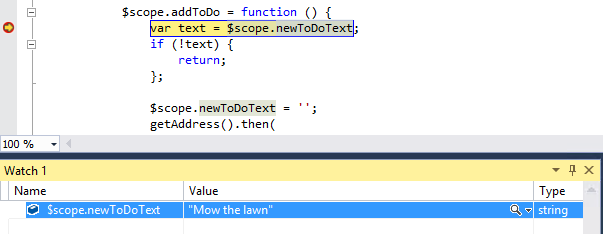
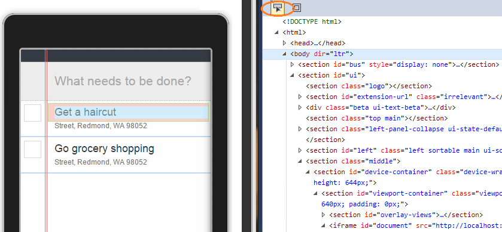
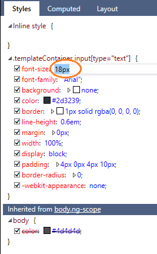
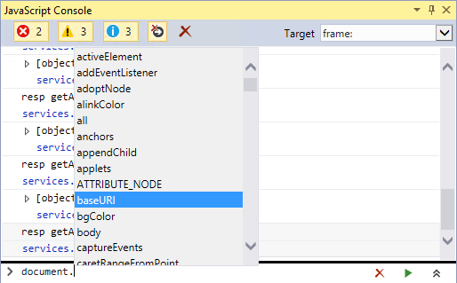

# Video Walkthrough: Debug using Visual Studio Diagnostic Tools for Cordova
When developing Apache Cordova apps in Visual Studio, you can use diagnostic tools such as the Visual Studio debugger, the DOM Explorer, and the JavaScript Console to fix problems in your apps.  
  
 This article matches the steps of the Cordova [Video tutorial](http://go.microsoft.com/fwlink/p/?LinkID=534729) on debugging. The steps match video content that follows the introduction of the tools and features (approximately four minutes from the start).  
  
## Prerequisites  
 To follow the steps in this tutorial, you must:  
  
1.  [Install Visual Studio 2015](http://go.microsoft.com/fwlink/p/?LinkId=397606) with Visual Studio Tools for Apache Cordova.  
  
2.  Download the [AngularJS ToDoList sample](http://go.microsoft.com/fwlink/?LinkID=398516), unzip it, and open the solution (.sln file) in Visual Studio.  
  
## Debug an app using diagnostic tools  
  
#### To use the diagnostic tools  
  
1.  With the AngularJS ToDoList sample app open in Visual Studio, choose Android in the **Solution Platforms** list.  
  
2.  Choose **Ripple Nexus (Galaxy)** as a debug target.  
  
3.  Press F5 to start the debugger.  
  
4.  When the ToDoList app loads in Ripple, add another task item to verify that the app is working correctly.  
  
5.  In controllers.js, add a breakpoint to `var text = $scope.newToDoText;` in the `addToDo` function by clicking in the gray left margin.  
  
    ```javascript  
    $scope.addToDo = function () {  
        var text = $scope.newToDoText;   
        if (!text) {   
        return;   
    };  
    ```  
  
     With the breakpoint added, the editor looks like this.  
  
       
  
6.  In the running app, add another ToDoList task item.  
  
     Now, when you enter the item, the debugger breaks into your code.  
  
       
  
     From here, you can:  
  
    -   Mouse over variables to see their current value (see preceding illustration).  
  
    -   Press F10 to step over code, allowing you to check updated values.  
  
    -   Open the shortcut menu for a selected variable and choose **Add Watch**.  
  
         The selected variable appears in the Watch window, giving you a great way view multiple variables and their values while they change as you step through code.  
  
           
  
    -   Use the Locals and Call Stack windows to find more information about the state of the app while you debug.  
  
7.  While your app is running, select the [DOM Explorer](http://msdn.microsoft.com/library/windows/apps/hh441474.aspx) tab.  
  
     On the left of the DOM Explorer, you have a view of the live DOM.  
  
8.  Choose the **Select Element** button and select something, like a list item, in the Ripple emulator.  
  
       
  
     When you select the element, the corresponding element is highlighted in the DOM Explorer.  
  
     On the right, you have the CSS property values for the currently selected element.  
  
    -   The Styles tab shows the CSS styles associated with the element with styles organized by CSS selector name.  
  
    -   The Computed tab shows real-time CSS style property values for the element.  
  
    -   The Layout tab shows the box model for the element.  
  
     You can make changes to your UI right here in DOM Explorer (in the live DOM view, Styles, and Layout tabs), and see the changes immediately reflected in your running app. This makes the UI easier to debug.  
  
     For example, you could edit the font size for a list item (an <input\> element) in the Styles tab.  
  
       
  
9. Select an element such as the location under a ToDo list item (an <h3\> element) and edit the value.  
  
     Your changes will appear in the app in the Ripple emulator.  
  
     Another critical tool to help debug Cordova apps is the JavaScript Console. You can also use the JavaScript Console window to read errors and messages sent from your running app, and also to evaluate lines of JavaScript code that run within the current script context.  
  
10. Look at the output in the JavaScript Console window to view messages.  
  
    > [!NOTE]
    >  For a list of commands such as `console.log`, see [JavaScript Console commands](http://msdn.microsoft.com/library/windows/apps/hh696634.aspx)  
  
11. To evaluate JavaScript, type JavaScript code in the input box. For example, type "document." and you will see IntelliSense information for the document object for the current HTML page displayed in Ripple (Chrome).  
  
       
  
     You can run code by pressing Enter (single-line mode) or by choosing the green arrow button (multi-line mode).  
  
12. Press Enter to see the value of the document object in the console window.  
  
    > [!TIP]
    >  Set breakpoints in your code to get your app into the desired state, and then use the JavaScript Console to check variables and evaluate code.