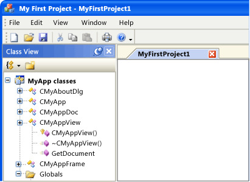
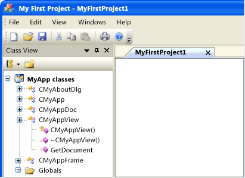
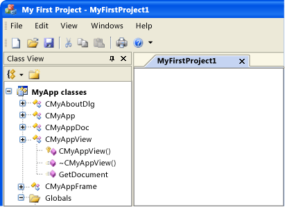
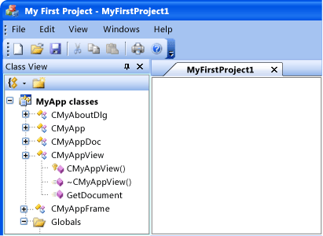
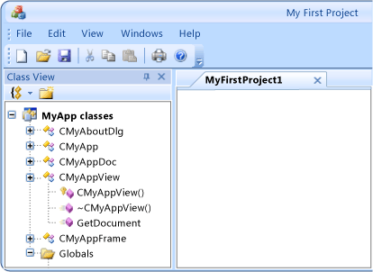

# Visualization Manager
The visual manager is an object that controls the appearance of a whole application. It acts as a single class where you can put all the drawing code for your application. The MFC Library includes several visual managers. You can also create your own visual manager if you want to create a custom view for your application. The following images show the same application when different visual managers are enabled:  
  
   
MyApp that uses the CMFCVisualManagerWindows visual manager  
  
   
MyApp that uses the CMFCVisualManagerVS2005 visual manager  
  
   
MyApp that uses the CMFCVisualManagerOfficeXP visual manager  
  
   
MyApp that uses the CMFCVisualManagerOffice2003 visual manager  
  
   
MyApp that uses the CMFCVisualManagerOffice2007 visual manager  
  
 By default, the visual manager maintains the drawing code for several GUI elements. To provide custom UI elements, you need to override the related drawing methods of the visual manager. For the list of these methods, see [CMFCVisualManager Class](../vs140/cmfcvisualmanager-class.md). The methods that you can override to provide a custom appearance are all the methods that start with `OnDraw`.  
  
 Your application can have only one `CMFCVisualManager` object. To obtain a pointer to the visual manager for your application, call the static function [CMFCVisualManager::GetInstance](../vs140/cmfcvisualmanager--getinstance.md). Because all visual managers inherit from `CMFCVisualManager`, the `CMFCVisualManager::GetInstance` method will get a pointer to the appropriate visual manager, even if you create a custom visual manager.  
  
 If you want to create a custom visual manager, you must derive it from a visual manager that already exists. The default class to derive from is `CMFCVisualManager`. However, you can use a different visual manager if it better resembles what you want for your application. For example, if you wanted to use the `CMFCVisualManagerOffice2007` visual manager, but wanted only to change how separators look, you could derive your custom class from `CMFCVisualManagerOffice2007`. In this scenario, you should overwrite only the methods for drawing separators.  
  
 There are two possible ways to use a specific visual manager for your application. One way is to call the [CMFCVisualManager::SetDefaultManager](../vs140/cmfcvisualmanager--setdefaultmanager.md) method and pass the appropriate visual manager as a parameter. The following code example shows how you would use the `CMFCVisualManagerVS2005` visual manager with this method:  
  
```  
CMFCVisualManager::SetDefaultManager (RUNTIME_CLASS (CMFCVisualManagerVS2005));  
```  
  
 The other way to use a visual manager in your application is to create it manually. The application will then use this new visual manager for all the rendering. However, because there can be only one `CMFCVisualManager` object per application, you will have to delete the current visual manager before you create a new one. In the following example, `CMyVisualManager` is a custom visual manager that is derived from `CMFCVisualManager`. The following method will change what visual manager is used to display your application, depending on an index:  
  
```  
void CMyApp::SetSkin (int index)  
{  
   if (CMFCVisualManager::GetInstance() != NULL)  
   {  
      delete CMFCVisualManager::GetInstance();  
   }  
  
   switch (index)  
   {  
   case DEFAULT_STYLE:  
      // The following statement creates a new CMFCVisualManager  
      CMFCVisualManager::GetInstance();  
      break;  
  
   case CUSTOM_STYLE:  
      new CMyVisualManager;  
      break;  
  
   default:  
      CMFCVisualManager::GetInstance();  
      break;  
   }  
  
   CMFCVisualManager::GetInstance()->RedrawAll();  
}  
```  
  
## See Also  
 [User Interface](../vs140/user-interface-elements--mfc-.md)   
 [CMFCVisualManager Class](../vs140/cmfcvisualmanager-class.md)