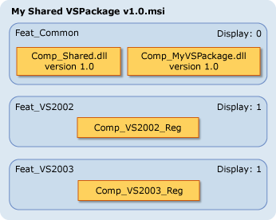
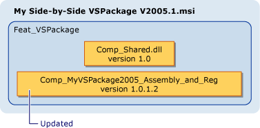

# VSPackage Setup Scenarios
It is important to design your VSPackage installer for flexibility. For example, you might need to release a security patch in the future, or you might change a business strategy that requires thorough side-by-side versioning support.  
  
 In [Side-by-Side Scenarios](../vs140/supporting-multiple-versions-of-visual-studio.md), you can read about the advantages and issues of supporting side-by-side installations of [!INCLUDE[vsprvs](../vs140/includes/vsprvs_md.md)] with either shared or side-by-side installations of your VSPackage. In short, side-by-side VSPackages give you the most flexibility to support new features of [!INCLUDE[vsprvs](../vs140/includes/vsprvs_md.md)].  
  
 The scenarios discussed in this topic are not your only choices, but they are presented as suggested best practices.  
  
## Components, Privacy, and Sharing  
  
##### Make your components independent  
 Once you identify and populate a component, assign a `GUID`, and deploy the component, you cannot change its composition. If you do change a component's composition, the resulting component must be a new component with a new `GUID`. Given these facts, the greatest versioning flexibility is afforded by making each component independent, self-reliant unit. For more information about rules governing components, see [Changing the Component Code](http://msdn.microsoft.com/library/aa367849\(VS.85\).aspx) and [What Happens if the Component Rules Are Broken?](http://msdn.microsoft.com/library/aa372795\(VS.85\).aspx).  
  
##### Do not mix shared and private resources in a component  
 Reference counting occurs on the component level. Consequently, mixing shared and private resources in one component makes it impossible to update private resources, such as an executable file, without also overwriting shared resources. This scenario creates backward-compatibility issues and restricts you from creating side-by-side capability.  
  
 For example, registry values used to register your VSPackage with the [!INCLUDE[vsipsdk](../vs140/includes/vsipsdk_md.md)] should be kept in a component separate from one used to register your VSPackage with [!INCLUDE[vsprvs](../vs140/includes/vsprvs_md.md)]. Shared files or registry values go in yet another component.  
  
## Scenario 1: Shared VSPackage  
 In this scenario, a shared VSPackage (a single binary that supports multiple versions of [!INCLUDE[vsprvs](../vs140/includes/vsprvs_md.md)]) is shipped in a Windows Installer package. Registering with each version of [!INCLUDE[vsprvs](../vs140/includes/vsprvs_md.md)] is controlled by user-selectable features. It also means that when assigned to separate features, each component can be selected individually for installation or uninstallation, putting the user in control of integrating the VSPackage into different versions of [!INCLUDE[vsprvs](../vs140/includes/vsprvs_md.md)]. (See [Windows Installer Features](http://msdn.microsoft.com/library/aa372840\(VS.85\).aspx) for more information on using features in Windows Installer packages.)  
  
   
Shared VSPackage installer  
  
 As shown in the illustration, shared components are made part of the Feat_Common feature, which is always installed. By making the Feat_VS2002 and Feat_VS2003 features visible, users can choose at install-time into which versions of [!INCLUDE[vsprvs](../vs140/includes/vsprvs_md.md)] they want the VSPackage to integrate. Users can also use Windows Installer maintenance mode to add or remove features, which in this case adds or removes the VSPackage registration information from different versions of [!INCLUDE[vsprvs](../vs140/includes/vsprvs_md.md)].  
  
> [!NOTE]
>  Setting a feature's Display column to 0 hides it. A low Level column value, such as 1, ensures it will always be installed. For more information, see [INSTALLLEVEL Property](http://msdn.microsoft.com/library/aa369536\(VS.85\).aspx) and [Feature Table](http://msdn.microsoft.com/library/aa368585.aspx).  
  
## Scenario 2: Shared VSPackage Update  
 In this scenario, an updated version of the VSPackage installer in scenario 1 is shipped. For the sake of discussion, the update adds support for [!INCLUDE[vsprvs](../vs140/includes/vsprvs_md.md)], but it could also be a simpler security patch or bug-fix service pack. Windows Installer's rules for installing newer components require that unchanged components already on the system are not recopied. In this case, a system with version 1.0 already present will overwrite the updated component Comp_MyVSPackage.dll and let users choose to add the new feature Feat_VS2005 with its component Comp_VS2005_Reg.  
  
> [!CAUTION]
>  Whenever a VSPackage is shared among multiple versions of [!INCLUDE[vsprvs](../vs140/includes/vsprvs_md.md)], it is essential that subsequent releases of the VSPackage maintain backward compatibility with prior versions of [!INCLUDE[vsprvs](../vs140/includes/vsprvs_md.md)]. Where you cannot maintain backward compatibility, you must use side-by-side, private VSPackages. For more information, see [Side-by-Side Scenarios](../vs140/supporting-multiple-versions-of-visual-studio.md).  
  
   
Shared VSPackage update installer  
  
 This scenario presents a new VSPackage installer, taking advantage of Windows Installer's support for minor upgrades. Users simply install version 1.1 and it upgrades version 1.0. However, it is not necessary to have version 1.0 on the system. The same installer will install version 1.1 on a system without version 1.0. The advantage to provide minor upgrades in this manner is that it is not necessary to go through the work of developing an upgrade installer and a full-product installer. One installer does both jobs. A security fix or service pack might instead take advantage of Windows Installer patches. For more information, see [Patching and Upgrades](http://msdn.microsoft.com/library/aa370579\(VS.85\).aspx).  
  
## Scenario 3: Side-by-Side VSPackage  
 This scenario presents two VSPackage installers — one for each version of Visual Studio .NET 2003 and [!INCLUDE[vsprvs](../vs140/includes/vsprvs_md.md)]. Each installer installs a side-by-side, or private, VSPackage (one that is specifically built and installed for a particular version of [!INCLUDE[vsprvs](../vs140/includes/vsprvs_md.md)]). Each VSPackage is in its own component. Consequently, each can be individually serviced with patches or maintenance releases. Because the VSPackage DLL is now version-specific, it is safe to include its registration information in the same component as the DLL.  
  
   
Side-by-side VSPackage installer  
  
 Each installer also includes code that is shared between the two installers. If the shared code is installed to a common location, installing both .msi files will install the shared code only once. The second installer just increments a reference count on the component. The reference count ensures that if one of the VSPackages is uninstalled, the shared code will remain for the other VSPackage. If the second VSPackage is uninstalled as well, the shared code will be removed.  
  
## Scenario 4: Side-by-Side VSPackage Update  
 In this scenario, your VSPackage for [!INCLUDE[vsprvslong](../vs140/includes/vsprvslong_md.md)] suffered from a security vulnerability and you need to issue an update. As in scenario 2, you can create a new .msi file that updates an existing installation to include the security fix, as well as deploy new installations with the security fix already in place.  
  
 In this case, the VSPackage is a managed VSPackage installed in the global assembly cache (GAC). When you rebuild it to include the security fix, you must change the revision number portion of the assembly version number. The registration information for the new assembly version number overwrites the previous version, causing [!INCLUDE[vsprvs](../vs140/includes/vsprvs_md.md)] to load the fixed assembly.  
  
   
Side-by-side VSPackage update installer  
  
 **Note** For more information on deployment of side-by-side assemblies, see [Simplifying Deployment and Solving DLL Hell with the .NET Framework](http://msdn.microsoft.com/library/ms973843.aspx).  
  
## See Also  
 [Windows Installer](http://msdn.microsoft.com/library/cc185688\(VS.85\).aspx)   
 [Side-by-Side Scenarios](../vs140/supporting-multiple-versions-of-visual-studio.md)