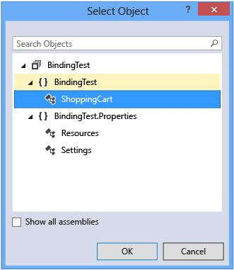
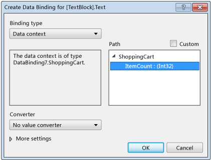

# Walkthrough: Binding to data in XAML Designer
In XAML Designer, you can set data binding properties by using the artboard and the Properties window. The example in this walkthrough shows how to bind data to a control. Specifically, the walkthrough shows how to create a simple shopping cart class that has a [DependencyProperty](http://msdn.microsoft.com/library/windows/apps/windows.ui.xaml.dependencyproperty.aspx) named `ItemCount`, and then bind the `ItemCount` property to the **Text** property of a [TextBlock](http://msdn.microsoft.com/library/windows/apps/windows.ui.xaml.controls.textblock.aspx) control.  
  
### To create a class to use as a data source  
  
1.  On the **File** menu, choose **New**, **Project**.  
  
2.  In the **New Project** dialog box, choose either the **Visual C#** or **Visual Basic** node, expand the **Windows Desktop** node, and then choose the **WPF Application** template.  
  
3.  Name the project **BindingTest**, and then choose the **OK** button.  
  
4.  Open the MainWindow.xaml.cs (or MainWindow.xaml.vb) file and add the following code. In C#, add the code in the `BindingTest` namespace (before the final closing parenthesis in the file). In Visual Basic, just add the new class.  
  
    ```c#  
    public class ShoppingCart : DependencyObject  
    {  
        public int ItemCount  
        {  
            get { return (int)GetValue(ItemCountProperty); }  
            set { SetValue(ItemCountProperty, value); }  
        }  
  
        public static readonly DependencyProperty ItemCountProperty =  
             DependencyProperty.Register("ItemCount", typeof(int),  
             typeof(ShoppingCart), new PropertyMetadata(0));  
    }  
  
    ```  
  
    ```vb  
    Public Class ShoppingCart  
        Inherits DependencyObject  
  
        Public Shared ReadOnly ItemCountProperty As DependencyProperty = DependencyProperty.Register(  
            "ItemCount", GetType(Integer), GetType(ShoppingCart), New PropertyMetadata(0))  
        Public Property ItemCount As Integer  
            Get  
                ItemCount = CType(GetValue(ItemCountProperty), Integer)  
            End Get  
            Set(value As Integer)  
                SetValue(ItemCountProperty, value)  
            End Set  
        End Property  
    End Class  
    ```  
  
     This code sets a value of 0 as the default item count by using the [PropertyMetadata](http://msdn.microsoft.com/library/windows/apps/windows.ui.xaml.propertymetadata.aspx) object.  
  
5.  On the **File** menu, choose **Build**, **Build Solution**.  
  
### To bind the ItemCount property to a TextBlock control  
  
1.  In Solution Explorer, open the shortcut menu for MainWindow.xaml and choose **View Designer**.  
  
2.  In the Toolbox, choose a [Grid](http://msdn.microsoft.com/library/windows/apps/windows.ui.xaml.controls.grid.aspx) control and add it to the form.  
  
3.  With the `Grid` selected, in the Properties window, choose the **New** button next to the **DataContext** property.  
  
4.  In the **Select Object** dialog box, make sure that **Show all assemblies** checkbox is cleared, choose **ShoppingCart** under the **BindingTest** namespace, and then choose the **OK** button.  
  
     The following illustration shows the **Select Object** dialog box with **ShoppingCart** selected.  
  
       
  
5.  In the **Toolbox**, choose a `TextBlock` control to add it to the form.  
  
6.  With the `TextBlock` control selected, in the Properties window, choose the property marker to the right of the **Text** property, and then choose **Create Data Binding**. (The property marker looks like a small box.)  
  
7.  In the Create Data Binding dialog box, in the **Path** box, choose the **ItemCount : (int32)** property and then choose the **OK** button.  
  
     The following illustration shows the **Create Data Binding** dialog box with the **ItemCount** property selected.  
  
       
  
8.  Press F5 to run the app.  
  
     The `TextBlock` control should show the default value of 0 as text.  
  
## See Also  
 [Creating a UI with XAML Designer](../vs140/creating-a-ui-by-using-xaml-designer-in-visual-studio.md)   
 [NIB: Add Value Converter dialog box](assetId:///c5f3d110-a541-4b55-8bca-928f77778af8)