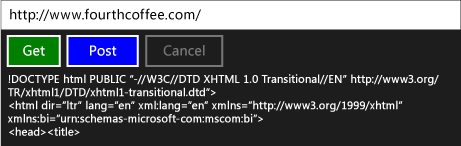

# Walkthrough: Connecting Using Tasks and XML HTTP Requests
This example shows how to use the [IXMLHTTPRequest2](assetId:///bbc11c4a-aecf-4d6d-8275-3e852e309908) and [IXMLHTTPRequest2Callback](assetId:///aa4b3f4c-6e28-458b-be25-6cce8865fc71) interfaces together with tasks to send HTTP GET and POST requests to a web service in a [!INCLUDE[win8_appname_long](../vs140/includes/win8_appname_long_md.md)] app. By combining <CodeContentPlaceHolder>0\</CodeContentPlaceHolder> together with tasks, you can write code that composes with other tasks. For example, you can use the download task as part of a chain of tasks. The download task can also respond when work is canceled.  
  
> [!TIP]
>  You can also use the C++ REST SDK to perform HTTP requests from a [!INCLUDE[win8_appname_long](../vs140/includes/win8_appname_long_md.md)] app using C++ app or from a desktop C++ app. For more info, see [C++ REST SDK (Codename "Casablanca")](../vs140/c---rest-sdk--codename--casablanca--.md).  
  
 For more information about tasks, see [Task Parallelism (Concurrency Runtime)](../vs140/task-parallelism--concurrency-runtime-.md). For more information about how to use tasks in a [!INCLUDE[win8_appname_long](../vs140/includes/win8_appname_long_md.md)] app, see [Asynchronous programming in C++](assetId:///512700b7-7863-44cc-93a2-366938052f31) and [Creating Asynchronous Operations in C++ for Windows Store Apps](../vs140/creating-asynchronous-operations-in-c---for-windows-store-apps.md).  
  
 This document first shows how to create <CodeContentPlaceHolder>1\</CodeContentPlaceHolder> and its supporting classes. It then shows how to use this class from a [!INCLUDE[win8_appname_long](../vs140/includes/win8_appname_long_md.md)] app that uses C++ and XAML.  
  
 For a more complete example that uses the <CodeContentPlaceHolder>2\</CodeContentPlaceHolder> class described in this document, see [Developing Bing Maps Trip Optimizer, a Windows Store app in JavaScript and C++](assetId:///974cf025-de1a-4299-b7dd-c6c7bf0e5d30). For another example that uses <CodeContentPlaceHolder>3\</CodeContentPlaceHolder> but does not use tasks, see [Quickstart: Connecting using XML HTTP Request (IXMLHTTPRequest2)](assetId:///cc7aed53-b2c5-4d83-b85d-cff2f5ba7b35).  
  
> [!TIP]
>  <CodeContentPlaceHolder>4\</CodeContentPlaceHolder> and <CodeContentPlaceHolder>5\</CodeContentPlaceHolder> are the interfaces that we recommend for use in a [!INCLUDE[win8_appname_long](../vs140/includes/win8_appname_long_md.md)] app. You can also adapt this example for use in a desktop app.  
  
## Prerequisites  
  
## Defining the HttpRequest, HttpRequestBuffersCallback, and HttpRequestStringCallback Classes  
 When you use the <CodeContentPlaceHolder>6\</CodeContentPlaceHolder> interface to create web requests over HTTP, you implement the <CodeContentPlaceHolder>7\</CodeContentPlaceHolder> interface to receive the server response and react to other events. This example defines the <CodeContentPlaceHolder>8\</CodeContentPlaceHolder> class to create web requests, and the <CodeContentPlaceHolder>9\</CodeContentPlaceHolder> and <CodeContentPlaceHolder>10\</CodeContentPlaceHolder> classes to process responses. The <CodeContentPlaceHolder>11\</CodeContentPlaceHolder> and <CodeContentPlaceHolder>12\</CodeContentPlaceHolder> classes support the <CodeContentPlaceHolder>13\</CodeContentPlaceHolder> class; you work only with the <CodeContentPlaceHolder>14\</CodeContentPlaceHolder> class from application code.  
  
 The <CodeContentPlaceHolder>15\</CodeContentPlaceHolder>, <CodeContentPlaceHolder>16\</CodeContentPlaceHolder> methods of the <CodeContentPlaceHolder>17\</CodeContentPlaceHolder> class enable you to start HTTP GET and POST operations, respectively. These methods use the <CodeContentPlaceHolder>18\</CodeContentPlaceHolder> class to read the server response as a string. The <CodeContentPlaceHolder>19\</CodeContentPlaceHolder> and <CodeContentPlaceHolder>20\</CodeContentPlaceHolder> methods enable you to stream large content in chunks. These methods each return [concurrency::task](../vs140/task-class--concurrency-runtime-.md) to represent the operation. The <CodeContentPlaceHolder>21\</CodeContentPlaceHolder> and <CodeContentPlaceHolder>22\</CodeContentPlaceHolder> methods produce <CodeContentPlaceHolder>23\</CodeContentPlaceHolder> value, where the <CodeContentPlaceHolder>24\</CodeContentPlaceHolder> part represents the server’s response. The <CodeContentPlaceHolder>25\</CodeContentPlaceHolder> and <CodeContentPlaceHolder>26\</CodeContentPlaceHolder> methods produce <CodeContentPlaceHolder>27\</CodeContentPlaceHolder> values; these tasks complete when the send and read operations complete.  
  
 Because the <CodeContentPlaceHolder>28\</CodeContentPlaceHolder> interfaces act asynchronously, this example uses [concurrency::task_completion_event](../vs140/task_completion_event-class.md) to create a task that completes after the callback object completes or cancels the download operation. The <CodeContentPlaceHolder>29\</CodeContentPlaceHolder> class creates a task-based continuation from this task to set the final result. The <CodeContentPlaceHolder>30\</CodeContentPlaceHolder> class uses a task-based continuation to ensure that the continuation task runs even if the previous task produces an error or is canceled. For more information about task-based continuations, see [Task Parallelism (Concurrency Runtime)](../vs140/task-parallelism--concurrency-runtime-.md)  
  
 To support cancellation, the <CodeContentPlaceHolder>31\</CodeContentPlaceHolder>, <CodeContentPlaceHolder>32\</CodeContentPlaceHolder>, and <CodeContentPlaceHolder>33\</CodeContentPlaceHolder> classes use cancellation tokens. The <CodeContentPlaceHolder>34\</CodeContentPlaceHolder> and <CodeContentPlaceHolder>35\</CodeContentPlaceHolder> classes use the [concurrency::cancellation_token::register_callback](../vs140/cancellation_token--register_callback-method.md) method to enable the task completion event to respond to cancellation. This cancellation callback aborts the download. For more info about cancellation, see [Cancellation in the PPL](../vs140/cancellation-in-the-ppl.md).  
  
#### To Define the HttpRequest Class  
  
1.  Use the Visual C++ **Blank App (XAML)** template to create a blank XAML app project. This example names the project <CodeContentPlaceHolder>36\</CodeContentPlaceHolder>.  
  
2.  Add to the project a header file that is named HttpRequest.h and a source file that is named HttpRequest.cpp.  
  
3.  In pch.h, add this code:  
  
     [!code[concrt-using-ixhr2#1](../vs140/codesnippet/CPP/walkthrough--connecting-using-tasks-and-xml-http-requests_1.h)]  
  
4.  In HttpRequest.h, add this code:  
  
     [!code[concrt-using-ixhr2#2](../vs140/codesnippet/CPP/walkthrough--connecting-using-tasks-and-xml-http-requests_2.h)]  
  
5.  In HttpRequest.cpp, add this code:  
  
     [!code[concrt-using-ixhr2#3](../vs140/codesnippet/CPP/walkthrough--connecting-using-tasks-and-xml-http-requests_3.cpp)]  
  
## Using the HttpRequest Class in a [!INCLUDE[win8_appname_long](../vs140/includes/win8_appname_long_md.md)] App  
 This section demonstrates how to use the <CodeContentPlaceHolder>37\</CodeContentPlaceHolder> class in a [!INCLUDE[win8_appname_long](../vs140/includes/win8_appname_long_md.md)] app. The app provides an input box that defines a URL resource, and button commands that perform GET and POST operations, and a button command that cancels the current operation.  
  
#### To Use the HttpRequest Class  
  
1.  In MainPage.xaml, define the [StackPanel](http://msdn.microsoft.com/library/windows/apps/xaml/windows.ui.xaml.controls.stackpanel.aspx) element as follows.  
  
     [!code[concrt-using-ixhr2#A1](../vs140/codesnippet/Xaml/walkthrough--connecting-using-tasks-and-xml-http-requests_4.xaml)]  
  
2.  In MainPage.xaml.h, add this <CodeContentPlaceHolder>38\</CodeContentPlaceHolder> directive:  
  
     [!code[concrt-using-ixhr2#A2](../vs140/codesnippet/CPP/walkthrough--connecting-using-tasks-and-xml-http-requests_5.h)]  
  
3.  In MainPage.xaml.h, add these <CodeContentPlaceHolder>39\</CodeContentPlaceHolder> member variables to the <CodeContentPlaceHolder>40\</CodeContentPlaceHolder> class:  
  
     [!code[concrt-using-ixhr2#A3](../vs140/codesnippet/CPP/walkthrough--connecting-using-tasks-and-xml-http-requests_6.h)]  
  
4.  In MainPage.xaml.h, declare the <CodeContentPlaceHolder>41\</CodeContentPlaceHolder> method <CodeContentPlaceHolder>42\</CodeContentPlaceHolder>:  
  
     [!code[concrt-using-ixhr2#A4](../vs140/codesnippet/CPP/walkthrough--connecting-using-tasks-and-xml-http-requests_7.h)]  
  
5.  In MainPage.xaml.cpp, add these <CodeContentPlaceHolder>43\</CodeContentPlaceHolder> statements:  
  
     [!code[concrt-using-ixhr2#A5](../vs140/codesnippet/CPP/walkthrough--connecting-using-tasks-and-xml-http-requests_8.cpp)]  
  
6.  In MainPage.xaml.cpp, implement the <CodeContentPlaceHolder>44\</CodeContentPlaceHolder>, <CodeContentPlaceHolder>45\</CodeContentPlaceHolder>, and <CodeContentPlaceHolder>46\</CodeContentPlaceHolder> methods of the <CodeContentPlaceHolder>47\</CodeContentPlaceHolder> class.  
  
     [!code[concrt-using-ixhr2#A6](../vs140/codesnippet/CPP/walkthrough--connecting-using-tasks-and-xml-http-requests_9.cpp)]  
  
    > [!TIP]
    >  If your app does not require support for cancellation, pass [concurrency::cancellation_token::none](../vs140/cancellation_token--none-method.md) to the <CodeContentPlaceHolder>48\</CodeContentPlaceHolder> and <CodeContentPlaceHolder>49\</CodeContentPlaceHolder> methods.  
  
7.  In MainPage.xaml.cpp, implement the <CodeContentPlaceHolder>50\</CodeContentPlaceHolder> method.  
  
     [!code[concrt-using-ixhr2#A7](../vs140/codesnippet/CPP/walkthrough--connecting-using-tasks-and-xml-http-requests_10.cpp)]  
  
8.  In the project properties, under **Linker**, **Input**, specify <CodeContentPlaceHolder>51\</CodeContentPlaceHolder> and <CodeContentPlaceHolder>52\</CodeContentPlaceHolder>.  
  
 Here is the running app:  
  
   
  
## Next Steps  
 [Concurrency Runtime Walkthroughs](../vs140/concurrency-runtime-walkthroughs.md)  
  
## See Also  
 [Task Parallelism (Concurrency Runtime)](../vs140/task-parallelism--concurrency-runtime-.md)   
 [Cancellation in the PPL](../vs140/cancellation-in-the-ppl.md)   
 [Asynchronous programming in C++](assetId:///512700b7-7863-44cc-93a2-366938052f31)   
 [Creating Asynchronous Operations in C++ for Windows Store Apps](../vs140/creating-asynchronous-operations-in-c---for-windows-store-apps.md)   
 [Quickstart: Connecting using XML HTTP Request (IXMLHTTPRequest2)](assetId:///cc7aed53-b2c5-4d83-b85d-cff2f5ba7b35)   
 [task Class](../vs140/task-class--concurrency-runtime-.md)   
 [task_completion_event Class](../vs140/task_completion_event-class.md)   
 [IXMLHTTPRequest2](assetId:///bbc11c4a-aecf-4d6d-8275-3e852e309908)   
 [IXMLHTTPRequest2Callback](assetId:///aa4b3f4c-6e28-458b-be25-6cce8865fc71)