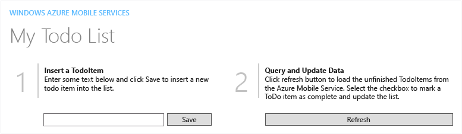
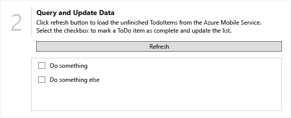

# Walkthrough: Create a WPF Desktop Application connected to an Azure Mobile Service
You can use Windows Presentation Foundation (WPF) to quickly create a modern desktop application that uses an Azure Mobile Service to store and provide data.  
  
##  \<a name="Requirements">\</a> Prerequisites  
 You’ll need the following to complete this walkthrough:  
  
-   Visual Studio 2015 – any version that supports WPF development.  
  
-   An active Microsoft Azure account.  
  
    -   You can sign up for a free trial account [here](http://azure.microsoft.com/en-us/pricing/free-trial/).  
  
    -   You can activate [MSDN subscriber benefits](https://azure.microsoft.com/en-us/pricing/member-offers/msdn-benefits-details/?WT.mc_id=A261C142F). Your MSDN subscription gives you credits every month that you can use for paid Azure services.  
  
## Create a project and add references  
 The first step is to create a WPF project and add a NuGet package that lets you connect to Azure Mobile Services.  
  
#### To create the project  
  
1.  On the menu bar, choose **File**, **New**, **Project**.  
  
2.  In the **New Project** dialog, expand either the **Visual C#** or **Visual Basic** node and choose the **Windows** node, and then expand the **Windows** node and choose the **Classic Desktop** node.  
  
3.  In the template list, choose the **WPF Application** template.  
  
4.  In the **Name** textbox enter <CodeContentPlaceHolder>13\</CodeContentPlaceHolder>, and then choose the **OK** button.  
  
     The project is created and the project files are added to **Solution Explorer**, and the designer for the default application window named **MainWindow.xaml** is displayed.  
  
#### To add a reference to the Windows Azure Mobile Services SDK  
  
1.  In **Solution Explorer**, open the shortcut menu for the **References** node and choose **Manage NuGet Packages**.  
  
2.  In the **NuGet Package Manager**, choose the **Search** field and enter <CodeContentPlaceHolder>14\</CodeContentPlaceHolder>.  
  
3.  In the left pane, choose **WindowsAzure.MobileServices**, and then in the right pane choose the **Install** button.  
  
    > [!NOTE]
    >  If a **Preview** dialog appears, review the proposed changes and then choose the **OK** button.  
  
4.  In the **License Acceptance** dialog, review the license terms and then accept them by choosing the **I Accept** button.  
  
     The necessary references will be added to **Solution Explorer**.  
  
    > [!NOTE]
    >  If you don’t agree with the license terms, choose the **I Decline** button. You won’t be able to finish the rest of the walkthrough.  
  
## Create the user interface  
 The next step is to create the user interface for the application. First you’ll create a reusable user control that displays a standard side-by-side two pane layout. You’ll add the user control to the main application window and add controls to enter and display data, then write some code to define the interaction with the mobile service backend.  
  
#### To add a user control  
  
1.  In **Solution Explorer**, open the shortcut menu for the **WPFQuickStart** node and choose **Add**, **New Folder**.  
  
2.  Name the folder <CodeContentPlaceHolder>15\</CodeContentPlaceHolder>.  
  
3.  Open the shortcut menu for the **Common** folder and choose **Add**, **User Control**.  
  
4.  In the **Add New Item** dialog, choose the Name field and enter <CodeContentPlaceHolder>16\</CodeContentPlaceHolder>, and then choose the **Add** button.  
  
     The user control will be added to the project and the **QuickStartTask.xaml** file will open in the designer.  
  
5.  In the lower pane of the designer, select the <CodeContentPlaceHolder>17\</CodeContentPlaceHolder> and <CodeContentPlaceHolder>18\</CodeContentPlaceHolder> tags and replace them with the following XAML code:  
  
<CodeContentPlaceHolder>0\</CodeContentPlaceHolder>  
     This XAML code creates a reusable layout with placeholders for number, title and description fields. At run time the placeholders can be replaced with text as shown in the following illustration.  
  
       
  
6.  In **Solution Explorer**, expand the **QuickStartTask.xaml** node and open the **QuickStartTask.xaml.cs** or **QuickStartTask.xaml.vb** file.  
  
7.  In the code editor, replace the <CodeContentPlaceHolder>19\</CodeContentPlaceHolder> (C#) namespace or the <CodeContentPlaceHolder>20\</CodeContentPlaceHolder> (VB) method with the following code:  
  
<CodeContentPlaceHolder>1\</CodeContentPlaceHolder>  
<CodeContentPlaceHolder>2\</CodeContentPlaceHolder>  
     This code uses dependency properties to set the values for the number, title and description fields at run time.  
  
8.  On the menu bar, choose **Build**, **Build WPFQuickStart** to build the user control.  
  
#### To create and modify the main window  
  
1.  In **Solution Explorer**, open the **MainWindow.xaml** file.  
  
2.  **Important**. This step is for C# only. If you are using Visual Basic, skip to the next step. In the lower pane of the designer, locate the line <CodeContentPlaceHolder>21\</CodeContentPlaceHolder> and replace it with the following XAML code:  
  
<CodeContentPlaceHolder>3\</CodeContentPlaceHolder>  
3.  In the **Properties** window, expand the **Common** category node and choose the **Title** property, and then enter <CodeContentPlaceHolder>22\</CodeContentPlaceHolder> and press the **Enter** key.  
  
     Notice that the **Title** element in the XAML window changes to match the new value. You can modify XAML properties in either the XAML window or the **Properties** window, and the changes are synchronized.  
  
4.  In the XAML window, set the value of the **Height** element to <CodeContentPlaceHolder>23\</CodeContentPlaceHolder>, and set the value of the **Width** property to <CodeContentPlaceHolder>24\</CodeContentPlaceHolder>.  
  
     These elements correspond to the **Height** and **Width** properties, found in the **Layout** category in the **Properties** window.  
  
5.  Select the <CodeContentPlaceHolder>25\</CodeContentPlaceHolder> and <CodeContentPlaceHolder>26\</CodeContentPlaceHolder> tags and replace them with the following XAML code:  
  
<CodeContentPlaceHolder>4\</CodeContentPlaceHolder>  
     Notice that the changes are reflected in the Design window. Once again, you also could have defined the user interface by adding controls from the **Toolbox** window and setting properties in the **Properties** window. Anything that can be done in the designer can be done in XAML code, and vice versa.  
  
     At this point, the design should look like the following illustration.  
  
       
  
    > [!NOTE]
    >  While following the next few procedures you might see errors in the **Error List** if it is open. Don’t worry; these errors will go away once you complete the remaining procedures.  
  
6.  In **Solution Explorer**, expand the **MainWindow.xaml** node and open the **MainWindow.xaml.cs** or **MainWindow.xaml.vb** file.  
  
7.  In the Code Editor, add the following <CodeContentPlaceHolder>27\</CodeContentPlaceHolder> or <CodeContentPlaceHolder>28\</CodeContentPlaceHolder> directives to the top of the file:  
  
<CodeContentPlaceHolder>5\</CodeContentPlaceHolder>  
<CodeContentPlaceHolder>6\</CodeContentPlaceHolder>  
8.  Replace all of the code in the **WPFQuickStart** namespace (C#) or **Class MainWindow** class (VB) with the following code:  
  
<CodeContentPlaceHolder>7\</CodeContentPlaceHolder>  
<CodeContentPlaceHolder>8\</CodeContentPlaceHolder>  
     This code defines the interaction between the user interface and the database in the mobile service using asynchronous methods.  
  
## Create the Azure mobile service  
 The final step is to create a mobile service in Microsoft Azure, add a table to store your data, and then reference the service instance from your application.  
  
#### To create a mobile service  
  
1.  Open a web browser and log in to your Microsoft Azure portal, and then choose the **MOBILE SERVICES** tab.  
  
2.  Choose the **NEW** button, and in the pop up dialog choose **COMPUTE**, **MOBILE SERVICE,CREATE**.  
  
3.  In the **NEW MOBILE SERVICE** dialog, choose the **URL** textbox and enter <CodeContentPlaceHolder>29\</CodeContentPlaceHolder>.  
  
    > [!NOTE]
    >  You may need to change the numeric portion of the URL. Microsoft Azure requires a unique URL for each mobile service.  
  
     This sets the URL for the service to *https://wpfquickstart01.azure-mobile.net/*.  
  
4.  In the **DATABASE** list, choose a database option. Since this is an application that probably won’t get a lot of usage, you might want to choose the **Create a free 20MB SQL database** option, or choose the free database already associated with your subscription.  
  
5.  In the **REGION** list, choose the data center where you want to deploy the mobile service, and then choose the **Next** (right arrow) button.  
  
    > [!NOTE]
    >  For this service you will use the default **BACKEND** setting, **JavaScript**.  
  
6.  If you are creating a new database, on the **Specify database settings** page, in the **SERVER** list choose **New SQL database server**, enter your **SQL LOGIN NAME** and **PASSWORD**, and then choose the **Complete** (checkmark) button.  
  
7.  If you chose an existing database, on the **Database Settings** page, enter your **LOGIN PASSWORD** and then choose the **Complete** (checkmark) button.  
  
     The process of creating the mobile service will begin. Once the process is completed the status will change to **Ready** and you can move on to the next step.  
  
8.  In the portal, select the newly created mobile service and then choose the **MANAGE KEYS** button.  
  
9. In the **Manage Access Keys** dialog, copy the **APPLICATION KEY**.  
  
     You’ll use this in the next procedure.  
  
#### To create a table  
  
1.  In the Microsoft Azure portal, choose the right arrow next to the name of your mobile service, and on the menu bar, choose **DATA**, and then choose the **ADD A TABLE** link.  
  
2.  In the **Create New Table** dialog, in the **TABLE NAME** text box enter <CodeContentPlaceHolder>30\</CodeContentPlaceHolder>, and then choose the **Complete** (checkmark) button.  
  
     Wait for the table to be created, and then move on to the final procedure.  
  
#### To add a declaration for the mobile service  
  
1.  Return to Visual Studio. In **Solution Explorer**, expand the **App.xaml** (C#) or **Application.xaml** (Visual Basic) node and open the **App.xaml.cs** or **App.xaml.vb** file.  
  
2.  In the Code Editor, add the following <CodeContentPlaceHolder>31\</CodeContentPlaceHolder> or **Imports** directives to the top of the file:  
  
<CodeContentPlaceHolder>9\</CodeContentPlaceHolder>  
<CodeContentPlaceHolder>10\</CodeContentPlaceHolder>  
3.  Add the following declaration to the class, replacing *YOUR-SERVICE_HERE* with the name of the URL for your service, and replacing *YOUR-KEY-HERE* with the application key that you copied in the previous procedure:  
  
<CodeContentPlaceHolder>11\</CodeContentPlaceHolder>  
<CodeContentPlaceHolder>12\</CodeContentPlaceHolder>  
     This code allows the application to access the mobile service running on Microsoft Azure.  
  
## Test the application  
 That’s it – you’ve created a WPF desktop application that accesses an Azure Mobile Service. Now all that’s left is to run the application and see it in action.  
  
#### To run the application  
  
1.  On the menu bar, choose **Debug**, **Start Debugging** (or press F5).  
  
2.  In the **Insert a TodoItem** textbox, enter <CodeContentPlaceHolder>32\</CodeContentPlaceHolder>, and then choose the **Save** button.  
  
3.  Enter <CodeContentPlaceHolder>33\</CodeContentPlaceHolder>, and then choose the **Save** button again.  
  
     Notice that the two entries are added to the **Query and Update Data** list, as shown in the following illustration.  
  
       
  
4.  Select the checkbox for the **Do something else** entry in the list.  
  
     This calls the **UpdateCheckedTodoItem** method and removes the item from both the list and the database.  
  
## Next Steps  
 You’ve completed a fairly simplistic example of a WPF desktop application with an Azure backend. Of course, a real application is likely to be much more complex, but the same basic concepts apply. See [WPF in the .NET Framework](https://msdn.microsoft.com/en-us/library/ms754130\(v=vs.100\).aspx).  
  
 You can make the user interface more appealing by adding color, shapes, graphics, and even animations. See [Designing XAML in Visual Studio](../vs140/designing-xaml-in-visual-studio.md).  
  
 You can connect to existing SQL databases or other sources of data using Azure Mobile Services. See [Mobile Services documentation](http://azure.microsoft.com/en-us/services/app-service/mobile/).  
  
## See Also  
 [Walkthrough: My First WPF Desktop Application](../vs140/walkthrough--my-first-wpf-desktop-application.md)   
 [Create Modern Desktop Applications with Windows Presentation Foundation](../vs140/create-modern-desktop-applications-with-windows-presentation-foundation.md)