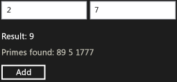

# Walkthrough: Creating a Basic Windows Runtime Component Using WRL
This document shows how to use the [!INCLUDE[cppwrl](../vs140/includes/cppwrl_md.md)] ([!INCLUDE[cppwrl_short](../vs140/includes/cppwrl_short_md.md)]) to create a basic [!INCLUDE[wrt](../vs140/includes/wrt_md.md)] component. The component adds two numbers and raises an event when the result is prime. This document also demonstrates how to use the component from a [!INCLUDE[win8_appname_long](../vs140/includes/win8_appname_long_md.md)] app that uses JavaScript.  
  
## Prerequisites  
  
-   Experience with the [Windows Runtime](http://msdn.microsoft.com/library/windows/apps/br211377.aspx).  
  
-   Experience with COM.  
  
### To create a basic [!INCLUDE[wrt](../vs140/includes/wrt_md.md)] component that adds two numbers  
  
1.  In Visual Studio, create a Visual C++ <CodeContentPlaceHolder>0\</CodeContentPlaceHolder> project. The document [Class Library Project Template (WRL)](../vs140/wrl-class-library-project-template.md) describes how to download this template. Name the project <CodeContentPlaceHolder>1\</CodeContentPlaceHolder>.  
  
2.  In Contoso.cpp and Contoso.idl, replace all instances of "WinRTClass" with "Calculator".  
  
3.  In Contoso.idl, add the <CodeContentPlaceHolder>2\</CodeContentPlaceHolder> method to the <CodeContentPlaceHolder>3\</CodeContentPlaceHolder> interface.  
  
     [!code[wrl-basic-component#1](../vs140/codesnippet/CPP/walkthrough--creating-a-basic-windows-runtime-component-using-wrl_1.idl)]  
  
4.  In Contoso.cpp, add the <CodeContentPlaceHolder>4\</CodeContentPlaceHolder> method to the <CodeContentPlaceHolder>5\</CodeContentPlaceHolder> section of the <CodeContentPlaceHolder>6\</CodeContentPlaceHolder> class.  
  
     [!code[wrl-basic-component#2](../vs140/codesnippet/CPP/walkthrough--creating-a-basic-windows-runtime-component-using-wrl_2.cpp)]  
  
    > [!IMPORTANT]
    >  Because you’re creating a COM component, remember to use the <CodeContentPlaceHolder>7\</CodeContentPlaceHolder> calling convention.  
  
     We recommend that you use <CodeContentPlaceHolder>8\</CodeContentPlaceHolder> and other source annotation language (SAL) annotations to describe how a function uses its parameters. SAL annotations also describe return values. SAL annotations work with the [C/C++ Code Analysis tool](../vs140/code-analysis-for-c-c---overview.md) to discover possible defects in C and C++ source code. Common coding errors that are reported by the tool include buffer overruns, uninitialized memory, null pointer dereferences, and memory and resource leaks.  
  
### To use the component from a [!INCLUDE[win8_appname_long](../vs140/includes/win8_appname_long_md.md)] app that uses JavaScript  
  
1.  In Visual Studio, add a new JavaScript <CodeContentPlaceHolder>9\</CodeContentPlaceHolder> project to the <CodeContentPlaceHolder>10\</CodeContentPlaceHolder> solution. Name the project <CodeContentPlaceHolder>11\</CodeContentPlaceHolder>.  
  
2.  In the <CodeContentPlaceHolder>12\</CodeContentPlaceHolder> project, add a reference to the <CodeContentPlaceHolder>13\</CodeContentPlaceHolder> project.  
  
3.  In default.html, replace the <CodeContentPlaceHolder>14\</CodeContentPlaceHolder> section with these UI elements:  
  
     [!code[wrl-basic-component#3](../vs140/codesnippet/Html/walkthrough--creating-a-basic-windows-runtime-component-using-wrl_3.html)]  
  
4.  In default.js, implement the <CodeContentPlaceHolder>15\</CodeContentPlaceHolder> function.  
  
     [!code[wrl-basic-component#4](../vs140/codesnippet/JavaScript/walkthrough--creating-a-basic-windows-runtime-component-using-wrl_4.js)]  
  
    > [!NOTE]
    >  In JavaScript, the first letter of a method name is changed to lowercase to match the standard naming conventions.  
  
### To add an event that fires when a prime number is calculated  
  
1.  In Contoso.idl, before the declaration of <CodeContentPlaceHolder>16\</CodeContentPlaceHolder>, define the delegate type, <CodeContentPlaceHolder>17\</CodeContentPlaceHolder>, which provides an <CodeContentPlaceHolder>18\</CodeContentPlaceHolder> argument.  
  
     [!code[wrl-basic-component#5](../vs140/codesnippet/CPP/walkthrough--creating-a-basic-windows-runtime-component-using-wrl_5.idl)]  
  
     When you use the <CodeContentPlaceHolder>19\</CodeContentPlaceHolder> keyword, the MIDL compiler creates an interface that contains an <CodeContentPlaceHolder>20\</CodeContentPlaceHolder> method that matches that delegate's signature. In this example, the generated file Contoso_h.h defines the <CodeContentPlaceHolder>21\</CodeContentPlaceHolder> interface, which is used later in this procedure.  
  
     [!code[wrl-basic-component#13](../vs140/codesnippet/CPP/walkthrough--creating-a-basic-windows-runtime-component-using-wrl_6.cpp)]  
  
2.  In the <CodeContentPlaceHolder>22\</CodeContentPlaceHolder> interface, define the <CodeContentPlaceHolder>23\</CodeContentPlaceHolder> event. The <CodeContentPlaceHolder>24\</CodeContentPlaceHolder> and <CodeContentPlaceHolder>25\</CodeContentPlaceHolder> attributes specify that the consumer of the <CodeContentPlaceHolder>26\</CodeContentPlaceHolder> interface can both subscribe to and unsubscribe from this event.  
  
     [!code[wrl-basic-component#6](../vs140/codesnippet/CPP/walkthrough--creating-a-basic-windows-runtime-component-using-wrl_7.idl)]  
  
3.  In Contoso.cpp, add a <CodeContentPlaceHolder>27\</CodeContentPlaceHolder>[Microsoft::WRL::EventSource](../vs140/eventsource-class.md) member variable to manage the event subscribers and invoke the event handler.  
  
     [!code[wrl-basic-component#7](../vs140/codesnippet/CPP/walkthrough--creating-a-basic-windows-runtime-component-using-wrl_8.cpp)]  
  
4.  In Contoso.cpp, implement the <CodeContentPlaceHolder>28\</CodeContentPlaceHolder> and <CodeContentPlaceHolder>29\</CodeContentPlaceHolder> methods.  
  
     [!code[wrl-basic-component#8](../vs140/codesnippet/CPP/walkthrough--creating-a-basic-windows-runtime-component-using-wrl_9.cpp)]  
  
### To raise the event when a prime number is calculated  
  
1.  In Contoso.cpp, add the <CodeContentPlaceHolder>30\</CodeContentPlaceHolder> method to the <CodeContentPlaceHolder>31\</CodeContentPlaceHolder> section of the <CodeContentPlaceHolder>32\</CodeContentPlaceHolder> class.  
  
     [!code[wrl-basic-component#12](../vs140/codesnippet/CPP/walkthrough--creating-a-basic-windows-runtime-component-using-wrl_10.cpp)]  
  
2.  Modify the <CodeContentPlaceHolder>33\</CodeContentPlaceHolder>’s <CodeContentPlaceHolder>34\</CodeContentPlaceHolder> method to call the [Microsoft::WRL::EventSource::InvokeAll](../vs140/eventsource--invokeall-method.md) method when a prime number is calculated.  
  
     [!code[wrl-basic-component#11](../vs140/codesnippet/CPP/walkthrough--creating-a-basic-windows-runtime-component-using-wrl_11.cpp)]  
  
### To handle the event from JavaScript  
  
1.  In default.html, modify the <CodeContentPlaceHolder>35\</CodeContentPlaceHolder> section to include a text area that contains prime numbers.  
  
     [!code[wrl-basic-component#9](../vs140/codesnippet/Html/walkthrough--creating-a-basic-windows-runtime-component-using-wrl_12.html)]  
  
2.  In default.js, modify the <CodeContentPlaceHolder>36\</CodeContentPlaceHolder> function to handle the <CodeContentPlaceHolder>37\</CodeContentPlaceHolder> event. The event handler appends the prime number to the text area that was defined by the previous step.  
  
     [!code[wrl-basic-component#10](../vs140/codesnippet/JavaScript/walkthrough--creating-a-basic-windows-runtime-component-using-wrl_13.js)]  
  
    > [!NOTE]
    >  In JavaScript, the event names are changed to lower-case and are prepended with "on" to match the standard naming conventions.  
  
 The following illustration shows the basic Calculator app.  
  
   
  
## Next Steps  
  
## See Also  
 [Windows Runtime C++ Template Library](../vs140/windows-runtime-c---template-library--wrl-.md)   
 [Class Library Project Template (WRL)](../vs140/wrl-class-library-project-template.md)   
 [C/C++ Code Analysis tool](../vs140/code-analysis-for-c-c---overview.md)