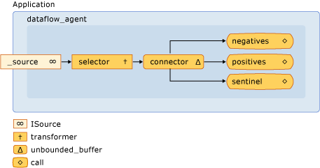

# Walkthrough: Creating a Dataflow Agent
This document demonstrates how to create agent-based applications that are based on dataflow, instead of control flow.  
  
 *Control flow* refers to the execution order of operations in a program. Control flow is regulated by using control structures such as conditional statements, loops, and so on. Alternatively, *dataflow* refers to a programming model in which computations are made only when all required data is available. The dataflow programming model is related to the concept of message passing, in which independent components of a program communicate with one another by sending messages.  
  
 Asynchronous agents support both the control-flow and dataflow programming models. Although the control-flow model is appropriate in many cases, the dataflow model is appropriate in others, for example, when an agent receives data and performs an action that is based on the payload of that data.  
  
## Prerequisites  
 Read the following documents before you start this walkthrough:  
  
-   [Asynchronous Agents](../vs140/asynchronous-agents.md)  
  
-   [Asynchronous Message Blocks](../vs140/asynchronous-message-blocks.md)  
  
-   [How-to: Use a Message Block Filter to Improve Performance](../vs140/how-to--use-a-message-block-filter.md)  
  
##  \<a name="top">\</a> Sections  
 This walkthrough contains the following sections:  
  
-   [Creating a Basic Control-Flow Agent](#control-flow)  
  
-   [Creating a Basic Dataflow Agent](#dataflow)  
  
-   [Creating a Message-Logging Agent](#logging)  
  
##  \<a name="control-flow">\</a> Creating a Basic Control-Flow Agent  
 Consider the following example that defines the <CodeContentPlaceHolder>0\</CodeContentPlaceHolder> class. The <CodeContentPlaceHolder>1\</CodeContentPlaceHolder> class acts on three message buffers: one input buffer and two output buffers. The <CodeContentPlaceHolder>2\</CodeContentPlaceHolder> method reads from the source message buffer in a loop and uses a conditional statement to direct the flow of program execution. The agent increments one counter for non-zero, negative values and increments another counter for non-zero, positive values. After the agent receives the sentinel value of zero, it sends the values of the counters to the output message buffers. The <CodeContentPlaceHolder>3\</CodeContentPlaceHolder> and <CodeContentPlaceHolder>4\</CodeContentPlaceHolder> methods enable the application to read the counts of negative and positive values from the agent.  
  
 [!code[concrt-dataflow-agent#1](../vs140/codesnippet/CPP/walkthrough--creating-a-dataflow-agent_1.cpp)]  
  
 Although this example makes basic use of control flow in an agent, it demonstrates the serial nature of control-flow-based programming. Each message must be processed sequentially, even though multiple messages might be available in the input message buffer. The dataflow model enables both branches of the conditional statement to evaluate concurrently. The dataflow model also enables you to create more complex messaging networks that act on data as it becomes available.  
  
 [[Top](#top)]  
  
##  \<a name="dataflow">\</a> Creating a Basic Dataflow Agent  
 This section shows how to convert the <CodeContentPlaceHolder>5\</CodeContentPlaceHolder> class to use the dataflow model to perform the same task.  
  
 The dataflow agent works by creating a network of message buffers, each of which serves a specific purpose. Certain message blocks use a filter function to accept or reject a message on the basis of its payload. A filter function ensures that a message block receives only certain values.  
  
#### To convert the control-flow agent to a dataflow agent  
  
1.  Copy the body of the <CodeContentPlaceHolder>6\</CodeContentPlaceHolder> class to another class, for example, <CodeContentPlaceHolder>7\</CodeContentPlaceHolder>. Alternatively, you can rename the <CodeContentPlaceHolder>8\</CodeContentPlaceHolder> class.  
  
2.  Remove the body of the loop that calls <CodeContentPlaceHolder>9\</CodeContentPlaceHolder> from the <CodeContentPlaceHolder>10\</CodeContentPlaceHolder> method.  
  
     [!code[concrt-dataflow-agent#2](../vs140/codesnippet/CPP/walkthrough--creating-a-dataflow-agent_2.cpp)]  
  
3.  In the <CodeContentPlaceHolder>11\</CodeContentPlaceHolder> method, after the initialization of the variables <CodeContentPlaceHolder>12\</CodeContentPlaceHolder> and <CodeContentPlaceHolder>13\</CodeContentPlaceHolder>, add a <CodeContentPlaceHolder>14\</CodeContentPlaceHolder> object that tracks the count of active operations.  
  
     [!code[concrt-dataflow-agent#6](../vs140/codesnippet/CPP/walkthrough--creating-a-dataflow-agent_3.cpp)]  
  
     The <CodeContentPlaceHolder>15\</CodeContentPlaceHolder> class is shown later in this topic.  
  
4.  Create the message buffer objects that will participate in the dataflow network.  
  
     [!code[concrt-dataflow-agent#3](../vs140/codesnippet/CPP/walkthrough--creating-a-dataflow-agent_4.cpp)]  
  
5.  Connect the message buffers to form a network.  
  
     [!code[concrt-dataflow-agent#4](../vs140/codesnippet/CPP/walkthrough--creating-a-dataflow-agent_5.cpp)]  
  
6.  Wait for the <CodeContentPlaceHolder>16\</CodeContentPlaceHolder> and <CodeContentPlaceHolder>17\</CodeContentPlaceHolder> objects to be set. These events signal that that the agent has received the sentinel value and that all operations have finished.  
  
     [!code[concrt-dataflow-agent#5](../vs140/codesnippet/CPP/walkthrough--creating-a-dataflow-agent_6.cpp)]  
  
 The following diagram shows the complete dataflow network for the <CodeContentPlaceHolder>18\</CodeContentPlaceHolder> class:  
  
   
  
 The following table describes the members of the network.  
  
|Member|Description|  
|------------|-----------------|  
|<CodeContentPlaceHolder>19\</CodeContentPlaceHolder>|A [concurrency::transformer](../vs140/transformer-class.md) object that increments the active event counter and passes the input value to the rest of the network.|  
|<CodeContentPlaceHolder>20\</CodeContentPlaceHolder>, <CodeContentPlaceHolder>21\</CodeContentPlaceHolder>|[concurrency::call](../vs140/call-class.md) objects that increment the count of numbers and decrements the active event counter. The objects each use a filter to accept either negative numbers or positive numbers.|  
|<CodeContentPlaceHolder>22\</CodeContentPlaceHolder>|A [concurrency::call](../vs140/call-class.md) object that accepts only the sentinel value of zero and decrements the active event counter.|  
|<CodeContentPlaceHolder>23\</CodeContentPlaceHolder>|A [concurrency::unbounded_buffer](../vs140/unbounded_buffer-class.md) object that connects the source message buffer to the internal network.|  
  
 Because the <CodeContentPlaceHolder>24\</CodeContentPlaceHolder> method is called on a separate thread, other threads can send messages to the network before the network is fully connected. The <CodeContentPlaceHolder>25\</CodeContentPlaceHolder> data member is an <CodeContentPlaceHolder>26\</CodeContentPlaceHolder> object that buffers all input that is sent from the application to the agent. To make sure that the network processes all input messages, the agent first links the internal nodes of the network and then links the start of that network, <CodeContentPlaceHolder>27\</CodeContentPlaceHolder>, to the <CodeContentPlaceHolder>28\</CodeContentPlaceHolder> data member. This guarantees that messages do not get processed as the network is being formed.  
  
 Because the network in this example is based on dataflow, rather than on control-flow, the network must communicate to the agent that it has finished processing each input value and that the sentinel node has received its value. This example uses a <CodeContentPlaceHolder>29\</CodeContentPlaceHolder> object to signal that all input values have been processed and a [concurrency::event](../vs140/event-class.md) object to indicate that the sentinel node has received its value. The <CodeContentPlaceHolder>30\</CodeContentPlaceHolder> class uses an <CodeContentPlaceHolder>31\</CodeContentPlaceHolder> object to signal when a counter value reaches zero. The head of the dataflow network increments the counter every time that it receives a value. Every terminal node of the network decrements the counter after it processes the input value. After the agent forms the dataflow network, it waits for the sentinel node to set the <CodeContentPlaceHolder>32\</CodeContentPlaceHolder> object and for the <CodeContentPlaceHolder>33\</CodeContentPlaceHolder> object to signal that its counter has reached zero.  
  
 The following example shows the <CodeContentPlaceHolder>34\</CodeContentPlaceHolder>, <CodeContentPlaceHolder>35\</CodeContentPlaceHolder>, and <CodeContentPlaceHolder>36\</CodeContentPlaceHolder> classes. The <CodeContentPlaceHolder>37\</CodeContentPlaceHolder> function creates a <CodeContentPlaceHolder>38\</CodeContentPlaceHolder> and a <CodeContentPlaceHolder>39\</CodeContentPlaceHolder> object and uses the <CodeContentPlaceHolder>40\</CodeContentPlaceHolder> function to send a series of random values to the agents.  
  
 [!code[concrt-dataflow-agent#7](../vs140/codesnippet/CPP/walkthrough--creating-a-dataflow-agent_7.cpp)]  
  
 This example produces the following sample output:  
  
 **Control-flow agent:**  
**There are 500523 negative numbers.**  
**There are 499477 positive numbers.**  
**Dataflow agent:**  
**There are 500523 negative numbers.**  
**There are 499477 positive numbers.**   
### Compiling the Code  
 Copy the example code and paste it in a Visual Studio project, or paste it in a file that is named <CodeContentPlaceHolder>41\</CodeContentPlaceHolder> and then run the following command in a Visual Studio Command Prompt window.  
  
 **cl.exe /EHsc dataflow-agent.cpp**  
  
 [[Top](#top)]  
  
##  \<a name="logging">\</a> Creating a Message-Logging Agent  
 The following example shows the <CodeContentPlaceHolder>42\</CodeContentPlaceHolder> class, which resembles the <CodeContentPlaceHolder>43\</CodeContentPlaceHolder> class. The <CodeContentPlaceHolder>44\</CodeContentPlaceHolder> class implements an asynchronous logging agent that writes log messages to a file and to the console. The <CodeContentPlaceHolder>45\</CodeContentPlaceHolder> class enables the application to categorize messages as informational, warning, or error. It also enables the application to specify whether each log category is written to a file, the console, or both. This example writes all log messages to a file and only error messages to the console.  
  
 [!code[concrt-log-filter#1](../vs140/codesnippet/CPP/walkthrough--creating-a-dataflow-agent_8.cpp)]  
  
 This example writes the following output to the console.  
  
 **error: This is a sample error message.** This example also produces the log.txt file, which contains the following text.  
  
 **info: ===Logging started.===**  
**warning: This is a sample warning message.**  
**error: This is a sample error message.**  
**info: ===Logging finished.===**   
### Compiling the Code  
 Copy the example code and paste it in a Visual Studio project, or paste it in a file that is named <CodeContentPlaceHolder>46\</CodeContentPlaceHolder> and then run the following command in a Visual Studio Command Prompt window.  
  
 **cl.exe /EHsc log-filter.cpp**  
  
 [[Top](#top)]  
  
## See Also  
 [Concurrency Runtime Walkthroughs](../vs140/concurrency-runtime-walkthroughs.md)