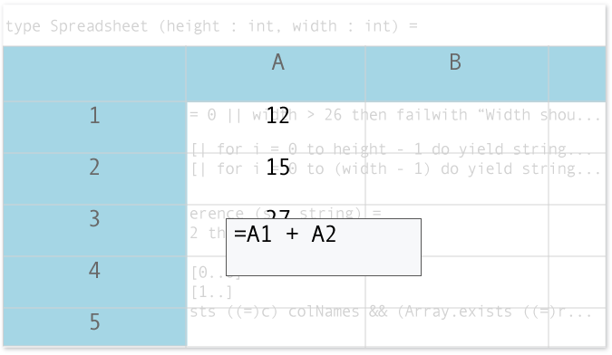

# Walkthrough: Creating a Portable F# Library
By following this walkthrough, you can create an assembly in F# that you can use with a Silverlight app, a traditional desktop app, or in a [!INCLUDE[win8_appname_long](../vs140/includes/win8_appname_long_md.md)] app that you create by using .NET APIs. In this way, you can write the UI portion of your app in another .NET language, such as C# or Visual Basic, and the algorithmic portion in F#. You can also support different user interfaces that target different platforms.  
  
 You can't use the [!INCLUDE[win8_appname_long](../vs140/includes/win8_appname_long_md.md)] UI directly from F#, so we recommend that you write the UI for your [!INCLUDE[win8_appname_long](../vs140/includes/win8_appname_long_md.md)] app in another .NET language and write the F# code in a portable library. You can write Silverlight and Windows Presentation Foundation (WPF) UI in F# directly, but you might want to take advantage of the additional design tools that are available when you write C# or Visual Basic code in Visual Studio.  
  
## Prerequisites  
 To create a [!INCLUDE[win8_appname_long](../vs140/includes/win8_appname_long_md.md)] app, you must have [!INCLUDE[win8](../vs140/includes/win8_md.md)] on your development computer.  
  
 To create a Silverlight project, you must have Silverlight 5 on your development computer.  
  
## The Spreadsheet App  
 In this walkthrough, you'll develop a simple spreadsheet that presents a grid to the user and accepts numerical input and formulas in its cells. The F# layer processes and validates all input and, in particular, parses the formula text and computes the results of formulas. First, you'll create the F# algorithmic code, which includes code for parsing expressions that involve cell references, numbers, and mathematical operators. This app also includes the code to track which cells must be updated when a user updates the contents of another cell. Next, you'll create the user interfaces.  
  
 The following figure shows the application that you'll create in this walkthrough.  
  
   
Spreadsheet Application User Interface  
  
 This walkthrough has the following sections.  
  
-   [How To: Create an F# Portable Library](#BK_FSPortableLibrary)  
  
-   [How To: Create a Silverlight App that Uses an F# Portable Library](#BK_Silverlight)  
  
-   [How To: Create a Windows Store App That Uses an F# Portable Library](#BK_WindowsStore)  
  
-   [How to: Create a Desktop App That References a Portable Library That Uses F#](#BK_DesktopApp)  
  
##  \<a name="BK_FSPortableLibrary">\</a> Creating a Portable Library in F#  
  
#### HowTo: Create an F# Portable Library  
  
1.  On the menu bar, choose **File**, **New Project**. In the **New Project** dialog box, expand **Visual F#**, choose the **F# Portable library** project type, and then name the library <CodeContentPlaceHolder>17\</CodeContentPlaceHolder>. Note that the project references a special version of FSharp.Core.  
  
2.  In **Solution Explorer**, expand the References node, and then select the FSharp.Core node. In the **Properties** window, the value of the **FullPath** property should contain .NETPortable, which indicates that you're using the portable version of the Core F# library. You can also review the various .NET libraries that you can access by default. These libraries all work with a common subset of the .NET Framework that is defined as .NET portable. You can remove references that you don't need, but if you add references, your reference assembly must be available on all platforms that you're targeting. The documentation for an assembly usually indicates the platforms on which it's available.  
  
3.  Open the shortcut menu for the project, and then choose **Properties**. On the **Application** tab, the target framework is set to **.NET Portable Subset**. For [!INCLUDE[vs_dev11_long](../vs140/includes/vs_dev11_long_md.md)], this subset targets .NET for [!INCLUDE[win8_appname_long](../vs140/includes/win8_appname_long_md.md)] apps, the .NET Framework 4.5, and Silverlight 5. These settings are important because, as a portable library, your app must run against the runtime that is available on various platforms. The runtimes for [!INCLUDE[win8_appname_long](../vs140/includes/win8_appname_long_md.md)] apps and Silverlight 5 contain subsets of the full .NET Framework.  
  
4.  Rename the main code file Spreadsheet.fs, and then paste the following code into the editor window. This code defines the functionality of a basic spreadsheet.  
  
<CodeContentPlaceHolder>0\</CodeContentPlaceHolder>  
##  \<a name="BK_Silverlight">\</a> Using a Portable Library in a Silverlight App  
  
#### How To: Create a Silverlight App That Uses an F# Portable Library  
  
1.  On the menu bar, choose **File**, **Add** and then **New Project**. In the **Add New Project** dialog box, expand **Visual C#**, expand <CodeContentPlaceHolder>18\</CodeContentPlaceHolder>, and then choose **Silverlight Application**. The **New Silverlight Application** dialog box appears.  
  
2.  Make sure that the check box for **Host the Silverlight application in a new Web site** is selected, and in the drop-down, make sure that **ASP.NET Web Application Project** is selected, and then choose the **OK** button. Two projects are created: one project has the Silverlight control, and the other project is an ASP.NET web app that hosts the control.  
  
3.  Add a reference to the Spreadsheet project. Open the shortcut menu for the References node of the Silverlight project, and then choose **Add Reference**. The Reference Manager appears. Expand the Solution node, and choose the Spreadsheet project, and then choose the **OK** button.  
  
4.  In this step, you create a view model, which describes everything that the UI must do without describing how it appears. Open the shortcut menu for the project node, choose **Add**, and then choose **New Item**. Add a code file, name it ViewModel.cs, and then paste the following code into it:  
  
<CodeContentPlaceHolder>1\</CodeContentPlaceHolder>  
5.  In the Silverlight control project, open MainPage.xaml, which declares the UI layout for the main spreadsheet. In MainPage.xaml, paste the following XAML code into the existing Grid element.  
  
<CodeContentPlaceHolder>2\</CodeContentPlaceHolder>  
6.  In MainPage.xaml.cs, add <CodeContentPlaceHolder>19\</CodeContentPlaceHolder> to the list of using directives, and then add the following methods to the <CodeContentPlaceHolder>20\</CodeContentPlaceHolder> class.  
  
<CodeContentPlaceHolder>3\</CodeContentPlaceHolder>  
7.  In App.xaml.cs, add the following using directives to it:  
  
<CodeContentPlaceHolder>4\</CodeContentPlaceHolder>  
     Paste the following code into the <CodeContentPlaceHolder>21\</CodeContentPlaceHolder> event handler:  
  
<CodeContentPlaceHolder>5\</CodeContentPlaceHolder>  
8.  You can test your Silverlight front end by either starting the Silverlight project directly or by starting the ASP.NET web app that hosts the Silverlight control. Open the shortcut menu for the node for either of those projects, and then choose **Set As Startup Project**.  
  
##  \<a name="BK_WindowsStore">\</a> Using the Portable Library in a Windows Store App  
  
#### How To: Create a [!INCLUDE[win8_appname_long](../vs140/includes/win8_appname_long_md.md)] App That Uses an F# Portable Library  
  
1.  In this section, you'll create a [!INCLUDE[win8_appname_long](../vs140/includes/win8_appname_long_md.md)] app that uses the F# spreadsheet code as its computational component. On the menu bar, choose **File**, **Add**, **New Project**. The **New Project** dialog box appears. Under **Installed**, expand **Visual C#**, expand **Windows Store**, and then choose the **Blank App** template. Name the project NewFrontEnd, and then choose the **OK** button. If prompted for your developer license to create [!INCLUDE[win8_appname_long](../vs140/includes/win8_appname_long_md.md)] apps, enter your credentials. If you don't have credentials, you can find out how to set them up [here](http://go.microsoft.com/fwlink/?LinkId=249092).  
  
     The project is created. Note the configuration and contents of this project. The default References include .NET for Windows Store apps, which is the subset of the .NET Framework that's compatible with [!INCLUDE[win8_appname_long](../vs140/includes/win8_appname_long_md.md)] apps, and the Windows assembly, which includes the APIs for the Windows Runtime and the UI for [!INCLUDE[win8_appname_long](../vs140/includes/win8_appname_long_md.md)] apps. The Assets and Common subfolders have been created. The Assets subfolder contains several icons that apply to [!INCLUDE[win8_appname_long](../vs140/includes/win8_appname_long_md.md)] apps, and the Common subfolder contains shared routines that templates for [!INCLUDE[win8_appname_long](../vs140/includes/win8_appname_long_md.md)] apps use. The default project template has also created App.xaml, BlankPage.xaml, and their associated C# code-behind files, App.xaml.cs and BlankPage.xaml.cs. App.xaml describes the overall app, and BlankPage.xaml describes its one defined UI surface. Finally, any .pfx files and .appxmanifest files support the security and deployment models for [!INCLUDE[win8_appname_long](../vs140/includes/win8_appname_long_md.md)] apps.  
  
2.  Add a reference to the Spreadsheet project by opening the shortcut menu for the References node of the Silverlight project and choosing **Add Reference**. In the Reference Manager, expand the Solution node, choose the Spreadsheet project, and then choose the **OK** button.  
  
3.  You'll need some of the code that you already used in the Silverlight project to support the code for the UI of the [!INCLUDE[win8_appname_long](../vs140/includes/win8_appname_long_md.md)] app. This code is in ViewModels.cs. Open the shortcut menu for the project node for NewFrontEnd, choose **Add**, and then choose **New Item**. Add a C# code file, and name it ViewModels.cs. Paste the code from ViewModels.cs in the Silverlight project, and then change the block of using directives at the top of this file. Remove System.Windows, which is used for the Silverlight UI, and add Windows.UI.Xaml and Windows.Foundation.Collections, which are used for the UI of the [!INCLUDE[win8_appname_long](../vs140/includes/win8_appname_long_md.md)] app. Both Silverlight and the [!INCLUDE[win8_appname_long](../vs140/includes/win8_appname_long_md.md)] UI are based on WPF, so they're compatible with each other. The updated block of using directives should resemble the following example:  
  
<CodeContentPlaceHolder>6\</CodeContentPlaceHolder>  
     Also, change the namespace in ViewModels.cs from SilverlightFrontEnd to NewFrontEnd.  
  
     You can reuse the rest of the code in ViewModels.cs, but some types, such as Visibility, are now the versions for [!INCLUDE[win8_appname_long](../vs140/includes/win8_appname_long_md.md)] apps instead of Silverlight.  
  
4.  In this [!INCLUDE[win8_appname_long](../vs140/includes/win8_appname_long_md.md)] app, the App.xaml.cs code file must have similar startup code as that which appeared in the <CodeContentPlaceHolder>22\</CodeContentPlaceHolder> event handler for the Silverlight app. In a [!INCLUDE[win8_appname_long](../vs140/includes/win8_appname_long_md.md)] app, this code appears in the <CodeContentPlaceHolder>23\</CodeContentPlaceHolder> event handler of the App class. Add the following code to the <CodeContentPlaceHolder>24\</CodeContentPlaceHolder> event handler in App.xaml.cs:  
  
<CodeContentPlaceHolder>7\</CodeContentPlaceHolder>  
5.  Add a using directive for the Spreadsheet code.  
  
<CodeContentPlaceHolder>8\</CodeContentPlaceHolder>  
6.  In App.xaml.cs, <CodeContentPlaceHolder>25\</CodeContentPlaceHolder> contains code that specifies what page to load. You'll add a page that you want the app to load when a user starts it. Change the code in <CodeContentPlaceHolder>26\</CodeContentPlaceHolder> to navigate to the first page, as the following example shows:  
  
<CodeContentPlaceHolder>9\</CodeContentPlaceHolder>  
     You can delete BlankPage1.xaml and its code-behind file because they're not used in this example.  
  
7.  Open the shortcut menu for the project node for NewFrontEnd, choose **Add**, and then choose **New Item**. Add an Items Page, and retain the default name, ItemsPage1.xaml. This step adds both ItemsPage1.xaml and its code-behind file, ItemsPage1.xaml.cs, to the project. ItemsPage1.xaml starts with a main tag of <CodeContentPlaceHolder>27\</CodeContentPlaceHolder> with many attributes, as the following XAML code shows:  
  
<CodeContentPlaceHolder>10\</CodeContentPlaceHolder>  
     The UI for the [!INCLUDE[win8_appname_long](../vs140/includes/win8_appname_long_md.md)] app is identical to the UI for the Silverlight app that you created, and the XAML format is the same in this case. Therefore, you can reuse the XAML from MainPage.xaml in the Silverlight project for ItemsPage1.xaml in the UI for the [!INCLUDE[win8_appname_long](../vs140/includes/win8_appname_long_md.md)] app.  
  
8.  Copy the code within the top-level Grid element of MainPage.xaml for the Silverlight project, and paste it into the top-level Grid element in ItemsPage1.xaml in the project for the UI of the [!INCLUDE[win8_appname_long](../vs140/includes/win8_appname_long_md.md)] app. When you paste the code, you can overwrite any existing contents of the Grid element. Change the Background attribute on the Grid element to "White," and replace <CodeContentPlaceHolder>28\</CodeContentPlaceHolder> with <CodeContentPlaceHolder>29\</CodeContentPlaceHolder>.  
  
     The name of this event differs in Silverlight apps and [!INCLUDE[win8_appname_long](../vs140/includes/win8_appname_long_md.md)] apps.  
  
9. In ItemsPage.xaml.cs, set the <CodeContentPlaceHolder>30\</CodeContentPlaceHolder> property by changing the <CodeContentPlaceHolder>31\</CodeContentPlaceHolder> method.  
  
<CodeContentPlaceHolder>11\</CodeContentPlaceHolder>  
10. Copy the following event-handler code, and paste it into the ItemsPage1 class: <CodeContentPlaceHolder>32\</CodeContentPlaceHolder>, <CodeContentPlaceHolder>33\</CodeContentPlaceHolder>, <CodeContentPlaceHolder>34\</CodeContentPlaceHolder>, <CodeContentPlaceHolder>35\</CodeContentPlaceHolder>, and <CodeContentPlaceHolder>36\</CodeContentPlaceHolder>.  
  
<CodeContentPlaceHolder>12\</CodeContentPlaceHolder>  
11. Change the startup project to the project for your [!INCLUDE[win8_appname_long](../vs140/includes/win8_appname_long_md.md)] app. Open the shortcut menu for the NewFrontEnd project node, choose **Set As Startup Project**, and then choose the F5 key to run the project.  
  
##  \<a name="BK_DesktopApp">\</a> Creating a Portable Library in C# that Uses F#  
 The previous sample duplicates code in that the ViewModels.cs code appears in multiple projects. In this section, you create a C# Portable Library project to contain this code. In some cases, you must add information to the configuration file of an app when it consumes portable libraries that use F#. In this case, a desktop app, which targets the desktop version of the .NET Framework 4.5, references a C# portable library that, in turn, references an F# portable library. In such a case, you must add a binding redirect to the app.config file of the main app. You must add this redirect because only one version of the FSharp.Core library is loaded, but the portable libraries reference the .NET Portable version. Any calls to the .NET Portable versions of FSharp.Core functions must be redirected to the single version of FSharp.Core that's loaded in a desktop app. The binding redirects are necessary only in the desktop app, because the runtime environments for Silverlight 5 and [!INCLUDE[win8_appname_long](../vs140/includes/win8_appname_long_md.md)] apps use the .NET Portable version of FSharp.Core, not the full desktop version.  
  
#### How to: Create a Desktop App That References a Portable Library That Uses F#  
  
1.  On the menu bar, choose **File**, **Add**, **New Project**. Under **Installed**, expand the **Visual C#** node, choose the **.NET Portable Library** project template, and then name the project <CodeContentPlaceHolder>37\</CodeContentPlaceHolder>.  
  
2.  You must set the targets for this .NET Portable library to match the F# Portable Library to which you'll add a reference. Otherwise, an error message will inform you of the mismatch. On the shortcut menu for the ViewModels project, choose **Properties**. On the **Library** tab, change the targets for this portable library to match the .NET Framework 4.5, Silverlight 5, and [!INCLUDE[win8_appname_long](../vs140/includes/win8_appname_long_md.md)] apps.  
  
3.  On the shortcut menu for the **References** node, choose **Add Reference**. Under **Solution**, select the check box next to Spreadsheet.  
  
4.  Copy the code for ViewModels.cs from one of the other projects, and paste it in the code file for the ViewModels project.  
  
5.  Make the following changes, which make the code in ViewModels completely independent of the UI platform:  
  
    1.  Remove using directives for System.Windows, System.Windows.Input, Windows.Foundation.Collections, and Windows.UI.Xaml, if present.  
  
    2.  Change the namespace to ViewModels.  
  
    3.  Remove the <CodeContentPlaceHolder>38\</CodeContentPlaceHolder> property. This property uses Visibility, which is a platform-dependent object.  
  
6.  On the menu bar, choose **File**, **Add**, **New Project**. Under **Installed**, expand the **Visual C#** node, and then choose the **WPF Application** project template. Name the new project <CodeContentPlaceHolder>39\</CodeContentPlaceHolder>, and choose the **OK** button.  
  
7.  Open the shortcut menu for the **References** node in the Desktop project, and then choose **Add Reference**. Under **Solution**, choose the Spreadsheet and ViewModels projects.  
  
8.  Open the app.config file for the WPF app, and then add the following lines of code. This code configures the appropriate binding redirects that apply when a desktop app that targets .NET Framework 4.5 references a .NET Portable Library that uses F#. The .NET Portable libraries use version 2.3.5.0 of the FSharp.Core library, and the .NET Framework 4.5 desktop apps use version 4.3.0.0.  
  
<CodeContentPlaceHolder>13\</CodeContentPlaceHolder>  
     Now you must add a reference to the portable version of the F# Core library. This reference is required whenever you have an application that consumes a portable library that references an F# portable library.  
  
9. Open the shortcut menu for the **References** node in the Desktop project, and then choose **Add Reference**. Choose **Browse**, and then navigate to Reference Assemblies\Microsoft\FSharp\3.0\Runtime\\.NETPortable\FSharp.Core.dll under the Program Files folder where Visual Studio is installed.  
  
10. In the Desktop project, add using directives for ViewModels.cs and Portable.Samples.Spreadsheet to App.xaml.cs and MainWindow.xaml.cs.  
  
<CodeContentPlaceHolder>14\</CodeContentPlaceHolder>  
11. Open the MainWindow.xaml file, and then change the title attribute of the Window class to <CodeContentPlaceHolder>40\</CodeContentPlaceHolder>.  
  
12. Copy the code within the Grid element of MainPage.xaml in the Silverlight project, and paste that code into the Grid element of MainWindow.xaml in the Desktop project.  
  
13. Copy the event-handling code in MainPage.xaml.cs from the Silverlight project, and paste that code into MainWindow.xaml.cs in the Desktop project.  
  
<CodeContentPlaceHolder>15\</CodeContentPlaceHolder>  
14. Add the spreadsheet startup code to the MainWindow constructor in MainWindow.xaml.cs, and replace references to MainPage with references to MainWindow.  
  
<CodeContentPlaceHolder>16\</CodeContentPlaceHolder>  
15. Open the shortcut menu for the Desktop project, and then choose **Set as Startup Project**.  
  
16. Choose the F5 key to build the app, and then debug it.  
  
## Next Steps  
 As an alternative, you can modify the projects for the [!INCLUDE[win8_appname_long](../vs140/includes/win8_appname_long_md.md)] app and the Silverlight app to use the new ViewModels portable library.  
  
 Continue to learn about [!INCLUDE[win8_appname_long](../vs140/includes/win8_appname_long_md.md)] apps at the [Windows Developer Center](http://go.microsoft.com/fwlink/?LinkId=247417).  
  
## See Also  
 [Visual F# Walkthroughs](../vs140/visual-fsharp-samples-and-walkthroughs.md)   
 [... Style Apps](../vs140/universal-windows-apps--c---.md)   
 [Silverlight](http://go.microsoft.com/fwlink/?LinkId=247415)   
 [Portable Class Library](assetId:///c31e1663-c164-4e65-b66d-d3aa8750a154)